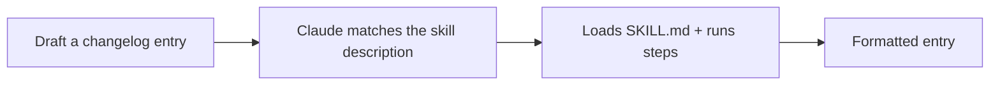

<LevelBadge level="intermediate" />

<VerifyNote lastVerified="2026-06-20" source="https://docs.anthropic.com/en/docs/claude-code/skills">
Skillのレイアウトや検出方法は変わる可能性があります。公式のSkillsドキュメントと照らし合わせて確認してください。
</VerifyNote>

動作する[Skill](/docs/claude-code/skills)をゼロから構築し、それが起動することを実証しましょう。小さな「changelogエントリ」Skillを作ります — 汎用的で再利用可能なものです。

## ステップ1 — フォルダを作成する

```bash
mkdir -p .claude/skills/changelog-entry
```

（すべてのプロジェクトにまたがる個人用Skillには `~/.claude/skills/…` を使ってください。）

## ステップ2 — SKILL.mdを書く

`.claude/skills/changelog-entry/SKILL.md`:

```markdown
---
name: changelog-entry
description: Use when the user wants to turn recent git commits into a Keep a Changelog entry.
---

# Changelog Entry

When asked for a changelog entry:
1. Run `git log --oneline -20` to see recent commits.
2. Group them into Added / Changed / Fixed / Removed (Keep a Changelog style).
3. Write concise, user-facing bullets (not raw commit messages).
4. Output only the formatted entry.
```

**`description` がトリガー**です — 「Use when…」の形式で書くことで、Claude が適切なタイミングでこれを読み込みます。

## ステップ3 — （任意）ヘルパースクリプトを追加する

Skillはスクリプトを同梱できます。決定論的なデータ収集を行いたい場合は、`scripts/recent.sh` を追加し、SKILL.md から参照してください:

```bash
#!/usr/bin/env bash
git log --oneline -20
```

## ステップ4 — トリガーされることを実証する

セッションを開始して、こう言います: *「最近の作業のchangelogエントリを下書きして。」* Claude は意図を認識し、Skillを読み込み、その手順に従うはずです。起動しない場合は、おそらく `description` がそれを*いつ*使うかについて十分に具体的でないので、より鋭くしてください。



## ステップ5 — 共有する

（他のものと一緒に）[プラグイン](/docs/claude-code/plugins-marketplaces)にまとめれば、チームが1ステップでインストールできます — あるいは AILmanac の[skillパック](/docs/templates/skills)に貢献しましょう。

## 落とし穴

- **曖昧な description** → 決してトリガーされない（または常にトリガーされる）。具体的にしましょう。
- **1つのSkillに詰め込みすぎ** → 1つの明確な仕事に絞りましょう。
- **共有Skillにシークレット** → 絶対にやめましょう。[サードパーティコードのレビュー](/docs/security/reviewing-third-party-code)を参照してください。

## 次へ

- [Skill: オンデマンドの専門知識](/docs/claude-code/skills)
- [SKILL.md テンプレート](/docs/templates/skills)
- [初めてのMCPサーバーを構築して接続する](/docs/walkthroughs/first-mcp-server)
