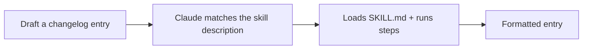

<LevelBadge level="intermediate" />

<Callout type="objectives" items={["動作するSkillをゼロから構築し、それが実際に起動することを実証する", "適切なタイミングでトリガーされる description を書く — Skillが起動するかどうかを決める唯一のフィールド", "決定論的なデータ収集のために、いつヘルパースクリプトを追加すべきかを判断する", "起動しないSkillを診断し、その原因となる3つの落とし穴を知る"]} />

<VerifyNote lastVerified="2026-06-20" source="https://code.claude.com/docs/en/skills">
Skillのレイアウトや検出方法は変わる可能性があります。公式のSkillsドキュメントと照らし合わせて確認してください。
</VerifyNote>

動作する[Skill](/docs/claude-code/skills)をゼロから構築し、それが起動することを実証しましょう。小さな「changelogエントリ」Skillを作ります — 汎用的で再利用可能なものです。

## ステップ1 — フォルダを作成する

<PromptCard title="Skillのフォルダを作成する">{`mkdir -p .claude/skills/changelog-entry`}</PromptCard>

（すべてのプロジェクトにまたがる個人用Skillには `~/.claude/skills/…` を使ってください。）

## ステップ2 — SKILL.mdを書く

`.claude/skills/changelog-entry/SKILL.md`:

```markdown
---
name: changelog-entry
description: Use when the user wants to turn recent git commits into a Keep a Changelog entry.
---

# Changelog Entry

When asked for a changelog entry:
1. Run `git log --oneline -20` to see recent commits.
2. Group them into Added / Changed / Fixed / Removed (Keep a Changelog style).
3. Write concise, user-facing bullets (not raw commit messages).
4. Output only the formatted entry.
```

**`description` がトリガー**です — 「Use when…」の形式で書くことで、Claude が適切なタイミングでこれを読み込みます。

## ステップ3 — （任意）ヘルパースクリプトを追加する

Skillはスクリプトを同梱できます。決定論的なデータ収集を行いたい場合は、`scripts/recent.sh` を追加し、SKILL.md から参照してください:

```bash
#!/usr/bin/env bash
git log --oneline -20
```

## ステップ4 — トリガーされることを実証する

セッションを開始して、下のプロンプトを試してください。Claude は意図を認識し、Skillを読み込み、その手順に従うはずです。起動しない場合は、おそらく `description` がそれを*いつ*使うかについて十分に具体的でないので、より鋭くしてください。

<PromptCard title="Skillがトリガーされることを実証する">{`Draft a changelog entry for recent work.`}</PromptCard>



## ステップ5 — 共有する

（他のものと一緒に）[プラグイン](/docs/claude-code/plugins-marketplaces)にまとめれば、チームが1ステップでインストールできます — あるいは AILmanac の[skillパック](/docs/templates/skills)に貢献しましょう。

## 落とし穴

- **曖昧な description** → 決してトリガーされない（または常にトリガーされる）。具体的にしましょう。
- **1つのSkillに詰め込みすぎ** → 1つの明確な仕事に絞りましょう。
- **共有Skillにシークレット** → 絶対にやめましょう。[サードパーティコードのレビュー](/docs/security/reviewing-third-party-code)を参照してください。

<Callout type="takeaways" items={["Skillとはフォルダと SKILL.md のことです — プロジェクト用は .claude/skills/<name>/、すべてのプロジェクト用は ~/.claude/skills/", "description がトリガーです。「Use when…」の形式で書き、Claude が適切なタイミングで読み込めるようにしましょう", "Skillはスクリプトを同梱できます — Claude にコマンドを即興させるのではなく、決定論的なデータ収集をしたいときに使いましょう", "Skill名を指定するのではなく、意図をプロンプトすることで動作を実証しましょう。起動しないなら、description が「いつ」について十分具体的ではありません", "1つのSkillは1つの明確な仕事に絞り、共有するSkillには決してシークレットを入れないこと"]} />

<Quiz title="理解度チェック" questions={[{q: "何を尋ねてもSkillが起動しません。ほぼ確実に問題があるのはどのフィールドですか？", options: ["name — フォルダ名と完全に一致する必要がある", "description — Skillを「いつ」使うかについて十分に具体的でない", "ヘルパースクリプトに実行権限ビットが付いていない"], answer: 1, explain: "description がトリガーです。「Use when…」の形式で書き、状況について具体的にすることで、いつSkillを読み込むべきかを Claude に伝えます。曖昧な description は決してトリガーされないか、逆に常にトリガーされます。"}, {q: "changelog Skillを、このプロジェクトだけでなく、作業するすべてのプロジェクトで使えるようにしたい。どこに置きますか？", options: ["各リポジトリの .claude/skills/changelog-entry/", "~/.claude/skills/changelog-entry/", "先にプラグインとして公開する必要がある"], answer: 1, explain: "すべてのプロジェクトに適用される個人用Skillには ~/.claude/skills/… を使います。リポジトリ内の .claude/skills/ パスは、Skillをそのプロジェクトに限定します。"}, {q: "scripts/recent.sh のようなヘルパースクリプトをSkillに同梱するのはなぜですか？", options: ["スクリプトがないとSkillはシェルコマンドを実行できないから", "決定論的なデータ収集のため — Claude が即興するのではなく、スクリプトは毎回同じように実行されるから", "Skillの読み込みが速くなるから"], answer: 1, explain: "Skillはスクリプトを同梱でき、SKILL.md から参照することで決定論的なデータ収集が得られます。これは任意です — モデルに任せるのではなく、毎回まったく同じコマンドを実行したいときに追加します。"}]} />

## 次へ

- [Skill: オンデマンドの専門知識](/docs/claude-code/skills)
- [SKILL.md テンプレート](/docs/templates/skills)
- [初めてのMCPサーバーを構築して接続する](/docs/walkthroughs/first-mcp-server)
