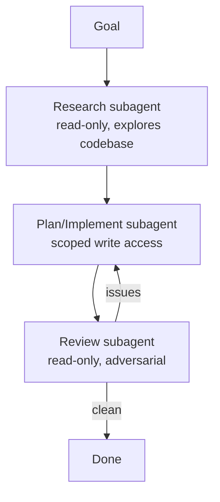

<LevelBadge level="advanced" />

大きなタスクは、すべてを1つのコンテキストに詰め込むのではなく、焦点を絞った[サブエージェント](/docs/claude-code/subagents)に分割すると、うまくいきます。調査 → 実装 → レビューのパイプラインを設計しましょう。

## 全体像

各サブエージェントは**独自のコンテキスト**と**専用のツールセット**を持ち、メインセッションに戻るのは*結果*だけです。これによってメインセッションをクリーンに保てます。

## ステップ1 — エージェントを定義する

`/agents` インターフェースを通じて、3つのエージェントを定義します。それぞれにタイトな `description`（メインエージェントが正しく委任できるように）とスコープを絞ったツールを与えます。

- **researcher** — 読み取り/検索のみ。関連するコードをマッピングし、調査結果を返します。
- **implementer** — ファイルの編集とテストの実行ができ、researcher の調査結果を入力として受け取ります。
- **reviewer** — 読み取り専用かつ敵対的: バグ、抜け漏れているケース、規約違反を探します。

## ステップ2 — ハンドオフでオーケストレーションする

メインセッションは各段階の出力を次の段階へ渡します。調査 → 実装（調査を使う）→ レビュー（実装の）。**レビューゲート**を追加しましょう。レビュアーが問題を見つけたら、完了する前に implementer に戻します。

## ステップ3 — これをやるべきでないときを知る

:::warning 並列・マルチエージェントはタダではない
- **逐次的な依存関係**（実装には調査が必要）は逐次的なままにします。順序が重要なところでファンアウトしないでください。
- **共有ファイルへの書き込み**は競合する可能性があります。[git worktree](/docs/claude-code/worktrees)で分離するか、直列化しましょう。
- 小さなタスクでは、調整のオーバーヘッドが利益を上回ります。これは**規模が大きく分解可能な**作業に使ってください。
:::

## ステップ4 — 検証する

良いマルチエージェントの実行では、次のことが見られます: 焦点の絞られたメインコンテキスト（重い読み込みは researcher で行われた）、調査を反映した実装、そして実際に何かを捉えた（あるいは説得力をもって承認した）レビュー。レビュアーが単なる形式的な承認になっている場合は、そのプロンプトを**敵対的**にしましょう（「何が間違っているか見つけ出してみろ」）。

## さらに進む

同じパターンをプログラム的に行うのが[API上でのエージェント構築](/docs/api/building-agents)であり、[Cowork とエージェントチーム](/docs/api/cowork-and-agent-teams)のような製品機能です。

## 次へ

- [サブエージェントと並列エージェント](/docs/claude-code/subagents)
- [Git Worktree](/docs/claude-code/worktrees)
- [API上でのエージェント構築](/docs/api/building-agents)
