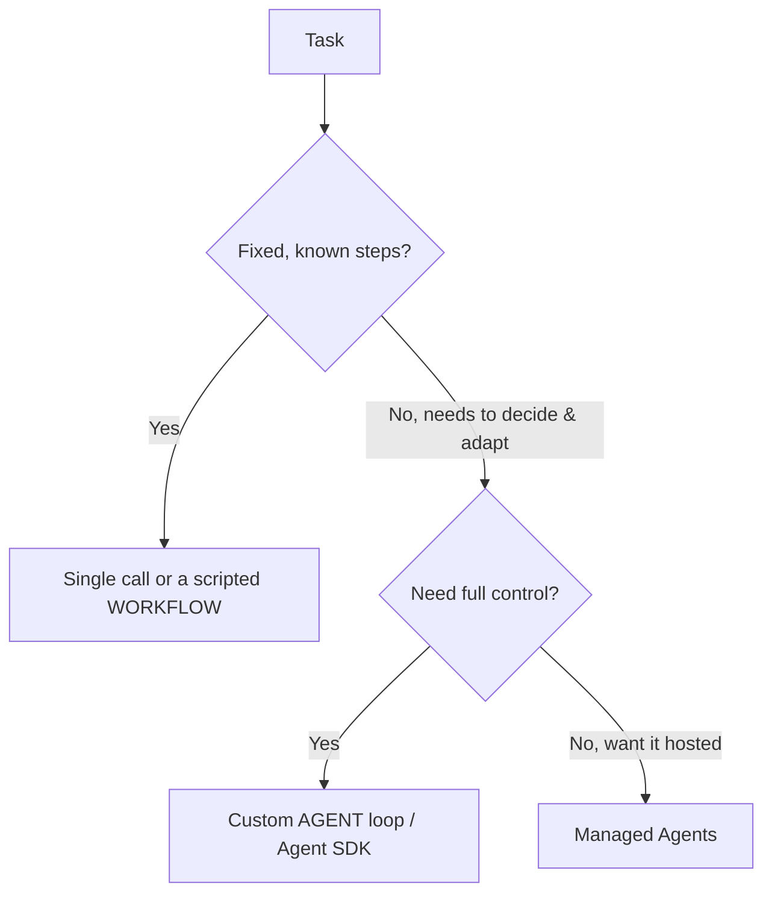

<LevelBadge level="advanced" />

<VerifyNote lastVerified="2026-06-20" source="https://platform.claude.com/docs/en/docs/agents-and-tools">
에이전트 도구(Agent SDK, 관리형 옵션)는 빠르게 진화합니다 — 현재 옵션은 공식 문서에서 확인하세요.
</VerifyNote>

<Callout type="objectives" items={["에이전트가 실제로 무엇인지 정의하기: 루프 안에서 실행되는 모델", "선택 기준을 적용해 단일 호출 vs 워크플로우 vs 에이전트 고르기", "올바른 가드레일을 갖춘 최소한의 에이전트 루프 설계하기", "직접 구현하는 대신 Claude Agent SDK를 언제 써야 하는지 알기", "에이전트를 견고하게 만들기: 경계 설정, 실패 처리, 권한 제한, 평가"]} />

**에이전트**는 루프 안에서 실행되는 모델입니다: [도구](/docs/api/tool-use)를 호출하고, 결과를 관찰하며, 완료될 때까지 다음 단계를 결정하면서 목표를 추구합니다. 에이전트를 만들기 전에 *동작하는 가장 단순한 것*을 고르세요.

## 선택 기준 (과잉 설계 금지)

모든 작업에 에이전트가 필요한 것은 아닙니다. 먼저 이 트리를 따라가 보세요 — 대부분의 작업은 맨 위에서 멈춥니다.

세 가지 옵션, 단순한 순서대로:

- **단일 호출** — 하나의 프롬프트로 해결됩니다. 대부분의 작업이 여기에 해당. 가장 저렴하고 가장 안정적.
- **워크플로우** — 코드에서 고정된 호출 시퀀스를 직접 오케스트레이션합니다(결정론적 제어 흐름). 단계가 알려져 있을 때 사용.
- **에이전트** — 모델이 단계를 동적으로 결정합니다. 경로를 도저히 하드코딩할 수 없을 때만 사용.

<Callout type="warning">
적응성이 핵심일 때 에이전트를 선택하세요 — 그럴싸해 보이기 때문이 아니라. 직접 제어하는 워크플로우가 테스트하고 디버깅하기 더 쉽습니다.
</Callout>

## 루프 설계

최소한의 커스텀 에이전트는 네 개의 움직이는 부품일 뿐입니다. 이 순서로 만드세요:

<Steps items={[
  {title: "시스템 프롬프트", body: "목표, 제약 조건, 사용 가능한 도구를 명시합니다. 모델이 매 턴마다 이것을 근거로 추론합니다."},
  {title: "루프", body: "메시지를 보내고 → 응답이 tool_use이면 도구를 실행하고 tool_result를 추가한 뒤 반복 → 최종 답변 또는 종료 조건에 도달할 때까지."},
  {title: "가드레일", body: "최대 반복 횟수 상한, 토큰/비용 예산, 그리고 무언가 실행되기 전에 도구 입력을 검증하는 로직을 추가합니다."},
  {title: "컨텍스트 관리", body: "히스토리가 커지면 요약하거나 잘라냅니다 — 컨텍스트 관리(/docs/claude-code/context-management)에서 다룬 것과 같은 개념입니다."}
]} />

**[Claude Agent SDK](/docs/claude-code/headless-and-agent-sdk)**는 이 루프 — 도구, 권한, 컨텍스트 처리 — 를 기본 제공하므로 직접 구현할 필요가 없습니다.

<Callout type="tip">
직접 루프를 작성하기 전에 Agent SDK가 이미 그것을 다루는지 확인하세요. 루프, 권한, 컨텍스트 처리를 제공하므로 여러분은 도구와 목표에 집중할 수 있습니다.
</Callout>

## 견고하게 만들기

도구를 호출할 수 있는 루프는 오작동할 수도 있습니다. 네 가지 습관이 에이전트를 신뢰할 수 있게 유지합니다:

- **모든 것에 경계 설정**: 반복 횟수, 시간, 비용. 에이전트는 무한 루프에 빠질 수 있습니다.
- **도구 실패를 우아하게 처리**하기 (오류를 결과로 반환).
- 위험한 작업에는 **최소 권한 + 휴먼 인 더 루프** — [에이전트 보안](/docs/security/securing-agents) 참고.
- 신뢰하기 전에 실제 사례로 **평가**하기 — [평가(Evals)](/docs/foundations/evals) 참고.

<Callout type="takeaways" items={["에이전트는 목표를 향해 도구를 호출하며 루프 안에서 실행되는 모델이다 — 경로를 하드코딩할 수 없을 때만 사용하라", "결정 순서: 단일 호출 → 워크플로우 → 에이전트 → 관리형 에이전트; 동작하는 가장 단순한 것을 선호하라", "최소한의 루프 = 시스템 프롬프트 + tool_use/tool_result 루프 + 가드레일 + 컨텍스트 관리", "Claude Agent SDK는 루프, 도구, 권한, 컨텍스트 처리를 제공한다", "견고함 = 반복/시간/비용 경계 설정, 도구 실패 처리, 최소 권한 + 휴먼 인 더 루프, 신뢰 전 평가"]} />

## 스스로 점검하기

<Quiz title="스스로 점검하기" questions={[
  {
    q: "이 맥락에서 에이전트를 가장 잘 설명하는 것은?",
    options: [
      "완전한 답변을 반환하는 단일 프롬프트",
      "루프 안에서 실행되며, 도구를 호출하고 완료될 때까지 다음 단계를 결정하는 모델",
      "코드에서 오케스트레이션하는 고정된 API 호출 시퀀스",
      "설정이 필요 없는 호스팅 서비스"
    ],
    answer: 1,
    explain: "에이전트는 루프 안에서 실행되는 모델입니다: 도구를 호출하고, 결과를 관찰하며, 완료될 때까지 다음 단계를 결정하면서 목표를 추구합니다."
  },
  {
    q: "작업에 고정되고 알려진 단계들이 있습니다. 무엇을 선택해야 할까요?",
    options: [
      "최대 제어를 위한 커스텀 에이전트 루프",
      "호스팅되도록 관리형 에이전트",
      "단일 호출 또는 스크립트화된 워크플로우",
      "멀티 에이전트 팀"
    ],
    answer: 2,
    explain: "단계가 고정되고 알려져 있을 때는 단일 호출 또는 스크립트화된 워크플로우(결정론적 제어 흐름)가 올바르고 가장 단순한 선택입니다."
  },
  {
    q: "커스텀 에이전트가 실제로 정당화되는 경우는?",
    options: [
      "워크플로우보다 더 그럴싸해 보일 때마다",
      "적응성이 핵심이고 경로를 도저히 하드코딩할 수 없을 때",
      "두 개 이상의 도구를 호출하는 모든 작업에",
      "Agent SDK를 사용할 수 없을 때만"
    ],
    answer: 1,
    explain: "적응성이 핵심일 때 에이전트를 선택하세요 — 그럴싸해 보이기 때문이 아니라. 직접 제어하는 워크플로우가 테스트하고 디버깅하기 더 쉽습니다."
  },
  {
    q: "루프에서 모델이 tool_use로 응답하면 무슨 일이 일어나나요?",
    options: [
      "루프를 멈추고 부분 답변을 반환한다",
      "도구를 실행하고, tool_result를 추가한 뒤 반복한다",
      "메시지를 버리고 시스템 프롬프트를 다시 보낸다",
      "히스토리를 즉시 요약한다"
    ],
    answer: 1,
    explain: "루프: 메시지를 보내고 → tool_use이면 도구를 실행하고 tool_result를 추가한 뒤 반복 → 최종 답변 또는 종료 조건에 도달할 때까지."
  },
  {
    q: "에이전트를 견고하게 만드는 가드레일이 아닌 것은?",
    options: [
      "최대 반복 횟수 상한과 토큰/비용 예산",
      "오류를 결과로 반환해 도구 실패를 처리하기",
      "에이전트가 절대 막히지 않도록 모든 권한을 부여하기",
      "위험한 작업에 최소 권한 + 휴먼 인 더 루프"
    ],
    answer: 2,
    explain: "견고한 에이전트는 위험한 작업에 최소 권한과 휴먼 인 더 루프를 사용합니다 — 모든 권한을 부여하는 것의 정반대입니다. 또한 반복/시간/비용에 경계를 설정하고, 도구 실패를 우아하게 처리하며, 신뢰하기 전에 평가합니다."
  }
]} />

## 다음

- [도구 사용](/docs/api/tool-use) · [헤드리스 & Agent SDK](/docs/claude-code/headless-and-agent-sdk)
- [관리형 에이전트](/docs/api/managed-agents) · [Cowork & 에이전트 팀](/docs/api/cowork-and-agent-teams)
- [에이전트 & 도구 보안](/docs/security/securing-agents)
