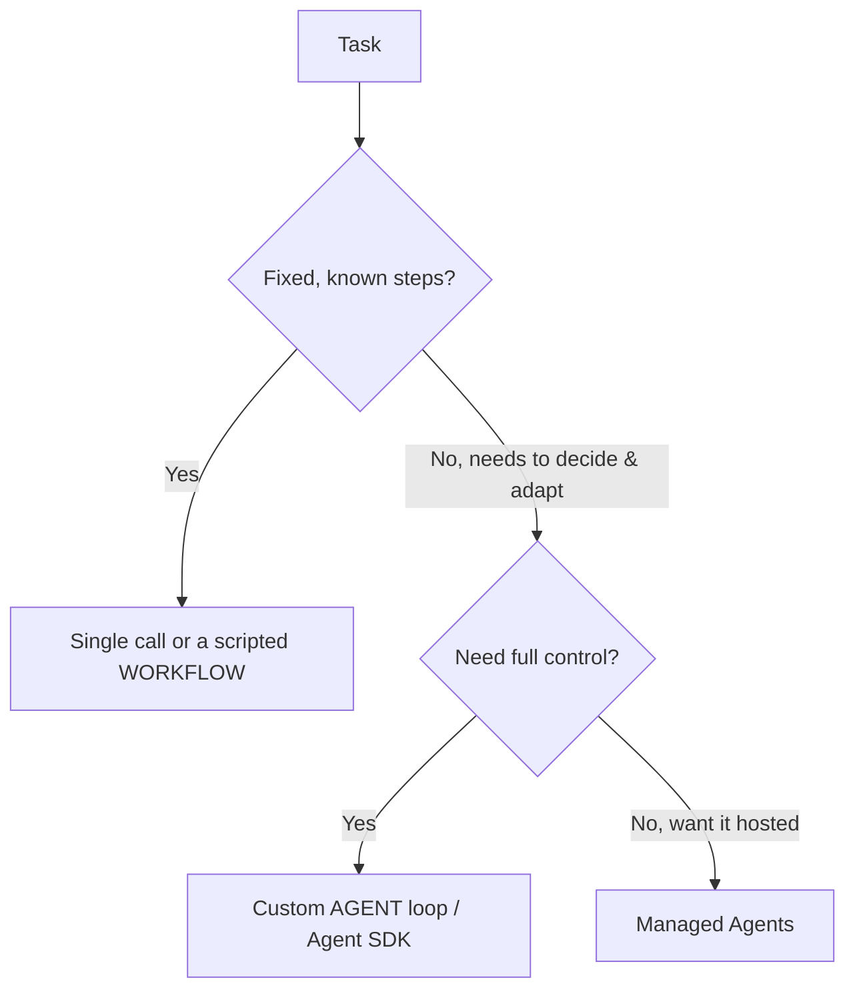

<LevelBadge level="advanced" />

<VerifyNote lastVerified="2026-06-20" source="https://docs.anthropic.com/en/docs/agents-and-tools">
에이전트 도구(Agent SDK, 관리형 옵션)는 빠르게 발전합니다 — 공식 문서에서 현재 옵션을 확인하세요.
</VerifyNote>

**에이전트**는 루프 안에서 실행되는 모델입니다. 즉, [도구](/docs/api/tool-use)를 호출하고 결과를 관찰하며 다음 단계를 결정하는 과정을 완료될 때까지 반복하면서 목표를 추구합니다. 에이전트를 만들기 전에, *작동하는 가장 단순한 방법*을 고르세요.

## 결정 테스트 (과도하게 만들지 말 것)

- **단일 호출** — 하나의 프롬프트로 답이 나옵니다. 대부분의 작업이 여기에 해당합니다. 가장 저렴하고 가장 안정적입니다.
- **워크플로** — 코드에서 정해진 일련의 호출을 직접 조율합니다(결정론적 제어 흐름). 단계가 알려져 있을 때 사용하세요.
- **에이전트** — 모델이 단계를 동적으로 결정합니다. 경로를 정말로 하드코딩할 수 없을 때만 사용하세요.

> 적응성이 핵심일 때 에이전트를 선택하세요 — 그럴듯해 보인다는 이유로는 아닙니다. 직접 제어하는 워크플로가 테스트와 디버깅이 더 쉽습니다.

## 루프 설계하기

최소한의 커스텀 에이전트는 다음과 같습니다:

1. **시스템 프롬프트**: 목표, 제약 조건, 사용 가능한 도구.
2. **루프**: 메시지 전송 → `tool_use`가 있으면 도구를 실행하고 `tool_result`를 덧붙인 뒤 반복 → 최종 답변 또는 중단 조건에 도달할 때까지.
3. **가드레일**: 최대 반복 횟수 제한, 토큰/비용 예산, 도구 입력 검증.
4. **컨텍스트 관리**: 히스토리가 늘어남에 따라 요약/정리(=[컨텍스트 관리](/docs/claude-code/context-management)와 같은 개념).

**[Claude Agent SDK](/docs/claude-code/headless-and-agent-sdk)**는 이 루프 — 도구, 권한, 컨텍스트 처리 — 를 일괄 제공하므로 직접 손으로 짤 필요가 없습니다.

## 견고하게 만들기

- **모든 것에 한계를 둘 것**: 반복 횟수, 시간, 비용. 에이전트는 무한 루프에 빠질 수 있습니다.
- **도구 실패를 우아하게 처리**하세요(오류를 결과로 반환).
- 위험한 작업에는 **최소 권한 + 휴먼 인 더 루프** — [에이전트 보안](/docs/security/securing-agents) 참고.
- 신뢰하기 전에 실제 사례로 **평가**하세요 — [평가(Evals)](/docs/foundations/evals) 참고.

## 다음

- [도구 사용](/docs/api/tool-use) · [헤드리스 & Agent SDK](/docs/claude-code/headless-and-agent-sdk)
- [관리형 에이전트](/docs/api/managed-agents) · [Cowork & 에이전트 팀](/docs/api/cowork-and-agent-teams)
- [에이전트 & 도구 보안](/docs/security/securing-agents)
