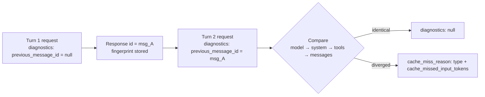

<LevelBadge level="advanced" />

<Callout type="objectives" items={[
  "프롬프트 바이트를 손으로 비교하는 대신 API 응답만으로 프롬프트 캐시 미스를 진단한다",
  "요청에 diagnostics 객체를 연결하고 대화 루프 전체에 previous_message_id를 이어 전달한다",
  "여섯 가지 cache_miss_reason 타입을 모두 읽고 각각이 요구하는 구체적인 수정을 적용한다",
  "진단 정보와 usage를 함께 읽어 실제 버그와 만료된 캐시 항목을 구분한다",
  "이 도구가 조용히 오해를 유발하는 세 가지 지점을 피한다: 최초 divergence만 보고, 비교 미완료 상태, 그리고 과금 수치가 아닌 토큰 추정값"
]} />

[프롬프트 캐싱](/docs/api/prompt-caching)을 설정하고 배포했는데 `cache_read_input_tokens`가 **0**입니다. 프리픽스의 뭔가가 바뀐 건 분명한데, 응답은 그게 무엇인지 전혀 알려주지 않습니다. 전통적인 해결 방법은 참담합니다. 연속된 두 요청을 디스크에 직렬화하고, 바이트 단위로 diff를 떠서, 여섯 달 전에 누군가 시스템 프롬프트에 끼워 넣은 타임스탬프를 찾아내는 겁니다.

**캐시 진단이 그 작업을 대체합니다.** 이전 응답의 `id`를 전달하면 API가 두 요청을 비교해서 처음으로 달라진 지점 — 모델, 시스템 프롬프트, 도구, 메시지 히스토리 — 을 짚어주고, 잃어버린 캐시 가능 프리픽스의 양을 추정해줍니다.

<VerifyNote lastVerified="2026-09-28" source="https://platform.claude.com/docs/en/build-with-claude/cache-diagnostics">
캐시 진단은 **2026년 9월 23일 Claude API에서 정식 출시(GA)** 되었습니다. `cache-diagnosis-2026-04-07` 베타 헤더는 더 이상 필요하지 않으며, 여전히 이 헤더를 보내는 요청도 이전과 동일하게 동작합니다. 사용 가능 범위, 필드 이름, `cache_miss_reason` 유니온은 모두 변경될 수 있으므로 공식 캐시 진단 문서에서 확인하세요.
</VerifyNote>

## 멘탈 모델

API는 여러분이 옵트인한 각 요청에 대해 작은 **지문(fingerprint)** 을 보관하며, 그 요청의 응답 `id`를 키로 사용합니다. 다음 요청에서 그 `id`를 돌려주면, API가 새 요청의 지문을 다시 만들어 두 지문을 비교하고 **처음 달라진 지점**을 보고합니다.



위 다이어그램에서 필드 이름보다 중요한 세 가지는 다음과 같습니다.

1. **객체 자체가 옵트인입니다.** API는 `diagnostics`를 포함한 요청에 대해서*만* 지문을 저장합니다. 한 턴이라도 빼먹으면 다음 턴의 조회가 실패합니다.
2. **비교 순서는 프리픽스 순서입니다.** 모델, 그다음 시스템, 그다음 도구, 그다음 메시지 — 캐시 자체가 구성되는 좌에서 우로의 순서와 동일합니다.
3. **구조를 보고할 뿐, 캐시 결과를 보고하지는 않습니다.** 진단은 *"내 요청이 바뀌었나?"* 에 답합니다. *"캐시가 적중했나?"* 는 별개의 질문입니다. 행동하려면 두 가지 판독이 모두 필요합니다. [usage와 함께 읽기](#usage와-함께-읽기)를 참고하세요.

<Flashcards title="캐시 진단 용어" cards={[
  {front:"지문(Fingerprint)", back:"diagnostics 객체를 포함한 모든 요청에 대해 API가 저장하는 경량 레코드. 암호학적 해시와 토큰 수 추정값만 담고, 원본 프롬프트 텍스트는 절대 담지 않는다. 응답 id를 키로 하며, 조직과 워크스페이스 범위로 한정되고 짧은 기간 뒤 만료된다."},
  {front:"previous_message_id", back:"현재 요청과 비교하고 싶은 응답의 id. 첫 턴에는 null을 전달해 비교 대상 없이 옵트인만 한다."},
  {front:"cache_miss_reason", back:"type을 판별자로 하는 구별 유니온. 두 요청이 처음 달라진 지점을 짚거나, 비교가 생성되지 않은 이유를 설명한다."},
  {front:"cache_missed_input_tokens", back:"네 가지 *_changed 타입에 함께 실려 온다. divergence 지점 이후에 놓인 입력 토큰이 대략 몇 개인지 — 즉 캐시 가능 프리픽스를 얼마나 잃었는지 — 에 대한 추정값."},
  {front:"최초 divergence만 보고", back:"응답은 첫 번째 차이만 짚고 멈춘다. 그 뒤에 또 다른 divergence가 숨어 있을 수 있으므로, 디버깅은 한 번에 끝나는 판독이 아니라 고치고 다시 측정하는 반복 루프다."}
]} />

## 대화에 계측 넣기

<Steps items={[
  {title: "모든 턴에 diagnostics 객체를 추가한다", body: "디버깅하는 턴만이 아니라 모든 요청에 diagnostics를 포함하세요. API는 이 객체를 실어 보낸 요청에 대해서만 지문을 저장하므로, 한 턴이라도 빠지면 체인이 끊어지고 다음 턴은 previous_message_not_found를 보고합니다."},
  {title: "첫 턴에는 null을 전달한다", body: "첫 턴에는 비교할 대상이 없습니다. previous_message_id를 null로 보내세요 — 그것으로 옵트인이 되고 지문이 등록됩니다. 응답의 diagnostics 필드는 null이 되는데, 이는 실패가 아니라 정상입니다."},
  {title: "응답 id를 다음 턴으로 넘긴다", body: "이후 모든 턴에서 previous_message_id를 직전 응답의 id로 설정하세요. 루프에서는 호출마다 재할당하는 변수 하나로 끝납니다."},
  {title: "응답에서 diagnostics를 읽는다", body: "비스트리밍 호출에서는 Message의 최상위 diagnostics 필드로 옵니다. 스트리밍 호출에서는 message_start 이벤트에 실려 오고, 누적된 최종 메시지까지 그대로 전달됩니다."},
  {title: "보고된 원인을 고치고 다시 측정한다", body: "가장 이른 divergence만 보고됩니다. 그것을 고친 뒤 다시 실행하세요 — 두 번째 원인이 처음부터 첫 번째 뒤에 숨어 있었을 수 있습니다."}
]} />

요청 모양은 간단합니다. 호출의 나머지 부분은 전혀 달라지지 않습니다.

<PromptCard title="2번째 턴 — 직전 응답과 비교하기">{`curl https://api.anthropic.com/v1/messages \\
  -H "x-api-key: $ANTHROPIC_API_KEY" \\
  -H "anthropic-version: 2023-06-01" \\
  -H "content-type: application/json" \\
  -d '{
    "model": "claude-opus-5-5",
    "max_tokens": 1024,
    "cache_control": {"type": "ephemeral"},
    "system": "You are an AI assistant analyzing a large document. <document>...</document>",
    "messages": [
      {"role": "user", "content": "Summarize section 1."},
      {"role": "assistant", "content": "Section 1 covers..."},
      {"role": "user", "content": "Now summarize section 2."}
    ],
    "diagnostics": {"previous_message_id": "msg_01Xyz..."}
  }' | jq '{id, usage, diagnostics}'`}</PromptCard>

멀티턴 루프에서는 재할당되는 변수 하나로 압축됩니다 — `prev_id`가 `None`으로 시작해서 호출마다 `r.id`가 됩니다.

```python
messages = []
prev_id = None

for turn, user_message in enumerate(prompts, start=1):
    messages.append({"role": "user", "content": user_message})

    r = client.beta.messages.create(
        model="claude-opus-5-5",
        max_tokens=1024,
        cache_control={"type": "ephemeral"},
        system=SYSTEM,
        messages=messages,
        diagnostics={"previous_message_id": prev_id},
    )

    if r.diagnostics is not None and r.diagnostics.cache_miss_reason is not None:
        print(f"Turn {turn} cache_miss_reason: {r.diagnostics.cache_miss_reason.type}")

    messages.append({"role": "assistant", "content": r.content})
    prev_id = r.id
```

## 응답 읽기

`diagnostics` 필드는 가능한 모양이 **세 가지**이며, 앞의 두 가지를 혼동하는 것이 가장 흔한 오독입니다.

| 값 | 의미 |
|---|---|
| `null` | `diagnostics` 객체를 보내지 않았거나, `previous_message_id`가 `null`이었거나(첫 턴), **또는** 비교가 실행되었지만 divergence를 찾지 못했습니다. |
| `cache_miss_reason`이 `null` | 응답이 직렬화되는 시점에 비교가 아직 진행 중이었습니다 — 응답이 매우 빠르게 시작될 때 발생할 수 있습니다. 결론이 나지 않은 상태이므로 다음 턴을 확인하세요. |
| `cache_miss_reason`이 객체 | divergence 지점, 또는 비교가 생성되지 않은 이유에 대한 설명입니다. |

:::caution `null`은 의도적으로 모호합니다
`diagnostics` 필드가 `null`이면 "보고할 것이 없다"는 뜻이고, 이는 *"프리픽스가 동일하다"* 와 *"애초에 옵트인하지 않았다"* 를 모두 포함합니다. 진단 결과를 기대했는데 어디서나 `null`이 보인다면, 프롬프트가 안정적이라고 결론 내리기 전에 **두 턴 모두**에 `diagnostics` 객체를 실제로 보내고 있는지 먼저 확인하세요.
:::

채워진 미스는 다음과 같이 보입니다.

```json
{
  "id": "msg_01Xyz...",
  "type": "message",
  "role": "assistant",
  "usage": {
    "input_tokens": 42,
    "cache_read_input_tokens": 0,
    "cache_creation_input_tokens": 41850,
    "output_tokens": 210
  },
  "diagnostics": {
    "cache_miss_reason": {
      "type": "system_changed",
      "cache_missed_input_tokens": 41850
    }
  }
}
```

## 여섯 가지 이유, 그리고 실제로 무엇을 바꿔야 하는가

네 가지 타입은 divergence 지점을 짚습니다. 나머지 두 가지는 비교가 아예 이루어지지 않았다는 뜻인데, 이를 "내 프롬프트가 바뀌었다"로 읽으면 존재하지도 않는 버그를 쫓게 됩니다.

| `type` | 무엇이 달라졌는가 | 해결 방법 |
|---|---|---|
| `model_changed` | `model`이 이전 요청과 다릅니다. 캐시는 모델별로 관리되므로, 대화 중간에 모델을 바꾼 라우터나 A/B 테스트, 폴백은 프리픽스 전체를 버립니다. | 캐시된 대화의 수명 동안 모델을 고정하세요. 폴백이 필요하다면 각 모델을 별도의 캐시 계보로 취급하세요. |
| `system_changed` | `system` 파라미터가 다릅니다 — 거의 항상 안정적이었을 프롬프트에 끼워 넣은 타임스탬프, 요청 ID, 세션 ID, 사용자 이름이 원인입니다. | 시스템 프롬프트를 바이트 단위로 안정적인 상수로 만드세요. 모든 동적 값은 캐시 중단점 **이후**의 첫 `user` 메시지로 옮기세요. |
| `tools_changed` | `tools` 배열이 다릅니다. 도구가 추가·제거·재배열되었거나, `input_schema` JSON이 턴 사이에 비결정적으로 직렬화되었습니다. | 매 턴 동일한 도구 목록을 고정된 순서로 보내고, 스키마를 결정적으로 직렬화하세요(객체 키 정렬). |
| `messages_changed` | 모델, 시스템, 도구는 모두 일치하지만 `messages`의 앞쪽 항목이 추가(append) 대신 수정·재배열·삭제되었습니다. 보통 히스토리 절단, 또는 재전송 시 어시스턴트 턴과 `tool_result` 블록이 다르게 재직렬화된 경우입니다. | 히스토리를 **추가 전용(append-only)** 으로 다루세요. 어시스턴트 `content`와 도구 결과는 재구성하지 말고 그대로 되돌려 보내세요. |
| `previous_message_not_found` | 해당 `previous_message_id`에 대한 저장된 지문이 없습니다. **이것은 요청이 바뀌었다는 증거가 아닙니다.** 이전 요청이 `diagnostics` 객체를 생략했거나, 다른 워크스페이스에서 실행되었거나, 너무 오래전이었습니다. | 모든 턴에 `diagnostics`를 보내고, 연속된 턴 사이의 시간 간격을 짧게 유지하세요. |
| `unavailable` | 진단이 생성되지 않았습니다. 서로 다른 두 경우를 포함합니다. 모델/시스템/도구 *이외의* 프롬프트에 영향을 주는 파라미터가 달랐거나, 대화가 길어서 divergence가 비교 지평선(horizon) 밖에 있는 경우입니다. | `tool_choice`, `thinking`, `context_management`, `output_config`, `output_format`, 그리고 활성 `anthropic-beta` 헤더 집합도 함께 고정하세요 — 모두 프롬프트에 영향을 줍니다. |

:::tip `unavailable`이 사람들이 가장 많이 오해하는 항목입니다
이것은 "기능이 고장났다"는 뜻이 **아닙니다**. 대개는 비교된 네 가지 표면이 모두 일치했고 다른 무언가가 움직였다는 뜻입니다 — 베타 헤더 집합이 단골 범인인데, 보통 호출 지점에서 멀리 떨어진 공용 클라이언트 설정에 들어 있고 아무도 그걸 프롬프트의 일부로 생각하지 않기 때문입니다.
:::

## usage와 함께 읽기

진단만으로는 판독의 절반입니다. 나머지 절반은 `usage.cache_read_input_tokens`이고, 두 값을 함께 보면 버그를 보고 있는지 물리 법칙을 보고 있는지 알 수 있습니다.

| 진단 | 캐시 읽기 토큰 | 실제 의미 |
|---|---|---|
| `null` | 높음 | 설계대로 작동 중. 안정적인 프리픽스, 캐시 적중. 할 일 없음. |
| `null` | 낮거나 0 | **당신의 버그가 아닙니다.** 요청은 일치했고, 캐시 항목이 그냥 만료된 것입니다. 턴 사이 간격을 줄이거나 [1시간 캐시 지속 시간](https://platform.claude.com/docs/en/build-with-claude/prompt-caching#1-hour-cache-duration)으로 옮기세요. |
| `*_changed` 타입 | 낮거나 0 | **당신의 버그입니다.** 요청이 바뀌었습니다. `type`이 짚은 원인을 고치세요. |
| `*_changed` 타입 | 높음 | 드문 경우. 프롬프트 뒷부분에서 뭔가 바뀌었지만 앞쪽의 `cache_control` 중단점은 여전히 적중했습니다. 고칠 가치는 있지만 영향은 작습니다. |

두 번째 행이 이 기능의 값어치를 벌어들이는 지점입니다. 예전에는 "캐시 읽기가 0"이 "프리픽스 버그가 있다"와 구별되지 않았고, 답이 전자였을 때도 팀들은 후자를 쫓으며 며칠을 태웠습니다. 함께 읽으면 진단은 *당신의* 실수와 *캐시의* 수명을 분리해줍니다.

이 매트릭스는 실제 `previous_message_id`를 전달한 턴에 적용됩니다. 첫 턴에는 적용되지 **않습니다**(`diagnostics`는 항상 `null`이고 캐시가 기록되는 중이므로 캐시 읽기도 보통 0입니다). `cache_miss_reason`이 `null`, `previous_message_not_found`, `unavailable`인 경우에도 적용되지 않습니다 — 이 모든 경우에는 비교가 생성되지 않았습니다.

## 흔한 실수

- **실패하는 턴에만 계측하기.** 지문은 *이전* 요청에 붙어 있습니다. 디버깅하는 턴에만 `diagnostics`를 추가하면 `previous_message_not_found`가 보장됩니다. 루프 전체를 계측하세요.
- **`cache_missed_input_tokens`를 과금 수치로 취급하기.** 이 값은 **토큰화 이전의 바이트 길이**에서 파생되므로 크기 지표입니다 — "프리픽스를 대략 40k 잃었다"는 뜻이고, "41,850 토큰이 과금되었다"는 뜻이 아닙니다. `usage.input_tokens`와 다를 수 있고, 때로는 그보다 클 수도 있습니다.
- **한 번 고친 뒤 멈추기.** 가장 이른 divergence만 보고됩니다. `system_changed`를 고치면 처음부터 거기 있던 `tools_changed`가 곧바로 드러날 수 있습니다. 진단이 조용해질 때까지 수정마다 다시 측정하세요.
- **워크스페이스를 넘나들며 디버깅하기.** 이전 요청은 같은 조직 *그리고* 같은 워크스페이스에서 실행되었어야 합니다. `previous_message_not_found`를 믿기 전에 두 응답의 `anthropic-workspace-id` 응답 헤더를 비교하세요.
- **Bedrock이나 Google Cloud에서 기대하기.** 캐시 진단은 **Claude API 전용**입니다. 멀티클라우드라면 Claude API 경로에 계측을 넣고, 거기서 프리픽스를 고친 다음 그 수정을 모든 곳에 배포하세요 — 진단을 쓸 수 없는 환경에서도 프리픽스 안정성 규칙은 동일합니다.
- **비교 미완료 상태를 건강 증명서로 읽기.** `cache_miss_reason: null`은 응답이 직렬화될 때 비교가 끝나지 않았다는 뜻입니다. 합격이 아니라 결론 미정입니다.

## 계속 켜둬도 안전한가?

대체로 그렇습니다 — 그리고 그 점이 사용 방식을 바꿉니다. 이 기능은 **설계상 최선 노력(best-effort)** 입니다. 진단은 절대 요청을 차단하거나 실패시키지 않으며, 정보를 얻을 수 없을 때는 오류 대신 `unavailable` 또는 `null` 이유를 받습니다. 저장되는 지문은 암호학적 해시와 토큰 수 추정값만 담고 원본 프롬프트 텍스트는 담지 않으며, 이 기능은 **ZDR 적격(qualified)** 입니다.

따라서 장애 상황에 급히 붙이는 대신 스테이징 환경에 `diagnostics`를 영구적으로 연결해두는 것이 합리적입니다. 누군가 시스템 프롬프트에 타임스탬프를 추가해 일주일에 걸쳐 캐시 적중률이 서서히 무너지는 느린 회귀를 잡는 유일한 방법이 바로 그것입니다.

<Quiz title="스스로 확인하기" questions={[
  {q:"2번째 턴 응답에서 diagnostics가 null이고 cache_read_input_tokens가 0으로 돌아왔습니다. 가장 가능성 높은 설명은 무엇일까요?",options:["조용한 무효화 요인이 시스템 프롬프트를 바꿨다","요청은 일치했지만 캐시 항목이 이미 만료되었다","해당 계정에서 진단 기능을 사용할 수 없다"],answer:1,explain:"diagnostics가 null인데 캐시 읽기가 낮다면 두 요청은 동일했지만 캐시 항목을 더 이상 쓸 수 없었다는 뜻입니다. 이는 프리픽스 버그가 아니라 TTL 문제입니다 — 턴 사이 간격을 줄이거나 1시간 캐시 지속 시간으로 옮기세요."},
  {q:"previous_message_not_found를 받았습니다. 이것이 프롬프트에 대해 알려주는 것은 무엇일까요?",options:["아무것도 — 해당 id에 저장된 지문이 없다는 뜻이다","메시지 히스토리가 절단되었다는 뜻이다","턴 사이에 모델이 바뀌었다는 뜻이다"],answer:0,explain:"previous_message_not_found는 요청이 바뀌었다는 증거가 아닙니다. 해당 previous_message_id에 대한 저장된 지문이 없다는 뜻이며, 보통 이전 요청이 diagnostics 객체를 생략했거나 다른 워크스페이스에서 실행되었거나 너무 오래전에 보내졌기 때문입니다."},
  {q:"보고된 system_changed를 고쳤는데 다음 실행에서 tools_changed가 보고됩니다. 무슨 일이 일어난 걸까요?",options:["수정 작업이 tools 배열에 새 버그를 만들었다","가장 이른 divergence만 보고되므로 도구 divergence가 시스템 divergence 뒤에 숨어 있었다","비교 지평선을 초과했다"],answer:1,explain:"응답은 가장 이른 divergence만 보고합니다. 첫 번째 원인을 고치면 그 뒤에 있던 것이 드러나며, 그래서 캐시 디버깅은 한 번의 판독이 아니라 고치고 다시 측정하는 루프입니다."},
  {q:"cache_missed_input_tokens 값은 어떻게 다뤄야 할까요?",options:["과금된 정확한 토큰 수로","프리픽스를 얼마나 잃었는지 보여주는 크기 지표로","캐시 중단점의 크기로"],answer:1,explain:"이 값은 토큰화 이전의 바이트 길이에서 파생되므로, divergence 지점 이후에 놓인 캐시 가능 프리픽스의 양을 추정합니다. 과금 수치가 아니라 크기 지표로 다루세요 — usage.input_tokens와 다를 수 있고 때로는 그보다 클 수도 있습니다."}
]} />

<Callout type="takeaways" items={[
  "모든 턴에 diagnostics 객체를 보내고 직전 응답 id를 다음 턴으로 넘기세요 — 지문은 옵트인한 요청에 대해서만 저장됩니다.",
  "diagnostics는 '내 요청이 바뀌었나?'에 답하고, usage.cache_read_input_tokens는 '캐시가 적중했나?'에 답합니다. 프리픽스 버그와 만료된 항목을 구분하려면 둘 다 필요합니다.",
  "네 가지 *_changed 타입은 divergence 지점을 짚습니다. previous_message_not_found와 unavailable은 비교가 실행되지 않았다는 뜻이며 변경의 증거가 아닙니다.",
  "가장 이른 divergence만 보고되므로, 진단이 조용해질 때까지 고치고 다시 측정하고 반복하세요.",
  "cache_missed_input_tokens는 바이트에서 파생된 크기 추정값이며 과금 수치가 아닙니다.",
  "Claude API 전용입니다 — Amazon Bedrock이나 Google Cloud에서는 쓸 수 없지만, 이 기능이 가르치는 프리픽스 안정성 규칙은 어디서나 적용됩니다."
]} />

## 다음으로

- [프롬프트 캐싱 & 비용 최적화](/docs/api/prompt-caching) — 애초에 중단점을 올바르게 설정해 진단할 거리를 줄이세요.
- [프로바이더별 프롬프트 캐싱](/docs/models/prompt-caching-across-providers) — OpenAI, Gemini, DeepSeek에서의 동일한 프리픽스 규칙과, 캐싱이 손해가 되는 손익분기 계산.
- [토큰, 컨텍스트 & 가격](/docs/api/tokens-and-pricing) — 방금 낭비를 멈춘 그 토큰들이 실제로 얼마인지.
