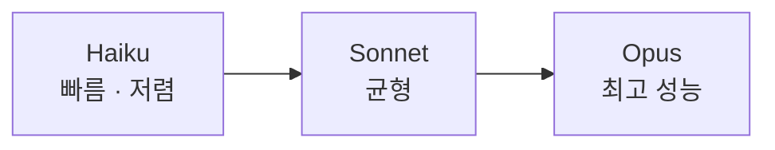

<LevelBadge level="beginner" />

Anthropic은 성능·비용·속도 지점이 서로 다른 모델 제품군을 제공합니다. 잘 선택한다는 것은 결국 작업에 맞는 모델을 고르는 일이며, 필요하지 않은 성능에 과지출하지 않는 일입니다.

<Callout type="objectives" items={[
  "Haiku → Sonnet → Opus 사다리를 성능/비용/속도 트레이드오프로 이해합니다",
  "추측 대신 올바른 기본값에서 시작해, 근거를 가지고 위 또는 아래로 이동합니다",
  "한 시스템 안에서 여러 티어를 섞습니다 — 대부분의 사람이 절대 당기지 않는 가장 큰 비용 레버입니다",
  "정확한 모델 ID를 올바른 방법으로 조회해, 업그레이드가 한 줄 변경으로 끝나게 만듭니다",
]} />

## 현재 모델들

<ModelTable />

## 실습: 어떤 모델이 맞을까?

세 가지 질문에 답하고 시작 추천을 받아 보세요:

<ModelPicker />

## 멘탈 모델: 성능 사다리

- **Sonnet으로 시작하세요.** 기본 주력 모델입니다 — 합리적 비용에 강력한 추론과 코딩. 대부분의 작업은 여기서 출발해야 합니다.
- **Opus로 올라가는 것은** Sonnet이 힘겨워하고 품질이 비용보다 중요할 때에만입니다(어려운 추론, 까다로운 에이전트, 지저분한 코드).
- **Haiku로 내려가세요** — 대량, 지연 시간 민감, 또는 단순 작업(분류, 추출, 라우팅, 저렴한 서브에이전트)이라면.

## 실제로 선택하는 법

<Steps items={[
  {title: "Sonnet을 기본으로 잡고 출시", body: "균형 잡힌 주력 모델입니다. 다른 곳에서 시작한다는 것은 실제 작업에 대한 근거도 없이 최적화하고 있다는 뜻입니다."},
  {title: "품질 상한에 부딪히나요? 어려운 부분집합에만 Opus를 시도", body: "전체 워크로드를 업그레이드하지 마세요. Sonnet이 실패하는 케이스를 찾아 그것만 Opus로 라우팅하세요 — 필요한 곳에서만 품질을 사는 것입니다."},
  {title: "비용이나 지연이 아프면 그 단계에 Haiku가 충분한지 확인", body: "분류, 추출, 라우팅, 저렴한 서브에이전트에는 큰 모델이 필요 없는 경우가 많습니다. 가정하지 말고 테스트하세요."},
  {title: "모델 섞기", body: "저렴한 전/후처리에는 Haiku를, 어려운 핵심 부분에는 Sonnet/Opus를 사용하세요. 이 모델 티어링은 가장 큰 비용 레버 중 하나입니다 — Cost & Latency 참고."},
]} />

모델 티어링은 별도로 읽어볼 만합니다: [Cost & Latency](/docs/foundations/cost-and-latency).

:::tip 벤치마크만 보고 고르지 마세요
공개 벤치마크는 출발점의 힌트일 뿐, *당신의* 작업에 대한 판결이 아닙니다. 실제 입력 몇 개로 두 모델에 대해 작은 [평가](/docs/foundations/evals)를 돌려 보세요 — 몇 분이면 되고 추측보다 낫습니다.
:::

## 정확한 모델 ID 조회하기

항상 현재 API 모델 ID를 전달하세요(예: `messages.create` 호출에서). [위 모델 표](/docs/whats-new/models-and-pricing)나 공식 모델 페이지에서 가져오세요 — 그리고 여러 곳에 하드코딩하기보다 설정 파일에서 읽는 것을 선호하세요. 그래야 모델 업그레이드가 한 줄 변경으로 끝납니다.

<Quiz title="스스로 확인해 보세요" questions={[
  {q: "새로운 것을 만들고 있고 어떤 모델이 맞을지 데이터가 없습니다. 어디서 시작할까요?", options: ["Opus에서 시작해, 너무 비싸면 다운그레이드", "Sonnet — 균형 잡힌 기본값 — 그 다음 근거를 가지고 위 또는 아래로 이동", "Haiku에서 시작해, 출력이 이상해 보일 때마다 업그레이드"], answer: 1, explain: "Sonnet은 주력 모델입니다: 합리적 비용에 강력한 추론과 코딩. 거기서 시작해 출시하고, 실제 실패가 Opus로 갈지 Haiku로 내려갈지를 알려주게 하세요."},
  {q: "Sonnet이 트래픽의 90%를 잘 처리하지만 어려운 10%에서 실패합니다. 가장 좋은 조치는?", options: ["전부 Opus로 이동", "어려운 부분집합만 Opus로 라우팅하고 나머지는 Sonnet에 둠", "예시를 더 넣고 실패를 감수"], answer: 1, explain: "전체 워크로드를 업그레이드하면 Sonnet이 이미 잘 처리하는 케이스에도 Opus 가격을 지불하게 됩니다. 어려운 부분집합만 라우팅하면 필요한 곳에서만 품질을 살 수 있습니다 — 모델 티어링의 본질입니다."},
  {q: "벤치마크가 모델 A가 모델 B를 이긴다고 보여줍니다. 당신의 앱에는 무슨 결론을 내릴까요?", options: ["모델 A 사용 — 벤치마크가 결론", "많지 않음 — 실제 입력으로 두 모델에 작은 평가를 돌리세요", "모델 B 사용, 벤치마크는 항상 조작되므로"], answer: 1, explain: "공개 벤치마크는 힌트일 뿐, 당신의 작업에 대한 판결이 아닙니다. 실제 입력 몇 개로 작은 평가를 돌리는 데 몇 분이면 되고 추측보다 낫습니다."},
  {q: "왜 코드베이스 전반에 하드코딩하는 대신 설정에서 모델 ID를 읽어야 할까요?", options: ["하드코딩된 문자열이 런타임에 느립니다", "모델 업그레이드가 모든 호출 지점을 뒤지지 않고 한 줄 변경으로 끝나도록", "API가 리터럴 모델 ID를 거부합니다"], answer: 1, explain: "모델 ID는 라인업이 바뀌면서 변합니다. 현재 ID를 설정에 두면 업그레이드가 한 줄만 건드리고, 값은 항상 라이브 모델 표에서 조회하게 됩니다."},
]} />

<Callout type="takeaways" items={[
  "Haiku → Sonnet → Opus는 성능/비용/속도 사다리입니다 — 계단을 고르되 모델을 추측하지 마세요.",
  "Sonnet을 기본으로 잡고 출시하세요; 자신의 작업에 대한 근거가 있을 때만 위나 아래로 이동하세요.",
  "전체 워크로드가 아닌 어려운 부분집합을 업그레이드하세요 — 라우팅이 일괄 업그레이드를 이깁니다.",
  "한 시스템 안에서 티어를 섞는 것은 가장 큰 비용 레버 중 하나입니다.",
  "벤치마크는 힌트이고, 실제 입력에 대한 작은 평가가 판결입니다.",
  "모델 ID는 설정에서 읽고 라이브 모델 표에서 조회하세요 — 모델 사실을 절대 하드코딩하지 마세요.",
]} />

## 다음

- [Tokens, Context & Pricing](/docs/api/tokens-and-pricing)
- [Your First API Call](/docs/api/first-call)
- [Current Models & Pricing](/docs/whats-new/models-and-pricing)
