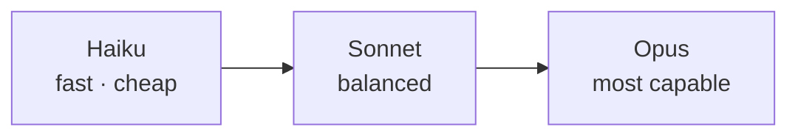

<LevelBadge level="beginner" />

Anthropic은 서로 다른 성능/비용/속도 지점에 위치한 모델 제품군을 제공합니다. 잘 고른다는 것은 대부분 작업에 맞는 모델을 짝지어 주는 일이며 — 필요하지 않은 성능에 과도하게 비용을 지불하지 않는 것입니다.

## 현재 모델

<ModelTable />

## 직접 해보기: 어떤 모델이 맞을까?

세 가지 질문에 답하고 시작 추천을 받으세요:

<ModelPicker />

## 멘탈 모델: 성능 사다리

- **Sonnet으로 시작하세요.** 기본 일꾼입니다 — 합리적인 비용으로 강력한 추론과 코딩을 제공합니다. 대부분의 작업은 여기서 시작해야 합니다.
- **Opus로 올라가는 것**은 Sonnet이 버거워하고 비용보다 품질이 더 중요할 때만(어려운 추론, 까다로운 에이전트, 복잡한 코드).
- **Haiku로 내려가는 것**은 대량 처리, 지연 시간에 민감하거나, 단순한 작업(분류, 추출, 라우팅, 저렴한 서브에이전트)에 적합합니다.

## 실제로 고르는 방법

1. **Sonnet을 기본값으로 두고** 출시하세요.
2. **품질 한계에 부딪혔나요?** 어려운 부분에만 Opus를 시도하세요.
3. **비용이나 지연 시간이 부담되나요?** 그 단계에 Haiku로 충분한지 확인하세요.
4. **모델을 혼합하세요.** 저렴한 전처리/후처리에는 Haiku를, 어려운 핵심에는 Sonnet/Opus를 사용하세요. 이 "모델 계층화(model tiering)"는 가장 큰 비용 레버 중 하나입니다 — [비용 & 지연 시간](/docs/foundations/cost-and-latency) 참고.

:::tip 벤치마크만 보고 고르지 마세요
공개 벤치마크는 시작점 힌트일 뿐 *당신의* 작업에 대한 판정이 아닙니다. 두 모델에 걸쳐 실제 입력 몇 개로 작은 [평가(eval)](/docs/foundations/evals)를 돌려보세요 — 몇 분이면 되고 추측보다 낫습니다.
:::

## 정확한 모델 ID 찾아보기

항상 현재 API 모델 ID를 전달하세요(예: `messages.create` 호출에서). [위의 모델 표](/docs/whats-new/models-and-pricing)나 공식 모델 페이지에서 가져오고 — 여러 곳에 하드코딩하기보다 설정에서 읽어 오는 것을 선호하세요. 그래야 모델 업그레이드가 한 줄 변경으로 끝납니다.

## 다음

- [토큰, 컨텍스트 & 가격](/docs/api/tokens-and-pricing)
- [첫 API 호출](/docs/api/first-call)
- [현재 모델 & 가격](/docs/whats-new/models-and-pricing)
