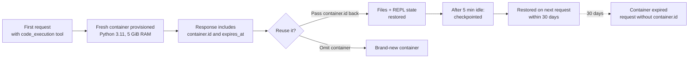

<LevelBadge level="intermediate" />

<Callout type="objectives" items={[
  "도구 블록 하나로 샌드박스를 켜고 Claude가 그것으로 무엇을 하는지 파악한다 — Bash 명령, 파일 편집, 그리고 (최신 버전에서는) 영속적인 Python REPL",
  "올바른 도구 버전을 고른다 — code_execution_20250825 vs 20260120 vs 20260521 — 그리고 각 버전이 정확히 무엇을 열어주는지 이해한다",
  "파일을 넣고 꺼낸다 — container_upload로 업로드하고, OUTPUT_DIR 패턴으로 생성된 파일을 캡처한다",
  "요청 간에 컨테이너를 재사용해 상태를 최대 30일까지 유지하고, 새 컨테이너가 더 안전한 경우를 안다",
  "가격을 정확히 읽는다 — 월 1,550 무료 시간, 그 이후 컨테이너-시간당 $0.05 — 그리고 완전히 무료가 되는 단 하나의 조합을 안다",
  "자체 Bash 도구와 코드 실행을 함께 제공할 때 생기는 다중 환경 혼란을 피한다"
]} />

<VerifyNote lastVerified="2026-08-25" source="https://platform.claude.com/docs/en/agents-and-tools/tool-use/code-execution-tool">
도구 버전 문자열, 모델 호환성, 리소스 한계, 가격 티어는 변동됩니다 — 특정 숫자를 전제로 아키텍처를 설계하기 전에 공식 레퍼런스에서 필드 이름과 무료 시간 상한을 다시 확인하세요.
</VerifyNote>

**코드 실행 도구**는 Anthropic의 서버 사이드 샌드박스입니다. `tools` 배열에 JSON 블록 하나를 추가하면 Claude는 Bash 셸, 파일 편집기, Python 3.11 인터프리터를 얻게 되고, 이 모든 것이 API가 대신 프로비저닝해주는 Linux 컨테이너 안에서 실행됩니다. 여러분이 명령을 실행하거나 `tool_result` 블록을 되돌려 보낼 일은 전혀 없습니다 — API가 각 호출을 실행하고 같은 응답 안에서 출력을 스트리밍해줍니다.

이것은 Anthropic이 이후에 출시하는 많은 것들의 기반 프리미티브입니다. [프로그래매틱 도구 호출](/docs/api/programmatic-tool-calling)은 바로 이 컨테이너 안에서 Python을 실행하고, 새로운 [웹 검색](https://platform.claude.com/docs/en/agents-and-tools/tool-use/web-search-tool)과 [웹 페치](https://platform.claude.com/docs/en/agents-and-tools/tool-use/web-fetch-tool) 도구는 동적 결과 필터링을 위해 이것을 눈에 보이지 않게 사용합니다. 샌드박스를 이해해두면 플랫폼 전체 영역에서 그 투자가 회수됩니다.

## 언제 꺼내 쓸까

<Callout type="info" items={[
  "간단하지 않은 수학 — 큰 수, 여러 단계, 실행 없이는 Claude가 추측할 수밖에 없는 정밀도 민감한 결과",
  "업로드한 파일에 대한 데이터 분석 — CSV, Excel, JSON, XML, 이미지, PDF",
  "사람이 내려받을 시각화, PDF, 스프레드시트 생성",
  "중간 상태를 저장하고 반복해야 하는 다단계 스크립트 — 요청 간에 유지되는 영속적 Python REPL",
  "그러지 않으면 거대한 도구 결과를 모델로 왕복시켜야 하는 모든 작업 — 샌드박스가 로컬에서 걸러줍니다"
]} />

Claude는 단순 산술, 널리 알려진 사실, 사실 확인/대화성 질문, 기본 단위 변환에는 코드를 실행하지 *않습니다*. 요청이 애매하다면 명시적으로 요구하세요. **"run code to verify this"**.

## 세 가지 도구 버전 — 각각이 추가하는 것

현재 유효한 버전은 세 가지입니다. 세 버전 모두 동일한 블록 모양을 반환하며, 어느 것도 `anthropic-beta` 헤더를 요구하지 않습니다.

| 버전                        | 추가되는 것                                                                                                                                                                                                                                               |
| --------------------------- | -------------------------------------------------------------------------------------------------------------------------------------------------------------------------------------------------------------------------------------------------------- |
| `code_execution_20250825`   | Bash 명령과 파일 작업(`view`, `create`, `str_replace`). 대부분의 예제가 사용하는 버전입니다.                                                                                                                                                             |
| `code_execution_20260120`   | **REPL 상태 영속성**과 샌드박스 내부에서의 [프로그래매틱 도구 호출](/docs/api/programmatic-tool-calling) 지원을 추가합니다. Python 인터프리터 상태(변수, import)가 컨테이너를 재사용하는 요청 간에 살아남습니다.               |
| `code_execution_20260521`   | 런타임은 `20260120`과 동일합니다. 도구 설명에 프로그래매틱 도구 호출에서의 **Python 셀당 90초 실제 시간(wall-clock) 제한**이 명시되어, Claude가 계산 중간에 끊기는 대신 오래 걸리는 셀의 예산을 짤 수 있습니다.                       |

**경험 법칙 두 가지:**

- 현재 버전의 웹 검색이나 웹 페치 도구(`web_search_20260209` / `web_fetch_20260209` 또는 이후)를 사용한다면 **반드시** `code_execution_20260120` 이상이어야 합니다 — 그것이 해당 도구들의 동적 필터링에 필요한 코드 실행 버전입니다.
- Claude Haiku 4.5는 최신 타입 문자열을 받아들이지만 실제로는 프로그래매틱 도구 호출이나 REPL 영속성을 지원하지 않습니다. Haiku에서는 최신 버전이 `code_execution_20250825`처럼 동작합니다.

## 요청 한 번으로 샌드박스 띄우기

<Steps items={[
  {title: "도구 블록을 추가한다", body: "tools에 항목 하나를 넣고, type은 원하는 버전으로, name은 code_execution으로 설정하세요. 다른 파라미터는 없습니다 — 두 필드 모두 고정입니다."},
  {title: "계산이 도움이 되는 메시지를 보낸다", body: "Claude에게 계산하거나 파일을 파싱하거나 차트를 만들거나 셸 명령을 실행해달라고 요청하세요. 실행이 필요한지는 Claude가 판단합니다."},
  {title: "교차된 응답을 읽는다", body: "응답은 server_tool_use 블록(Claude가 실행한 명령)과 그에 대응하는 tool_result 블록(stdout, stderr, return_code, 그리고 캡처된 파일)을 섞어 담고, 그 뒤에 Claude의 텍스트 답변이 옵니다."},
  {title: "필요하면 컨테이너를 재사용한다", body: "응답에는 id를 가진 최상위 container 객체가 포함됩니다. 다음 요청에 그 id를 돌려주면 파일과 (최신 도구 버전에서는) Python 상태가 유지됩니다."}
]} />

<PromptCard title="최소 cURL 요청 — 평균과 표준편차">{`curl https://api.anthropic.com/v1/messages \\
  -H "x-api-key: $ANTHROPIC_API_KEY" \\
  -H "anthropic-version: 2023-06-01" \\
  -H "content-type: application/json" \\
  -d '{
    "model": "claude-opus-5",
    "max_tokens": 4096,
    "messages": [{
      "role": "user",
      "content": "Use the code execution tool to calculate the mean and standard deviation of [1, 2, 3, 4, 5, 6, 7, 8, 9, 10]"
    }],
    "tools": [{
      "type": "code_execution_20250825",
      "name": "code_execution"
    }]
  }'`}</PromptCard>

응답은 `server_tool_use` 블록과 `bash_code_execution_tool_result`(또는 `text_editor_code_execution_tool_result`) 블록을 교차로 담고, 그 뒤에 Claude의 요약 텍스트가 옵니다.

## 공짜로 따라오는 하위 도구

코드 실행 도구를 추가하면 Claude가 어느 턴에서든 골라 쓸 수 있는 두 개의 하위 도구가 조용히 열립니다.

- **`bash_code_execution`** — 임의의 셸 명령을 실행합니다. 결과에는 `stdout`, `stderr`, `return_code`, 그리고 명령이 `$OUTPUT_DIR`에 남긴 파일들의 `content` 목록이 포함됩니다.
- **`text_editor_code_execution`** — 파일(소스 코드 포함)을 보고, 만들고, 편집합니다. 지원 명령: `view`, `create`, `str_replace`. diff는 통합 diff 형태(`old_start`, `new_start`, `lines`)로 돌아옵니다.

Python 인터프리터는 별도의 하위 도구가 아닙니다 — Claude는 파일 편집기로 Python을 작성하고 Bash 명령으로 실행합니다. `code_execution_20260120` 이상에 프로그래매틱 도구 호출을 더하면, 컨테이너를 재사용하는 셀 사이에서 *인터프리터 상태*가 유지됩니다.

## 컨테이너에 파일 넣기

[Files API](https://platform.claude.com/docs/en/build-with-claude/files)로 파일을 업로드한 뒤, 메시지에서 `container_upload` 콘텐츠 블록으로 참조하세요. Python 환경은 CSV, Excel(`.xlsx`, `.xls`), JSON, XML, 이미지(JPEG/PNG/GIF/WebP), 그리고 텍스트 기반 포맷을 처리할 수 있습니다.

<PromptCard title="CSV를 업로드하고 Claude에게 분석을 요청하기">{`# 1. Upload the file
FILE_ID=$(curl -sS https://api.anthropic.com/v1/files \\
  -H "x-api-key: $ANTHROPIC_API_KEY" \\
  -H "anthropic-version: 2023-06-01" \\
  -F "file=@data.csv" | jq -r '.id')

# 2. Reference it with a container_upload block
curl https://api.anthropic.com/v1/messages \\
  -H "x-api-key: $ANTHROPIC_API_KEY" \\
  -H "anthropic-version: 2023-06-01" \\
  -H "content-type: application/json" \\
  -d '{
    "model": "claude-opus-5",
    "max_tokens": 4096,
    "messages": [{
      "role": "user",
      "content": [
        {"type": "text", "text": "Analyze this CSV data"},
        {"type": "container_upload", "file_id": "'"$FILE_ID"'"}
      ]
    }],
    "tools": [{"type": "code_execution_20250825", "name": "code_execution"}]
  }'`}</PromptCard>

## 파일을 다시 꺼내기 — `$OUTPUT_DIR` 패턴

이것이 물리기 전까지 아무도 문서화하지 않는 함정입니다. **`$OUTPUT_DIR` 최상위에 있는 파일만 캡처되어 `file_id` 항목으로 반환됩니다.** 모든 `bash_code_execution` 호출은 `$OUTPUT_DIR`로 접근할 수 있는 새 빈 디렉터리를 받습니다. Claude가 컨테이너의 다른 곳에 쓴 것은 그대로 거기에 남고 클라이언트로 전달되지 않습니다.

애플리케이션이 특정 파일을 반드시 받아야 한다면, 프롬프트에서 명시하고 명령을 아래처럼 구성해서 같은 도구 결과 안에서 `ls`로 캡처를 확인하게 하세요.

```bash
python /tmp/make_report.py && cp /tmp/report.pdf "$OUTPUT_DIR/" && ls "$OUTPUT_DIR"
```

Claude는 응답의 `content` 목록을 볼 수 없습니다 — 자신의 프롬프트와 자기 stdout만 봅니다 — 그래서 복사가 성공했음을 알려주는 것이 바로 그 `ls` 줄입니다.

캡처된 파일은 Files API로 내려받을 수 있습니다(`client.files.download(file_id)`). 코드 실행이 Files API를 통해 *생성한* 파일은 여러분이 삭제할 때까지 남으며, 30일 컨테이너 만료와는 무관합니다.

## 컨테이너 수명 주기



- **컨테이너는 생성 시점부터 30일간 유지됩니다.** 각 응답의 `expires_at` 타임스탬프는 더 짧은 *롤링* 값이며, 30일 하드 리밋을 반영하지 않습니다.
- **약 5분간 활동이 없으면** 컨테이너가 체크포인트됩니다. 30일 창 안에서 해당 ID로 요청을 보내면 복원됩니다.
- **만료된 컨테이너는 재사용할 수 없습니다.** 그것을 참조하는 요청은 오류를 반환합니다 — `container` 파라미터 없이 요청을 다시 보내 새 컨테이너를 받으세요.

## 런타임 스펙 — 샌드박스의 실체

| 속성               | 값                                                                                                          |
| ------------------ | ----------------------------------------------------------------------------------------------------------- |
| Python 버전        | 3.11                                                                                                        |
| OS                 | Linux (x86_64 / AMD64)                                                                                      |
| 메모리             | RAM 5 GiB                                                                                                   |
| 디스크             | 워크스페이스 5 GiB                                                                                          |
| CPU                | 1                                                                                                            |
| 실행 시간          | API가 강제하는 도구 호출 전체 상한. 프로그래매틱 도구 호출에서는 각 REPL 셀에 90초 실제 시간 상한이 추가됩니다 |
| 인터넷             | **완전히 비활성** — 외부로 나가는 네트워크 요청 불가                                                         |
| 샌드박스 격리      | 호스트 및 다른 컨테이너로부터 완전 격리                                                                      |
| 워크스페이스 범위  | 컨테이너는 API 키의 워크스페이스 범위로 한정됩니다                                                           |

사전 설치된 라이브러리에는 일반적인 데이터 사이언스 스택(pandas, numpy, scipy, scikit-learn, statsmodels), 시각화(matplotlib, seaborn), 파일 처리(pyarrow, openpyxl, xlsxwriter, xlrd, pillow, python-pptx, python-docx, pypdf, pdfplumber, pypdfium2, pdf2image, pdfkit, tabula-py, reportlab, Img2pdf), 수학(sympy, mpmath), 유틸리티(tqdm, python-dateutil, pytz, joblib), 그리고 커맨드라인 도구(`unzip`, `unrar`, `7zip`, `bc`, `rg`, `fd`, `sqlite`)가 포함됩니다.

**`pip install`은 없습니다.** 인터넷이 꺼져 있으므로 Claude는 런타임에 추가 패키지를 가져올 수 없습니다. 이미 들어 있는 것을 전제로 설계하세요.

## 가격 — 그리고 무료가 되는 단 하나의 조합

<VerifyNote lastVerified="2026-08-25" source="https://platform.claude.com/docs/en/agents-and-tools/tool-use/code-execution-tool#usage-and-pricing">
무료 시간 상한과 시간당 요율은 변경될 수 있습니다 — 이 숫자들을 기준으로 예산 알림을 작성하기 전에 항상 공식 문서의 현재 가격 섹션을 다시 확인하세요.
</VerifyNote>

**요청에 웹 검색이나 웹 페치가 함께 포함되어 있으면 코드 실행은 무료입니다**(`web_search_20260209` 이상, `web_fetch_20260209` 이상). 이런 요청에서는 표준 토큰 비용을 넘어서는 코드 실행 도구 호출 추가 요금이 없습니다 — 여기에는 Anthropic이 눈에 보이지 않게 수행하는 동적 필터링과 Claude가 직접 작성하는 코드가 모두 포함됩니다.

이 도구들이 없으면 코드 실행은 실행 시간 기준으로 과금됩니다.

- 컨테이너당 최소 과금 실행 시간은 **5분**입니다.
- 조직별로 **월 1,550 무료 시간**이 제공됩니다.
- 무료 티어를 초과한 사용분은 **컨테이너당 시간당 $0.05**입니다.
- 요청에 파일이 첨부되면 컨테이너가 미리 로드되므로, Claude가 도구를 전혀 호출하지 않아도 실행 시간이 과금됩니다.

사용량은 응답의 `usage.server_tool_use.code_execution_requests` 카운트로 추적하세요.

## 다중 환경 함정

여러분이 자체 [Bash 도구](https://platform.claude.com/docs/en/agents-and-tools/tool-use/bash-tool)나 커스텀 REPL도 노출한다면, Claude는 이제 *두 개*의 실행 환경을 바라보게 됩니다. Anthropic의 샌드박스 컨테이너와 여러분의 로컬 환경입니다. 두 환경 사이에는 상태가 공유되지 않으며, Claude는 가끔 이 사실을 잊고 엉뚱한 쪽으로 손을 뻗습니다.

둘이 공존할 때는 시스템 프롬프트에 명시적인 가이드를 추가하세요.

<PromptCard title="다중 환경 구성을 위한 시스템 프롬프트 설명문">{`When multiple code execution environments are available, be aware that:
- Variables, files, and state do NOT persist between different execution environments.
- Use the code_execution tool for general-purpose computation in Anthropic's sandboxed environment.
- Use client-provided execution tools (e.g., bash) when you need access to the user's local system, files, or data.
- If you need to pass results between environments, explicitly include outputs in subsequent tool calls rather than assuming shared state.`}</PromptCard>

자체 셸 도구와 함께 웹 검색이나 웹 페치를 활성화할 때도 같은 함정이 조용히 발동합니다. 동적 필터링을 위해 프로비저닝되는 자동 코드 실행은, 여러분이 `tools`에 추가한 적이 없더라도 *두 번째* 환경으로 계산됩니다.

## 실제로 마주칠 오류들

| 도구        | 오류 코드                 | 의미                                                                       |
| ----------- | ------------------------- | -------------------------------------------------------------------------- |
| 전체        | `unavailable`             | 도구를 일시적으로 사용할 수 없음 — 백오프를 두고 재시도하세요               |
| 전체        | `execution_time_exceeded` | 도구 호출 전체가 최대 시간을 초과함 — 명령에 상한을 두세요                  |
| 전체        | `invalid_tool_input`      | 잘못된 형식의 파라미터                                                      |
| 전체        | `too_many_requests`       | 레이트 리밋 — 재시도 전에 백오프하세요                                      |
| bash        | `output_file_too_large`   | 명령 출력이 상한을 초과함 — 쪼개거나 파일로 리다이렉트하세요                |
| text_editor | `file_not_found`          | 보기 또는 편집 대상이 존재하지 않음                                         |

만료된 컨테이너를 참조하면 새 컨테이너가 아니라 오류가 돌아옵니다 — `container` 파라미터를 생략하고 재시도하세요.

오래 걸리는 응답에는 `pause_turn` 중단 이유가 포함될 수 있습니다. 응답을 그대로 되돌려 보내면 Claude가 이어서 진행하고, 수정해서 보내면 중단시킬 수 있습니다.

## 레거시 Python 전용 도구에서 마이그레이션

아직 레거시 `code_execution_20250522`(Python 전용, `code-execution-2025-05-22` 베타 헤더 필요)를 쓰고 있다면, 업그레이드는 한 줄 diff입니다.

```diff
- "type": "code_execution_20250522"
+ "type": "code_execution_20250825"
```

새 버전은 레거시 도구가 하던 것 위에 Bash와 파일 작업을 추가합니다 — 베타 헤더는 필요 없습니다. 응답을 프로그램으로 파싱한다면, 블록 타입이 `code_execution_result`에서 `bash_code_execution_result` 및 `text_editor_code_execution_*_result` 모양으로 바뀝니다.

## 스스로 테스트하기

<Quiz questions={[
  {
    q: "같은 요청에 code_execution_20250825와 web_search_20260209를 함께 제공합니다. 가격은 어떻게 될까요?",
    options: [
      "웹 검색 건당 과금 + 코드 실행 컨테이너-시간당 과금",
      "코드 실행 무료(웹 검색이 있으므로), 표준 입력/출력 토큰은 여전히 과금",
      "코드 실행과 짝지으면 웹 검색이 무료",
      "두 도구 모두 무료 — Anthropic이 이 쌍을 묶음으로 제공"
    ],
    answer: 1,
    explain: "요청에 web_search_20260209(또는 이후)나 web_fetch_20260209(또는 이후)가 있으면, 코드 실행 도구 호출에는 표준 토큰 비용을 넘는 추가 요금이 없습니다 — 여기에는 동적 필터링과 Claude가 직접 실행하는 코드가 모두 포함됩니다."
  },
  {
    q: "Claude가 bash_code_execution 호출 중에 /tmp/report.pdf를 작성합니다. 클라이언트가 응답에서 파일 ID를 추출하는데 PDF가 나타나지 않습니다. 왜일까요?",
    options: [
      "API는 $OUTPUT_DIR 최상위에 있는 파일만 캡처합니다 — /tmp는 컨테이너 안에 있지만 반환되지 않습니다",
      "PDF는 Files API를 별도로 활성화해야 합니다",
      "생성된 파일을 얻으려면 컨테이너 엔드포인트를 폴링해야 합니다",
      "Bash는 PDF를 만들 수 없습니다 — 텍스트 편집기 하위 도구를 사용하세요"
    ],
    answer: 0,
    explain: "각 bash_code_execution 호출은 $OUTPUT_DIR로 접근할 수 있는 빈 디렉터리를 받습니다. 그 디렉터리 최상위의 파일만 캡처되어 반환됩니다. /tmp에 쓴 파일은 여전히 컨테이너 안에 있으므로, 컨테이너를 재사용해 Claude에게 $OUTPUT_DIR로 cp해달라고 요청할 수 있습니다."
  },
  {
    q: "요청 간에 REPL 상태(변수 바인딩)가 유지되어야 합니다. 어떤 도구 버전을 설정해야 할까요?",
    options: [
      "code_execution_20250522 (레거시)",
      "code_execution_20250825 — REPL은 항상 영속적입니다",
      "code_execution_20260120 이상, 그리고 이후 모든 요청에 container.id를 돌려줍니다",
      "아무 버전이든, anthropic-beta: code-execution-repl 헤더를 설정하기만 하면 됩니다"
    ],
    answer: 2,
    explain: "REPL 상태 영속성과 프로그래매틱 도구 호출은 code_execution_20260120에서 도입되었고 _20260521에서도 이어집니다. 영속성을 위해서는 다음 요청에 container.id를 돌려주어 컨테이너를 재사용하는 것도 필요합니다. 베타 헤더는 필요 없습니다."
  }
]} />

## 용어

<Flashcards title="코드 실행 용어집" cards={[
  {front: "$OUTPUT_DIR", back: "명령마다 주어지는 빈 디렉터리로, 최상위 파일이 자동으로 캡처되어 도구 결과의 file_id 항목으로 반환된다. 컨테이너의 다른 곳에 쓴 파일은 컨테이너에 남는다."},
  {front: "container_upload", back: "Files API 파일 ID를 참조하는 콘텐츠 블록으로, 해당 턴 동안 그 파일을 샌드박스 안에서 사용할 수 있게 한다."},
  {front: "container.id", back: "코드 실행을 사용한 모든 응답에 함께 반환되는 최상위 식별자. 다음 요청에 돌려주면 파일(그리고 최신 도구 버전에서는 Python REPL 상태)을 최대 30일까지 유지할 수 있다."},
  {front: "server_tool_use", back: "Claude가 API에 실행을 요청한 명령을 보여주는 응답 블록 타입 — 대응하는 bash_code_execution_tool_result 또는 text_editor_code_execution_tool_result 블록과 짝을 이룬다."},
  {front: "pause_turn", back: "API가 오래 걸리는 턴을 일시 중단했음을 나타내는 중단 이유. 응답을 그대로 재전송하면 Claude가 계속하고, 수정해서 보내면 중단된다."},
  {front: "동적 필터링(Dynamic filtering)", back: "웹 검색 / 웹 페치 뒤에서 코드 실행을 자동으로 사용해, 결과가 컨텍스트에 들어오기 전에 축소하거나 변환하는 것. API가 프로비저닝하므로 이를 위해 도구를 추가할 필요가 없다."}
]} />

## 핵심 정리

<Callout type="takeaways" items={[
  "도구 블록 하나, 이름 하나 — 대부분의 경우 code_execution_20250825, REPL 영속성이나 프로그래매틱 도구 호출이 필요하면 20260120 또는 20260521",
  "컨테이너 재사용이 배수 효과를 냅니다 — container.id를 돌려주어 파일과 상태를 최대 30일까지 유지하세요",
  "파일 넣기: Files API id와 함께 container_upload. 파일 꺼내기: $OUTPUT_DIR 최상위에 있는 파일만 캡처됩니다",
  "웹 검색이나 웹 페치와 짝지으면 토큰 비용 외에 코드 실행이 무료가 됩니다",
  "인터넷도, pip install도 없습니다 — 미리 로드된 라이브러리 집합을 전제로 설계하세요",
  "자체 Bash 도구도 함께 노출할 때는 항상 시스템 프롬프트에 다중 환경 가이드를 추가하세요"
]} />

## 다음으로

- [프로그래매틱 도구 호출](/docs/api/programmatic-tool-calling) — 같은 컨테이너 안의 Python에서 여러분의 도구를 호출하기
- [태스크 예산](/docs/api/task-budgets) — 에이전트 루프 전체의 총 토큰 지출에 상한을 두어 오래 돌아가는 코드가 폭주하지 않게 하기
- [프롬프트 캐싱](/docs/api/prompt-caching) — 안정적인 프리픽스를 재사용해 반복 호출을 저렴하게 유지하기
- [어드바이저 도구](/docs/api/advisor-tool) — 빠른 실행자와 더 높은 지능의 조언자를 짝지우기
