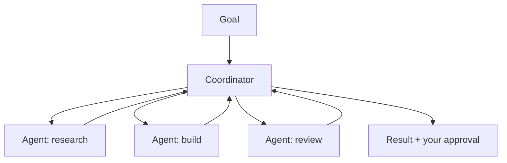

<LevelBadge level="advanced" />

<VerifyNote lastVerified="2026-06-20" source="https://platform.claude.com/docs">
Cowork와 에이전트 팀은 빠르게 변화하는 2026년 표면입니다 — 이름, 가용성, 기능이 자주 바뀝니다. 공식 Anthropic 문서/발표에서 현재 세부 사항을 확인하세요.
</VerifyNote>

단일 에이전트를 넘어, Anthropic은 에이전트가 지속적이고 협업적인 작업을 수행하도록 하는 **제품 수준**의 표면을 출시해 왔습니다: **Cowork**(에이전트형 데스크톱 워크스페이스)와 **에이전트 팀**(여러 에이전트의 협업). 이 페이지는 큰 그림을 담은 지도입니다 — 이들은 빠르게 발전하므로 구체적인 사항은 공식 문서와 대조해 확인하세요.

## Claude Cowork

**에이전트가 당신과 함께 실제적이고 다단계인 작업을 수행하는 워크스페이스**라고 생각하세요 — 단일 채팅 턴보다 긴 시간 동안 파일과 도구를 다루며, 당신이 감독합니다. API에서 에이전트를 구축하는 것의 소비자/프로 대상 사촌격입니다: 루프는 제공되고, 당신은 목표를 지시합니다.

## 에이전트 팀

하나의 에이전트로 충분하지 않은 경우, **여러 에이전트가 협업**합니다 — 목표를 나누고, 각자 역할과 도구를 가지며, 결과를 향해 조율합니다. 개념적으로는 Claude Code의 [서브에이전트](/docs/claude-code/subagents)를 반영하지만, 단일 위임 하위 작업이 아니라 지속적인 멀티 에이전트 협업을 위한 제품 표면입니다.

## 이것이 사이트의 나머지와 어떻게 연결되는가

- 프로그래밍 방식으로 직접 구축 → [에이전트 구축](/docs/api/building-agents) + [Agent SDK](/docs/claude-code/headless-and-agent-sdk).
- 코딩 세션 내부의 위임 → [서브에이전트](/docs/claude-code/subagents).
- 호스팅된 루프/상태/스케줄링 → [관리형 에이전트](/docs/api/managed-agents).

## 변하지 않는 것: 감독

:::warning 자율성이 클수록 더 주의를
멀티 에이전트, 장기 시계열 작업은 가치 *와* 위험을 모두 증폭합니다. 중대한 작업에는 사람을 루프 안에 두고, 도구 접근 범위를 좁게 설정하며, 출력을 검증하세요 — [책임 있는 사용](/docs/security/responsible-use)과 [에이전트 보안](/docs/security/securing-agents) 참고.
:::

## 다음

- [서브에이전트 & 병렬 에이전트](/docs/claude-code/subagents)
- [관리형 에이전트](/docs/api/managed-agents)
- [책임 있는 사용, 윤리 & 검증](/docs/security/responsible-use)
