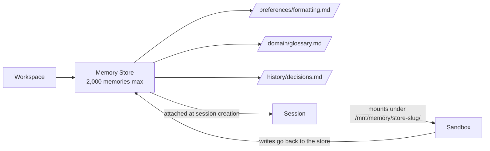

<LevelBadge level="advanced" />

<Callout type="objectives" items={["메모리 스토어란 무엇인지 — 그리고 기존 클라이언트 측 메모리 도구와 어떻게 다른지", "스토어가 세션 샌드박스의 /mnt/memory/에 어떻게 마운트되고 에이전트가 어떻게 사용하는지", "사람들이 걸려 넘어지는 베타 헤더 규칙 (agent-memory-2026-07-22 vs managed-agents-2026-04-01)", "전체 라이프사이클: 생성 → 시드 → 첨부 → 읽기/쓰기 → 버전 감사 → 편집(리댁션)", "구체적인 한도: 세션당 스토어 8개, 스토어당 메모리 2,000개, 메모리당 100 kB"]} />

<VerifyNote lastVerified="2026-07-30" source="https://platform.claude.com/docs/en/managed-agents/memory">
메모리 스토어는 2026년 7월 22일 기준으로 **공개 베타** 상태입니다. 베타 기간 동안 엔드포인트, 헤더 문자열, 한도가 변경되므로 — 배포 전에 공식 레퍼런스와 대조하여 확인하세요.
</VerifyNote>

[관리형 에이전트](/docs/api/managed-agents)로 개발해 본 적이 있다면, 각 세션이 기본적으로 새로운 컨텍스트로 시작한다는 것을 알 것입니다. 세션이 끝나면 에이전트가 학습한 내용은 함께 사라집니다. **메모리 스토어**는 이에 대한 퍼스트파티 해결책입니다: 세션 간에 지속되며 에이전트의 샌드박스에 일반 디렉터리로 마운트되어 파일 도구로 읽고 쓸 수 있는, 서버 측 버전 관리형 텍스트 문서 컬렉션입니다.

## 메모리 스토어 vs 클라이언트 측 메모리 도구

Claude 플랫폼에는 이제 **두 가지 서로 다른 "메모리" 프리미티브**가 있습니다. 혼동하지 마세요.

| | **메모리 스토어** (이 페이지) | **클라이언트 측 메모리 도구** ([별도 페이지](/docs/api/memory-and-context-editing)) |
|---|---|---|
| **메모리가 저장되는 곳** | Anthropic 호스팅, 워크스페이스 범위 | 사용자 자체 스토리지 (Redis, Postgres, 파일 등) |
| **루프 실행자** | 관리형 에이전트 | 사용자 (Messages API + 도구 루프) |
| **베타 헤더** | `agent-memory-2026-07-22` | `context-management-2025-06-27` (메모리 도구) |
| **에이전트가 읽는 방식** | `/mnt/memory/`에 파일로 마운트됨 | 도구 호출 (`view`, `str_replace`, `create` 등) |
| **감사 추적** | 불변 버전, 편집(리댁션) 엔드포인트 | 사용자가 직접 구축 |

같은 *개념*(영구 상태), 다른 *프리미티브*입니다. 아래 내용은 모두 **메모리 스토어**에 관한 것입니다 — 관리형 에이전트 전용, 서버 측 메모리.

## 개념 모델

스토어는 워크스페이스 범위로 지정된 작은 Markdown/텍스트 파일(메모리)의 폴더입니다. 세션에 첨부하면 샌드박스 내부의 마운트로 나타나고, Claude는 표준 [에이전트 도구셋](https://platform.claude.com/docs/en/managed-agents/tools) — 파일 시스템의 나머지 부분에 사용하는 것과 동일한 도구 — 으로 이를 읽고 씁니다.

두 가지 중요한 귀결:

- **각 마운트에 대한 메모**(이름, 마운트 경로, 액세스 모드, 설명 및 세션별 `instructions`)가 시스템 프롬프트에 자동으로 삽입됩니다. 에이전트는 여러분이 알려주지 않아도 마운트가 존재한다는 것을 압니다.
- 마운트 경로 **바깥**에 대한 쓰기 — `/mnt/memory/` 아래 다른 어떤 곳이든 — 는 컨테이너 로컬 스크래치에 저장되며 세션이 종료되면 사라집니다. 마운트 경로에 대한 쓰기만 지속됩니다.

## 베타 헤더 규칙 (함정)

여기서 사람들이 20분을 잃습니다.

<Callout type="warning" items={["메모리 스토어 엔드포인트는 anthropic-beta: agent-memory-2026-07-22만 사용합니다 — 그 외에는 없습니다.", "세션 엔드포인트(메모리 스토어를 세션에 첨부하는 것 포함)는 여전히 managed-agents-2026-04-01을 사용합니다.", "메모리 스토어 요청에 둘 다 보내면 HTTP 400을 반환합니다. 코드가 베타 헤더를 명시적으로 설정한다면, 추가하지 말고 교체하세요."]} />

공식 SDK를 사용하면 올바른 헤더가 자동으로 설정됩니다. 원시 HTTP를 사용하는 경우 호출 지점을 분리하세요:

| 호출 | 헤더 |
|---|---|
| `POST /v1/memory_stores` (생성) | `agent-memory-2026-07-22` |
| `POST /v1/memory_stores/{id}/memories` (메모리 생성/목록/업데이트/삭제) | `agent-memory-2026-07-22` |
| `POST /v1/memory_stores/{id}/memory_versions/…/redact` | `agent-memory-2026-07-22` |
| `POST /v1/sessions` — `resources[]`에 스토어 첨부 | `managed-agents-2026-04-01` |

## 라이프사이클

<Steps items={[{title: "1. 스토어 생성", body: "이름과 설명으로 POST /v1/memory_stores. 설명은 에이전트에게 전달되므로, 브리핑처럼 읽혀야 합니다: '사용자별 환경 설정 및 프로젝트 컨텍스트'."}, {title: "2. 시드 (선택)", body: "/formatting_standards.md 같은 경로에서 memories.create로 참조 자료를 미리 로드하세요. 모든 세션이 봐야 하는 공유 읽기 전용 지식에 좋습니다."}, {title: "3. 세션 생성 시 첨부", body: "POST /v1/sessions에서 type: memory_store, memory_store_id, access, 선택적 instructions를 가진 resources[] 항목을 넣으세요. 스토어는 세션 생성 시에만 첨부할 수 있습니다 — 세션 도중에 추가하거나 제거할 수 없습니다."}, {title: "4. 에이전트가 읽고 쓰도록 하기", body: "스토어는 /mnt/memory/[store-slug]/에 마운트됩니다 (응답에서 정확한 mount_path를 읽으세요). 에이전트의 일반 파일 도구가 나머지를 처리하며, 해당 호출은 스트림에서 agent.tool_use/agent.tool_result 이벤트로 나타납니다."}, {title: "5. 감사 및 편집(리댁션)", body: "모든 쓰기는 불변 메모리 버전을 생성합니다. memory_versions로 히스토리를 검사하고, 이전 콘텐츠를 다시 써서 롤백하거나, redact 엔드포인트로 민감한 콘텐츠를 히스토리에서 지우세요."}]} />

## 스토어 생성과 첫 번째 메모리

스토어 이름과 설명은 에이전트가 보는 것입니다 — 폴더의 README를 작성하듯이 작성하세요.

<PromptCard title="스토어 생성 (curl, 원시 HTTP)">{`curl -s https://api.anthropic.com/v1/memory_stores \\
  -H "x-api-key: $ANTHROPIC_API_KEY" \\
  -H "anthropic-version: 2023-06-01" \\
  -H "anthropic-beta: agent-memory-2026-07-22" \\
  -H "content-type: application/json" \\
  -d '{"name": "User Preferences", "description": "Per-user preferences and project context."}'
# -> {"id": "memstore_01Hx...", ...}`}</PromptCard>

<PromptCard title="메모리 시드">{`curl -s "https://api.anthropic.com/v1/memory_stores/$store_id/memories" \\
  -H "x-api-key: $ANTHROPIC_API_KEY" \\
  -H "anthropic-version: 2023-06-01" \\
  -H "anthropic-beta: agent-memory-2026-07-22" \\
  -H "content-type: application/json" \\
  -d '{"path": "/formatting_standards.md", "content": "All reports use GAAP formatting. Dates are ISO-8601."}'`}</PromptCard>

## 세션에 스토어 첨부

헤더가 다시 `managed-agents-2026-04-01`로 바뀐다는 점에 유의하세요 — 첨부를 포함한 세션 엔드포인트는 관리형 에이전트 헤더를 사용합니다.

<PromptCard title="세션 생성 시 첨부 (read_write)">{`curl -s https://api.anthropic.com/v1/sessions \\
  -H "x-api-key: $ANTHROPIC_API_KEY" \\
  -H "anthropic-version: 2023-06-01" \\
  -H "anthropic-beta: managed-agents-2026-04-01" \\
  -H "content-type: application/json" \\
  -d '{
    "agent": "$AGENT_ID",
    "environment_id": "$ENVIRONMENT_ID",
    "resources": [{
      "type": "memory_store",
      "memory_store_id": "$STORE_ID",
      "access": "read_write",
      "instructions": "User preferences and project context. Check before starting any task."
    }]
  }'`}</PromptCard>

`instructions` 필드는 4,096자로 제한되며 스토어의 `name` 및 `description`과 함께 에이전트에게 표시됩니다.

## 액세스 모드와 인젝션 위험

`access`는 기본적으로 `read_write`입니다. 에이전트가 세션에서 *학습*해야 할 때 올바른 선택입니다. 아무도(또는 아무것도) 수정하지 않기를 원하는 스토어에는 **잘못된** 선택입니다.

<Callout type="warning" items={["read_write 스토어는 세션의 프롬프트 인젝션 위험 하류에 있습니다. 에이전트가 신뢰할 수 없는 입력(사용자 프롬프트, 가져온 페이지, 서드파티 도구 출력)을 처리하면, 성공한 인젝션이 악의적인 콘텐츠를 스토어에 쓸 수 있습니다. 이후 세션은 이를 신뢰할 수 있는 메모리로 읽습니다.", "경험 법칙: 공유 참조 자료(표준, 용어집, 도메인 문서)는 read_only로 첨부하세요. 성장해야 하는 사용자별 또는 세션별 상태만 read_write로 첨부하세요.", "필요하면 둘 다 첨부하세요: 읽기 전용 참조 스토어 하나 + 읽기/쓰기 스크래치 스토어 하나. 세션당 최대 8개."]} />

## 구체적인 한도

모두 공식 문서에서 가져온 것이며, 모두 외울 가치가 있습니다:

| 한도 | 값 |
|---|---|
| 세션당 메모리 스토어 | **8** |
| 스토어당 메모리 | **2,000** |
| 메모리당 바이트 | **100 kB** (~25k 토큰) |
| `instructions` 길이 (첨부당) | **4,096자** |
| 버전 보존 | **30일** (최근 버전은 항상 유지) |

스토어가 메모리 2,000개에 도달하면 이후 쓰기는 — 직접 API 호출 *및* 에이전트 자신의 파일 쓰기 — 실패하기 시작합니다. 문서의 권장 해결책은 "하나의 거대한 스토어"가 아닙니다: **여러 개의 작고 집중된 스토어**(사용자당 하나, 공유 참조용 하나, 프로젝트당 하나)를 사용하고, `memories.delete`로 오래된 항목을 정리하거나, [드리밍 세션](https://platform.claude.com/docs/en/managed-agents/dreams)을 실행하여 통합하세요.

## 감사 추적, 버전, 롤백

메모리에 대한 모든 쓰기는 불변 **메모리 버전**(`memver_...`)을 생성합니다. 버전은 메모리가 아닌 스토어에 속하므로, 메모리 자체가 삭제된 후에도 살아남습니다 — 감사 추적은 완전한 상태로 유지됩니다.

유용한 패턴:

- **특정 시점 검사:** `GET /v1/memory_stores/{id}/memory_versions?memory_id=…` 로 최신순으로 누가 무엇을 변경했는지 확인하세요.
- **롤백:** 전용 복원 엔드포인트는 없습니다. 원하는 버전을 가져와서 그 `content`를 `memories.update`로 다시 쓰세요 (부모 메모리가 사라진 경우 `memories.create`).
- **안전한 동시 편집:** `memories.update`에 `content_sha256` 사전 조건을 전달하세요. 헤드 해시가 더 이상 일치하지 않으면 업데이트가 거부되고, 다시 시도하기 전에 다시 읽습니다 — 고전적인 낙관적 동시성 제어입니다.

## 컴플라이언스: 버전 편집(리댁션)

PII, 비밀, 또는 사용자 삭제 요청으로 콘텐츠를 *히스토리에서 사라지게* 해야 할 때 redact를 사용하세요. 콘텐츠는 지우지만 감사 추적(누가, 언제, 무엇을 했는지)은 보존합니다.

<Callout type="tip" items={["활성 메모리의 현재 헤드는 편집(리댁션)할 수 없습니다. 먼저 새 버전을 쓰거나(또는 메모리를 삭제하고), 그 다음 이전 버전을 편집하세요.", "버전이 부모 메모리보다 오래 지속되기 때문에, 메모리를 삭제해도 히스토리가 자동으로 삭제되지는 않습니다 — 여전히 버전마다 편집(리댁션)해야 합니다.", "버전 보존은 최소 30일입니다. 컴플라이언스를 위해 더 긴 보존이 필요한 경우, 만료되기 전에 API를 통해 버전을 내보내세요."]} />

## 흔한 실수

<Callout type="tip" items={["메모리 스토어 호출에 두 개의 베타 헤더를 모두 보내는 것 — HTTP 400을 받습니다. 추가하지 말고 교체하세요.", "실행 중인 세션에서 스토어를 추가하거나 제거하려는 시도 — 지원되지 않습니다. 첨부는 세션 생성 시에만 이루어집니다, 끝.", "공유 참조 스토어를 read_write로 첨부하기 — 인젝션 한 번이면 여러분의 표준이 향후 모든 세션에서 손상됩니다.", "여러 개의 집중된 스토어 대신 하나의 거대한 스토어 — 2,000 한도에 부딪혀 이후 쓰기가 잠깁니다.", "/mnt/memory/scratch/에 쓰면서 지속되기를 바라는 것 — 마운트 경로 바깥의 모든 것은 컨테이너 로컬이며 세션 종료 시 증발합니다."]} />

## 스스로 확인해 보기

<Quiz title="스스로 확인해 보기" questions={[{q: "메모리 스토어 생성 요청에 anthropic-beta: agent-memory-2026-07-22와 anthropic-beta: managed-agents-2026-04-01을 둘 다 보냈습니다. 어떻게 될까요?", options: ["두 헤더 모두 수락됩니다", "요청이 HTTP 400을 반환합니다 — 메모리 스토어 엔드포인트는 agent-memory-2026-07-22만 단독으로 사용해야 합니다", "새로운 헤더가 조용히 승리합니다", "SDK가 원시 HTTP에서도 자동으로 오래된 헤더를 제거합니다"], answer: 1, explain: "문서는 명시적입니다: 메모리 스토어 엔드포인트에서 둘을 결합하지 마세요 — 둘 다 보내면 400을 반환합니다. 세션 엔드포인트(첨부 포함)는 여전히 managed-agents-2026-04-01을 사용합니다."}, {q: "메모리 스토어는 세션 샌드박스 내부의 어디에 나타나나요?", options: ["/etc/memory/[store-id]", "/mnt/memory/[store-slug]/, 여기서 store slug는 표시 이름을 정제한 것입니다", "/tmp/memory-[store-id]", "나타나지 않습니다 — 에이전트가 읽으려면 API를 호출해야 합니다"], answer: 1, explain: "스토어는 스토어 이름의 slug로 /mnt/memory/ 아래에 마운트됩니다. 경로를 구성하지 말고 항상 세션의 메모리 스토어 리소스에서 정확한 mount_path를 읽으세요."}, {q: "에이전트가 외부 사용자로부터 온 이메일을 처리합니다. 공유 '표준 및 용어집' 스토어에 가장 안전한 액세스 모드는 무엇인가요?", options: ["read_write, 에이전트가 시간이 지남에 따라 용어집을 개선할 수 있도록", "read_only, 그렇지 않으면 프롬프트 인젝션이 공유 참조 자료를 오염시킬 수 있기 때문에", "엄격한 시스템 프롬프트와 함께 read_write", "중요하지 않습니다 — 액세스 모드는 권고 사항입니다"], answer: 1, explain: "액세스는 파일 시스템 수준에서 강제됩니다. read_only 스토어는 성공한 프롬프트 인젝션 아래서도 쓰기를 거부하여, 공유 참조가 향후 세션에서 오염되는 것을 방지합니다."}, {q: "히스토리에서 유출된 비밀을 삭제해야 합니다. 어떤 순서가 작동합니까?", options: ["메모리를 삭제하기 — 히스토리도 함께 삭제됩니다", "현재 헤드 버전을 직접 편집(리댁션)하기", "새 버전을 쓰기(또는 메모리 삭제), 그 다음 이전 버전을 편집(리댁션)", "스토어를 아카이브하기"], answer: 2, explain: "활성 메모리의 현재 헤드는 편집(리댁션)할 수 없습니다. 먼저 새 버전을 쓰거나(또는 메모리를 삭제하고), 그 다음 이전 버전에서 redact를 호출하세요 — 버전은 부모보다 오래 지속됩니다."}, {q: "메모리당 크기 한도와 스토어당 메모리 개수는 얼마입니까?", options: ["메모리당 10 kB, 스토어당 200 메모리", "메모리당 100 kB, 스토어당 2,000 메모리", "메모리당 1 MB, 스토어당 500 메모리", "베타 기간 동안 명시적인 한도는 없습니다"], answer: 1, explain: "메모리당 100 kB(~25k 토큰)와 스토어당 2,000 메모리입니다. 문서는 몇 개의 큰 파일이 아닌 여러 개의 작고 집중된 파일을 권장합니다."}]} />

<Callout type="takeaways" items={["메모리 스토어는 관리형 에이전트를 위한 서버 측 영구 메모리 프리미티브입니다 — 클라이언트 측 메모리 도구와 다릅니다.", "헤더 규칙: 메모리 스토어 엔드포인트에는 agent-memory-2026-07-22, 세션 엔드포인트에는 managed-agents-2026-04-01. 절대 둘 다 사용하지 마세요.", "스토어는 세션 생성 시 첨부되고 /mnt/memory/[store-slug]/에 마운트됩니다; 세션 도중 추가/제거는 지원되지 않습니다.", "공유 참조에는 기본적으로 read_only를 사용하세요; 사용자별 또는 세션별 성장만 read_write여야 합니다.", "모든 쓰기는 불변 버전을 생성합니다; 롤백은 '가져와서 다시 쓰기'; 편집(리댁션)은 컴플라이언스를 위해 히스토리를 지웁니다."]} />

## 다음

- [관리형 에이전트](/docs/api/managed-agents) — 상위 개념: 에이전트, 세션, 환경, 볼트, 배포
- [API에서 에이전트 구축하기](/docs/api/building-agents) — 자체 루프를 만드는 경우
- [메모리 도구 및 컨텍스트 편집 (클라이언트 측)](/docs/api/memory-and-context-editing) — *다른* 메모리 프리미티브
- [프롬프트 인젝션](/docs/security/prompt-injection) — 공유 스토어에서 `read_only`가 중요한 이유
- [에이전트 메모리 아키텍처](/docs/frontiers/agent-memory-architectures) — 영구 메모리 시스템 뒤의 설계 패턴
