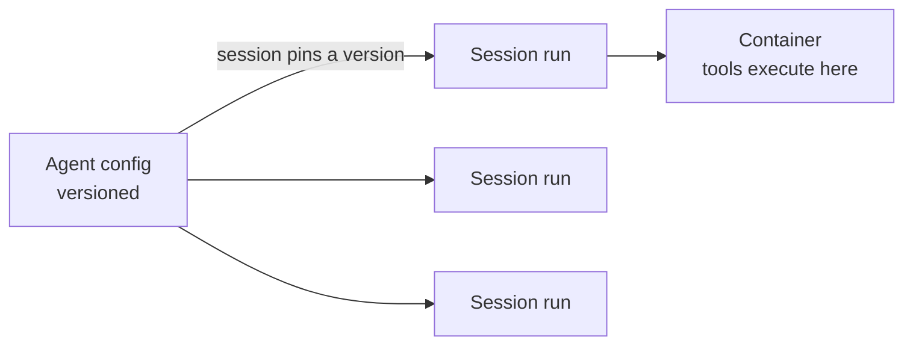

<LevelBadge level="advanced" />

<VerifyNote lastVerified="2026-07-21" source="https://platform.claude.com/docs/en/managed-agents/overview">
관리형 에이전트의 기능과 제공 범위는 변경됩니다 — 이 API는 베타 단계입니다. 이를 기반으로 구축하기 전에 공식 문서에서 엔드포인트, 필드 이름, 접근 권한을 확인하세요.
</VerifyNote>

<Callout type="objectives" items={["관리형(Anthropic 호스팅) 에이전트 루프가 대신 처리해 주는 것이 무엇인지 이해하기", "두 가지 핵심 객체를 구분하기: 버전 관리되는 Agent vs 실행 단위인 Session", "Vault로 시크릿을 안전하게 주입하기 — 모델이 절대 보지 못하게", "예약 배포로 에이전트를 cron 스케줄에 올리기 — 직접 호스팅할 스케줄러 없이", "관리형이 커스텀 루프보다 유리한 경우와 여전히 적용되는 가드레일 알기"]} />

[직접 에이전트 루프를 구축하는 것](/docs/api/building-agents)이 감당하고 싶은 것보다 더 많은 인프라를 요구한다면, **관리형**(Anthropic 호스팅) 에이전트가 루프를 대신 실행해 줍니다 — 그래서 세션 배관, 재시도, 상태, 스케줄링이 아니라 에이전트의 *작업* 자체에 집중할 수 있습니다.

## 두 객체: Agent vs Session

이것이 나머지 모든 것이 매달려 있는 멘탈 모델입니다. 둘은 의도적으로 분리되어 있습니다.

- **Agent**는 *지속되고 버전 관리되는 구성* 입니다 — 모델, 시스템 프롬프트, 도구, MCP 서버, 스킬. 한 번만 생성합니다. 모든 업데이트는 새로운 불변 버전을 만듭니다.
- **Session**은 *런타임 인스턴스* 입니다 — 에이전트를 ID로 가리키는 한 번의 실행. 구성은 에이전트에 있으며, 세션에는 절대 없습니다.

<Callout type="tip">
세션은 생성될 당시의 에이전트 버전에 **고정**됩니다: 실행 중인 세션은 자기 버전을 유지하고, 새 세션은 최신 버전을 받습니다. 이것이 진행 중인 작업을 깨뜨리지 않고 구성 변경을 배포하는 방법입니다.
</Callout>

## "관리형"이 안겨 주는 것

직접 만들어 호스팅하는 대신, 호스팅된 빌딩 블록을 얻습니다:

- **세션** — 실행마다 생성하고 재개하는 지속적 실행; SSE로 이벤트를 스트리밍합니다.
- **환경** — 컨테이너 인프라로, `cloud`(Anthropic 호스팅) 또는 `self_hosted`(도구가 사용자 자신의 VPC에서 실행됨) 중 하나입니다. 세션당 하나의 컨테이너가 에이전트의 워크스페이스입니다.
- **메모리 스토어** — 세션 간 지속되는 상태로, 버전 관리와 편집(redaction)을 지원하며, 데이터베이스를 직접 배선할 필요가 없습니다.
- **Vault** — MCP 인증 및 기타 서비스용 시크릿.
- **예약 배포** — cron 스케줄에 따라 무인으로 실행되는 에이전트.

<PromptCard title="에이전트(버전 관리되는 구성)를 만든 다음, 그에 대해 세션을 실행하기">{`# 1. Create the agent once
POST /v1/agents        -> returns $AGENT_ID
# 2. Each execution is a session pinned to that agent
POST /v1/sessions      { "agent": "$AGENT_ID" }`}</PromptCard>

## Vault: 모델이 절대 보지 못하는 시크릿

자율 에이전트는 종종 API 키가 필요합니다 — 하지만 *모델* 은 절대 그것을 읽어서는 안 됩니다. Vault 자격 증명(`mcp_oauth`, `static_bearer`, `environment_variable`)은 송신(egress) 시점에 치환됩니다: `environment_variable` 자격 증명은 실행 시점에 샌드박스로 주입되며 모델에게는 *절대 보이지 않습니다*.

<Callout type="warning">
이것이 에이전트에게 강력한 접근 권한을 부여하는 안전한 패턴입니다. 키를 시스템 프롬프트나 메시지에 붙여넣지 마세요 — 그렇게 하면 모델(과 사용자의 로그)이 볼 수 있는 컨텍스트의 일부가 됩니다. 키는 Vault에 넣으세요.
</Callout>

## 예약 배포: cron 위의 에이전트

**배포(deployment)**는 cron 스케줄을 에이전트에 연결합니다. 스케줄이 발동하면 새 세션을 시작하고 작업을 완료합니다 — 사용자가 만들거나 호스팅할 스케줄러가 없습니다. 야간 데이터 동기화, 주간 규정 준수 스캔, 일간 다이제스트에 적합합니다.

<Steps items={[
  {title: "스케줄 정의하기", body: "POST /v1/deployments에 agent, environment_id, initial_events(user.message를 반드시 포함해야 함), 그리고 schedule을 담아 호출합니다: POSIX cron 표현식과 IANA 타임존."},
  {title: "발동 1회 = 실행 1회", body: "모든 트리거 시도는 실행 레코드(drun_ 접두사)를 만듭니다. 성공은 session_id를 동반하고, 실패는 error.type(예: environment_archived, session_rate_limited)을 동반합니다. GET /v1/deployment_runs?deployment_id=... 으로 실행 목록을 조회합니다."},
  {title: "수명 주기 제어하기", body: "일시 중지(pause)는 향후 트리거를 억제합니다(수동 실행은 여전히 동작함); 재개(unpause)는 다음 발생 시점부터 재개되며 놓친 트리거를 소급 채우지 않습니다(backfill); 보관(archive)은 종료 상태입니다."},
  {title: "필요할 때 트리거하기", body: "POST /v1/deployments/{id}/run은 — 일시 중지 상태에서도 — 즉시 세션을 시작하며, trigger_context.type: manual을 갖습니다."}
]} />

<PromptCard title="주간 규정 준수 스캔, 매주 금요일 뉴욕 시간 20:00">{`POST /v1/deployments
{
  "name": "Weekly compliance scan",
  "agent": "$AGENT_ID",
  "environment_id": "$ENVIRONMENT_ID",
  "initial_events": [
    {"type": "user.message", "content": [{"type": "text", "text": "Run the compliance scan and summarize findings."}]}
  ],
  "schedule": {"type": "cron", "expression": "0 20 * * 5", "timezone": "America/New_York"}
}`}</PromptCard>

<Callout type="tip">
Cron은 `minute hour day-of-month month day-of-week`이며, 분 단위 세분성을 가집니다. DST는 벽시계(wall-clock) 의미론을 사용합니다: 봄철 시간 앞당김에서 존재하지 않는 시각은 건너뛰고, 가을철 시간 되돌림에서 두 번 발생하는 시각은 두 번 발동합니다. 민감한 작업에는 그러한 경계를 피하는 타임존과 시각을 고르세요.
</Callout>

## 관리형 vs 커스텀, 언제 선택할까

| 다음과 같을 때 **관리형**을 선택하세요… | 다음과 같을 때 **커스텀 루프 / SDK**를 선택하세요… |
|---|---|
| 호스팅, 상태, 스케줄링, 시크릿이 알아서 처리되길 원할 때 | 루프와 도구에 대한 완전한 제어가 필요할 때 |
| 빠르게 프로토타이핑하고 있을 때 | 엄격한 커스텀 인프라/규정 준수 요구사항이 있을 때 |
| 제어보다 운영 단순성이 더 중요할 때 | 자신의 스택에 깊이 임베드하고 있을 때 |

이것은 스펙트럼입니다 — 단일 호출 → 워크플로 → 커스텀 에이전트(SDK) → 관리형. 작업이 허용하는 한 최대한 단순하게 시작하고, 필요할 때만 위로 올라가세요.

## 동일한 가드레일이 적용됩니다

호스팅이든 아니든, 자율 에이전트는 여전히 행동을 취합니다. **최소 권한**, **제한된 비용/반복 횟수**, **위험한 단계에 대한 사람의 승인**을 유지하세요 — [에이전트 보안](/docs/security/securing-agents)과 [자율 실행 강화](/docs/security/hardening-autonomous-runs)를 참고하세요.

<Callout type="takeaways" items={["관리형 에이전트는 루프, 세션, 환경, 메모리, Vault, 스케줄링을 넘겨받아 처리하므로 사용자는 작업 자체에 집중합니다", "Agent는 버전 관리되는 구성이고, Session은 버전에 고정되는 한 번의 실행입니다 — 구성은 세션이 아니라 에이전트에 있습니다", "Vault의 environment_variable 자격 증명은 실행 시점에 주입되며 모델에게 절대 보이지 않습니다 — 에이전트에게 시크릿을 주는 안전한 방법입니다", "예약 배포는 cron 표현식 + IANA 타임존입니다; 발동마다 실행이 생성되며, 재개는 놓친 트리거를 소급 채우지 않습니다", "관리형은 단일 호출 -> 워크플로 -> 커스텀 -> 관리형 중 호스팅 쪽 끝에 위치합니다; 자율성 가드레일은 여전히 적용됩니다"]} />

## 스스로 점검하기

<Quiz title="스스로 점검하기" questions={[
  {
    q: "Agent와 Session의 차이는 무엇인가요?",
    options: [
      "같은 객체에 대한 두 가지 이름이다",
      "Agent는 버전 관리되는 구성이고, Session은 에이전트 버전에 고정되는 한 번의 런타임 실행이다",
      "Session이 모델과 시스템 프롬프트를 담고, Agent는 단지 ID일 뿐이다",
      "Agent가 도구를 실행하고, Session이 시크릿을 저장한다"
    ],
    answer: 1,
    explain: "Agent는 지속되고 버전 관리되는 구성(모델, 프롬프트, 도구, MCP, 스킬)입니다. Session은 에이전트를 참조하고 생성 시점에 그 버전에 고정되는 실행 단위 인스턴스입니다."
  },
  {
    q: "관리형 에이전트가 필요로 하는 API 키를 어떻게 주어야 하나요?",
    options: [
      "에이전트가 읽을 수 있도록 시스템 프롬프트에 넣는다",
      "세션의 첫 번째 사용자 메시지로 전달한다",
      "Vault 자격 증명으로 저장하여 실행 시점에 주입되고 모델에게 절대 보이지 않게 한다",
      "도구 정의에 하드코딩한다"
    ],
    answer: 2,
    explain: "Vault 자격 증명(예: environment_variable 타입)은 송신 시점에 치환되며 모델에게 절대 보이지 않습니다 — 프롬프트나 메시지에 든 키는 보이는 컨텍스트의 일부가 됩니다."
  },
  {
    q: "예약 배포가 이틀간 일시 중지되었다가 다시 재개되었습니다. 일시 중지 동안 발동되었어야 할 트리거는 어떻게 되나요?",
    options: [
      "소급 채워진다 — 놓친 모든 실행이 재개 시 실행된다",
      "소급 채워지지 않는다; 배포는 단지 다음 예약 발생 시점부터 재개된다",
      "배포가 자동으로 보관된다",
      "놓친 모든 실행이 큐에 들어가 1분 간격으로 실행된다"
    ],
    answer: 1,
    explain: "재개는 다음 발생 시점부터 재개되며 놓친 트리거를 소급 채우지 않습니다. (일시 중지 상태에서도 수동 트리거로 언제든 실행을 강제할 수 있습니다.)"
  }
]} />

## 다음

- [API에서 에이전트 구축하기](/docs/api/building-agents)
- [Cowork & 에이전트 팀](/docs/api/cowork-and-agent-teams)
- [헤드리스 모드 & Agent SDK](/docs/claude-code/headless-and-agent-sdk)
- [에이전트 보안](/docs/security/securing-agents)
