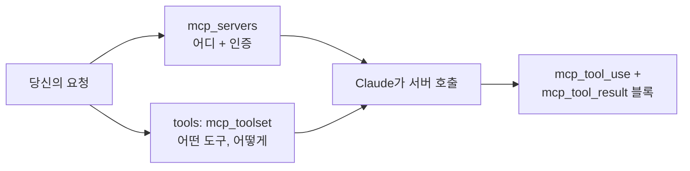

<LevelBadge level="advanced" />

**Model Context Protocol(MCP)** 은 AI를 외부 도구 및 데이터에 연결하기 위한 개방형 표준입니다. API에서는 MCP 클라이언트를 직접 실행할 필요조차 없습니다. **MCP 커넥터** 로 요청에 원격 서버 이름을 넣기만 하면 Claude가 일반 에이전트 루프 안에서 그 도구들을 호출합니다. 두 개의 요청 필드가 통합 계층 전체를 대체합니다.

<Callout type="objectives" items={[
  "MCP 커넥터가 손으로 정의한 도구보다 나을 때 — 그리고 그렇지 않을 때",
  "정확한 요청 구조: 연결은 mcp_servers, 정책은 mcp_toolset",
  "허용 목록, 거부 목록, 도구별 설정 — 그리고 세 층의 설정이 어떻게 병합되는지",
  "반드시 처리해야 하는 응답 블록: mcp_tool_use와 mcp_tool_result",
  "실제 한계들: HTTPS 전용, 도구 전용, 플랫폼 공백, ZDR 미적용",
]} />

<VerifyNote lastVerified="2026-07-20" source="https://platform.claude.com/docs/en/agents-and-tools/mcp-connector">
커넥터는 베타이며 헤더가 이미 한 번 바뀌었습니다: 현재 버전은 `mcp-client-2025-11-20`이고, `mcp-client-2025-04-04`는 **폐지됨** 입니다. 필드 이름, 플랫폼 가용성, 베타 상태는 변합니다 — 배포 전에 공식 페이지와 [modelcontextprotocol.io](https://modelcontextprotocol.io) 를 확인하세요.
</VerifyNote>

## MCP vs 손으로 정의한 도구

| | [도구 사용](/docs/api/tool-use) (커스텀) | MCP 커넥터 |
|---|---|---|
| 당신이 정의하는 것 | 각 도구의 스키마와, 당신이 그걸 실행 | 도구를 *공개* 하는 서버로의 연결 |
| 도구를 누가 실행 | 당신의 코드, 당신의 루프 안에서 | Anthropic 쪽에서 원격 서버를 호출 |
| 적합한 경우 | 앱 안의 몇 가지 맞춤 함수 | 기존 통합 재사용(GitHub, DB, 브라우저, SaaS) |
| 인증 | 당신의 코드 | 서버마다 당신이 제공하는 OAuth 베어러 토큰 |

두 방식은 공존합니다. 앱 고유 도구는 직접 정의하고, 이미 만들어진 능력은 MCP로 가져오세요.



## 요청 구조

두 부분이고, 의도적으로 분리되어 있습니다: **`mcp_servers`** 는 *서버가 어디에 있고 어떻게 인증하는지* 를 말하고, `tools` 배열의 **`mcp_toolset`** 항목은 *그 서버의 어떤 도구를 노출할지, 그리고 어떻게 할지* 를 말합니다.

<Steps items={[
  {title: "베타 헤더 보내기", body: "anthropic-beta: mcp-client-2025-11-20 — 이것이 없으면 mcp_servers 필드가 수락되지 않습니다. SDK에서는 beta.messages.create 호출의 betas 목록입니다."},
  {title: "mcp_servers에 서버 선언", body: "type을 url로, https url, 고유한 name을 지정합니다. 서버가 OAuth를 요구하면 authorization_token을 추가합니다 — OAuth 플로우는 당신이 직접 실행하고 얻은 액세스 토큰을 전달합니다."},
  {title: "tools에 짝이 맞는 mcp_toolset 추가", body: "mcp_server_name을 방금 사용한 이름으로 설정합니다. 추가 설정이 없으면, 그 서버의 모든 도구가 기본값으로 활성화됩니다."},
  {title: "새로운 응답 블록 처리", body: "Claude의 응답에는 mcp_tool_use와 mcp_tool_result 콘텐츠 블록이 들어올 수 있습니다. 도구 블록처럼 렌더링하거나 로깅하세요 — 응답이 평문이라고 가정하지 마세요."},
]} />

<PromptCard title="최소한의 MCP 커넥터 호출 (cURL)">{`curl https://api.anthropic.com/v1/messages \\
  -H "Content-Type: application/json" \\
  -H "X-API-Key: $ANTHROPIC_API_KEY" \\
  -H "anthropic-version: 2023-06-01" \\
  -H "anthropic-beta: mcp-client-2025-11-20" \\
  -d '{
    "model": "MODEL_ID",
    "max_tokens": 1000,
    "messages": [{"role": "user", "content": "What tools do you have available?"}],
    "mcp_servers": [
      {"type": "url", "url": "https://example.com/sse", "name": "example-mcp", "authorization_token": "YOUR_TOKEN"}
    ],
    "tools": [
      {"type": "mcp_toolset", "mcp_server_name": "example-mcp"}
    ]
  }'`}</PromptCard>

:::tip 모델을 절대 하드코딩하지 마세요
위 `MODEL_ID`는 의도적인 자리표시자입니다. [Current Models & Pricing](/docs/whats-new/models-and-pricing) 에서 현재 ID를 읽어 설정에 두세요. 그래야 모델 업그레이드가 한 줄 변경으로 끝납니다.
:::

API는 엄격한 짝을 강제합니다: `mcp_servers`의 모든 서버는 **정확히 하나의** 툴셋에서 참조되어야 하고, 모든 툴셋의 `mcp_server_name`은 선언된 서버와 일치해야 합니다. 불일치는 검증 오류이지 조용한 무동작이 아닙니다.

## Claude가 실제로 할 수 있는 것을 고르기

대부분의 통합이 틀리는 부분이 여기입니다. 툴셋은 모든 도구에 적용되는 `default_config`와, 도구별 오버라이드를 담는 `configs`를 받습니다. 우선순위, 높은 것부터: **도구별 `configs` → 세트 단위 `default_config` → 시스템 기본값**.

**거부 목록** — 전부 켜고, 그 다음 위험한 것들을 끕니다. 폭넓게 열되 파괴적 쓰기는 원치 않을 때 합리적입니다:

```json
{
  "type": "mcp_toolset",
  "mcp_server_name": "calendar-mcp",
  "configs": {
    "delete_all_events": { "enabled": false },
    "share_calendar_publicly": { "enabled": false }
  }
}
```

**허용 목록** — 기본적으로 끄고, 살아남을 것들만 이름 짓습니다. 최소 권한 자세이며, 기본으로 손을 뻗어야 할 방식입니다:

```json
{
  "type": "mcp_toolset",
  "mcp_server_name": "calendar-mcp",
  "default_config": { "enabled": false },
  "configs": {
    "search_events": { "enabled": true },
    "create_event": { "enabled": true }
  }
}
```

:::warning 거부 목록은 당신이 생각한 것만 막습니다
서버는 도구를 추가할 수 있습니다. 거부 목록은 당신이 그것을 쓴 이후 배포된 모든 도구를 조용히 허용합니다; 허용 목록은 그것들을 조용히 *무시* 합니다. 고객 데이터나 돈에 닿는 것이라면 허용 목록으로. 또한 서버에 존재하지 않는 도구를 `configs`에 이름 짓는 것은 백엔드 경고를 남기지만 오류를 내지 **않습니다** — 그래서 허용 목록의 오타는 활성화하려던 도구를 조용히 비활성화합니다. 서버의 라이브 도구 목록에 대해 검증하세요.
:::

## 스키마를 컨텍스트 밖에 두기

활성화된 모든 도구의 설명이 요청과 함께 보내지므로, 뚱뚱한 카탈로그는 매 턴마다 세금을 매깁니다. 커넥터의 답은 `defer_loading: true`입니다: 설명은 초기 컨텍스트에서 빠져 있다가, Claude가 Tool Search Tool을 통해 필요할 때 끌어옵니다.

```json
{
  "type": "mcp_toolset",
  "mcp_server_name": "calendar-mcp",
  "default_config": { "defer_loading": true },
  "configs": {
    "search_events": { "defer_loading": false }
  }
}
```

이걸 이렇게 읽으세요: *이 작업이 시작할 때 필요한 하나만 빼고 전부 미룬다*. 툴셋은 `cache_control`도 받으므로, 안정적인 카탈로그는 매 턴 다시 청구되는 대신 [프롬프트 캐싱](/docs/api/prompt-caching) 브레이크포인트 뒤에 앉을 수 있습니다. 이 뒤의 수치들 — 그리고 도구를 미루는 것이 왜 선택 정확도를 낮추기는커녕 *올렸는지* — 는 [The MCP Token Tax](/docs/claude-code/mcp-token-cost) 를 보세요. 정의가 아니라 *결과* 가 컨텍스트를 침수시킬 때는 대신 [Programmatic Tool Calling](/docs/api/programmatic-tool-calling) 에 손을 뻗으세요.

## 무엇이 돌아오는가

반드시 처리해야 할 두 가지 콘텐츠 블록 유형:

```json
{ "type": "mcp_tool_use", "id": "mcptoolu_...", "name": "echo",
  "server_name": "example-mcp", "input": { "param1": "value1" } }

{ "type": "mcp_tool_result", "tool_use_id": "mcptoolu_...", "is_error": false,
  "content": [ { "type": "text", "text": "Hello" } ] }
```

use 블록의 `server_name`에 주목하세요: 여러 서버가 연결된 상태에서, 그것이 호출을 귀속시키는 방법입니다 — 로깅과 어느 통합이 오작동했는지 디버깅하는 데 필수적입니다. 그리고 `is_error`는 예외가 아니라 필드입니다: 실패한 MCP 도구는 *결과* 로 돌아오므로, 당신의 루프는 성공을 가정하지 말고 그것을 검사해야 합니다.

## 물어뜯는 한계들

<Callout type="warning" items={[
  "도구 전용. MCP 사양 중 커넥터는 현재 도구 호출을 지원합니다 — 프롬프트나 리소스는 아닙니다. 그것들이 필요하다면 자신의 클라이언트를 실행하고 SDK MCP 헬퍼를 사용하세요.",
  "원격 HTTPS 전용. 서버는 HTTP(Streamable HTTP 또는 SSE 전송)로 공개적으로 도달 가능해야 합니다. 로컬 stdio 서버는 이 방식으로 연결할 수 없습니다 — 그것은 Claude Code와 데스크톱 앱이 하는 일입니다.",
  "플랫폼 공백. Claude API, AWS의 Claude Platform, Microsoft Foundry(Hosted-on-Anthropic 배포)에서 사용 가능. 현재 Amazon Bedrock이나 Google Cloud에서는 제공되지 않습니다.",
  "제로 데이터 보존 없음. MCP 서버와 교환되는 데이터 — 도구 정의 및 실행 결과 — 는 ZDR이 아닌 표준 보존 정책 아래 있습니다.",
  "OAuth는 당신의 몫. API는 authorization_token을 받습니다; 그것을 얻고 만료 전에 갱신하는 것은 당신의 일입니다.",
]} />

## 같은 표준, 세 가지 표면

- **API** (이 페이지) — 커넥터를 통해 URL로 원격 서버.
- **[Claude Code](/docs/claude-code/mcp)** — 개발 세션에서 로컬 및 원격 서버.
- **[앱들](/docs/claude-app/connectors)** — MCP가 Connectors를 구동합니다.

프로토콜을 한 번 배우면 옮겨갑니다. 배선만 달라집니다.

## 신뢰

:::warning MCP 서버는 코드 더하기 접근입니다
신뢰하는 서버만 연결하고, 허용 목록으로 최소 권한 범위를 잡으세요. 그리고 서버가 반환하는 콘텐츠는 [프롬프트 인젝션](/docs/security/prompt-injection) 을 실을 수 있는 신뢰되지 않는 입력임을 기억하세요. 서드파티 서버는 배선하기 전에 검토하세요 — [Reviewing Third-Party Code](/docs/security/reviewing-third-party-code) 와 [Securing MCP Servers](/docs/security/securing-mcp-servers).
:::

<Flashcards title="MCP 커넥터 어휘" cards={[
  {front: "MCP 커넥터", back: "자신의 MCP 클라이언트 없이 Messages API에서 직접 원격 MCP 서버를 호출하는 것."},
  {front: "mcp_servers", back: "연결을 담는 요청 필드: type, https url, 고유한 name, 선택적 authorization_token."},
  {front: "mcp_toolset", back: "서버의 어떤 도구가 활성화되어 있고 어떻게 되어 있는지를 말하는 tools 배열의 항목. mcp_server_name을 통해 서버를 가리킴."},
  {front: "default_config vs configs", back: "세트 전체 기본값 vs 도구별 오버라이드. configs가 default_config를 이기고, default_config가 시스템 기본값을 이깁니다."},
  {front: "defer_loading", back: "Claude가 검색할 때까지 도구의 설명을 초기 컨텍스트에서 빼둠 — 부풀어 오른 도구 카탈로그의 해결책."},
  {front: "도구 결과의 is_error", back: "실패한 MCP 도구는 is_error가 true인 결과 블록을 반환합니다 — 예외가 아닙니다. 루프에서 검사하세요."},
]} />

<Quiz title="스스로 확인해 보세요" questions={[
  {q: "캘린더 서버에서 Claude가 search_events와 create_event만 사용하기를 원합니다. 올바른 툴셋 형태는?", options: ["서버 정의의 allowed_tools 배열에 나열", "default_config.enabled를 false로 설정한 다음, configs에서 그 두 개를 활성화", "그 외 모든 도구에 defer_loading을 true로 설정"], answer: 1, explain: "allowed_tools는 폐지된 mcp-client-2025-04-04 헤더에 속합니다. 현재 버전에서는 default_config에서 기본적으로 비활성화하고 configs에서 특정 도구를 활성화하는 방식으로 허용 목록을 만듭니다. defer_loading은 컨텍스트 비용에 영향을 주지 권한에는 영향을 주지 않습니다."},
  {q: "MCP 도구 호출이 실패합니다. 그것은 어디에 나타납니까?", options: ["Messages 요청에 대한 HTTP 오류로", "is_error가 true로 설정된 mcp_tool_result 콘텐츠 블록으로", "응답이 조용히 도구 호출을 생략"], answer: 1, explain: "실패는 is_error가 true인 결과 블록으로 응답 안에서 돌아옵니다. 성공을 가정하는 코드는 실패한 호출을 사실처럼 태연히 렌더링할 것입니다."},
  {q: "Claude가 로컬 stdio 서버에서 MCP 리소스를 읽어야 합니다. 커넥터가 그것을 할 수 있나요?", options: ["예 — mcp_servers에서 type을 stdio로 설정", "아니오 — 커넥터는 원격-HTTPS이고 도구 호출 전용입니다; SDK MCP 헬퍼로 자신의 클라이언트를 실행하세요", "예, 하지만 Bedrock에서만"], answer: 1, explain: "커넥터는 공개적으로 도달 가능한 HTTPS 서버에 대한 도구 호출을 지원합니다. 로컬 stdio 서버, MCP 프롬프트, MCP 리소스는 자신의 클라이언트가 필요하며, SDK가 헬퍼를 제공합니다."},
  {q: "당신의 도구 카탈로그가 네 서버에 걸쳐 있고 매 턴마다 컨텍스트 창을 지배합니다. 가장 저렴한 첫 조치는?", options: ["더 큰 컨텍스트 모델로 전환", "default_config.defer_loading을 true로 설정하고 작업이 시작하는 도구만 미루지 않기", "네 개의 별도 요청으로 작업을 나눔"], answer: 1, explain: "지연 로딩은 Claude가 검색할 때까지 설명을 컨텍스트 밖에 둡니다. 어떤 기능도 떨어뜨리지 않고 턴당 스키마 세금을 줄이며 — 더 적은 도구가 컨텍스트를 혼잡하게 하므로 도구 선택이 개선되는 경향이 있습니다."},
]} />

<Callout type="takeaways" items={[
  "커넥터는 MCP 클라이언트를 두 개의 요청 필드로 대체합니다 — 하지만 원격 HTTPS 서버에 대해서만, 그리고 도구 호출에 대해서만.",
  "mcp_servers는 연결이고, tools의 mcp_toolset은 정책입니다. 각 서버는 정확히 하나의 툴셋과 짝을 이뤄야 합니다.",
  "허용 목록(default_config.enabled false에 명시적 configs 추가)이 거부 목록을 이깁니다: 나중에 서버에 추가된 도구는 허용되지 않고 무시됩니다.",
  "도구 스키마가 컨텍스트 창을 먹기 시작하면 defer_loading과 cache_control이 당신의 레버입니다.",
  "mcp_tool_use와 mcp_tool_result 블록을 처리하세요 — 예외가 아닌 필드인 is_error를 포함해서.",
  "배포 전에 베타 헤더를 확인하세요: mcp-client-2025-11-20은 현재, mcp-client-2025-04-04는 폐지됨.",
]} />

## 출처 및 추가 자료

- [MCP connector — Anthropic docs](https://platform.claude.com/docs/en/agents-and-tools/mcp-connector) — 권위 있는 필드 참조 및 마이그레이션 가이드.
- [Model Context Protocol specification](https://modelcontextprotocol.io) — 개방형 표준 자체, 인가 포함.

## 다음

- [Tool Use / Function Calling](/docs/api/tool-use)
- [Building Agents on the API](/docs/api/building-agents)
- [The MCP Token Tax](/docs/claude-code/mcp-token-cost)
- [Build & Wire Your First MCP Server](/docs/walkthroughs/first-mcp-server)
- [MCP Config Builder](/docs/tools/mcp-config-builder)
