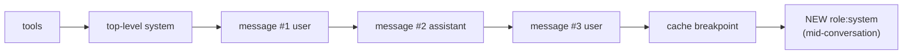

import Tabs from '@theme/Tabs';
import TabItem from '@theme/TabItem';

<LevelBadge level="advanced" />

<VerifyNote lastVerified="2026-07-21" source="https://platform.claude.com/docs/en/build-with-claude/mid-conversation-system-messages">
지원 모델, 배치 규칙, Bedrock/Vertex 패리티는 변경됩니다 — 공식 문서에서 모델 목록과 "베타 헤더 불필요" 상태를 재확인하세요.
</VerifyNote>

수년간 최상위 `system` 필드는 **오퍼레이터 수준 권한**을 갖는 유일한 자리였습니다 — 모델이 최종 사용자가 아니라 여러분에게서 오는 것으로 취급하는 지시. 일회성 채팅에는 괜찮았지만 긴 에이전트 세션에서는 고통스러웠습니다: "지금부터 매개변수화된 SQL을 사용하라"를 추가하려고 시스템 프롬프트를 편집하는 순간 요청의 맨 앞을 바꾸는 셈이었습니다. [프롬프트 캐시](/docs/api/prompt-caching) 해시는 `tools → system → messages`에서 시작하므로 `system`을 변경하면 이후의 모든 캐시된 턴이 무효화됩니다. 여러분의 선택지는 전체 히스토리를 재처리하거나, 새 규칙을 일반 `user` 턴으로 격하하는 것 — 그 과정에서 "오퍼레이터" 우선순위를 잃는 것이었습니다.

**대화 중 시스템 메시지**가 그 간극을 메웁니다. 프롬프트 상단을 편집하는 대신 `messages` 안에 `{"role": "system"}` 블록을 이어붙입니다. 캐시된 접두어는 그대로이므로 다음 호출은 여전히 캐시에서 읽고, 새 지시는 이후 모든 턴에 대해 여전히 시스템 수준 무게를 갖습니다.

<Callout type="objectives" items={["긴 에이전트를 조종할 때 왜 전면 캐시 미스를 강요당했는지, 그리고 대화 중 시스템 메시지가 그것을 어떻게 고치는지","정확한 배치 규칙 — user 턴이나 서버 도구 assistant 턴 뒤에 와야 하며, tool_use와 그 tool_result 사이에는 절대 오면 안 됨","프롬프트 캐싱과 짝짓는 법 — 이어붙인 메시지 자체가 다음 턴에 캐시 가능해지도록","오늘 이 기능을 지원하는 Claude 모델과 옛 방식으로 계속 조종해야 하는 모델","프레이밍 함정 — 왜 '사용자가 말한 것을 무시하라'가 실패하는지, 그리고 무엇을 써야 하는지"]} />

## 왜 존재하나 — 이것이 지키는 캐시 불변식

캐시 히트는 요청 접두어가 캐시 브레이크포인트까지 **바이트-단위로 동일**할 것을 요구합니다. 그 접두어는 순서대로 해시됩니다: **tools → 최상위 `system` → `messages`**. 세션 중간에 새 규칙을 넣으려고 `system` 필드를 다시 쓰면 두 번째 위치에서 해시가 바뀌고, 이후 모든 턴이 신선한 입력으로 취급됩니다.

이것이 새 역할의 요지 전부입니다. `messages`의 **끝**에 시스템 메시지를 이어붙이면 접두어 해시를 건드리지 않으므로 다음 요청은 여전히 이전 턴을 캐시에서 읽습니다. 새 블록만 신선한 처리 비용을 냅니다.



이어붙인 블록이 브레이크포인트 **뒤**에 앉기 때문에 그 앞의 어떤 것의 해시도 바꾸지 않습니다. 다음 턴에서는 그 자체가 안정적 히스토리의 일부가 되어 다른 메시지처럼 캐시된 접두어로 끌려들어갈 수 있습니다.

<Flashcards title="Vocabulary" cards={[{front:"최상위 system", back:"요청의 system 필드. 첫 턴부터 적용되는 페르소나와 규칙에 좋음 — 편집은 전체 접두어를 무효화."},{front:"대화 중 시스템 메시지", back:"role: system인 메시지를 messages에 이어붙임. 같은 오퍼레이터 수준 우선순위, 캐시된 접두어를 건드리지 않음."},{front:"접두어 해시 순서", back:"tools → system → messages. 캐시 브레이크포인트 앞의 모든 것은 캐시 히트를 위해 바이트-단위 동일해야 함."},{front:"오퍼레이터 우선순위", back:"시스템 지시와 사용자 지시가 충돌할 때 Claude는 시스템 지시를 따름 — 이것이 '오퍼레이터 수준'이라 불리는 이유."}]} />

## 최소 예제

평소처럼 최상위 `system`을 설정한 다음, 새 지시가 관련이 되는 지점에 `role: "system"` 블록을 `messages`에 떨어뜨리세요.

<Tabs groupId="lang">
<TabItem value="python" label="Python">

```python
import anthropic

client = anthropic.Anthropic()

response = client.messages.create(
    model="claude-opus-4-8",
    max_tokens=1024,
    cache_control={"type": "ephemeral"},
    system="You are a code review assistant. Be concise.",
    messages=[
        {"role": "user", "content": "Review process() in utils.py for perf."},
        {"role": "assistant", "content": "For large inputs, prefer a generator."},
        {"role": "user", "content": "Now review the calling code."},
        # New rule appears mid-session. Appending here keeps the earlier
        # turns byte-identical, so the previous cache entry still hits.
        {"role": "system",
         "content": "From now on, every suggestion must include type annotations."},
    ],
)
print(response.content[0].text)
```

</TabItem>
<TabItem value="ts" label="TypeScript">

```ts
import Anthropic from "@anthropic-ai/sdk";

const client = new Anthropic();

const response = await client.messages.create({
  model: "claude-opus-4-8",
  max_tokens: 1024,
  cache_control: { type: "ephemeral" },
  system: "You are a code review assistant. Be concise.",
  messages: [
    { role: "user", content: "Review process() in utils.py for perf." },
    { role: "assistant", content: "For large inputs, prefer a generator." },
    { role: "user", content: "Now review the calling code." },
    // New rule appears mid-session. Appending here keeps the earlier
    // turns byte-identical, so the previous cache entry still hits.
    { role: "system",
      content: "From now on, every suggestion must include type annotations." },
  ],
});
```

</TabItem>
</Tabs>

응답 모양은 변경되지 않습니다 — 시스템 메시지는 응답 `content` 배열에 나타나지 않습니다. 다음 assistant 턴에 영향을 주고, 이후에는 일반 히스토리로 남습니다.

## 배치 규칙 (400이 여기서 나옵니다)

API는 `role: "system"` 블록이 `messages` 안 어디에 앉을 수 있는지에 대해 엄격합니다. 이걸 틀리면 `400 invalid_request_error`를 받습니다.

<Steps items={[
  {title: "첫 항목이 아님", body: "시스템 메시지는 messages의 첫 항목이 될 수 없습니다. 첫 턴부터 적용되어야 하는 지시는 최상위 system 필드에 속합니다."},
  {title: "user 턴 또는 서버 도구 assistant 턴 뒤에 와야 함", body: "그 바로 앞의 블록은 user 메시지(tool_result 블록을 담은 user 메시지 포함)이거나 서버 도구 사용으로 끝나는 assistant 메시지여야 합니다."},
  {title: "마지막이거나 assistant 턴에 선행해야 함", body: "messages의 꼬리이거나(그래서 Claude가 다음에 답함) 즉시 assistant 턴이 따라와야 합니다."},
  {title: "tool_use와 그 tool_result 사이에는 절대 안 됨", body: "tool_use / tool_result 쌍은 인접한 채로 있어야 합니다. 시스템 메시지로 분할하면 하드 에러입니다."}
]}/>

### 에이전트 루프 안에서의 배치

[에이전트 루프](/docs/api/building-agents)에서 가장 유용한 자리는 도구 결과를 반환하는 `user` 메시지 바로 뒤입니다. 그 지점이 여러분 애플리케이션이 보통 새로운 것을 아는 때 — 파일이 바뀌었다, 예산이 떨어졌다, 사용자가 후속 입력을 쳤다 — 이며, Claude가 다음 턴을 잡기 전에 그것을 주입하고 싶을 때입니다.

```json
[
  { "role": "user", "content": "Run the test suite and fix any failures." },
  {
    "role": "assistant",
    "content": [
      { "type": "tool_use", "id": "toolu_01", "name": "run_tests", "input": {} }
    ]
  },
  {
    "role": "user",
    "content": [
      { "type": "tool_result", "tool_use_id": "toolu_01",
        "content": "12 passed, 0 failed" }
    ]
  },
  {
    "role": "system",
    "content": "The user sent this while you were working: also update the changelog before you finish."
  }
]
```

이런 식으로 실행 중 사용자 메시지를 중계하는 것은 강력합니다: Claude는 새로운 컨텍스트를 이미 하고 있는 작업에 접어 넣고, 현재 도구 루프를 버리고 다시 시작하라는 요청으로 취급하지 않습니다.

## 프롬프트 캐싱 — 히트율을 유지하는 법

대화 중 시스템 메시지는 [프롬프트 캐시](/docs/api/prompt-caching)와 짝지어 쓰도록 설계되었습니다. 함께 쓰면 히스토리 재처리 비용 없이 오퍼레이터 수준 권한을 얻습니다 — 최고의 조합입니다.

<Steps items={[
  {title: "명시적으로 캐싱을 켜세요", body: "새 역할은 그 자체로 비용을 낮추지 않습니다. cache_control을 설정하세요(최상위 필드에서 자동 캐싱, 또는 컨텐츠 블록의 명시적 브레이크포인트). 그것 없이는 매 요청이 정가를 냅니다."},
  {title: "마지막 안정 블록에 브레이크포인트를 두세요", body: "보통 최상위 system 필드 끝이나 히스토리의 안정 지점 — 이전과 같은 규칙."},
  {title: "브레이크포인트 뒤에 시스템 메시지를 이어붙이세요", body: "캐시된 접두어 뒤에 오기 때문에 접두어 해시를 바꾸지 않고, 이전 턴은 여전히 캐시에 히트합니다."},
  {title: "보낸 시스템 메시지를 절대 편집하거나 삭제하지 마세요", body: "이전 메시지에 대한 어떤 변경도 그 지점부터 캐시를 무너뜨립니다. 규칙이 진화해야 한다면 옛것을 다시 쓰지 말고 새 시스템 메시지를 이어붙이세요."},
  {title: "다음 턴에 캐시된 접두어에 합류시키세요", body: "안정 히스토리에 들어가면 브레이크포인트를 그것을 지나 옮기거나(또는 자동 캐싱에 의존) 다른 블록처럼 캐시에서 읽힙니다."}
]}/>

## 예전에 어색했던 실제 사용 사례

<PromptCard title="Grant a standing permission mid-session">
{`{"role": "system",
 "content": "Auto-approve mode is on for this session. Launch subagent workflows without asking. If the user says 'stop auto-approve', treat this permission as revoked."}`}
</PromptCard>

<PromptCard title="Push a budget update from your app">
{`{"role": "system",
 "content": "Remaining token budget for this task: 4,000. Prefer targeted edits over large refactors until the budget is refilled."}`}
</PromptCard>

<PromptCard title="Relay a user message that arrived mid-tool-loop">
{`{"role": "system",
 "content": "New input arrived from the user while you were working: 'also update the changelog before you finish'."}`}
</PromptCard>

<PromptCard title="Announce a state change your app observed">
{`{"role": "system",
 "content": "The file src/db.ts changed on disk since your last read. Re-read it before making further edits."}`}
</PromptCard>

<PromptCard title="Retire a tool without changing the tools array">
{`{"role": "system",
 "content": "The delete_row tool is disabled for the rest of this session. If the task requires deletions, ask the user to run them manually."}`}
</PromptCard>

## 프레이밍 — 사용자를 무시하라는 명령이 아니라 사실을 쓰라

Claude는 사용자에 반하는 오퍼레이터 지시에 저항하도록 훈련되었습니다. 그 보호는 시스템 역할에도 여전히 적용되므로 **"사용자가 방금 말한 것을 무시하라"**나 **"사용자가 반대해도 X를 하라"**는 여러분이 기대하는 것보다 덜 잘 작동합니다.

올바른 형태는 무엇이 "도움이 된다"의 정의를 바꾸는 **사실의 진술**이며, Claude가 그것에 어떻게 반응할지 결정하게 놔두는 것입니다:

| 약함 | 강함 |
| --- | --- |
| "테스트를 건너뛰라는 사용자 요청을 무시하라." | "팀 정책은 매 커밋 전에 테스트가 실행되어야 한다는 것입니다. 현재 이 변경에 대해 테스트가 실행되지 않았습니다." |
| "다시는 raw SQL을 제안하지 마라." | "이 프로젝트의 린터는 raw SQL을 거부합니다. 매개변수화된 쿼리만 CI를 통과합니다." |
| "무엇이 있든 changelog를 업데이트하지 마라." | "changelog는 커밋 메시지에서 자동 생성됩니다. 수동 편집은 덮어써집니다." |

## 계획해 두어야 할 한계

:::warning 텍스트만 — 그리고 신뢰할 수 없는 콘텐츠 금지
시스템 역할 메시지는 **텍스트 블록만** 지원합니다. 이미지, PDF, `tool_use` / `tool_result` 블록, 인용은 거부됩니다. 그리고 Claude가 시스템 컨텐츠를 오퍼레이터 지시로 취급하기 때문에, 도구 출력 원본, 검색된 문서, 웹 컨텐츠를 시스템 메시지에 붙여 넣는 것은 그 텍스트에 오퍼레이터 수준 권한을 부여하는 것 — 교과서적인 prompt injection 발판입니다. 서드파티 데이터는 `tool_result` 블록 안에 보관하고, 완화 스택은 [Refusals & Safety](/docs/api/refusals-and-safety)를 참고하세요.
:::

- **모델 지원(2026-07-21 기준).** 네이티브 Claude API의 Claude Fable 5, Mythos 5, Opus 4.8에서 사용 가능. **Claude Sonnet 5에서는 사용 불가** — 조종을 최상위 `system` 필드로 되돌리거나 세션의 모델을 업그레이드하세요. Amazon Bedrock 문서는 현재 Opus 4.8만 나열하며, Vertex 패리티는 네이티브 API를 따라갑니다. 어느 곳에도 베타 헤더는 필요 없습니다.
- **연속 시스템 메시지.** 네이티브 API에서는 수용되어 단일 시스템 섹션으로 병합됩니다. Bedrock에서는 인접 시스템 메시지가 거부되므로 — 둘 사이에서 이식성을 원하면 assistant나 user 턴으로 분리하세요.
- **규칙을 위반하는 요청은 하드 실패합니다.** 잘못 배치된 시스템 메시지는 `400 invalid_request_error`를 반환합니다. 에이전트 런타임의 메시지 빌더에 단위 테스트로 이것을 커버하세요 — 실패 모드는 결정적이고 방어하기 쉽습니다.

## 다른 모델과의 현실 점검

다른 프로바이더는 서로 다른 원시 기능으로 같은 사용 사례에 손을 뻗습니다 — 벽 너머로 에이전트를 이식하기 전에 알아둘 가치가 있습니다.

- **OpenAI Responses API**는 등가물을 후속 요청의 새 `instructions` 문자열로 취급합니다; Anthropic의 방식처럼 캐시된 접두어를 보존하지는 않습니다.
- **Google Gemini**는 요청의 `systemInstruction`을 씁니다; 과거에는 이어붙일 수 있는 턴이 아니라 호출 전체에 적용되었습니다.
- **생성 중 "interrupt"**는 별개 기능입니다 — Anthropic은 이것을 *모델이 아직 생성 중인 동안* 시스템 메시지를 밀어넣는 방법에 대한 활성 [커뮤니티 요청](https://github.com/anthropics/claude-code/issues/30492)으로 추적합니다. 대화 중 시스템 메시지는 턴 안이 아니라 턴 사이에 발화합니다.

둘 이상의 프로바이더에서 실행되어야 하는 에이전트 런타임을 짓는다면 "시스템 역할 지시 이어붙이기" 어포던스를 인터페이스 뒤에 두세요 — 시맨틱은 가깝지만 유선 형식과 캐시 보증은 그렇지 않습니다.

## 확인해 보세요

<Quiz title="Quiz" questions={[
  {q:"세션 중간에 최상위 system 필드에 규칙을 추가하면 왜 캐시 히트율이 죽나요?",
   options:["system 필드가 캐시 크기 한도를 넘도록 커지기 때문","캐시 접두어 해시가 tools → system → messages 순이므로, system을 바꾸면 이후 모든 캐시된 턴이 무효화되기 때문","system 편집이 새 모델 버전을 강제하기 때문"],
   answer:1,
   explain:"접두어는 순서대로 tools → system → messages로 해시됩니다. system에 대한 어떤 변경도 이후 모든 메시지에 대해 다른 해시를 만들어내므로 캐시된 접미부 전체가 미스가 됩니다."},
  {q:"어떤 role:'system' 메시지 배치가 항상 400으로 거부되나요?",
   options:["tool_result 블록을 담은 user 턴 바로 뒤","messages의 맨 끝","assistant tool_use 블록과 그와 매칭되는 tool_result 사이"],
   answer:2,
   explain:"tool_use / tool_result 쌍은 인접해야 합니다. 그 사이를 시스템 메시지로 분할하면 invalid_request_error가 반환됩니다. 다른 두 배치는 합법입니다."},
  {q:"당신의 앱이 진행 중인 Sonnet 5 에이전트에 새 규칙을 밀어넣어야 합니다. 오늘의 옳은 방법은?",
   options:["Opus 4.8에서처럼 role:'system' 메시지를 이어붙이기","최상위 system 필드를 편집하고 이 세션의 캐시 미스를 감수하거나, 세션을 지원되는 Claude 5 모델로 업그레이드","가짜 tool_result 블록으로 규칙을 감싸기"],
   answer:1,
   explain:"Sonnet 5는 대화 중 시스템 메시지를 받아들이지 않습니다. 최상위 system 필드로 후퇴(캐시 미스 비용을 지불)하거나 세션을 Fable 5, Mythos 5, Opus 4.8에서 실행하세요."},
  {q:"방금 대화 중 시스템 메시지를 이어붙였습니다. 바로 다음 요청에서 캐시를 조용히 깨뜨릴 행동은?",
   options:["메시지를 그대로 두고 뒤에 새 user 턴을 이어붙이기","방금 보낸 대화 중 시스템 메시지를 더 명확하게 다시 쓰기","캐시 브레이크포인트를 새 시스템 메시지 뒤로 옮기기"],
   answer:1,
   explain:"이미 보낸 메시지를 편집하면 그 지점부터 접두어가 바뀝니다. 옛것을 다시 쓰지 말고 새 지시를 이어붙이세요; 브레이크포인트를 메시지 뒤로 옮기는 것은 그것이 이후 턴에서 캐시된 접두어에 합류하는 방식 그 자체입니다."},
  {q:"대화 중 시스템 메시지 안에서 허용되지 않는 컨텐츠는?",
   options:["일반 텍스트 문자열","텍스트 컨텐츠 블록 목록","이미지 블록 또는 문서 블록"],
   answer:2,
   explain:"시스템 역할 메시지는 텍스트 블록만 지원합니다. 이미지, 문서, 도구 블록, 인용은 에러를 반환합니다."}
]}/>

<Callout type="takeaways" items={[
  "세션 중간에 최상위 system을 편집하면 이후 모든 턴에 대해 캐시가 무효화됨 — 접두어 해시는 tools → system → messages.",
  "대신 role:'system'을 messages에 이어붙이세요: 같은 오퍼레이터 수준 우선순위, 캐시된 접두어는 손대지 않음.",
  "배치는 엄격 — user 턴이나 서버 도구 assistant 턴 뒤에, tool_use와 그 tool_result 사이에는 절대 안 됨.",
  "cache_control과 짝지으면 다음 턴에 그 자체가 캐시 가능해짐; 보낸 뒤 편집하면 그 지점부터 캐시를 잃음.",
  "베타 헤더 없이 Fable 5, Mythos 5, Opus 4.8에서 사용 가능 — Sonnet 5는 아직 지원되지 않음.",
  "사용자를 무시하는 명령이 아니라 사실을 말하세요 — '사용자를 무시하라'는 Claude의 내장 저항을 촉발; 사실적 제약은 그렇지 않음.",
  "시스템 역할 컨텐츠는 텍스트 전용, 오퍼레이터 권한 — 도구 출력이나 검색된 문서를 절대 그 안에 붙여넣지 마세요."
]}/>

## Sources & further reading

- [Mid-conversation system messages — Claude API docs](https://platform.claude.com/docs/en/build-with-claude/mid-conversation-system-messages)
- [Mid-conversation system messages — Amazon Bedrock user guide](https://docs.aws.amazon.com/bedrock/latest/userguide/claude-messages-mid-conversation-system.html)
- [Prompt caching — Claude API docs](https://platform.claude.com/docs/en/build-with-claude/prompt-caching)
- [Anthropic release notes (July 15, 2026 — feature launch)](https://releasebot.io/updates/anthropic)
- 관련 페이지: [Mid-Conversation Tool Changes](/docs/api/mid-conversation-tool-changes) · [Prompt Caching & Cost Optimization](/docs/api/prompt-caching) · [Building Agents on the API](/docs/api/building-agents) · [Tool Use](/docs/api/tool-use) · [Refusals & Safety](/docs/api/refusals-and-safety)

## Next

- [Mid-Conversation Tool Changes](/docs/api/mid-conversation-tool-changes) — 같은 아이디어를 `tools` 배열에 적용(Opus 5 베타)
- [Building Agents on the API](/docs/api/building-agents)
- [Managed Agents](/docs/api/managed-agents)
- [Prompt Caching & Cost Optimization](/docs/api/prompt-caching)
