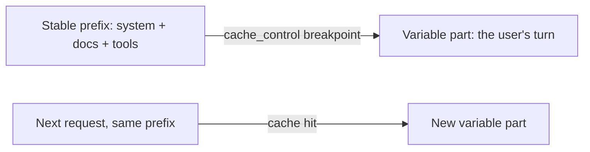

import Tabs from '@theme/Tabs';
import TabItem from '@theme/TabItem';

<LevelBadge level="advanced" />

<VerifyNote lastVerified="2026-07-01" source="https://platform.claude.com/docs/en/build-with-claude/prompt-caching">
캐시 메커니즘, 적격성, 캐시된 토큰 vs 새 토큰의 가격은 변합니다 — 공식 프롬프트 캐싱 문서에서 확인하세요.
</VerifyNote>

여러 요청이 크고 변하지 않는 청크 — 긴 시스템 프롬프트, 큰 문서, 도구 카탈로그 — 를 공유한다면, **프롬프트 캐싱**은 API가 매 호출마다 다시 읽는 대신 처리된 접두부를 재사용하게 해줍니다. 이는 캐시된 부분의 **비용**과 **지연**을 모두 줄여줍니다.

<Callout type="objectives" items={["멘탈 모델: 안정적인 접두부 뒤의 캐시 브레이크포인트, 호출 간 재사용","Python과 TypeScript에서 cache_control로 브레이크포인트 표시하기","성패를 가르는 하나의 불변식 — 접두부는 바이트 단위로 동일해야 한다","usage 필드를 읽어 실제로 캐시 히트를 얻는지 확인하기","캐싱이 가장 큰 효과를 내는 곳, 그리고 배치 처리 및 적정 규모화와 결합하는 법"]} />

## 작동 방식 (멘탈 모델)

안정적인 접두부 뒤에 **캐시 브레이크포인트**를 표시합니다. 첫 호출에서는 처리되어 캐시되고, **정확히 같은 접두부**를 공유하는 이후 호출은 캐시를 히트하여 훨씬 적게 지불합니다.



<Flashcards title="캐싱 용어" cards={[{front:"캐시 브레이크포인트","back":"안정적인 접두부 뒤에 놓인 cache_control 마커. 표시된 블록까지 포함해 모든 것이 캐시됩니다."},{front:"캐시 쓰기","back":"캐시를 채우기 위한 첫 호출의 작은 프리미엄."},{front:"캐시 읽기","back":"같은 접두부를 가진 이후의 모든 호출은 입력 가격의 일부로 그것을 다시 읽습니다."},{front:"조용한 무효화 요인","back":"프롬프트 상단 근처의 변하는 값(타임스탬프, 사용자 이름, 재정렬된 도구 목록)으로, 접두부를 바꿔 히트율을 조용히 0으로 떨어뜨립니다."}]} />

## 브레이크포인트 표시하기 (복사-붙여넣기)

**마지막 안정 블록** — 여기서는 큰 시스템 프롬프트 — 에 `cache_control`을 추가하세요. 사용자의 턴은 그 뒤에 오고 자유롭게 변합니다; 표시된 블록까지 포함해 모든 것이 캐시됩니다.

<Steps items={[{title: "안정적인 접두부 식별", body: "많은 요청에 재사용되는 크고 변하지 않는 청크 — 긴 시스템 프롬프트, 큰 문서, 도구 카탈로그 — 를 찾으세요."},{title: "마지막 블록에 cache_control 부착", body: "마지막 안정 블록을 ephemeral 타입의 cache_control로 표시하여, 그것을 포함한 접두부가 캐시되도록 하세요."},{title: "가변 부분이 뒤따르게 하기", body: "사용자의 턴을 표시된 블록 뒤에 두세요 — 매 호출마다 자유롭게 변하고 전체 가격으로 청구됩니다."},{title: "히트 확인", body: "응답 usage에서 cache_read_input_tokens를 읽으세요. 0보다 크면 캐시 히트를 얻은 것입니다."}]} />

<Tabs groupId="lang">
<TabItem value="python" label="Python">

```python
import anthropic

client = anthropic.Anthropic()

message = client.messages.create(
    model="claude-sonnet-5",
    max_tokens=1024,
    system=[
        {
            "type": "text",
            "text": LARGE_STABLE_PROMPT,  # long, unchanging — the cached prefix
            "cache_control": {"type": "ephemeral"},
        }
    ],
    messages=[{"role": "user", "content": "Summarize the key points."}],  # varies per call
)

print(message.usage.cache_read_input_tokens)  # > 0 means you got a hit
```

</TabItem>
<TabItem value="ts" label="TypeScript">

```ts
import Anthropic from "@anthropic-ai/sdk";

const client = new Anthropic();

const message = await client.messages.create({
  model: "claude-sonnet-5",
  max_tokens: 1024,
  system: [
    {
      type: "text",
      text: LARGE_STABLE_PROMPT, // long, unchanging — the cached prefix
      cache_control: { type: "ephemeral" },
    },
  ],
  messages: [{ role: "user", content: "Summarize the key points." }], // varies per call
});

console.log(message.usage.cache_read_input_tokens); // > 0 means you got a hit
```

</TabItem>
</Tabs>

첫 호출은 캐시를 채우기 위해 작은 **쓰기** 프리미엄을 지불하고, 같은 접두부를 가진 이후의 모든 호출은 입력 가격의 일부로 그것을 다시 읽습니다. 접두부는 적격이 되기에 충분히 길어야 합니다 — 모델에 따라 수천 토큰 — 그렇지 않으면 조용히 캐시되지 않습니다.

## 성패를 가르는 불변식

:::warning 캐싱은 접두부-정확이다
캐시 히트는 캐시된 접두부가 **바이트 단위로 동일**할 것을 요구합니다. 가장 흔한 버그: 프롬프트 상단 근처의 *조용한 무효화 요인* — 타임스탬프, 변하는 사용자 이름, 재정렬된 도구 목록 — 이 접두부를 바꿔 히트율을 조용히 0으로 떨어뜨립니다.
:::

**안정적인 것은 모두 앞에, 가변적인 것은 모두 뒤에 두고,** 접두부를 진정으로 일정하게 유지하세요.

## 실제로 작동하는지 확인하기

가정하지 말고 — 응답 `usage`에서 다시 읽으세요:

- **`cache_creation_input_tokens`** — 이번 호출에서 캐시에 쓰인 토큰(첫 요청).
- **`cache_read_input_tokens`** — 캐시에서 제공된 토큰(절감분).
- **`input_tokens`** — 캐시되지 않은 나머지로, 전체 가격으로 청구됩니다.

접두부를 공유해야 하는 반복 요청에서 `cache_read_input_tokens`가 계속 **0**이면, 조용한 무효화 요인이 작동 중입니다 — 두 호출 사이에 렌더링된 프롬프트 바이트를 diff하여 찾으세요.

## 가장 큰 효과를 내는 곳

- 사용자 간에 재사용되는 긴 **시스템 프롬프트**.
- 같은 소스 텍스트를 반복 질의하는 **RAG / 문서 Q&A**.
- 여러 턴에 걸쳐 고정된 도구 카탈로그와 지시를 가진 **에이전트**.

오프라인 워크로드에는 캐싱을 **배치 처리**와 결합하고, 모델 적정 규모화([모델 선택](/docs/api/choosing-a-model))와 결합하면 가장 큰 통합 절감을 얻습니다 — [비용 & 지연](/docs/foundations/cost-and-latency) 참고.

<Quiz title="스스로 점검하기" questions={[{q:"캐시 히트가 캐시된 접두부에 요구하는 것은?",options:["최소 한 토큰 길이여야 한다","이전 접두부와 바이트 단위로 동일해야 한다","사용자의 턴 뒤에 와야 한다"],answer:1,explain:"캐시 히트는 캐시된 접두부가 바이트 단위로 동일할 것을 요구합니다. 어떤 변화라도 — 타임스탬프, 재정렬된 도구 목록 — 그것을 무효화합니다."},{q:"토큰이 캐시에서 제공되었음(절감분)을 알려주는 usage 필드는?",options:["input_tokens","cache_creation_input_tokens","cache_read_input_tokens"],answer:2,explain:"cache_read_input_tokens는 캐시에서 제공된 토큰입니다. cache_creation_input_tokens는 첫 호출에 쓰인 것이고, input_tokens는 전체 가격으로 청구되는 캐시되지 않은 나머지입니다."},{q:"가변적인 호출별 콘텐츠는 캐시 브레이크포인트에 대해 어디에 놓여야 하나요?",options:["안정적인 접두부 앞","마지막에 — 표시된 블록 뒤","시스템 프롬프트 전체에 뒤섞여"],answer:1,explain:"안정적인 것은 모두 앞에, 가변적인 것은 모두 뒤에 두세요. 사용자의 턴은 표시된 블록 뒤에 오고 매 호출마다 자유롭게 변합니다."}]} />

<Callout type="takeaways" items={["안정적인 접두부 뒤에 캐시 브레이크포인트를 표시하세요; 첫 호출이 그것을 쓰고, 이후 호출은 저렴하게 다시 읽습니다.","캐시 히트는 바이트 단위로 동일한 접두부가 필요합니다 — 안정적인 콘텐츠는 앞에, 가변적인 콘텐츠는 뒤에 두세요.","프롬프트 상단 근처의 조용한 무효화 요인(타임스탬프, 이름, 재정렬된 도구)은 히트율을 조용히 0으로 떨어뜨립니다.","usage로 검증하세요: cache_read_input_tokens > 0이면 히트; 반복 요청에서 0이면 무효화 요인이 작동 중입니다.","캐싱은 재사용되는 시스템 프롬프트, RAG, 에이전트에 가장 큰 효과를 냅니다; 배치 처리 및 모델 적정 규모화와 결합하세요."]} />

## 다음

- [토큰, 컨텍스트 & 가격](/docs/api/tokens-and-pricing)
- [스트리밍 & 멀티 턴](/docs/api/streaming)
- [API로 에이전트 구축하기](/docs/api/building-agents)
