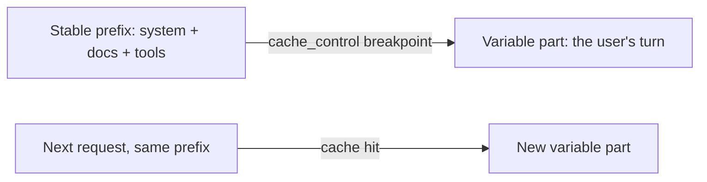

<LevelBadge level="advanced" />

<VerifyNote lastVerified="2026-06-20" source="https://docs.anthropic.com/en/docs/build-with-claude/prompt-caching">
캐시 메커니즘, 적격성, 캐시된 토큰 대 신규 토큰의 가격은 변합니다 — 공식 프롬프트 캐싱 문서에서 확인하세요.
</VerifyNote>

많은 요청이 큰 불변 덩어리 — 긴 시스템 프롬프트, 큰 문서, 도구 카탈로그 — 를 공유한다면, **프롬프트 캐싱**을 통해 API가 매 호출마다 다시 읽는 대신 처리된 접두부를 재사용할 수 있습니다. 이는 캐시된 부분에 대한 **비용**과 **지연 시간**을 모두 줄여줍니다.

## 작동 방식 (멘탈 모델)

안정적인 접두부 뒤에 **캐시 중단점(cache breakpoint)**을 표시합니다. 첫 호출에서 그것이 처리되어 캐시되고, **정확히 동일한 접두부**를 공유하는 후속 호출은 캐시에 적중하여 그 부분에 대해 훨씬 적은 비용을 지불합니다.

## 성패를 가르는 불변 조건

:::warning 캐싱은 접두부가 정확히 일치해야 합니다
캐시 적중은 캐시된 접두부가 **바이트 단위로 동일**할 것을 요구합니다. 가장 흔한 버그: 프롬프트 상단 근처의 *조용한 무효화 요인* — 타임스탬프, 바뀌는 사용자 이름, 순서가 재배열된 도구 목록 — 가 접두부를 바꿔 적중률을 조용히 0으로 떨어뜨리는 것입니다.
:::

**안정적인 모든 것을 앞에, 가변적인 모든 것을 뒤에 두고,** 접두부를 진정으로 일정하게 유지하세요.

## 가장 효과가 큰 곳

- 사용자 전반에 걸쳐 재사용되는 긴 **시스템 프롬프트**.
- 같은 원본 텍스트를 반복적으로 질의하는 **RAG / 문서 Q&A**.
- 여러 턴에 걸쳐 고정된 도구 카탈로그와 지시문을 가진 **에이전트**.

오프라인 워크로드에는 캐싱을 **배치 처리**와, 그리고 모델 크기 적정화([모델 선택](/docs/api/choosing-a-model))와 결합하면 가장 큰 종합 절감 효과를 얻습니다 — [비용 & 지연 시간](/docs/foundations/cost-and-latency) 참고.

## 다음

- [토큰, 컨텍스트 & 가격](/docs/api/tokens-and-pricing)
- [스트리밍 & 멀티턴](/docs/api/streaming)
- [API로 에이전트 구축하기](/docs/api/building-agents)
