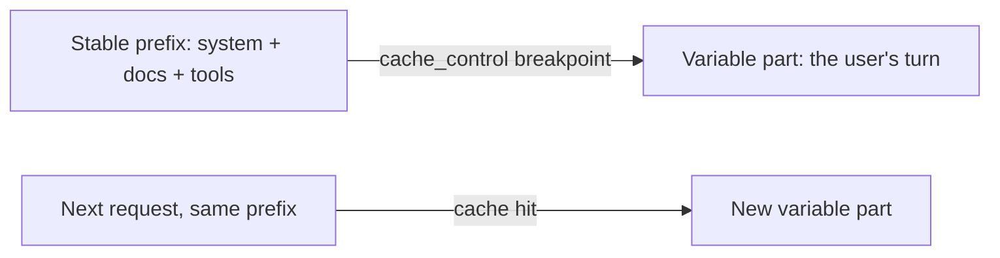

import Tabs from '@theme/Tabs';
import TabItem from '@theme/TabItem';

<LevelBadge level="advanced" />

<VerifyNote lastVerified="2026-06-21" source="https://platform.claude.com/docs/en/docs/build-with-claude/prompt-caching">
캐시 동작 방식, 적용 조건, 캐시된 토큰과 새 토큰의 가격은 변할 수 있습니다 — 공식 prompt-caching 문서에서 확인하세요.
</VerifyNote>

여러 요청이 크고 변하지 않는 덩어리 — 긴 시스템 프롬프트, 대용량 문서, 도구 카탈로그 — 를 공유한다면, **프롬프트 캐싱**을 통해 API가 매 호출마다 접두부를 다시 읽는 대신 이미 처리된 접두부를 재사용할 수 있습니다. 이는 캐시된 부분의 **비용**과 **지연 시간**을 모두 줄여줍니다.

## 작동 원리 (멘탈 모델)

안정적인 접두부 뒤에 **캐시 중단점(cache breakpoint)**을 표시합니다. 첫 호출에서 이 부분이 처리되어 캐시되고, **정확히 동일한 접두부**를 공유하는 이후 호출은 캐시에 적중하여 해당 부분에 대해 훨씬 적은 비용을 지불합니다.



## 중단점 표시하기 (복사-붙여넣기)

**마지막 안정 블록** — 여기서는 대용량 시스템 프롬프트 — 에 `cache_control`을 추가합니다. 사용자의 턴은 그 뒤에 오며 자유롭게 변합니다. 표시된 블록까지의 모든 내용이 캐시됩니다.

<Tabs groupId="lang">
<TabItem value="python" label="Python">

```python
import anthropic

client = anthropic.Anthropic()

message = client.messages.create(
    model="claude-sonnet-4-6",
    max_tokens=1024,
    system=[
        {
            "type": "text",
            "text": LARGE_STABLE_PROMPT,  # long, unchanging — the cached prefix
            "cache_control": {"type": "ephemeral"},
        }
    ],
    messages=[{"role": "user", "content": "Summarize the key points."}],  # varies per call
)

print(message.usage.cache_read_input_tokens)  # > 0 means you got a hit
```

</TabItem>
<TabItem value="ts" label="TypeScript">

```ts
import Anthropic from "@anthropic-ai/sdk";

const client = new Anthropic();

const message = await client.messages.create({
  model: "claude-sonnet-4-6",
  max_tokens: 1024,
  system: [
    {
      type: "text",
      text: LARGE_STABLE_PROMPT, // long, unchanging — the cached prefix
      cache_control: { type: "ephemeral" },
    },
  ],
  messages: [{ role: "user", content: "Summarize the key points." }], // varies per call
});

console.log(message.usage.cache_read_input_tokens); // > 0 means you got a hit
```

</TabItem>
</Tabs>

첫 호출은 캐시를 채우기 위해 소액의 **쓰기(write)** 프리미엄을 지불하고, 동일한 접두부를 가진 이후의 모든 호출은 입력 가격의 일부 비용으로 이를 다시 읽어옵니다. 접두부는 적용 대상이 될 만큼 충분히 길어야 합니다 — 모델에 따라 다르지만 수천 토큰 정도 — 그렇지 않으면 아무런 알림 없이 캐시되지 않습니다.

## 성패를 가르는 불변 조건

:::warning 캐싱은 접두부가 정확히 일치해야 합니다
캐시 적중은 캐시된 접두부가 **바이트 단위로 동일**할 것을 요구합니다. 가장 흔한 버그는 프롬프트 상단 근처의 *조용한 무효화 요인(silent invalidator)* — 타임스탬프, 바뀌는 사용자 이름, 순서가 재배열된 도구 목록 — 이 접두부를 바꿔 적중률을 소리 없이 0으로 떨어뜨리는 것입니다.
:::

**안정적인 모든 것을 앞에, 가변적인 모든 것을 뒤에 두고,** 접두부를 진정으로 일정하게 유지하세요.

## 실제로 작동하는지 확인하기

추측하지 말고, 응답의 `usage`에서 직접 읽어 확인하세요:

- **`cache_creation_input_tokens`** — 이번 호출에서 캐시에 기록된 토큰 (첫 요청).
- **`cache_read_input_tokens`** — 캐시에서 제공된 토큰 (절감분).
- **`input_tokens`** — 캐시되지 않은 나머지로, 전체 가격으로 청구됩니다.

접두부를 공유해야 하는 반복 요청 전반에서 `cache_read_input_tokens`가 계속 **0**으로 유지된다면, 조용한 무효화 요인이 작동하고 있는 것입니다 — 두 호출 사이에 렌더링된 프롬프트 바이트를 비교(diff)하여 원인을 찾으세요.

## 가장 효과가 큰 곳

- 사용자 전반에 걸쳐 재사용되는 긴 **시스템 프롬프트**.
- 같은 원본 텍스트를 반복적으로 질의하는 **RAG / 문서 Q&A**.
- 여러 턴에 걸쳐 고정된 도구 카탈로그와 지시문을 가진 **에이전트**.

오프라인 워크로드에는 캐싱을 **배치 처리**와, 그리고 모델 크기 적정화([모델 선택](/docs/api/choosing-a-model))와 결합하면 가장 큰 종합 절감 효과를 얻습니다 — [비용 및 지연 시간](/docs/foundations/cost-and-latency) 참고.

## 다음

- [토큰, 컨텍스트 및 가격](/docs/api/tokens-and-pricing)
- [스트리밍 및 멀티턴](/docs/api/streaming)
- [API로 에이전트 구축하기](/docs/api/building-agents)
