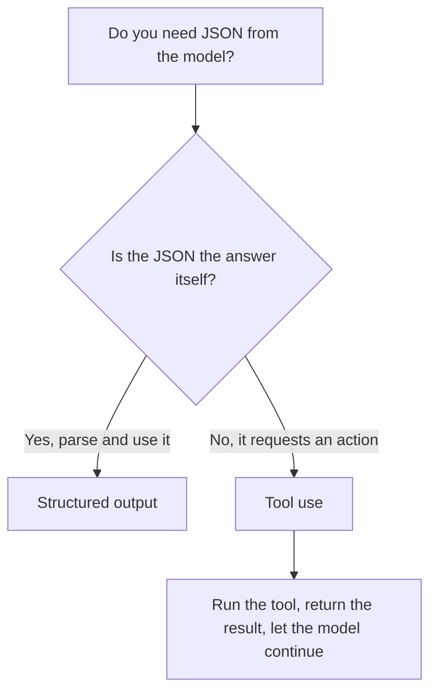

<LevelBadge level="intermediate" />

<VerifyNote lastVerified="2026-06-20" source="https://docs.anthropic.com/en/docs/build-with-claude/structured-outputs">
스키마를 강제하는 정확한 메커니즘은 발전합니다 — 현재 접근법(출력 설정 / 파싱 헬퍼)을 공식 문서에서 확인하세요.
</VerifyNote>

Claude의 출력이 다른 소프트웨어에 입력될 때는 **신뢰할 수 있는 구조** — 매번 알려진 형태에 맞는 유효한 JSON — 가 필요합니다. "JSON으로 응답하라"고 하고 기대에 맡기지 마세요; 플랫폼의 구조화된 출력 지원을 사용하세요.

## 신뢰할 수 있는 방법

출력에 대한 **JSON 스키마**를 제공하고 API/SDK가 이를 강제하도록 한 뒤, 타입이 지정된 객체(예: Python의 Pydantic, TypeScript의 Zod)로 파싱하세요. SDK 파싱 헬퍼는 직접 `JSON.parse`하고 검증해야 하는 문자열 대신 타입이 지정된 결과를 건네줍니다.

```python
# Conceptual shape — see the official docs for the current API surface.
from pydantic import BaseModel

class Ticket(BaseModel):
    title: str
    priority: str   # "low" | "medium" | "high"
    tags: list[str]

# Request the model to return data conforming to Ticket's JSON schema,
# then parse the response into a Ticket instance.
```

## 그냥 JSON을 프롬프트로 요청하면 안 되나요?

프롬프트에서 JSON을 요청할 *수* 있고 단순한 경우에는 잘 됩니다 — 하지만 흔들릴 수 있습니다: 군더더기 산문, 끝에 붙은 쉼표, 누락된 필드. 스키마로 강제된 출력은 이런 부류의 버그를 제거하는데, 이는 다운스트림 시스템이 그것에 의존하는 순간 중요해집니다.

## 구조화된 출력 vs. 도구 사용

두 기능 모두 모델에 **JSON Schema**를 건네주므로 비슷해 보입니다 — 그래서 사람들이 잘못된 것을 고릅니다. 차이는 메커니즘이 아니라 *의도*입니다:

| | **구조화된 출력** | **[도구 사용](/docs/api/tool-use)** |
|---|---|---|
| 원하는 것 | 고정된 형태의 **최종 답변** | 모델이 **기능을 호출**하는 것(함수 호출, 데이터 가져오기, 액션 수행) |
| 누가 소비하는가 | 당신의 코드가 직접 | 당신의 코드가 도구를 실행한 뒤 결과를 모델에 다시 전달 |
| 턴 형태 | 한 번의 응답으로 끝 | 루프: 모델이 요청하고, 당신이 실행하고, 모델이 계속 진행 |
| 일반적인 용도 | 추출, 분류, 파싱 | 에이전트, 실시간 조회, 부수 효과 |

빠른 경험칙:



JSON이 결과물 *그 자체*라면 구조화된 출력을 사용하세요. JSON이 모델이 당신의 코드에 무언가를 *하도록* 요청하는 것이라면, 그것은 도구 사용입니다. 에이전트는 흔히 둘 다 사용합니다: 행동하기 위한 도구, 그리고 깔끔한 최종 결과를 반환하기 위한 구조화된 출력.

## 팁

- **스키마를 빡빡하게 유지하세요.** 고정된 선택지에는 enum을 사용하고, 필수 필드를 표시하세요.
- **필드를 설명하세요.** 필드 설명은 미니 프롬프트처럼 모델을 안내합니다.
- **그래도 검증하세요** — 경계에서의 방어적 파싱은 저렴한 보험입니다.
- **추출** 작업에는 구조화된 출력 + 명확한 스키마가 매번 자유 형식을 이깁니다.

## 다음

- [도구 사용 / 함수 호출](/docs/api/tool-use) — 도구도 JSON 스키마를 사용합니다
- [첫 API 호출](/docs/api/first-call)
- [재사용 가능한 프롬프트 템플릿](/docs/templates/prompts)
