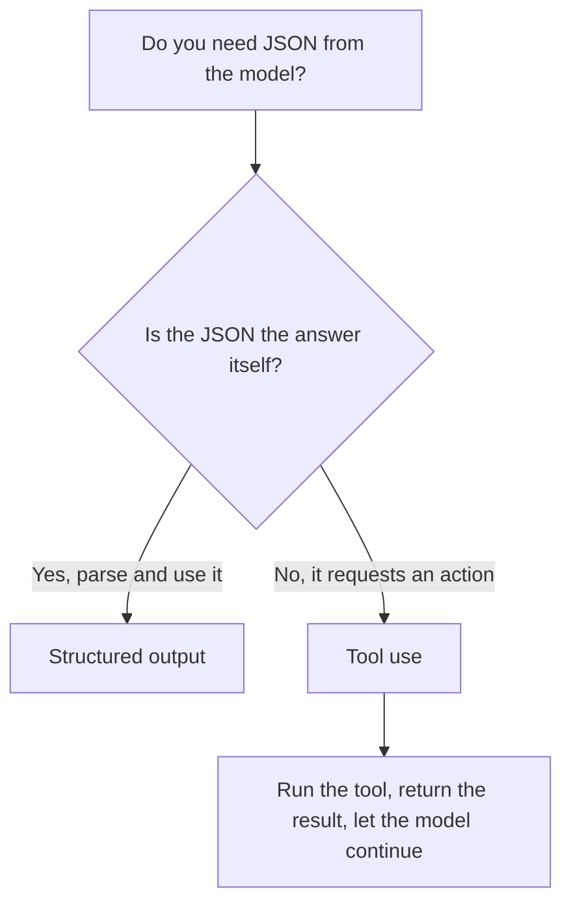

<LevelBadge level="intermediate" />

<VerifyNote lastVerified="2026-06-20" source="https://platform.claude.com/docs/en/docs/build-with-claude/structured-outputs">
스키마를 강제하는 정확한 메커니즘은 진화합니다 — 현재 접근법(출력 설정 / 파싱 헬퍼)을 공식 문서에서 확인하세요.
</VerifyNote>

<Callout type="objectives" items={["JSON을 프롬프트하고 바라는 것보다 스키마 강제 출력이 왜 나은지 설명하기", "JSON Schema를 제공하고 응답을 타입 객체(Pydantic / Zod)로 파싱하기", "구조화된 출력을 도구 사용과 메커니즘이 아닌 의도로 구분하기", "탄탄하고 신뢰할 수 있는 스키마를 위한 네 가지 팁 적용하기", "한 가지 질문 경험칙으로 알맞은 도구 고르기"]} />

Claude의 출력이 다른 소프트웨어에 공급될 때는 **신뢰할 수 있는 구조** — 매번 알려진 형태를 따르는 유효한 JSON — 가 필요합니다. "JSON으로 응답해"에 의존하고 바라지 마세요; 플랫폼의 구조화된 출력 지원을 사용하세요.

이 레슨은 *프롬프트하고 기도하기가 왜 실패하는지*에서 *스키마를 강제하고 타입 객체로 파싱하는 법*까지 안내하며 — 둘이 똑같아 보일 때 구조화된 출력을 도구 사용과 구별하는 법도 다룹니다. 위에서 아래로 진행한 뒤, 끝부분의 퀴즈로 스스로를 테스트하세요.

## 신뢰할 수 있는 방법

출력에 대한 **JSON Schema**를 제공하고 API/SDK가 그것을 강제하게 한 뒤, 타입 객체(예: Python의 Pydantic, TypeScript의 Zod)로 파싱하세요. SDK 파싱 헬퍼는 여러분이 직접 `JSON.parse`하고 검증해야 하는 문자열 대신 타입이 지정된 결과를 건네줍니다.

<Steps items={[
  {title: "형태 정의", body: "필요한 출력을 JSON Schema로 모델링하세요 — Python에서는 Pydantic BaseModel로, TypeScript에서는 Zod 스키마로."},
  {title: "스키마 준수 출력 요청", body: "모델에게 그 스키마를 따르는 데이터를 반환하도록 요청하여, 운에 맡기는 대신 API/SDK가 그것을 강제하게 하세요."},
  {title: "타입 객체로 파싱", body: "SDK 파싱 헬퍼로 타입이 지정된 결과를 직접 얻으세요 — 수동 JSON.parse에 손수 만든 검증을 더할 필요 없이."}
]} />

```python
# Conceptual shape — see the official docs for the current API surface.
from pydantic import BaseModel

class Ticket(BaseModel):
    title: str
    priority: str   # "low" | "medium" | "high"
    tags: list[str]

# Request the model to return data conforming to Ticket's JSON schema,
# then parse the response into a Ticket instance.
```

적용할 구체적인 요청이 필요한가요? 여기 모델에 건네는 것의 형태가 있습니다 — 모델을 여러분 자신의 스키마로 교체하세요.

<PromptCard title="Ask for schema-conforming output">{`Return the data conforming to this JSON Schema:

{
  "title": "string",
  "priority": "low | medium | high",
  "tags": ["string"]
}

Do not include any prose outside the JSON.`}</PromptCard>

## 왜 그냥 JSON을 프롬프트하지 않나?

프롬프트에서 JSON을 요청할 *수도* 있고, 단순한 경우에는 작동합니다 — 하지만 표류할 수 있습니다: 불필요한 산문, 후행 쉼표, 누락된 필드. 스키마 강제 출력은 그 부류의 버그를 제거하는데, 이는 다운스트림 시스템이 그것에 의존하는 순간 중요해집니다.

<Callout type="warning" items={["프롬프트된 JSON은 데모에서는 작동하고 프로덕션에서는 깨집니다: 실패는 다운스트림 시스템이 그것을 파싱할 때만 드러납니다.", "주의해야 할 세 가지 고전적 표류: JSON 주변의 불필요한 산문, 후행 쉼표, 누락된 필수 필드."]} />

## 구조화된 출력 vs. 도구 사용

두 기능 모두 모델에 **JSON Schema**를 건네므로 비슷해 보입니다 — 그리고 사람들은 잘못된 것을 고릅니다. 차이는 메커니즘이 아니라 *의도*입니다:

| | **구조화된 출력** | **[도구 사용](/docs/api/tool-use)** |
|---|---|---|
| 원하는 것 | 고정된 형태의 **최종 답변** | 모델이 **기능을 호출**하는 것 (함수 호출, 데이터 가져오기, 조치 취하기) |
| 소비하는 주체 | 여러분의 코드가 직접 | 여러분의 코드가 도구를 실행한 뒤 결과를 모델에 다시 공급 |
| 턴 형태 | 하나의 응답, 완료 | 루프: 모델이 요청하고, 여러분이 실행하고, 모델이 계속 |
| 전형적 용도 | 추출, 분류, 파싱 | 에이전트, 실시간 조회, 부작용 |

빠른 경험칙:



JSON이 *산출물 그 자체*라면 구조화된 출력을 사용하세요. JSON이 모델이 여러분의 코드에게 무언가를 *하라고* 요청하는 것이라면, 그것은 도구 사용입니다. 에이전트는 종종 둘 다 사용합니다: 행동하기 위한 도구, 깔끔한 최종 결과를 반환하기 위한 구조화된 출력.

## 팁

<Callout type="tip" items={["스키마를 탄탄하게 유지하세요 — 고정된 선택에는 enum을 사용하고, 필수 필드를 표시하세요.", "필드를 설명하세요 — 필드 설명은 미니 프롬프트처럼 모델을 안내합니다.", "경계에서는 어쨌든 검증하세요 — 방어적 파싱은 저렴한 보험입니다.", "추출 작업에는 구조화된 출력 + 명확한 스키마가 매번 자유 형식을 이깁니다."]} />

<Callout type="takeaways" items={["API/SDK에 JSON Schema를 건네고 타입 객체로 파싱하세요 — 프롬프트하고 기도하지 마세요.", "JSON을 프롬프트하면 표류할 수 있습니다(불필요한 산문, 후행 쉼표, 누락 필드); 스키마 강제는 그 버그 부류를 제거합니다.", "구조화된 출력 vs. 도구 사용은 의도로 다릅니다: JSON이 답인가 vs. JSON이 조치를 요청하는가.", "탄탄한 스키마, 설명된 필드, 경계 검증이 추출과 분류를 신뢰할 수 있게 만듭니다."]} />

## 용어 굳히기

<Flashcards cards={[
  {front: "구조화된 출력", back: "최종 답변에 대한 JSON Schema를 API/SDK에 건네고 응답을 타입 객체(Pydantic / Zod)로 파싱합니다. JSON이 산출물 그 자체입니다."},
  {front: "도구 사용", back: "모델이 기능을 호출할 수 있도록 JSON Schema를 건넵니다. 여러분의 코드가 도구를 실행한 뒤 결과를 다시 공급합니다 — 일회성 답변이 아니라 루프."},
  {front: "JSON Schema", back: "두 기능이 의존하는 형태. Python에서는 Pydantic BaseModel로, TypeScript에서는 Zod 스키마로 모델링합니다."},
  {front: "파싱 헬퍼", back: "타입이 지정된 결과를 직접 반환하는 SDK 헬퍼로, 수동 JSON.parse와 손수 만든 검증을 건너뛰게 합니다."},
  {front: "한 가지 질문 경험칙", back: "JSON이 답 그 자체인가? 예 → 구조화된 출력. 아니오, 조치를 요청함 → 도구 사용."}
]} />

<Quiz title="스스로 점검하기" questions={[
  {
    q: "Claude에서 구조화된 JSON을 얻는 신뢰할 수 있는 방법은?",
    options: [
      "프롬프트에서 'JSON으로 응답해'를 요청하고 실패 시 재시도",
      "JSON Schema를 제공하고 API/SDK가 강제하게 한 뒤 타입 객체로 파싱",
      "자유 텍스트를 생성하고 정규식으로 필드를 추출"
    ],
    answer: 1,
    explain: "JSON Schema를 제공하고 API/SDK가 그것을 강제하게 한 뒤, Pydantic(Python)이나 Zod(TypeScript) 같은 타입 객체로 파싱하세요."
  },
  {
    q: "다운스트림 시스템이 의존하게 되면 JSON을 프롬프트하는 것이 왜 위험한가요?",
    options: [
      "스키마 강제보다 느리다",
      "표류할 수 있다 — 불필요한 산문, 후행 쉼표, 누락된 필드",
      "도구 사용보다 토큰이 더 든다"
    ],
    answer: 1,
    explain: "프롬프트된 JSON은 단순한 경우에는 작동하지만 표류할 수 있습니다; 스키마 강제 출력은 그 부류의 버그를 제거합니다."
  },
  {
    q: "구조화된 출력을 도구 사용과 실제로 구별하는 것은?",
    options: [
      "구조화된 출력은 JSON Schema를 사용하고 도구 사용은 사용하지 않는다",
      "의도: 구조화된 출력은 고정된 형태의 최종 답변, 도구 사용은 기능을 호출",
      "도구 사용은 Python용이고 구조화된 출력은 TypeScript용이다"
    ],
    answer: 1,
    explain: "둘 다 모델에 JSON Schema를 건네므로 비슷해 보입니다. 차이는 메커니즘이 아니라 의도입니다 — 최종 답변 vs. 기능 호출."
  },
  {
    q: "스키마 설계에 대한 건전한 조언은?",
    options: [
      "유연성을 위해 필드를 선택적으로 두고 enum을 건너뛴다",
      "고정된 선택에 enum을 사용하고, 필수 필드를 표시하고, 경계에서 어쨌든 검증한다",
      "스키마를 신뢰하고 파싱된 출력을 절대 검증하지 않는다"
    ],
    answer: 1,
    explain: "스키마를 탄탄하게 유지하고(enum, 필수 필드), 필드를 미니 프롬프트처럼 설명하고, 저렴한 보험으로 경계에서 여전히 검증하세요."
  }
]} />

## 다음

- [도구 사용 / 함수 호출](/docs/api/tool-use) — 도구도 JSON 스키마를 사용합니다
- [첫 API 호출](/docs/api/first-call)
- [재사용 가능한 프롬프트 템플릿](/docs/templates/prompts)
