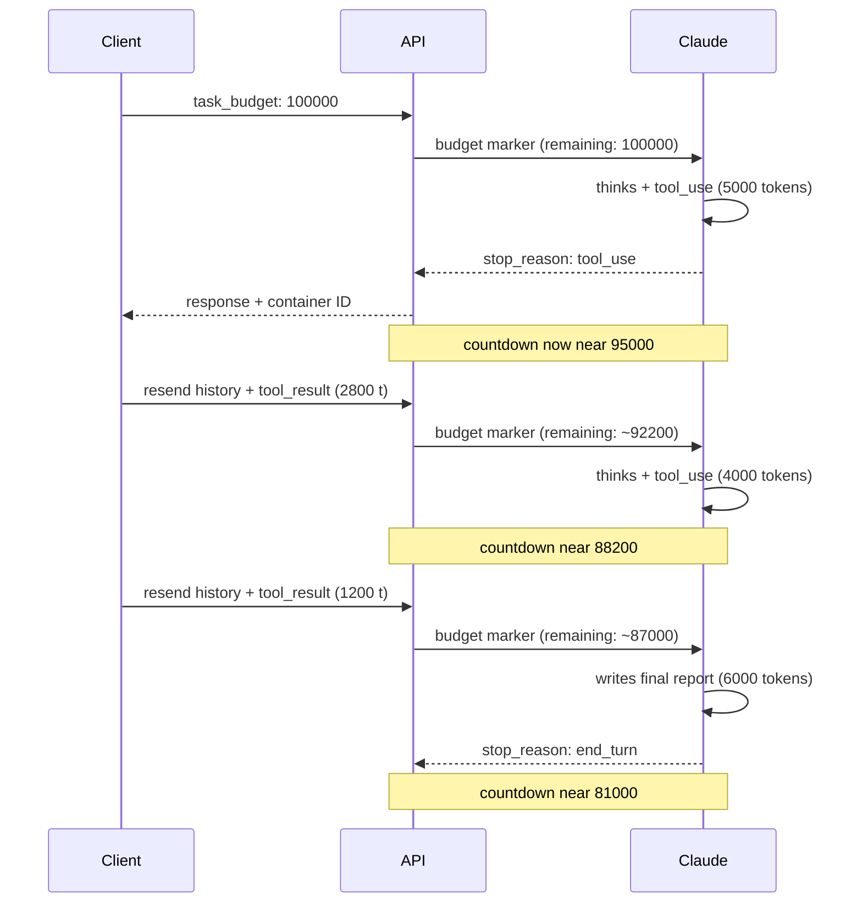

<LevelBadge level="advanced" />

<Callout type="objectives" items={[
  "태스크 예산이 무엇인지 이해하기 — 에이전트 루프 전체에 걸친, 권고형이며 모델에게 보이는 토큰 카운트다운",
  "task_budget을 올바르게 설정하기 — output_config 안에, task-budgets-2026-03-13 베타 헤더와 함께, 지원되는 모델에서",
  "무엇이 예산에서 차감되는지(이번 턴에 Claude가 보는 토큰) 무엇이 차감되지 않는지(다시 보낸 히스토리의 반복 페이로드) 읽어내기",
  "거부처럼 보이는 동작을 유발하는 대신 도움이 되는 예산 크기를 고르기 — 먼저 측정하고, 그다음 넉넉하게 설정하기",
  "remaining 필드로 압축(compaction)을 넘어 예산을 이어가고, 프롬프트 캐싱 무효화 함정을 피하기",
  "태스크 예산, 세션 예산, effort, max_tokens를 구분하기 — 네 개의 레버, 네 개의 서로 다른 역할"
]} />

<VerifyNote lastVerified="2026-08-25" source="https://platform.claude.com/docs/en/build-with-claude/task-budgets">
태스크 예산은 **퍼블릭 베타**입니다 — 베타 헤더(`task-budgets-2026-03-13`), 지원 모델 목록, 20,000 토큰 최솟값, 그리고 `output_config.task_budget`의 정확한 필드 이름은 공식 레퍼런스에서 인용한 것이며 기능이 베타인 동안 변할 수 있습니다. 출시 전에 다시 확인하세요.
</VerifyNote>

장기 호라이즌 에이전트는 외부에서 예측하기 어려운 방식으로 토큰을 태웁니다. 열두 번의 사고-더하기-도구-호출 라운드로 확장되는 단일 요청이 평소 한 턴의 10배 비용을 조용히 쓸 수 있습니다. **태스크 예산**은 그에 대한 Anthropic의 답입니다: 에이전트 루프 전체에 대한 권고형 토큰 상한을 Claude에게 넘기고, 모델이 *스스로 조절*하게 하는 것입니다 — 사고 속도를 조절하고, 행동의 우선순위를 정하고, 예산이 줄어들면 요약으로 마무리합니다. `max_tokens`에 걸려 도구 호출 중간에 끊기는 대신에요.

태스크 예산을 이미 알고 있을 다른 모든 비용 레버와 다르게 만드는 것은 두 가지입니다:

- **카운트다운이 모델에게 보입니다.** Claude는 서버 측에서 주입되는 "남은 토큰" 마커를 보고 그에 맞춰 행동을 조정합니다. 클라이언트는 usage 필드에서 이 마커를 절대 볼 수 없습니다.
- **강제가 아니라 권고입니다.** 태스크 예산은 소프트 힌트이고, 하드 상한은 여전히 `max_tokens`입니다. 이것은 기능입니다 — 진행 중인 작업을 중단하는 것이 끝내는 것보다 더 큰 혼란이 될 경우, Claude는 때때로 예산을 넘길 수 있습니다.

## 예산 카운트다운이 작동하는 방식

카운트다운은 **Claude가 이 루프에서 처리한** 토큰 — 사고, 도구 호출, 도구 결과, 출력 — 을 반영하며, 요청 페이로드의 크기가 아닙니다. 클라이언트가 매 턴 전체 대화를 다시 보낼 때, *페이로드*는 단조롭게 커지지만 *예산*은 이번 턴에 Claude에게 새로운 부분만큼만 줄어듭니다.

<Callout type="warning" items={[
  "카운트다운은 모델에게만 보입니다. API 응답에는 남은 예산 필드가 포함되지 않습니다 — usage에 task_budget 항목도 없고, 그에 대한 SDK 접근자도 없습니다. 클라이언트 측에서 지출을 추적하려면 루프 내 요청들의 output_tokens를 합산하세요.",
  "클라이언트가 매 후속 요청마다 전체 히스토리를 보내면서 동시에 remaining을 줄인다면, 모델은 실제보다 적게 보고된 예산을 보고 예산이 실제로 허용하는 것보다 일찍 마무리합니다. 예산을 넉넉하게 설정하고, 모델이 서버 측 카운트다운에 맞춰 스스로 조절하게 하세요."
]} />

## 첫 예산 적용 요청 발사하기

<Steps items={[
  {title: "베타 헤더 포함하기", body: "요청에 anthropic-beta: task-budgets-2026-03-13을 추가합니다. 이것이 없으면 output_config.task_budget은 무시됩니다."},
  {title: "지원되는 모델 고르기", body: "현재: Claude Opus 5, Fable 5, Mythos 5, Opus 4.8, Opus 4.7. Sonnet 5, Sonnet 4.6, Haiku 4.5, 그리고 더 오래된 Opus 4.6은 지원되지 않습니다."},
  {title: "output_config 안에 task_budget 설정하기", body: "이 객체에는 세 개의 필드가 있습니다 — type(항상 tokens), total(토큰 단위 상한), remaining(선택, 압축을 넘어 예산을 이어갈 때). total의 최솟값은 20,000 토큰이며, 그보다 작으면 400 오류가 반환됩니다."},
  {title: "max_tokens는 넉넉하게 유지하기", body: "task_budget은 에이전트 루프 전체에 걸치고, max_tokens는 요청당 하드 상한입니다. high 또는 xhigh effort에서는 Claude가 요청마다 사고하고 행동할 여유를 갖도록 max_tokens를 64k 이상으로 유지하세요."}
]} />

<PromptCard title="최소 요청 — 코드베이스 리뷰 에이전트에 64k 토큰 예산 주기">{`curl https://api.anthropic.com/v1/messages \\
  -H "x-api-key: $ANTHROPIC_API_KEY" \\
  -H "anthropic-version: 2023-06-01" \\
  -H "anthropic-beta: task-budgets-2026-03-13" \\
  -H "content-type: application/json" \\
  -d '{
    "model": "claude-opus-5",
    "max_tokens": 128000,
    "stream": true,
    "messages": [{
      "role": "user",
      "content": "Review the codebase and propose a refactor plan."
    }],
    "output_config": {
      "effort": "high",
      "task_budget": {"type": "tokens", "total": 64000}
    }
  }'`}</PromptCard>

## 실제로 지원하는 모델

| 모델              | 지원 여부                                                   |
| ----------------- | ---------------------------------------------------------- |
| Claude Opus 5     | 베타 — `task-budgets-2026-03-13` 설정                       |
| Claude Fable 5    | 베타 — `task-budgets-2026-03-13` 설정                       |
| Claude Mythos 5   | 베타 — `task-budgets-2026-03-13` 설정                       |
| Claude Sonnet 5   | 미지원                                                      |
| Claude Opus 4.8   | 베타 — `task-budgets-2026-03-13` 설정                       |
| Claude Opus 4.7   | 베타 — `task-budgets-2026-03-13` 설정                       |
| Claude Opus 4.6   | 미지원                                                      |
| Claude Sonnet 4.6 | 미지원                                                      |
| Claude Haiku 4.5  | 미지원                                                      |

태스크 예산은 [Claude Code](/docs/claude-code/what-is-claude-code)나 Cowork 표면에서는 **지원되지 않습니다** — 지원되는 모델 중 하나에서 Messages API를 통해 직접 사용하세요. 대신 Managed Agents 세션에 하드 달러 상한이 필요하다면, 그것은 별개의 기능입니다: [Managed Agents 세션 예산](/docs/api/managed-agents-session-budgets).

## 예산 고르기 — 먼저 측정하고, 추측하지 말기

적절한 예산은 현재 루프가 얼마나 많은 작업을 하는지에 달려 있습니다. Anthropic 자체의 권고는 이렇습니다: **먼저 측정하고, 그다음 조정하라.**

<Steps items={[
  {title: "task_budget 없이 대표 샘플을 실행하기", body: "샘플의 각 태스크에 대해, 루프 내 모든 요청의 usage.output_tokens를 합산하고, 요청 사이에 덧붙인 도구 결과의 토큰 크기도 더합니다. 그것이 모델이 본 총량입니다."},
  {title: "태스크별 분포의 p99를 취하기", body: "거기서 시작하세요. 목표는 예산을 적용한 실행이 현재 베이스라인보다 갑자기 못해지지 않을 만큼 Claude에게 여유를 주는 것입니다."},
  {title: "p99에서 위아래로 조정하기", body: "Claude가 늘 너무 일찍 마무리한다면 예산을 올리세요. 태스크가 일관되게 예산을 한참 밑돈다면 더 낮게 잡아 규율을 강제하세요. 20,000 토큰 최솟값 아래로는 절대 내리지 마세요 — API가 400 오류를 반환합니다."}
]} />

<Callout type="warning" items={[
  "태스크에 비해 너무 작은 예산은 거부처럼 보이는 동작을 유발할 수 있습니다. Claude가 작업에 명백히 부족한 예산(예를 들어 여러 시간짜리 에이전트형 코딩 태스크에 20,000 토큰)을 보면, 끝낼 수 없는 작업을 시작하는 대신 태스크 시도를 거절하거나, 범위를 공격적으로 줄이거나, 부분 결과만 내고 일찍 멈출 수 있습니다.",
  "예산을 추가한 뒤 예상치 못한 거부나 조기 중단을 관찰하면, 다른 파라미터를 디버깅하기 전에 예산을 올리세요. 고정된 기본값이 아니라 실제 태스크 길이 분포에 맞춰 크기를 정하세요."
]} />

## 압축을 넘어 예산 이어가기

루프가 요청 사이에 컨텍스트를 압축하거나 다시 쓴다면 — 예를 들어 페이로드를 줄이기 위해 앞선 턴들을 요약한다면 — 서버는 **압축 이전에 쓴 예산에 대한 기억이 없습니다**. 카운트다운이 멈춘 지점에서 계속되도록 다음 요청에 `remaining`을 전달하세요:

<PromptCard title="Python — 압축을 넘어 remaining 이어가기">{`# Tokens spent before compaction, tracked client-side
tokens_spent_so_far = 45000

output_config = {
    "effort": "high",
    "task_budget": {
        "type": "tokens",
        "total": 128000,
        "remaining": 128000 - tokens_spent_so_far,
    },
}`}</PromptCard>

**매 턴 압축되지 않은 전체 히스토리를 다시 보내는 루프라면 `remaining`을 생략하고** 서버가 카운트다운을 추적하게 하세요. 필요하지 않을 때 수동으로 설정하면, 클라이언트가 생각하는 지출과 Claude가 실제로 본 것 사이에 드리프트가 생깁니다.

## 다른 파라미터와의 상호작용

| 상호작용 대상        | 어떻게 상호작용하는가                                                                                                                                                                                                                                                                                                  |
| -------------------- | ------------------------------------------------------------------------------------------------------------------------------------------------------------------------------------------------------------------------------------------------------------------------------------------------------------------------------ |
| `max_tokens`         | **직교적.** `max_tokens`는 요청당 하드 상한이고, `task_budget`은 루프 전체에 걸친 권고형 상한입니다. 어느 쪽도 다른 쪽과 같거나 작아야 할 필요가 없습니다. 둘을 조합하세요: `task_budget`은 Claude에게 속도를 맞출 목표를 주고, `max_tokens`는 단일 요청에서 생성이 폭주하는 것을 막습니다.                            |
| [Effort](/docs/api/effort-tuning) | **보완적.** Effort는 Claude가 한 단계마다 얼마나 깊이 추론하는지(사고의 폭)를 제어합니다. 태스크 예산은 루프가 총 얼마나 많은 작업을 할 수 있는지(반복의 폭)를 제어합니다. 둘을 함께 조정하세요.                                                                                                                              |
| [Adaptive thinking](https://platform.claude.com/docs/en/build-with-claude/thinking) | 태스크 예산은 사고 토큰을 집계에 **포함**하므로, 적응형 사고는 예산이 줄어들면서 자연스럽게 축소됩니다.                                                                                                                                                                                                     |
| [프롬프트 캐싱](/docs/api/prompt-caching) | **캐시 무효화 함정.** 예산 카운트다운 마커는 턴마다 주입되며 요청 간에 일치하지 않습니다. 클라이언트가 후속 요청마다 `task_budget.remaining`을 줄이면, 바뀐 값이 그 값을 포함한 캐시 접두사를 무효화합니다. 예산은 최초 요청에서 한 번만 설정하고, 모델이 스스로 조절하게 하세요. |

## 태스크 예산 vs 다른 예산들

Ailmanac은 이미 "예산" 형태의 기능 세 가지를 다룹니다. 서로 바꿔 쓸 수 있는 것이 아닙니다.

| 기능                                                                             | 단위            | 범위                                | 강제 방식                                  | 필요한 헤더                                    |
| -------------------------------------------------------------------------------- | --------------- | ----------------------------------- | ------------------------------------------ | ---------------------------------------------- |
| **태스크 예산** (이 페이지)                                                      | 토큰            | 하나의 에이전트 루프(여러 요청 가능) | **권고형** — 모델에게 주는 소프트 힌트 | `anthropic-beta: task-budgets-2026-03-13`      |
| **`max_tokens`**                                                                 | 토큰            | 하나의 요청                         | **하드** — `stop_reason: max_tokens`로 절단 | 없음                                           |
| **`output_config.effort`**                                                       | Effort 수준     | 단계별 깊이                         | 권고형(모델이 제어)                | 없음                                           |
| [**Managed Agents 세션 예산**](/docs/api/managed-agents-session-budgets)   | 미국 센트        | Managed Agents 세션 전체      | **하드** — 서버가 `budget_reached`에서 일시정지 | Managed Agents 베타 헤더                    |

이렇게 생각하면 됩니다: `max_tokens`는 퓨즈(정해진 지점에서 끊어짐), 태스크 예산은 Claude에게 점수를 속삭이는 코치(플레이를 조정함), effort는 플레이 스타일, 세션 예산은 인건비 상한을 집행하는 회계사입니다. 경계가 있고, 스스로 조절하며, 달러 상한이 걸린 에이전트가 필요할 때 네 가지를 함께 쓰세요.

## 스스로 테스트하기

<Quiz questions={[
  {
    q: "코드베이스 감사 에이전트에 task_budget.total을 100000으로 설정했습니다. 실행 중에 매 턴 전체 히스토리를 다시 보내기 때문에 클라이언트의 누적 페이로드가 요청들에 걸쳐 250000 토큰까지 커집니다. 마지막에 Claude가 보는 카운트다운은 어떻게 되어 있을까요?",
    options: [
      "0이 되었고 실행이 끊겼다 — 예산을 초과했다",
      "다시 보낸 페이로드의 크기가 아니라 이번 턴에 Claude가 실제로 처리하는 양만큼만 줄어든다 — 전체 히스토리는 한 번만 집계된다",
      "페이로드 크기와 일치한다 — 250000이 100000을 넘으므로 Claude가 거부했다",
      "출력 토큰에만 반응해 줄어들므로 거의 움직이지 않았다"
    ],
    answer: 1,
    explain: "태스크 예산은 매 턴 Claude가 보는 것 — 사고, 도구 호출, 도구 결과, 텍스트 — 을 집계하며, 요청 페이로드의 크기가 아닙니다. 후속 요청에서 반복되는 히스토리는 한 번만 집계되고, 새로운 내용(새 도구 결과 같은 것)은 등장할 때 예산에서 차감됩니다."
  },
  {
    q: "요청 사이에 컨텍스트를 압축합니다. 카운트다운이 리셋되지 않게 하려면 무엇을 해야 할까요?",
    options: [
      "아무것도 — 서버가 압축을 넘어 예산을 자동으로 추적한다",
      "후속 요청에서 max_tokens를 올린다",
      "다음 요청에 task_budget.remaining을, total에서 클라이언트 측에서 이미 추적한 양을 뺀 값으로 전달한다",
      "남은 양과 같은 새로운 task_budget.total을 설정한다"
    ],
    answer: 2,
    explain: "컨텍스트를 압축하거나 다시 쓰면 서버는 압축 이전의 예산 지출에 대한 기억이 없습니다. 클라이언트 측에서 추적한 (total - tokens_spent_so_far) 값으로 다음 요청에 remaining 필드를 전달하세요."
  },
  {
    q: "긴 에이전트형 코딩 태스크에 task_budget.total을 20000으로 설정했는데, Claude가 갑자기 거부하거나 부분 결과만 내고 일찍 멈춥니다. 해결책은?",
    options: [
      "준수를 강제하도록 anthropic-beta: task-budgets-strict-2026-03-13을 추가한다",
      "예산을 올린다 — 20k는 허용되는 최솟값이고, 태스크에 명백히 부족한 예산은 거부처럼 보이는 동작을 유발할 수 있다",
      "max_tokens를 예산에 맞춰 낮춘다",
      "작은 예산을 더 잘 처리하는 Sonnet 5로 바꾼다"
    ],
    answer: 1,
    explain: "태스크에 비해 너무 작은 예산은 거부처럼 보이는 동작을 유발합니다 — Claude는 끝낼 수 없는 작업의 시도를 거절할 수 있습니다. 먼저 예산을 올리고, 고정된 기본값 대신 실제 태스크 길이 분포를 측정해 p99에 맞춰 크기를 정하세요. (또한: Sonnet 5는 태스크 예산을 아예 지원하지 않습니다.)"
  }
]} />

## 어휘

<Flashcards title="태스크 예산 용어집" cards={[
  {front: "task_budget", back: "output_config 안의 객체로, type('tokens'), total(상한), 그리고 선택 필드 remaining(압축을 넘어 이어갈 때)을 가진다. total의 최솟값은 20,000이다."},
  {front: "task-budgets-2026-03-13", back: "옵트인에 필요한 anthropic-beta 헤더. 이것이 없으면 output_config.task_budget은 무시된다."},
  {front: "카운트다운 마커", back: "현재 에이전트 루프에서 남은 토큰을 보여주며 매 턴 Claude가 보도록 서버 측에서 주입되는 마커. 응답의 usage 객체에는 절대 노출되지 않는다."},
  {front: "강제가 아닌 권고", back: "태스크 예산은 소프트 힌트다 — Claude는 진행 중인 작업을 중단하지 않으려고 때때로 예산을 넘길 수 있다. 하드 상한은 여전히 max_tokens다."},
  {front: "remaining", back: "압축을 넘어 예산을 이어가기 위한 선택 필드. 압축되지 않은 전체 히스토리를 다시 보내는 루프에서는 생략하고 서버가 추적하게 하자."},
  {front: "거부처럼 보이는 동작", back: "Claude가 태스크에 명백히 너무 작은 예산을 보면, 거절하거나, 범위를 줄이거나, 일찍 멈출 수 있다. 다른 파라미터를 디버깅하기 전에 예산을 올려 해결하자."}
]} />

## 핵심 정리

<Callout type="takeaways" items={[
  "태스크 예산은 에이전트 루프 전체에 걸친, 모델에게 보이고 권고형인 토큰 카운트다운이다 — Claude가 그에 맞춰 스스로 조절한다",
  "지원되는 모델 — Opus 5, Fable 5, Mythos 5, Opus 4.8, Opus 4.7 — 에서 task-budgets-2026-03-13 베타 헤더로 옵트인하자. Sonnet, Haiku, Claude Code는 지원하지 않는다",
  "카운트다운은 이번 턴에 CLAUDE가 보는 토큰을 집계한다 — 다시 보낸 페이로드의 크기가 아니다 — 따라서 반복되는 히스토리는 이중 과금되지 않는다",
  "먼저 측정하고(태스크별 토큰 분포의 p99), 그다음 넉넉하게 설정하자. 과소 설정된 예산은 거부처럼 보이는 동작을 일으킨다",
  "압축을 넘어 예산을 이어갈 때는 remaining을 쓰고, 압축되지 않은 히스토리를 다시 보낼 때는 생략하고 서버가 추적하게 하자",
  "하드 퓨즈로는 max_tokens와, 단계별 깊이 조정에는 effort와 함께 쓰자 — 네 개의 레버가 네 개의 서로 다른 역할을 한다"
]} />

## 다음

- [Effort 튜닝](/docs/api/effort-tuning) — 다섯 가지 effort 수준과 태스크 예산과의 상호작용
- [Managed Agents 세션 예산](/docs/api/managed-agents-session-budgets) — 플랫폼이 강제하는 세션 단위 하드 달러 상한
- [프롬프트 캐싱](/docs/api/prompt-caching) — 변하는 예산 값에서 캐시 무효화 함정이 어떻게 전개되는지
- [코드 실행 도구](/docs/api/code-execution) — 장시간 실행 에이전트가 자주 의존하는 샌드박스 런타임
- [Claude로 에이전트 만들기](/docs/api/building-agents) — 이 예산들이 형태를 잡아주는 에이전트 루프 전체 생애주기
