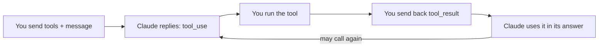

import Tabs from '@theme/Tabs';
import TabItem from '@theme/TabItem';

<LevelBadge level="intermediate" />

<VerifyNote lastVerified="2026-07-01" source="https://platform.claude.com/docs/en/build-with-claude/tool-use">
도구 사용 요청/응답 형태는 안정적이지만 발전합니다 — 필드는 공식 도구 사용 문서에서 확인하세요.
</VerifyNote>

**도구 사용**은 Claude가 *여러분이* 정의한 함수 — 검색, 계산기, 데이터베이스, 어떤 API든 — 를 호출하고 그 결과를 사용하게 합니다. 모든 [에이전트](/docs/api/building-agents)의 토대입니다.

<Callout type="objectives" items={["도구 정의부터 최종 답변까지, 4단계 에이전트 루프가 어떻게 작동하는지","Python에서 이름, 설명, JSON-Schema 입력으로 도구를 정의하는 법","왜 도구 설명이 Claude가 언제 어떻게 호출할지를 형성하는 프롬프트로 작동하는지","입력을 검증하고, 오류를 결과로 반환하고, 서버 측 도구를 안전하게 사용하는 법"]} />

## 루프

도구 사용은 단일 호출이 아니라 대화입니다. 여러분은 Claude에게 도구 메뉴를 건네고; Claude가 하나를 골라 멈추고; 여러분이 그것을 실행해 보고하고; Claude가 그 결과를 답변에 엮습니다 — 필요한 만큼 반복합니다.

<Steps items={[{title: "메뉴 보내기", body: "각각 이름, 설명, JSON-Schema 입력을 가진 도구 정의 목록을 포함합니다."}, {title: "Claude가 도구를 고른다", body: "Claude가 하나를 쓰기로 하면, 인수가 담긴 tool_use 블록을 반환하고 멈춥니다."}, {title: "여러분이 실행한다", body: "여러분이 직접 도구를 실행하고 출력을 tool_result로 되돌려 보냅니다."}, {title: "Claude가 계속한다", body: "Claude는 답할 때까지, 필요하면 더 많은 도구를 호출하며 계속합니다."}]} />

## 도구 정의하기 (Python)

도구 정의는 이름, 평이한 언어로 된 설명, 그리고 입력을 위한 JSON-Schema일 뿐입니다. `tools`에 전달한 뒤, Claude가 언제 행동하고자 하는지 알려면 `stop_reason`을 확인하세요.

<PromptCard title="get_weather tool + first call">{`tools = [{
    "name": "get_weather",
    "description": "Get current weather for a city.",
    "input_schema": {
        "type": "object",
        "properties": {"city": {"type": "string"}},
        "required": ["city"],
    },
}]

msg = client.messages.create(
    model="claude-sonnet-5", max_tokens=1024,
    tools=tools,
    messages=[{"role": "user", "content": "What's the weather in Rome?"}],
)
# If msg.stop_reason == "tool_use": run the tool, then send a tool_result back.`}</PromptCard>

## 팁

도구를 어떻게 정의하고 처리하느냐의 작은 선택들이 신뢰성에 큰 차이를 만듭니다.

- **설명은 프롬프트입니다.** 명확한 도구 `description`과 파라미터 문서는 Claude가 언제/어떻게 호출할지를 크게 개선합니다.
- 실행하기 전에 받은 **입력을 검증하세요** — 절대 맹목적으로 신뢰하지 마세요.
- **오류를 결과로 반환하세요.** 도구가 실패하면, Claude가 복구할 수 있도록 오류를 설명하는 `tool_result`를 보내세요.
- **서버 측 도구.** Anthropic은 내장 도구(예: 웹 검색, 코드 실행, 컴퓨터 사용)도 제공합니다 — 현재 메뉴는 문서를 확인하세요.

:::warning 도구 = 행동 = 위험
실제 행동을 하는 도구는 보안 모델을 물려받습니다. 최소 권한을 적용하고 위험한 호출에는 사람을 루프에 두세요 — [에이전트 & 도구 보안](/docs/security/securing-agents)을 참고하세요.
:::

<Flashcards title="도구 사용 어휘" cards={[{front: "tool_use 블록", back: "Claude가 도구를 호출하기로 결정했을 때 반환하는 것 — 인수를 포함하며 — 그 후 멈추고 여러분을 기다립니다."}, {front: "tool_result", back: "도구의 출력(또는 Claude가 복구할 수 있도록 오류 설명)을 담아 되돌려 보내는 메시지."}, {front: "input_schema", back: "도구 입력을 기술하는 JSON-Schema: 타입, 속성, 그리고 어떤 필드가 필수인지."}, {front: "서버 측 도구", back: "Anthropic이 제공하는 내장 도구, 예: 웹 검색, 코드 실행, 컴퓨터 사용 — 현재 메뉴는 문서를 확인하세요."}]} />

<Quiz title="스스로 점검하기" questions={[{q: "Claude가 tool_use 블록을 반환한 후, 누가 도구를 실행하나요?", options: ["Claude가 Anthropic 서버에서 자동으로 실행한다", "여러분이 실행하고 출력을 tool_result로 되돌려 보낸다", "JSON-Schema가 실행한다"], answer: 1, explain: "Claude는 tool_use 블록을 반환하고 멈춥니다; 여러분이 도구를 실행하고 결과를 tool_result로 되돌려 보냅니다."}, {q: "여러분이 정의한 도구가 실행 중 실패합니다. 권장되는 조치는?", options: ["성공할 때까지 조용히 재시도", "Claude가 복구할 수 있도록 오류를 설명하는 tool_result 보내기", "대화 중단"], answer: 1, explain: "오류를 결과로 반환하세요 — 실패를 설명하는 tool_result가 Claude가 복구하게 합니다."}, {q: "명확한 도구 설명이 왜 그렇게 중요한가요?", options: ["문서용일 뿐이고 Claude는 무시한다", "설명은 프롬프트다 — Claude가 언제 어떻게 도구를 호출할지를 형성한다", "JSON-Schema 검증 규칙을 바꾼다"], answer: 1, explain: "설명은 프롬프트입니다: 명확한 설명과 파라미터 문서는 Claude가 언제 어떻게 도구를 호출할지를 크게 개선합니다."}]} />

<Callout type="takeaways" items={["도구 사용은 루프입니다: 도구 정의를 보내면 Claude가 tool_use 블록을 반환하고 멈추며, 여러분이 실행해 tool_result를 반환하면 Claude가 답할 때까지 계속합니다.","도구 정의는 이름, 설명, JSON-Schema 입력입니다 — tools에 전달하고 stop_reason == tool_use를 확인하세요.","설명은 프롬프트입니다; 실행 전에 입력을 검증하고; 실패는 tool_result 오류로 반환해 Claude가 복구하게 하세요.","Anthropic은 서버 측 도구도 제공하며, 실제 행동을 하는 도구는 최소 권한과 사람의 루프 개입이 필요합니다."]} />

## 다음

- [API로 에이전트 구축하기](/docs/api/building-agents)
- [구조화된 출력](/docs/api/structured-output)
- [MCP & 도구 연결](/docs/api/mcp)
