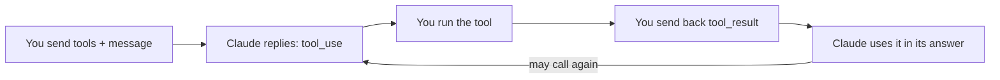

<LevelBadge level="intermediate" />

**도구 사용**은 Claude가 *여러분이* 정의한 함수 — 검색, 계산기, 여러분의 데이터베이스, 어떤 API든 — 를 호출하고 그 결과를 사용하게 합니다. 모든 [에이전트](/docs/api/building-agents)의 토대입니다.

대부분의 도구 사용 튜토리얼은 4단계 루프에서 멈춥니다. 루프는 쉬운 부분입니다. 실제로 프로덕션 통합을 깨뜨리는 것은 더 좁고 덜 이야기되는 것들입니다: `400`을 반환하는 메시지 형태, Claude가 사과하는 대신 복구할 수 있게 하는 오류 필드, 그리고 **최신 Claude 모델에서는 도구 호출을 강제하는 것이 더 이상 작동하지 않는다는 사실**. 이 페이지는 그 전부를 다룹니다.

<Callout type="objectives" items={["도구 정의부터 최종 답변까지, 4단계 에이전트 루프가 어떻게 작동하는지","도구 정의를 작성하는 법 — 그리고 Claude가 언제 호출할지를 실제로 좌우하는 설명을 쓰는 법","400을 반환하는 세 가지 메시지 형태 규칙, 그리고 어느 규칙을 깼는지 알려주는 오류 문구","tool_choice \"any\"와 \"tool\"이 최신 모델에서 이제 실패하는 이유, 그리고 두 가지 대체 방법","strict: true로 스키마에 유효한 도구 입력을 보장하는 법","도구 결과가 프롬프트 인젝션이 여러분의 에이전트에 도달할 가장 유력한 지점인 이유"]} />

<VerifyNote lastVerified="2026-09-29" source="https://platform.claude.com/docs/en/agents-and-tools/tool-use/define-tools">
도구 정의 필드, `tool_choice` 지원 매트릭스, `tool_result` 형식 규칙, `is_error` 동작,
`strict: true` 의미론은 2026년 9월 29일 Anthropic의 "Define tools", "Handle tool calls",
"Strict tool use" 페이지와 대조해 확인했습니다. 강제 도구 사용에 대한 모델 지원은 출시마다
바뀝니다 — 의존하기 전에 Define tools 페이지의 지원 매트릭스를 다시 확인하고, 현재 라인업은
[현재 모델 및 가격](/docs/whats-new/models-and-pricing)을 보세요.
</VerifyNote>

## 루프

도구 사용은 단일 호출이 아니라 대화입니다. 여러분은 Claude에게 도구 메뉴를 건네고; Claude가 하나를 골라 멈추고; 여러분이 그것을 실행해 보고하고; Claude가 그 결과를 답변에 엮습니다 — 필요한 만큼 반복합니다.


```mermaid
flowchart LR
  A[You send tools + message] --> B[Claude replies: tool_use]
  B --> C[You run the tool]
  C --> D[You send back tool_result]
  D --> E[Claude uses it in its answer]
  E -->|may call again| B
```

<Steps items={[{title: "메뉴 보내기", body: "각각 이름, 설명, JSON-Schema 입력을 가진 도구 정의 목록을 포함합니다."}, {title: "Claude가 도구를 고른다", body: "Claude가 하나를 쓰기로 하면, 응답은 stop_reason \"tool_use\"와 하나 이상의 tool_use 블록을 담고 돌아오며, 각 블록은 id, name, input 객체를 나릅니다."}, {title: "여러분이 실행한다", body: "여러분이 직접 도구를 실행하고, tool_use id를 참조하는 tool_result로 출력을 되돌려 보냅니다."}, {title: "Claude가 계속한다", body: "Claude는 평범한 stop_reason으로 답할 때까지, 더 많은 도구를 호출할 수도 있으며 계속합니다."}]} />

2단계의 복수형에 주의하세요: Claude는 **한 응답에 여러 개의 `tool_use` 블록**을 반환할 수 있습니다. `content[0]`을 가정하지 말고 각 블록의 `type` 필드로 분기하세요 — 응답은 보통 `text` 블록으로 시작하고, 최신 모델에서는 대신 `thinking` 블록으로 시작할 수 있습니다.

## 도구 정의하기

도구 정의는 이름, 평이한 언어로 된 설명, 그리고 입력을 위한 JSON Schema입니다.

| 필드 | 필수 | 비고 |
| --- | --- | --- |
| `name` | 예 | 정규식 `^[a-zA-Z0-9_-]{1,128}$`에 일치해야 합니다 |
| `description` | 예 | 무엇을 하는지, 언제 쓰는지, 언제 쓰지 *않는지*. 최소 3~4문장을 목표로 하세요 |
| `input_schema` | 예 | 파라미터를 기술하는 JSON Schema 객체 |
| `input_examples` | 아니오 | 각각 스키마에 유효한 예시 입력 객체의 배열 |
| `strict` | 아니오 | 스키마에 유효한 입력을 강제하려면 `true`로 설정 — 아래 참고 |
| `cache_control` | 아니오 | 턴 간에 정의를 캐시합니다([프롬프트 캐싱](/docs/api/prompt-caching) 참고) |

<PromptCard title="get_weather 도구 + 첫 호출 (Python)">{`tools = [{
    "name": "get_weather",
    "description": (
        "Get the current weather for a city. Use this when the user asks about "
        "present conditions or temperature in a named place. Returns temperature "
        "in the requested unit plus a one-word sky condition. It does NOT return "
        "forecasts — use get_forecast for anything in the future."
    ),
    "input_schema": {
        "type": "object",
        "properties": {
            "city": {"type": "string", "description": "City and region, e.g. 'Rome, IT'"},
            "unit": {"type": "string", "enum": ["celsius", "fahrenheit"]},
        },
        "required": ["city"],
        "additionalProperties": False,
    },
}]

msg = client.messages.create(
    model="claude-opus-5-5", max_tokens=1024,
    tools=tools,
    messages=[{"role": "user", "content": "What's the weather in Rome?"}],
)

if msg.stop_reason == "tool_use":
    for block in msg.content:            # iterate — never index content[0]
        if block.type == "tool_use":
            result = run_tool(block.name, block.input)
            # send back a tool_result carrying block.id`}</PromptCard>

### 설명은 프롬프트입니다

`description` 필드는 도구 사용 품질에 대한 단연 가장 강력한 지렛대입니다 — 그것을 읽는 것은 여러분의 팀 동료가 아니라 모델입니다. 좋은 설명을 가르는 기준에 대해 Anthropic 자신의 가이드는 분명합니다:

- **언제 쓰지 *않는지*를 말하세요.** 대부분의 오선택은 인접한 도구가 담당하는 일에 어떤 도구가 호출되는 경우입니다.
- **늘리지 말고 통합하세요.** `create_pr`, `review_pr`, `merge_pr` 대신 `action` 파라미터를 가진 도구 하나를 내보내세요. 더 적고 더 넓은 도구는 선택 모호성을 줄입니다.
- **서비스별로 네임스페이스를 두세요.** 도구 표면이 커지면 `github_list_prs`와 `slack_send_message`가 `list_prs`와 `send_message`를 이깁니다.
- **신호가 높은 결과를 반환하세요.** 안정적이고 의미론적인 식별자(슬러그, UUID), 그리고 Claude가 다음 단계를 고르는 데 필요한 필드만. 부풀어 오른 도구 출력은 컨텍스트를 태우고 신호를 묻어버립니다.
- **까다로운 입력에는 `input_examples`를 추가하세요.** 스키마로 검증된 예시는 단순한 객체는 각각 대략 20~50 토큰, 복잡하게 중첩된 객체는 100~200 토큰이 들고, 유효하지 않은 예시는 400을 반환합니다.

## 응답 처리하기: 400을 반환하는 세 가지 규칙

작동하는 코드가 보통 여기서 깨집니다. `tool_result`는 평범한 `user` 메시지이지만, 세 가지 배치 규칙이 API에 의해 강제됩니다.

<Steps items={[{title: "결과는 해당 tool_use 바로 뒤에 와야 한다", body: "어시스턴트의 tool_use 메시지와 여러분의 tool_result 메시지 사이에 어떤 메시지도 끼어들 수 없습니다. 이를 깨면 API는 이렇게 알립니다: tool_use ids were found without tool_result blocks immediately after."}, {title: "tool_result 블록은 content 배열에서 맨 먼저 온다", body: "여러분이 추가하는 모든 텍스트는 모든 tool_result 뒤에 와야 합니다. tool_result 앞의 텍스트 블록은 400입니다."}, {title: "서버 도구 호출이 아직 해결되지 않았다면, tool_result 블록만 보낸다", body: "같은 어시스턴트 턴이 아직 결과가 없는 서버 도구도 호출했다면, 뒤에 텍스트를 붙이는 것은 턴을 일찍 끝내고, 요청은 해결되지 않은 서버 도구를 지명하는 400으로 실패합니다."}]} />

```json
// ❌ 400 — text before tool_result
{"role": "user", "content": [
  {"type": "text", "text": "Here are the results:"},
  {"type": "tool_result", "tool_use_id": "toolu_01", "content": "15 degrees"}
]}

// ✅ correct — results first, text after (client tools only)
{"role": "user", "content": [
  {"type": "tool_result", "tool_use_id": "toolu_01", "content": "15 degrees"},
  {"type": "text", "text": "What should I do next?"}
]}
```

`tool_result`의 `content`는 평범한 문자열일 수도 있고, `text`, `image`, `document`, `search_result` 블록의 목록일 수도 있습니다. 아무것도 반환하지 않는 도구라면 아예 생략할 수도 있습니다.

### 실패는 예외가 아니라 결과로 반환하세요

도구가 예외를 던지면 루프를 중단하지 마세요 — `is_error`로 실패를 되돌려 건네세요:

```json
{"role": "user", "content": [{
  "type": "tool_result",
  "tool_use_id": "toolu_01A09q90qw90lq917835lq9",
  "content": "Rate limit exceeded. Retry after 60 seconds.",
  "is_error": true
}]}
```

다음에 무엇을 할지 결정해야 하는 독자를 위해 메시지를 쓰세요. `"failed"`는 Claude에게 아무것도 알려주지 않습니다; `"Rate limit exceeded. Retry after 60 seconds."`는 즉시 재시도하지 말고 기다리라고 알려줍니다. 도구 호출이 유효하지 않거나 파라미터가 빠졌을 때, Claude는 보통 두세 번 교정해서 재시도한 뒤 포기하고 사용자에게 사과합니다 — 그래서 가르쳐주는 오류는 종종 복구와 막다른 길을 가르는 차이가 됩니다.

## 스키마에 유효한 입력 보장하기: `strict: true`

도구 정의에 `strict: true`를 설정하면 모델의 토큰 샘플링이 스키마에 유효한 출력으로 제약됩니다(문법 제약 샘플링). 그러면 모든 `tool_use` 블록의 `input`은 여러분의 `input_schema`와 일치함이 증명되고, `name`은 항상 실제로 존재하는 도구입니다 — `2`가 필요한 자리에 `"2"`가 오는 일도, 필수 필드가 빠지는 일도, 검증 후 재시도 계층도 없습니다.

<PromptCard title="strict 도구 정의">{`{
  "name": "search_flights",
  "description": "Search bookable flights for a route and date.",
  "strict": true,
  "input_schema": {
    "type": "object",
    "properties": {
      "destination": {"type": "string"},
      "departure_date": {"type": "string", "format": "date"},
      "passengers": {"type": "integer", "enum": [1, 2, 3, 4, 5, 6]}
    },
    "required": ["destination", "departure_date"],
    "additionalProperties": false
  }
}`}</PromptCard>

어디서나 켜기 전에 알아둘 만한 세 가지 주의사항:

- 스키마는 지원되는 JSON Schema 부분집합 안에 머물러야 합니다 — [구조화된 출력](/docs/api/structured-output)이 사용하는 것과 동일한 부분집합입니다.
- 컴퓨터 사용과 브라우저 사용 **툴셋** 항목은 `strict: true`를 거부합니다; 둘 중 어느 쪽에든 이를 설정한 요청은 거부됩니다.
- 컴파일된 스키마는 메시지 내용과 별도로 최대 24시간 캐시됩니다. Anthropic의 가이드는 명확합니다: **스키마에 보호 대상 건강 정보를 넣지 마세요** — 속성 이름에도, `enum` 값에도, `const` 값에도, `pattern` 정규식에도 넣지 마세요. PHI는 메시지 내용에 속하며, 메시지 내용은 캐시된 스키마에는 없는 HIPAA 보호 장치를 갖습니다.

## `tool_choice` — 그리고 도구 강제가 이제 실패하는 이유

`tool_choice`는 Claude가 도구를 호출할 *수 있는지*, 호출해*야* 하는지, 호출할 수 *없는지*를 제어합니다. 네 가지 값을 받습니다:

| 값 | 의미 |
| --- | --- |
| `auto` | Claude가 결정합니다. `tools`가 있을 때는 언제나 기본값 |
| `any` | Claude는 여러분의 도구 중 하나를 호출해야 하지만, 어느 것인지는 직접 고릅니다 |
| `tool` | Claude는 지명된 도구를 호출해야 합니다 |
| `none` | Claude는 어떤 도구도 호출할 수 없습니다. `tools`가 없을 때의 기본값 |

다른 모든 도구 사용 가이드가 현재 놓치고 있는 부분이 여기입니다. **`any`와 `tool`은 보편적으로 지원되지 않으며, 최신 모델에서는 400을 반환합니다.**

| 모델 또는 설정 | 제약 | 대신 사용할 것 |
| --- | --- | --- |
| 수동 확장 사고(`thinking` 타입 `enabled`) | `any`와 `tool`이 오류 | `auto` 또는 `none`. 적응형 사고 자체는 강제 도구 사용을 막지 *않습니다* |
| Claude Opus 5.5, Sonnet 5.5, Fable 5.1, Mythos 5.1 | 사고 설정과 무관하게 `any`와 `tool`이 400을 반환 | `auto` + `strict: true`, 또는 [구조화된 출력](/docs/api/structured-output). `none`은 여전히 작동합니다 |

오류는 명확합니다:

```text
tool_choice: type "tool" and "any" are not supported for this model.
```

같은 검증이 토큰 카운팅 엔드포인트에도 적용되므로, 토큰 카운팅을 통과한 요청이 나중에 여러분을 놀라게 하지는 않습니다.

### 대신 무엇을 할 것인가

두 가지 동기를 분리하면 마이그레이션이 명확해집니다. 강제 도구 사용은 서로 무관한 두 가지 일을 하고 있었기 때문입니다:

- **"스키마에 유효한 JSON이 필요하다."** 그건 애초에 호출을 강제하는 문제가 아니었습니다. `tool_choice`를 `auto`로 두고 `strict: true`를 설정하거나, 호출이 아니라 응답을 원한다면 스키마를 [구조화된 출력](/docs/api/structured-output)으로 옮기세요.
- **"나한테 수다 떨지 말고 도구를 호출하게 해야 한다."** 프롬프트에서 그렇게 말하세요. 도구가 언제 적용되는지 명시하는 것 — "현재 상태에 관한 어떤 질문이든 `get_weather`를 사용하라" — 은 여전히 `auto`가 어떤 도구를 고르는지를 좌우합니다.

강제 도구 사용을 포기하면 보너스가 하나 있습니다: `any`와 `tool`은 어시스턴트 메시지를 프리필하는 방식으로 작동했고, 이는 `tool_use` 블록 앞의 자연어 서두를 모두 억눌렀습니다. `auto`에서는 Claude가 자신이 무엇을 하려는지 설명할 수 있습니다 — 사용자를 마주하는 에이전트에서는 보통 그게 여러분이 원하는 것입니다.

:::tip 캐싱의 함정
대화 중간에 `tool_choice`를 바꾸면 **캐시된 메시지 블록이 무효화됩니다**. 도구 정의와 시스템 프롬프트는 캐시된 상태로 남지만, 메시지 내용은 다시 처리되어야 합니다. 턴마다 `tool_choice`를 토글하고 있었다면, 그것은 조용히 비용을 내고 있었던 것입니다 — [프롬프트 캐싱](/docs/api/prompt-caching)을 보세요.
:::

## 클라이언트 도구 vs. 서버 도구

모든 도구가 여러분의 코드베이스에 핸들러를 필요로 하는 것은 아닙니다.

- **클라이언트 도구** — 여러분의 것입니다. 여러분이 스키마를 정의하고, 여러분이 실행하고, 여러분이 `tool_result`를 반환합니다. 위의 루프입니다.
- **Anthropic 스키마 클라이언트 도구** — bash, 텍스트 에디터, 메모리. 스키마는 미리 정의되어 있지만, 실행은 여전히 *여러분의* 앱이 합니다.
- **서버 도구** — 웹 검색, 웹 페치, 코드 실행, 도구 검색. 여러분 쪽에 핸들러 코드 없이 Anthropic의 인프라에서 실행되고, 오류는 투명하게 처리됩니다: 서버 도구에 대해서는 절대 `is_error`를 반환하지 않습니다.
- **클라이언트 툴셋** — 컴퓨터 사용과 브라우저 사용은 `name`이 없고 고정된 멤버 도구 집합을 선언하는 단일 항목입니다. 그들의 `tool_use` 블록은 추가로 `toolset_name` 필드(`"computer"` 또는 `"browser"`)를 나르고, `name`은 호출되는 멤버 — `screenshot`이나 `navigate` 같은 것 — 입니다. **두 필드 모두로 분기하고**, 결과에 `toolset_name`을 되돌려 실어 보내세요 — 이를 생략한 멤버 결과는 거부됩니다.

## 흔한 실수

- 순회하며 `type`으로 분기하는 대신 **`content[0]`을 인덱싱하기.** 응답은 흔히 `text` 블록으로 시작하고, 최신 모델에서는 `thinking` 블록으로 시작합니다.
- **응답당 `tool_use` 하나만 처리하기.** Claude는 한 턴에 여러 도구를 호출할 수 있습니다; 첫 번째만 답하고 나머지를 버리는 루프는 결과 없는 `tool_use` id를 남기고, 그것은 다음 요청에서 400입니다.
- **결과보다 앞에 여러분의 설명을 놓기.** `tool_result` 블록은 항상 맨 먼저 옵니다.
- **도구 예외를 삼키기.** 핸들러에서의 예외는 루프를 끝냅니다; `is_error` 결과는 Claude가 적응하게 합니다.
- **습관적으로 `tool_choice: "any"`에 손을 뻗기.** 현재 플래그십 모델에서는 400입니다 — 그리고 애초에 `strict: true`가 더 나은 답이었습니다.
- **도구 출력을 신뢰할 수 있는 것으로 취급하기.** 아래를 보세요.

:::warning 도구 결과는 여러분의 에이전트에서 가장 큰 인젝션 표면입니다
도구 결과는 일상적으로 여러분이 통제하지 않는 내용을 나릅니다: 웹 페이지, 수신 이메일, 사용자 업로드, 서드파티 API. 그중 어느 것에든 영향을 줄 수 있는 공격자는 여러분의 모델을 겨냥한 지시를 심을 수 있습니다 — 간접 프롬프트 인젝션입니다. 신뢰할 수 없는 내용은 **`tool_result` 블록 안에** 두고, `system` 프롬프트나 평범한 사용자 `text` 블록에 끼워 넣지 마세요. 그리고 [프롬프트 인젝션](/docs/security/prompt-injection)과 [에이전트 & 도구 보안](/docs/security/securing-agents)을 읽으세요. 실제 행동을 하는 도구는 보안 모델도 물려받습니다: 최소 권한, 그리고 되돌릴 수 없는 모든 것에는 사람을 루프에 두기.
:::

<Flashcards title="도구 사용 어휘" cards={[{front: "tool_use 블록", back: "Claude가 도구를 호출하기로 결정했을 때 반환하는 것 — id, name, input을 나르며 — 그 후 멈추고 여러분을 기다립니다. 한 응답에 여러 개가 들어 있을 수 있습니다."}, {front: "tool_result", back: "도구의 출력을 나르는 사용자 메시지 블록으로, tool_use id에 키가 걸립니다. content 배열에서 맨 먼저, 어시스턴트의 tool_use 메시지 바로 뒤에 와야 합니다."}, {front: "is_error", back: "호출이 실패했음을 표시하는 tool_result의 선택적 불리언. Claude는 메시지를 읽고 적응합니다 — 보통 사과하기 전에 두세 번 재시도합니다."}, {front: "strict: true", back: "도구 정의에 대한 문법 제약 샘플링: 도구 입력이 여러분의 input_schema와 일치함이 증명됩니다. additionalProperties false가 필요하고; 컴퓨터/브라우저 툴셋 항목에서는 거부되며; PHI는 스키마 밖에 두세요."}, {front: "tool_choice", back: "auto | any | tool | none. tools가 있으면 auto가 기본값, 없으면 none입니다. any와 tool은 Opus 5.5, Sonnet 5.5, Fable 5.1, Mythos 5.1에서 400을 반환합니다."}, {front: "toolset_name", back: "컴퓨터 사용과 브라우저 사용 멤버 블록의 추가 필드(\"computer\" 또는 \"browser\"). name과 함께 이것으로 분기하고, 결과에 되돌려 실어 보내세요 — 그러지 않으면 결과가 거부됩니다."}]} />

<Quiz title="스스로 점검하기" questions={[{q: "claude-opus-5-5에서 tool_choice를 {\"type\": \"tool\", \"name\": \"get_weather\"}로 설정합니다. 무슨 일이 일어날까요?", options: ["Claude가 get_weather를 호출하도록 강제된다", "요청이 400을 반환한다 — 그 모델에서는 강제 도구 사용이 지원되지 않는다", "Claude가 tool_choice를 무시하고 텍스트로 답한다"], answer: 1, explain: "Opus 5.5, Sonnet 5.5, Fable 5.1, Mythos 5.1에서는 사고 설정과 무관하게 tool_choice 타입 \"any\"와 \"tool\"이 400을 반환합니다. auto와 strict: true를 함께 쓰거나, 구조화된 출력을 사용하세요."}, {q: "여러분의 사용자 메시지에 결과를 설명하는 텍스트 블록이 먼저 있고, 그 뒤에 두 개의 tool_result 블록이 있습니다. API는 어떻게 할까요?", options: ["받아들인다 — 순서는 중요하지 않다", "400을 반환한다: tool_result 블록이 먼저 오고 텍스트가 뒤에 와야 한다", "조용히 텍스트 블록을 버린다"], answer: 1, explain: "tool_result 블록은 content 배열에서 맨 먼저 와야 합니다; 어떤 텍스트든 그 전부의 뒤에 와야 합니다."}, {q: "여러분이 정의한 도구가 런타임에 연결 오류를 던집니다. 권장되는 조치는?", options: ["예외를 올리고 대화를 끝낸다", "성공할 때까지 조용히 재시도한다", "is_error true와 'Rate limit exceeded. Retry after 60 seconds.' 같은 가르쳐주는 메시지를 담은 tool_result를 보낸다"], answer: 2, explain: "실패를 is_error true인 tool_result로 반환하세요. 가르쳐주는 메시지는 Claude에게 다음에 무엇을 할지 알려주지만, 일반적인 'failed'는 아무것도 알려주지 않습니다."}, {q: "신뢰할 수 없는 웹 내용은 왜 시스템 프롬프트에 붙여 넣는 대신 tool_result 블록 안에 머물러야 할까요?", options: ["tool_result 블록이 토큰 면에서 더 저렴하다", "간접 프롬프트 인젝션을 제한한다 — tool_result 안의 내용은 지시가 아니라 데이터로 틀이 잡힌다", "시스템 프롬프트에 길이 제한이 있다"], answer: 1, explain: "도구 결과는 여러분이 통제하지 않는 내용을 나릅니다. 그것을 시스템 프롬프트나 평범한 사용자 텍스트가 아니라 tool_result 블록 안에 두는 것이 간접 프롬프트 인젝션에 대한 Anthropic의 권장 격리 방법입니다."}]} />

<Callout type="takeaways" items={["도구 사용은 루프입니다: 도구 정의를 보내면 Claude가 하나 이상의 tool_use 블록을 반환하고 멈추며, 여러분이 실행해 tool_result를 반환하면 Claude가 계속합니다. content 블록을 type으로 순회하세요 — 절대 content[0]을 인덱싱하지 마세요.","대부분의 400은 세 가지 배치 규칙에서 옵니다: 결과는 해당 tool_use 바로 뒤에 와야 하고, tool_result 블록은 content 배열에서 맨 먼저 오며, 해결되지 않은 서버 도구 호출이 있으면 결과만 보내야 합니다.","최신 모델에서 강제 도구 사용은 사라졌습니다: tool_choice \"any\"와 \"tool\"은 Opus 5.5, Sonnet 5.5, Fable 5.1, Mythos 5.1에서 400을 반환합니다. auto와 strict: true를 함께 쓰거나 구조화된 출력을 사용하고, 도구 선택은 프롬프트에서 유도하세요.","strict: true는 문법 제약 샘플링으로 스키마에 유효한 입력을 보장합니다 — 다만 PHI는 스키마 밖에 두고, 컴퓨터/브라우저 툴셋 항목에는 설정하지 마세요.","실패는 is_error와 가르쳐주는 메시지를 담은 tool_result로 반환해, Claude가 사과하는 대신 적응할 수 있게 하세요.","도구 결과는 간접 프롬프트 인젝션이 여러분의 에이전트에 도달하는 가장 유력한 경로입니다 — 신뢰할 수 없는 내용은 그 안에 두고, 최소 권한을 적용하고, 되돌릴 수 없는 행동은 사람이 승인하게 하세요."]} />

## 다음

- [프로그래매틱 도구 호출](/docs/api/programmatic-tool-calling) — Claude가 샌드박스 안의 Python에서 이 똑같은 도구들을 호출하게 하여, 왕복을 줄이고 중간 결과를 컨텍스트 밖에 둡니다
- [구조화된 출력](/docs/api/structured-output) — 호출이 아니라 JSON 응답을 원할 때, 강제 도구 사용 대체의 나머지 절반
- [API로 에이전트 구축하기](/docs/api/building-agents) — 루프를 실제 에이전트로 감싸기
- [Claude Opus 5.5: 필드 가이드](/docs/models/opus-5-5-field-guide) — 강제 도구 사용 제거 뒤의 전체 마이그레이션 이야기
- [MCP & 도구 연결](/docs/api/mcp) — 직접 정의하는 대신 서버에서 도구를 받기
