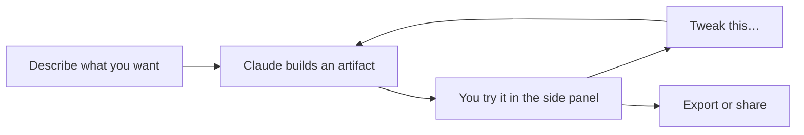

<LevelBadge level="beginner" />

<VerifyNote lastVerified="2026-09-25" source="https://support.claude.com/en/articles/17153992-what-are-artifacts-and-how-do-i-use-them">
Artifacts는 **Free, Pro, Max, Team, Enterprise**에서 사용할 수 있습니다. 세 가지 *템플릿* — **Claude Docs**, **Claude Slides**, **Claude Design** — 은 **유료 플랜에서만 베타**입니다: Pro, Max, Team에서는 기본 활성, Enterprise에서는 소유자가 각각을 켤 때까지 비활성입니다. 이 영역의 기능은 빠르게 바뀝니다 — 현재 동작은 헬프 센터에서 확인하세요.
</VerifyNote>

**Artifacts**는 Claude가 채팅 옆 **사이드 패널**에 렌더링하는 출력입니다 — 문서, 덱, 차트, 동작하는 앱 — 대화 텍스트와 분리된 채로 보고, 사용하고, 다듬을 수 있습니다.

[2026년 9월 통합](/docs/claude-app/one-claude-docs-and-slides) 이후로는 이 패널이 세 가지 **템플릿**이 사는 곳이기도 합니다. 그래서 "artifact"는 컨테이너이고 "template"은 시작 형태가 됩니다.

<Callout type="objectives" items={[
  "artifact 패널이 무엇을 만들어낼 수 있는지, 그리고 어떤 출력이 일반 artifact이고 어떤 것이 베타 템플릿인지 알기",
  "시행착오 없이 Doc, 덱, 디자인, 실행 가능한 앱, 다운로드 파일 중에서 고르기",
  "처음부터 다시 묻는 대신 평범한 말로 artifact를 다듬기",
  "어떤 artifact를 어떤 형식으로, 어떤 플랜에서 내보낼 수 있는지 알기"
]} />

## 만들 수 있는 것

| 출력 | 무엇인가 | 플랜 |
| --- | --- | --- |
| **미니 웹 앱 & 도구** | 계산기, 퀴즈, 폼, 작은 인터랙티브 데모 | 모든 플랜 |
| **차트 & 다이어그램** | 시각화와 간단한 데이터 대시보드 | 모든 플랜 |
| **코드** | 읽고 실행할 수 있는 무언가 | 모든 플랜 |
| **Claude Docs** | Claude와 팀과 함께 공동 편집하는, 살아 있는 멀티 탭 문서 | 유료, 베타 |
| **Claude Slides** | 내 노트나 대화에서 만들어지며 그 자리에서 발표할 수 있는 덱 | 유료, 베타 |
| **Claude Design** | 내 디자인 시스템에 맞춘 비주얼, 목업, 프로토타입, 랜딩 페이지 | 유료, 베타 |

내보내기 형식은 유형별로 다릅니다: Docs는 **Word, PDF, Markdown, Google Docs**로, Slides는 **PowerPoint와 PDF**로, Designs는 **.zip, PDF, PowerPoint 또는 단독 HTML**로 나갑니다.

## 개발자가 아닌 사람에게 강력한 이유

설명만으로 *실제로 쓸 수 있는* 무언가를 만들 수 있습니다 — "단체 저녁 식사용 팁 계산기 만들어 줘", "이 CSV로 대시보드 만들어 줘" — 그리고 대화로 다듬으면 됩니다("서비스 요금 입력란 추가해 줘", "버튼 더 크게"). **직접 코드를 쓰지 않고 AI로 만드는 것**의 가장 분명한 예시입니다.

## artifact와 함께 작업하는 방법

<Steps items={[
  {title: "구체적으로 요청하기", body: "목적, 입력, 대상 사용자, 그리고 원하는 외형을 밝히세요. 첫 artifact가 어긋나는 가장 큰 이유는 모호함입니다 — 일반적인 프롬프팅과 같은 규칙입니다."},
  {title: "아니면 직접 형태를 고르기", body: "메시지 입력창에서 Output을 선택해 템플릿을 고르거나, Artifacts 탭에서 하나를 시작하세요. Claude가 계속 내가 생각한 것과 다른 형태를 내놓을 때 이렇게 하세요."},
  {title: "평범한 말로 다듬기", body: "Claude는 새 것을 만드는 대신 같은 artifact를 업데이트합니다. 다섯 가지를 한 번에 나열하는 것보다 한 번에 하나씩 바꾸는 편이 제대로 되기 훨씬 쉽습니다."},
  {title: "써 보고, 내보내거나 공유하기", body: "패널에서 직접 시도해 보세요. Docs, Slides, Designs는 각각 고유한 내보내기 형식을 가지며, 공유 규칙은 플랜에 따라 다릅니다."}
]} />

<PromptCard title="구체적인 artifact 브리프가 모호한 것보다 낫다">{`Build me an interactive artifact: a tip calculator for a group dinner.

Inputs: bill total, number of people, tip percentage (slider, 0-30%,
default 18), and a toggle for "service charge already included".
Output: tip amount, total, and per-person share, updating live.

Audience: my friends on their phones — big tap targets, works at
375px wide, no explanation text.`}</PromptCard>

## 팁

- 입력/출력과 대상 사용자에 대해 **구체적으로** 쓰세요 — 좋은 [프롬프팅](/docs/prompting/basics)과 같습니다.
- **작게 반복하세요.** 한 번에 하나씩 바꾸는 편이 제대로 되기 쉽습니다.
- 중요한 용도라면 artifact가 계산한 **로직/숫자를 반드시 검증하세요**([환각](/docs/foundations/hallucinations)).
- **Doc 안의 차트는 스스로 갱신되지 않습니다.** 데이터를 바꿔도 Claude에게 다시 만들어 달라고 할 때까지 차트는 이전 값을 유지합니다.

## 퀴즈

<Quiz questions={[
  {q: "Free 플랜에서 Claude에게 대화를 공유 가능한 멀티 탭 문서로 만들어 달라고 요청하면 무엇을 받게 될까요?", options: ["Claude Doc — artifacts는 모든 플랜에서 쓸 수 있다", "Claude Doc, 다만 보기 전용", "Claude Doc은 아니다 — 템플릿은 유료 플랜에서만 베타다. 일반 artifact나 다운로드 가능한 파일은 여전히 받을 수 있다", "아무것도 — artifacts에는 유료 플랜이 필요하다"], answer: 2, explain: "Artifacts 자체는 Free, Pro, Max, Team, Enterprise에서 사용할 수 있습니다. 세 가지 템플릿 — Docs, Slides, Design — 은 유료 플랜에서만 베타입니다. Free에서도 일반 artifact와 생성된 파일은 받을 수 있습니다."},
  {q: "Claude가 만든 artifact가 거의 맞는데 버튼이 너무 작습니다. 효율적인 조치는?", options: ["더 충실한 명세로 새 대화를 시작한다", "평범한 말로 변경을 요청한다 — Claude가 같은 artifact를 업데이트한다", "내보낸 뒤 손으로 수정한다", "턴을 아끼려고 다섯 가지 수정을 한꺼번에 요청한다"], answer: 1, explain: "대화로 반복하면 같은 artifact가 업데이트되고, 그것이 바로 이 패널의 핵심입니다. 그리고 한 번에 하나씩 바꾸는 편이 다섯 개를 묶어 요청하는 것보다 안정적으로 반영됩니다."}
]} />

<Callout type="takeaways" items={[
  "Artifact = 사이드 패널 컨테이너, template = 시작 형태(Docs, Slides, Design).",
  "일반 artifact는 모든 플랜에서 동작하고, 세 가지 템플릿은 유료 플랜에서 베타이며 Enterprise에서는 기본 비활성이다.",
  "같은 artifact를 평범한 말로 다듬자 — 대화를 처음부터 다시 시작하지 말자.",
  "계산된 숫자는 항상 검증하고, 데이터가 바뀐 뒤에는 차트를 다시 만들자."
]} />

## 다음

- [One Claude: 통합, Claude Docs & Claude Slides](/docs/claude-app/one-claude-docs-and-slides) — 템플릿을 깊이 다루고, 그 한계까지
- [실제 파일 생성하기 (docx/pptx/xlsx/pdf)](/docs/claude-app/generating-files) — 대신 다운로드를 원할 때
- [데이터 분석 플레이북](/docs/playbooks/data-analysis)
