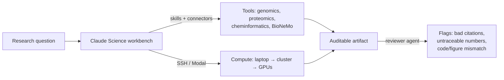

<LevelBadge level="advanced" />

<VerifyNote lastVerified="2026-07-13" source="https://www.anthropic.com/news/claude-science-ai-workbench">
Claude Science는 베타입니다. 번들 스킬, 연결된 모델, 컴퓨트 옵션, 플랜별 제공 여부는 빠르게 바뀝니다 — 이에 의존하기 전에 앱과 공식 발표에서 현재 사양을 확인하세요.
</VerifyNote>

<Callout type="objectives" items={["Claude Science가 무엇인지 — 그리고 채팅 창으로는 풀 수 없는 어떤 구체적 문제를 해결하는지 이해하기", "세 가지 축 배우기: 통합 도구, 감사 가능한 산출물, 관리형 컴퓨트", "리뷰어 에이전트가 추적 불가능한 수치와 어긋난 그림을 어떻게 자동으로 잡아내는지 보기", "Claude Science를 언제 쓰고, 언제 일반 Claude나 Claude Code를 쓸지 알기", "모델이 검증할 수 있는 범위를 과장하지 않으면서 더 넓은 AI-for-science 지형 속에 위치시키기"]} />

범용 챗봇으로 하는 대부분의 과학 작업은 같은 이음새에서 깨집니다. 모델은 추론을 잘하지만 *도구, 데이터, 컴퓨트*는 다른 곳에 있습니다 — 클러스터, 노트북, 게놈 브라우저, 폴딩 모델. 결과를 손으로 복사해 오가고, 나중에 누구도 그림이 정확히 어떻게 만들어졌는지 재구성할 수 없습니다. **Claude Science**(베타, **2026년 6월 30일** 출시)는 그 이음새를 메우려는 Anthropic의 시도입니다. 추론, 도구, 컴퓨트, 출처가 모두 한 곳에 있는 AI *워크벤치*입니다.

이것은 별도의 앱입니다 — 채팅에 붙여넣는 프롬프트가 아닙니다. 소프트웨어 저장소 대신 웻랩과 전산생물학 워크플로를 향한 [Claude Code](/docs/claude-code/what-is-claude-code)라고 생각하세요.

## 겨냥하는 문제

예컨대 단일 세포 RNA 파이프라인을 돌리는 연구자는 데이터 소스, QC 도구, 플로팅 라이브러리, GPU 위의 폴딩 모델, 인용 관리자를 저글링합니다 — 여기에 3주 전 어떤 스크립트의 어떤 버전이 어떤 그림을 만들었는지 기억해야 하는 정신적 부담이 더해집니다. 범용 어시스턴트는 *한* 단계는 돕지만 나머지에서는 맥락을 놓칩니다.

<Callout type="tip">
과학에서 가치의 단위는 좋은 답이 아니라 **재현 가능한** 답입니다. Claude Science는 그것을 중심으로 만들어졌습니다. 산출물은 리뷰어(사람이든 에이전트든)가 모든 수치를 그것을 만들어낸 코드와 환경까지 추적할 수 있도록 설계되었습니다.
</Callout>

## 세 가지 축

### 1. 통합 도구 — 환경이 미리 연결되어 있다

Claude Science에는 게놈학, 단일 세포, 프로테오믹스, 구조생물학, 케모인포매틱스를 위해 미리 구성된 **60개 이상의 선별된 스킬과 커넥터**가 함께 제공됩니다. 결정적으로 **NVIDIA BioNeMo** 모델 — **Evo 2**(게놈 파운데이션 모델), **Boltz-2**(구조/친화도 예측), **OpenFold3**(단백질 폴딩) — 에 네이티브로 연결되므로, 폴딩이나 친화도 예측이 별도 포털이 아니라 워크플로의 한 단계가 됩니다.

이는 Claude Code에서 익숙할 수도 있는 바로 그 [스킬 및 커넥터](/docs/claude-code/skills) 메커니즘을, 소프트웨어 스택 대신 과학 스택에 맞춰 선별한 것입니다.

### 2. 감사 가능한 산출물 — 출처가 기본값이지 사후 처리가 아니다

모든 산출물은 전체 계보를 담고 있습니다.

- 그것을 만들어낸 **정확한 코드와 환경**,
- 어떻게 만들어졌는지에 대한 **평이한 언어의 설명**, 그리고
- 그 뒤에 있는 **전체 메시지 기록**.

여기에 더해 **리뷰어 에이전트**가 **잘못된 인용, 추적 불가능한 수치, 기반 코드와 맞지 않는 그림**을 자동으로 표시합니다. 마지막 항목이 눈에 잘 띄지 않는 안전장치입니다. 그럴듯해 보이는 차트인데 그 데이터가 실제로는 산출물 속 코드에서 나오지 않았다면 걸립니다.

<Callout type="warning">
리뷰어 에이전트는 특정 유형의 오류를 줄일 뿐, 산출물을 *올바르게* 만들지는 않습니다. 검증할 수 없는 인용과 추적할 수 없는 수치를 표시할 뿐, 실험 설계나 생물학적 타당성, 올바른 질문을 던졌는지는 보증하지 못합니다. 출처 ≠ 진실. 과학은 여전히 여러분의 몫입니다.
</Callout>

### 3. 관리형 컴퓨트 — 노트북에서 수백 개의 GPU까지

Claude Science는 **노트북, 클러스터, 온디맨드 GPU에서 컴퓨트를 관리**하며 **GPU 하나에서 필요에 따라 수백 개까지** 확장합니다. 기존 인프라와 함께 동작합니다 — **SSH**를 통한 HPC 클러스터 또는 **Modal** 계정 — 따라서 무거운 작업은 데이터와 할당량이 이미 있는 곳에서 실행되며, 오케스트레이션을 손으로 작성할 필요가 없습니다.

## 네이티브 과학 시각화

결과는 다운로드해서 다른 곳에서 여는 파일이 아니라 **인터페이스 안에서** 렌더링됩니다. **3D 단백질 구조, 게놈 브라우저 트랙, 화학 구조**가 네이티브로 표시됩니다. 폴딩이나 유전자 자리를 그것에 대해 추론한 바로 그 자리에서 살펴봅니다 — [아티팩트](/docs/claude-app/artifacts) 개념을 과학적 대상으로 확장한 것입니다.

## 전형적인 워크플로

<Steps items={[{title: "질문 정의하기", body: "생물학적 질문을 진술하고 커넥터를 통해 Claude Science가 데이터 소스를 바라보게 하세요."}, {title: "파이프라인을 조립하게 하기", body: "스킬(QC, 정렬, 폴딩)을 선택하고 단계를 제안합니다 — 무거운 컴퓨트가 돌기 전에 검토하세요."}, {title: "데이터가 있는 곳에서 실행하기", body: "비싼 단계는 SSH로 HPC 클러스터나 온디맨드 GPU에 넘기고, 가벼운 단계는 로컬에 두세요."}, {title: "네이티브로 살펴보기", body: "3D 구조, 게놈 트랙, 화학 구조를 내보내지 않고 인라인으로 확인하세요."}, {title: "감사 가능한 산출물 내놓기", body: "산출물은 코드, 환경, 평이한 언어의 방법, 메시지 기록을 묶습니다 — 그리고 리뷰어 에이전트가 추적 불가능한 것을 표시합니다."}]} />

<PromptCard title="Claude Science 안에서 던지는 첫 구체적 요청">{`Load the connected single-cell dataset, run standard QC (filter low-count cells and high-mito), and show a UMAP colored by cluster. Keep every step in an auditable artifact I can hand to a reviewer.`}</PromptCard>

<PromptCard title="무거운 단계를 실제 컴퓨트로 넘기기">{`Predict the structure of this sequence with the connected folding model, run it on my HPC cluster over SSH, and render the 3D structure inline when it finishes.`}</PromptCard>

## 언제 쓰고 언제 쓰지 않을까

| 이럴 때 Claude Science… | 이럴 때는 다른 것을… |
|---|---|
| 재현 가능하고 검토 가능한 과학적 산출물이 필요할 때 | 빠른 일회성 답이 필요할 때 → 일반 [Claude](/docs/claude-app/getting-started) |
| 작업이 게놈학 / 프로테오믹스 / 케모인포매틱스 도구에 걸쳐 있을 때 | 소프트웨어를 만들 때 → [Claude Code](/docs/claude-code/what-is-claude-code) |
| 무거운 컴퓨트가 클러스터나 온디맨드 GPU에서 돌아야 할 때 | 연결할 데이터 커넥터나 컴퓨트가 없을 때 |
| 출처(코드 + 환경 + 기록)가 검토에 실제로 중요할 때 | Free 플랜이거나 Windows일 때 (제공 범위 참고) |

## 제공 범위와 한계

- **플랜:** **Claude Pro, Max, Team, Enterprise** 사용자에게 베타. (Free 티어 없음.)
- **플랫폼:** **macOS와 Linux** — 출시 시점에 Windows 클라이언트는 없습니다.
- **상태:** 베타 — 번들 스킬 목록, 연결된 모델, 컴퓨트 옵션은 바뀔 수 있습니다.

<Callout type="tip">
Claude Science는 Claude 고유의 제품이지만 그 *패턴*은 업계 전반의 것입니다. 어시스턴트들은 설명만 하는 게 아니라 실제 작업을 하기 위해 도구 통합, 출처, 컴퓨트 계층을 키워가고 있습니다. 다른 AI 랩에서 나올 동등한 "워크벤치" 움직임을 주시하세요 — Claude Science가 세운 재현성 기준은 그들을 판단하는 좋은 잣대입니다.
</Callout>

<Flashcards title="Claude Science 용어" cards={[{front: "Claude Science", back: "과학자를 위한 Anthropic의 베타 AI 워크벤치: 통합 연구 도구, 감사 가능한 산출물, 네이티브 시각화, 관리형 컴퓨트를 하나의 앱에."}, {front: "감사 가능한 산출물 (Auditable artifact)", back: "정확한 코드, 그 환경, 평이한 언어의 방법, 전체 메시지 기록이 함께 묶인 산출물 — 어떤 결과든 어떻게 만들어졌는지 되짚을 수 있다."}, {front: "리뷰어 에이전트 (Reviewer agent)", back: "잘못된 인용, 추적 불가능한 수치, 기반 코드와 맞지 않는 그림을 표시하는 자동 검사. 오류를 줄이지만 정확성을 보증하지는 않는다."}, {front: "BioNeMo", back: "NVIDIA의 생물학 파운데이션 모델 모음. Claude Science는 Evo 2, Boltz-2, OpenFold3에 네이티브로 연결된다."}, {front: "관리형 컴퓨트 (Managed compute)", back: "Claude Science는 노트북, HPC 클러스터(SSH 경유), 온디맨드 GPU(예: Modal)에서 작업을 실행하며 GPU 하나에서 수백 개까지 확장한다."}, {front: "케모인포매틱스 (Cheminformatics)", back: "화학 구조와 물성의 전산 분석 — Claude Science가 게놈학, 단일 세포, 프로테오믹스, 구조생물학과 함께 스킬을 미리 연결해 둔 영역 중 하나."}]} />

<Quiz title="확인해 보세요" questions={[{q: "범용 챗봇과 비교했을 때 Claude Science의 가장 뚜렷한 설계 목표 하나는?", options: ["더 빠른 응답", "재현성 — 모든 결과가 그것을 만들어낸 코드와 환경까지 추적된다", "더 큰 컨텍스트 윈도우"], answer: 1, explain: "산출물은 감사 가능한 아티팩트(코드 + 환경 + 평이한 언어의 방법 + 메시지 기록)이며, 리뷰어가 모든 수치를 추적할 수 있도록 만들어졌습니다. 출처 우선 설계가 핵심 차별점입니다."}, {q: "리뷰어 에이전트가 산출물 속 코드와 수치가 맞지 않는 그림을 표시했습니다. 이것이 증명한 것은?", options: ["과학이 틀렸다는 것", "결과가 옳다는 것", "그림이 추적 불가능하다는 것 — 생물학에 대한 판정이 아니라 출처의 문제"], answer: 2, explain: "리뷰어는 추적 불가능한 수치, 잘못된 인용, 코드/그림 불일치를 잡아냅니다. 특정 유형의 오류를 줄이지만 기반 과학이 타당한지는 확인할 수 없습니다 — 출처는 진실이 아닙니다."}, {q: "워크벤치 안에서 연구실 HPC 할당량으로 단백질을 폴딩해야 합니다. Claude Science는…", options: ["Anthropic 클라우드에서만 실행할 수 있다", "SSH로 여러분의 클러스터에서(또는 온디맨드 GPU에서) 작업을 실행하며 필요에 따라 확장한다", "컴퓨트를 전혀 하지 못한다"], answer: 1, explain: "Claude Science는 노트북, 클러스터(SSH 경유), 온디맨드 GPU(예: Modal)에서 GPU 하나부터 수백 개까지 컴퓨트를 관리합니다."}, {q: "출시 시점에 Claude Science를 사용할 수 없는 사용자는?", options: ["macOS의 Max 사용자", "Linux의 Enterprise 사용자", "Windows의 Free 플랜 사용자"], answer: 2, explain: "Pro, Max, Team, Enterprise 대상 베타이고(Free 티어 없음) macOS와 Linux에서만 제공되므로, Free/Windows 사용자는 두 가지 이유로 모두 제외됩니다."}]} />

<Callout type="takeaways" items={["Claude Science는 별도의 베타 앱입니다 — 채팅에 붙여넣는 프롬프트가 아니라 과학자를 위한 AI 워크벤치.", "세 가지 축: 미리 연결된 도구(60개 이상의 스킬, 네이티브 BioNeMo — Evo 2, Boltz-2, OpenFold3), 감사 가능한 산출물, 관리형 컴퓨트.", "감사 가능한 산출물은 코드 + 환경 + 방법 + 메시지 기록을 묶습니다. 리뷰어 에이전트는 추적 불가능한 수치, 잘못된 인용, 코드/그림 불일치를 표시합니다.", "컴퓨트는 데이터가 있는 곳에서 실행됩니다: 노트북, SSH 경유 HPC, 온디맨드 GPU, 하나 → 수백 개로 확장.", "macOS와 Linux의 Pro/Max/Team/Enterprise 대상 베타. 출처는 오류를 줄이지만 과학이 옳다고 인증하지는 않습니다."]} />

## 출처 및 더 읽을거리

- [Claude Science, 과학자를 위한 AI 워크벤치 — Anthropic](https://www.anthropic.com/news/claude-science-ai-workbench) — 출시 발표(2026년 6월 30일). 60개 이상의 스킬, BioNeMo 연결, 감사 가능한 산출물 구조, 리뷰어 에이전트, 컴퓨트 옵션, 제공 범위의 출처.
- [NVIDIA BioNeMo](https://www.nvidia.com/en-us/clara/bionemo/) — Evo 2, Boltz-2, OpenFold3 뒤에 있는 생물학 파운데이션 모델 플랫폼.
- [Modal](https://modal.com/) — Claude Science가 사용할 수 있는 온디맨드 컴퓨트 백엔드 중 하나.
- AILmanac 관련 문서: [Claude Code](/docs/claude-code/what-is-claude-code), [스킬](/docs/claude-code/skills), [아티팩트](/docs/claude-app/artifacts), [관리형 에이전트](/docs/api/managed-agents).
