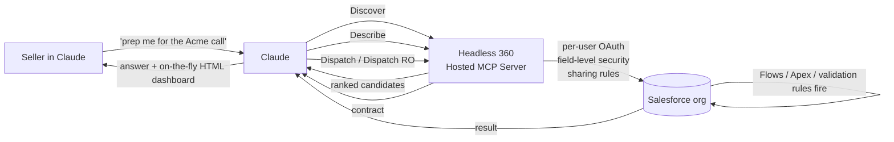

<LevelBadge level="intermediate" />

<VerifyNote lastVerified="2026-09-01" source="https://www.salesforce.com/news/press-releases/2026/08/26/salesforce-and-anthropic-announce-claudeforce/">
Claudeforce는 **2026년 8월 26일**에 발표되었습니다. **Salesforce in Claude**는 현재 **선별 파일럿** 단계이며 **오픈 베타는 2026년 9월로 예정**되어 있습니다. 4-도구 Headless 360 MCP 서피스는 Salesforce가 공개한 API입니다 (Beta, 2026년 7월). 스킬 개수, 가격, Slack/Agentforce 가닥의 정확한 범위는 매주 바뀌고 있습니다 — 조직을 여기에 투입하기 전에 링크된 Salesforce Developers 문서로 확인하세요.
</VerifyNote>

**2026년 8월 26일**, Salesforce와 Anthropic은 네 가닥으로 이루어진 파트너십 **Claudeforce**를 공동 발표했습니다. 가장 먼저 출시되는 조각은 **Salesforce in Claude** — Claude 대화가 실시간 CRM 데이터를 기반으로 추론하고 통제된 액션을 취할 수 있게 해주는 플러그인입니다. **37개의 사전 구축 세일즈 스킬**(출시 시점에 공개적으로 이름이 밝혀진 것은 약 8개뿐)을 갖추고 있고, 오픈 베타는 2026년 9월로 예정되어 있으며 — 그리고 언론 보도가 건너뛰는 부분인데 — 그 밑에 **놀랄 만큼 작은 MCP 서피스**가 깔려 있습니다.

대부분의 기사는 보도자료를 다시 편집한 것입니다. 이 페이지는 실전 현장 가이드입니다: 단 **4개의 MCP 도구**로 37개 스킬을 가능하게 만드는 아키텍처, 플러그인이 함께 제공하는 **매우 다른 두 가지 인증 모델**, 그리고 이것을 또 하나의 Chrome 확장 프로그램처럼 취급하면 RevOps를 물어뜯을 **거버넌스 함정들**.

<Callout type="objectives" items={[
  "2026년 9월 오픈 베타에서 실제로 출시되는 것 이해하기 — Claudeforce의 네 가닥, 그리고 그중 어느 것이 'Salesforce in Claude'인지",
  "플러그인이 Salesforce API 서피스 전체를 노출하기 위해 왜 4개의 MCP 도구(Discover / Describe / Dispatch / Dispatch Read-Only)만 필요한지 확인하기",
  "두 가지 인증 경로를 구분하기 — 사용자별 OAuth (Claude) 대 클라이언트 자격 증명 통합 사용자 (Slack) — 그리고 우리 조직에 맞게 올바르게 선택하기",
  "37개 스킬 중 어느 것이든 켜기 전에 권한 수준(읽기 전용 / 제안 / 쓰기)으로 분류하기",
  "네 가지 함정 피하기: 과도하게 부여된 프로필, 잊혀진 자동화 부수 효과, Winter '27 업그레이드 충돌, 그리고 섀도 IT MCP 서버"
]} />

## Claudeforce가 실제로 무엇인가 (그리고 무엇이 아닌가)

Claudeforce는 제품이 아니라 네 가닥의 파트너십입니다. 2026년 9월에 열리는 것은 단 하나의 가닥 — **Salesforce in Claude** — 뿐입니다. 가닥을 혼동하는 것이 RevOps 팀이 엉뚱한 파일럿을 설계하게 되는 경로입니다.

<Steps items={[
  {title: "가닥 1 — Salesforce in Claude (2026년 9월 오픈 베타)", body: "Claude 앱 '안에서' 실행되는 Salesforce 플러그인. 영업 담당자는 Claude에 머물고, Claude가 Salesforce의 Hosted MCP를 통해 조직에 손을 뻗습니다. 이 페이지가 다루는 가닥이 바로 이것입니다."},
  {title: "가닥 2 — Salesforce 제품 안의 Claude", body: "반대 방향: Anthropic의 모델이 Agentforce 전반(Atlas Reasoning Engine, Agentforce Vibes, Agentforce Coworker, Agent Builder)에서 일급 시민으로 제공됩니다. 다른 UX, 다른 관리 서피스, 다른 롤아웃 일정."},
  {title: "가닥 3 — Slack의 기본 모델이 되는 Claude", body: "Slack AI 기능(허들 요약, 채널 리캡, 메시지 초안 작성)이 Claude를 기본 백엔드 모델로 사용하기 시작합니다. 거버넌스 방식이 다릅니다 — 아래의 Slack 인증 경로를 참고하세요."},
  {title: "가닥 4 — 상호 상업적 도입", body: "Salesforce는 Anthropic의 대형 고객이 되고, Anthropic은 Salesforce의 대형 고객이 됩니다. 조달 부서에는 흥미롭지만 기술 설정에는 무관합니다."}
]} />

이 페이지의 나머지는 가닥 1, **Salesforce in Claude**에 관한 것입니다.

## 37개 스킬까지 확장되는 4-도구 아키텍처

Claudeforce에서 유일하게 직관적이지 않은 점은 플러그인이 역량마다 도구를 등록하지 **않는다**는 것입니다. Salesforce의 **[Headless 360 Hosted MCP Server](https://developer.salesforce.com/docs/platform/hosted-mcp-servers/guide/headless-360-mcp.html)** (Beta, 2026년 7월)는 정확히 **4개의 MCP 도구**만 노출하며, Claude는 이것들을 조합해 모든 스킬에 도달합니다.

<Steps items={[
  {title: "Discover", body: "연결된 조직의 모든 API와 스킬에 대한 벡터 인덱스를 대상으로 하는 의미 기반 검색. Claude가 요청에 대한 자신의 해석을 전달하면, Discover가 후보 작업들의 순위 목록을 반환합니다. '이 계정에 대한 거래 건전성 관련 기능을 찾아줘'가 컨텍스트를 어지럽히는 200개의 사전 등록 도구를 필요로 하지 않는 이유가 바로 이것입니다."},
  {title: "Describe", body: "선택된 후보에 대해 Describe는 기술적 계약을 반환합니다: 파라미터, 의존성, 순서가 있는 단계, 부수 효과. Claude는 무엇이든 실행하기로 확정하기 전에 Discover가 올바른 것을 찾아냈는지 검증하기 위해 이것을 사용합니다."},
  {title: "Dispatch", body: "선택된 작업을 실행합니다. 올바른 엔드포인트로 라우팅합니다. 호출이 Salesforce에 도달하기 전에 사용자 접근 가드를 적용합니다. 이것이 쓰기 경로입니다 — 검증 규칙, Flow, Apex 트리거, CPU 거버너 한도가 모두 Dispatch 하류에서 평소와 똑같이 작동합니다."},
  {title: "Dispatch Read-Only", body: "GET 전용 변종. 동일한 디스커버리 플로우, 동일한 접근 검사지만 도구가 물리적으로 변경을 할 수 없습니다. 이것이 파일럿에 안전한 기본값이며 읽기 전용 스킬들이 바인딩되는 도구입니다."}
]} />

대부분의 출시 게시글이 놓치는 두 가지 함의:

- **도구 서피스는 작고 안정적으로 유지되지만**, **스킬 카탈로그는 Salesforce 측에서 독립적으로 성장합니다** — Claude는 새 스킬에 도달하기 위해 새 도구 등록이 필요하지 않습니다.
- **필드 수준 보안, 객체 권한, 공유 규칙이 모든 도구 호출에 적용됩니다** — 적용은 Claude가 아니라 조직에서 일어납니다. 사용자가 Salesforce UI에서 어떤 필드를 볼 수 없다면 Discover는 그것을 노출하지 않고, Dispatch도 어차피 거부합니다.

## 두 가지 인증 경로 — 그리고 차이가 중요한 이유

Claudeforce는 똑같이 보이는 플러그인에 **두 가지 OAuth 모델**을 붙여서 제공하며, 둘은 보안 태세가 매우 다릅니다. 이것을 잘못 다루면 조직의 모든 담당자에게 통합 사용자 한 명의 실질 권한을 실수로 넘겨주게 됩니다.

<Steps items={[
  {title: "경로 A — Salesforce in Claude (사용자별 OAuth)", body: "mcp_api 스코프를 사용하는 Salesforce External Client Apps를 사용합니다. 관리자 한 명이 조직 수준의 일회성 연결을 수행하고, 이후 각 영업 담당자가 자신으로서 인가합니다. 모든 Claude 도구 호출은 요청한 개인으로서 실행되며, 그 사람의 프로필, 권한 세트, 공유 규칙, 필드 수준 보안이 적용됩니다. 사용자에게 보이는 모든 것에 올바른 태세입니다."},
  {title: "경로 B — Claude in Slack (클라이언트 자격 증명)", body: "전용 통합 사용자와 함께 OAuth 2.0 클라이언트 자격 증명 플로우를 사용합니다. 액세스 번들은 사용자들 간에 '하나의' 에이전트 자격 증명을 공유합니다. 모든 요청이 동일한 통합 사용자로서 실행됩니다 — 즉 그 사용자의 권한이 그것을 거치는 모든 사람의 실질 상한이 됩니다. 편리하지만, 사용자별 데이터 격리 요구가 있는 것에는 잘못된 형태입니다."}
]} />

<Callout type="warning" items={[
  "'그냥 잘 작동하게' 하려고 Slack 통합 사용자에게 넓은 세일즈 운영 프로필을 부여하면, 그것을 경유하는 모든 Slack 사용자가 그 실질 접근 권한을 상속합니다. 통합 사용자의 프로필을 Slack이 실제로 필요한 가장 좁은 범위로 제한한 다음, 권한 세트로 역량을 추가하세요 — 공유 서비스 계정과 동일한 원칙입니다."
]} />

## 37개 스킬, 권한 수준별 분류

Salesforce는 출시 시점에 소수의 스킬만 이름을 공개했고, 더 많은 스킬이 2026년 말까지 나올 예정입니다. 지금 당장 계획할 수 있는 것은 모든 스킬이 **세 가지 권한 수준** 중 하나에 속하며, 인터페이스상으로는 전부 똑같이 보인다는 점입니다. 분류하는 것은 여러분의 책임입니다.

| 공개된 스킬 (2026년 8월) | 권한 수준 | 대략적인 Dispatch 경로 |
| --- | --- | --- |
| Daily briefing | 읽기 전용 | Dispatch RO |
| Pipeline review | 읽기 전용 | Dispatch RO |
| Forecast narrative | 읽기 전용 | Dispatch RO |
| Meeting preparation | 읽기 전용 | Dispatch RO |
| Deal-health review | 읽기 전용 | Dispatch RO |
| Win/loss analysis | 읽기 전용 | Dispatch RO |
| Salesforce hygiene | 제안 | Dispatch RO → 초안 |
| Activity logging | 쓰기 | Dispatch (POST/PATCH) |

나머지 약 29개 스킬은 출시 시점에 미공개입니다. 그것들이 나올 때도 동일한 분류가 적용됩니다:

<Steps items={[
  {title: "읽기 전용 (Dispatch RO만)", body: "분석하고, 요약하고, 조회합니다. 변경할 수 없습니다. 파일럿 집단에 자유롭게 활성화하세요. 실패 양상은 '잘못된 쓰기'가 아니라 '잘못된 답'입니다."},
  {title: "제안 (Dispatch RO + 초안)", body: "분석하고 '동시에' 변경을 제안하지만, 실제 변경은 사람을 위한 초안으로 남겨둡니다. 읽기 전용 계층이 제대로 작동한 뒤에 활성화하세요. 실패 양상은 영업 담당자가 읽지 않고 승인할 수도 있는 나쁜 초안입니다 — 속도만이 아니라 수정률을 측정하세요."},
  {title: "쓰기 (Dispatch POST/PATCH/DELETE)", body: "CRM 데이터를 직접 변경합니다. 모든 쓰기는 사람이 저장을 클릭한 것과 '정확히' 똑같이 조직의 검증 규칙, Flow, Apex 트리거, CPU 거버너 한도를 통과합니다. 가장 마지막에, 스킬 단위로, 사용자별 프로필 범위 지정과 함께, 그리고 제안 계층의 정확도를 최소 4주간 측정한 뒤에만 활성화하세요."}
]} />

## 파일럿 설정하기 — RevOps 체크리스트

<Steps items={[
  {title: "1. 노출하려는 프로필을 감사하라", body: "느린 UI 뒤에서는 무해했던 과도하게 부여된 프로필이 빠른 에이전트 뒤에서는 진짜 위험이 됩니다. 파일럿 전에 초대할 사용자들에 대해 권한 감사를 실행하세요: 어떤 객체, 어떤 필드, 어떤 레코드 타입 공유. 플러그인은 그 프로필이 말하는 것을 충실히 적용합니다 — 아무도 눈치채지 못했던 과거의 과도한 권한 부여까지 포함해서."},
  {title: "2. 파일럿 사용자를 잠긴 권한 세트에 바인딩하라", body: "Claudeforce Pilot 권한 세트를 만드세요: 특정 객체, 특정 필드, 처음에는 읽기 전용. 평소 프로필에 '추가로' 할당해서, 파일럿이 끝났을 때 기본 접근 권한을 건드리지 않고 깔끔하게 제거할 수 있게 하세요."},
  {title: "3. 어디서나 Dispatch Read-Only로 시작하라", body: "처음 두 스프린트에는 읽기 전용 스킬만 활성화하세요. 롤백 서피스 없이 정확도를 측정할 수 있게 됩니다. 환각된 필드명이나 잘못된 레코드 조회를 주의하세요 — 그것들이 쓰기 계층까지 살아남는 실패 양상입니다."},
  {title: "4. 쓰기 계층 파일럿을 위해 세 가지 권한 수준에 걸친 워크플로 '세 개'를 고르라", body: "읽기 전용 하나, 제안 하나, 쓰기 하나. 위험 프로필이 다르면 드러나는 거버넌스 공백도 다르고, 계층당 파일럿 하나가 스킬당 파일럿 하나보다 저렴합니다."},
  {title: "5. API 기준선에 버전을 고정하라", body: "Salesforce in Claude는 API v67.0 이상을 요구하며, Winter '27은 v68.0을 도입합니다. 베타 기간(2026년 9~10월) 중에 조직이 Winter '27로 자동 업그레이드된다면, 플랫폼 업그레이드가 파일럿 중간에 의미론을 바꿔버리지 않도록 플러그인의 API 버전을 명시적으로 고정하세요."},
  {title: "6. 베타 기간 중에는 팀이 소유한 MCP 연결을 금지하라", body: "개별 팀이 '더 빨리 움직이려고' 자체 Hosted MCP Server를 세우기 시작한다면, 포장만 더 깔끔한 섀도 IT를 재발명한 것입니다. 연결된 앱과 프로필을 소유한 동일한 관리자 아래로 MCP 거버넌스를 중앙화하세요."}
]} />

<PromptCard title="영업 담당자 프롬프트 템플릿: 안전한 월요일 파이프라인 브리핑 (읽기 전용 계층)">{`You are preparing my Monday pipeline briefing from Salesforce.

Every Monday at 07:00 local:

1. Use the "Pipeline review" skill on my named accounts (owner = me,
   stage != Closed Lost, close date in current quarter).
2. Use the "Deal-health review" skill on the top 10 by amount.
3. Use the "Meeting preparation" skill for accounts I have a meeting
   with in the next 5 business days.

Constraints (do NOT violate):
- Read-only pass only. If any skill proposes a write (update stage,
  log activity, change amount) STOP and surface it as a draft in
  the output — do NOT dispatch it.
- Do not log activities on my behalf. Do not update fields.
- If a skill returns a field you cannot see under my profile, do
  not guess the value — flag it as "hidden by permissions".

Produce a single briefing:
- 3-bullet TL;DR
- "Pipeline movement since last Monday" (opportunity-level, cite
  the Salesforce record IDs)
- "Deals I should touch this week" (with why, from deal-health)
- "Meetings this week" (with prep pack from meeting-preparation)
- "Proposed writes (NOT DISPATCHED)" — every draft change the agent
  wanted to make, so I can review in one place.`}</PromptCard>

이 프롬프트가 대부분의 '이 템플릿을 복사하세요' 게시글과 달리 해내는 두 가지:

- **파일럿을 읽기 전용에 고정합니다** — "스킬이 쓰기를 제안하면 STOP"이라는 명시적 불변 조건을 통해서요. 예약된 또는 장시간 실행되는 Claude 세션에서는 '확실해?'라는 후속 질문에 답할 수 없습니다 — 불변 조건은 프롬프트 안에 살아야 합니다.
- 모델에게 **하려고 했던 모든 쓰기를 한곳에 드러내라**고 요구합니다. 그래서 어떤 스킬을 쓰기 계층으로 승격하기 전에 그 스킬의 제안 계층 정확도를 측정할 수 있습니다. 승격을 얻어내는 가장 저렴한 방법입니다.

## 여러분을 물어뜯을 네 가지 함정

<Steps items={[
  {title: "1. 과도하게 부여된 프로필이 실제 폭발 반경이 된다", body: "UI 뒤에서는 대체로 괜찮았던 그 권한 세트가 분당 30건의 쓰기를 Dispatch할 수 있는 에이전트 뒤에서는 진짜로 위험합니다. 해결: 파일럿 '전에' 프로필 감사, 사후가 아니라."},
  {title: "2. 모든 Dispatch 쓰기마다 자동화 부수 효과가 발동한다", body: "Dispatch PATCH는 평범한 Salesforce 쓰기입니다. 모든 검증 규칙, Flow, Process Builder, Apex 트리거, CPU 시간 거버너 한도가 사람이 클릭한 것과 똑같이 발동합니다. 선의로 루프를 돌리는 스킬 하나가 CPU 한도를 건드리거나 원치 않는 Flow 기반 이메일을 대량 발송할 수 있습니다. 해결: 쓰기 계층 스킬을 켜기 전에 파일럿 조직의 자동화를 계측하세요."},
  {title: "3. 오픈 베타 기간에 Winter '27이 들어온다", body: "Winter '27 프로덕션 업그레이드(2026년 9~10월)가 Claudeforce 오픈 베타와 겹칩니다. 그 기간 중간에 스킬이 깨지면, 동시에 벌어진 '두 가지' 플랫폼 변화를 디버깅하게 됩니다. 해결: 플러그인에 API 버전을 고정하고, 가능하면 파일럿 집단의 Winter '27 업그레이드를 베타 기간 '밖으로' 일정을 잡으세요."},
  {title: "4. Slack 경로 ≠ Claude 경로", body: "Slack은 통합 사용자와 함께 클라이언트 자격 증명을 사용하므로, 'Slack에 Claudeforce 접근 권한을 주는 것'은 개별 사용자에게 Claude 안의 플러그인을 주는 것과 같은 거버넌스 형태가 아닙니다. 두 개의 별도 롤아웃, 두 개의 별도 감사 추적으로 취급하세요."}
]} />

## Claudeforce는 Agentforce와 어떤 관계인가

Salesforce는 2024년부터 **Agentforce**를 출시해왔고, Claude는 2025년 말부터 그 파운데이션 모델 중 '하나'였습니다. Claudeforce는 Agentforce를 대체하지 않습니다 — **새로운 서피스**(Claude 앱)를 추가하고 네 개의 Agentforce 계층(Atlas Reasoning Engine, Agentforce Vibes, Agentforce Coworker, Agent Builder)에 걸쳐 Claude를 **공식화**합니다. 모델 선택권은 유지됩니다: Agent Builder는 여전히 Claude와 함께 Amazon Nova를 제공합니다.

둘을 함께 바라보는 팀을 위한 대략적인 의사결정 표:

| 하고 싶은 일 | 선택할 것 |
| --- | --- |
| 영업 담당자에게 실시간 CRM을 기반으로 추론하는 채팅 인터페이스 제공 | Salesforce in Claude (플러그인) |
| Salesforce UI '안에' AI 기능 임베드 (레코드, 리스트 뷰, 버튼) | Agentforce |
| 도구, 메모리, 에스컬레이션 정책을 갖춘 커스텀 에이전트 구축 | Agent Builder (Salesforce 내부) |
| 반복 가능한 백오피스 CRM 작업을 종단 간 자동화 | Agentforce Coworker |
| Claude로 Salesforce 코드 작성 (Apex, LWC) | Agentforce Vibes |

여러 행이 해당된다면, 하나를 골라 억지로 밀어붙이는 것이 잘못된 선택입니다 — Claudeforce는 플러그인, Agentforce, Agent Builder가 상호 보완적이도록 설계되었고, 사용자는 같은 조직 안에서 그 사이를 오갈 수 있습니다.

## Salesforce in Claude를 쓰지 '말아야' 할 때

- **머신 대 머신 통합이 필요할 때.** 플러그인은 사람이 루프에 있는 채팅 서피스입니다. 대규모 무인 CRM 쓰기가 필요하면, Claude 앱을 중간에 두지 말고 [Headless 360 MCP Server](https://developer.salesforce.com/docs/platform/hosted-mcp-servers/guide/headless-360-mcp.html)를 [Managed Agents](/docs/api/managed-agents)에 직접 연결하세요.
- **영업 담당자가 이미 익숙한 Agentforce 경험을 이미 제공하고 있을 때.** 두 번째 서피스를 추가하면 교육이 분산되고 거버넌스 작업이 두 배가 됩니다. 팀이 실제로 사는 쪽을 고르세요.
- **이것을 통제할 Salesforce 관리자가 전혀 없을 때.** 플러그인은 조직을 더 강력하고 더 접근 가능하게 만듭니다 — 프로필, 권한 세트, MCP 연결을 소유한 사람이 없다면 나쁜 조합입니다.
- **컴플라이언스 태세가 고객 데이터에 대한 추론을 금지할 때.** 플러그인이 Salesforce Trust Boundary 내부의 Amazon Bedrock을 통해 추론을 라우팅하더라도, 프롬프트 내용과 반환된 데이터는 여전히 스토리지 계층을 벗어납니다. 파일럿 전에 DPA를 읽으세요.

## 퀴즈

<Quiz questions={[
  {q: "카탈로그에 '스킬'이 몇 개 있든 관계없이, Headless 360 서버가 Claude에 노출하는 MCP 도구는 몇 개인가요?", options: ["37개 — 사전 구축 스킬마다 하나", "수백 개 — Salesforce API 작업마다 하나", "4개 — Discover, Describe, Dispatch, Dispatch Read-Only", "1개 — 범용 'salesforce' 도구"], answer: 2, explain: "Salesforce는 MCP 서피스를 의도적으로 네 개의 도구(Discover / Describe / Dispatch / Dispatch RO)로 작고 안정적으로 유지합니다. 새 스킬은 그 네 개 도구 뒤의 카탈로그에 들어오며, 모델은 각 스킬마다 새 도구 등록이 필요하지 않습니다. 바로 그것이 같은 플러그인이 Claude의 컨텍스트 윈도를 오염시키지 않고 출시 시점 37개 스킬에서 나중에 수백 개로 확장될 수 있게 하는 것입니다."},
  {q: "영업 담당자에게 Opportunity.Amount 편집 권한이 있는 권한 세트를 주고 쓰기 계층 스킬을 활성화했습니다. 담당자가 Claude에게 기회 세 건의 금액을 10% 올려달라고 요청합니다. 조직 쪽에서는 무엇이 발동하나요?", options: ["원시 UPDATE만 — Claude는 속도를 위해 조직 자동화를 우회합니다", "UPDATE에 더해 Opportunity의 모든 검증 규칙, Flow, Apex 트리거가 UI 클릭과 정확히 똑같이 발동합니다", "아무것도 — 쓰기는 큐에 쌓여 야간 배치로 적용됩니다", "호출자가 에이전트일 때는 자동화가 기본적으로 비활성화됩니다"], answer: 1, explain: "Dispatch PATCH는 평범한 Salesforce 쓰기입니다. 검증 규칙, Flow, Process Builder, Apex 트리거, CPU 거버너 한도가 모두 발동합니다. 이것이 '자동화를 감사하라'가 파일럿 전 체크리스트에 있는 이유입니다 — 분당 30건의 쓰기를 하는 에이전트는 조용히 거버너 한도를 건드리거나 예상하지 못한 Flow 기반 이메일을 대량 발송할 수 있습니다."},
  {q: "CFO가 'Slack의 Claude 통합도 Salesforce in Claude와 같은 방식으로 통제되나요?'라고 묻습니다. 올바른 답은 무엇인가요?", options: ["예 — 동일한 OAuth, 동일한 사용자별 적용", "아니요 — Slack은 통합 사용자와 함께 클라이언트 자격 증명을 사용하므로, 모든 요청이 담당자별이 아니라 그 한 명의 사용자로서 실행됩니다", "예 — 둘 다 Salesforce Trust Boundary를 경유하므로 문제되지 않습니다", "아니요 — Slack에는 인증이 없고, 읽기 전용입니다"], answer: 1, explain: "Salesforce in Claude는 External Client Apps (mcp_api 스코프)를 통한 사용자별 OAuth를 사용합니다 — 각 호출이 요청한 개인으로서 실행됩니다. Slack 경로는 전용 통합 사용자와 함께 OAuth 2.0 클라이언트 자격 증명을 사용하므로, Slack을 거치는 모든 요청이 그 통합 사용자로서 실행됩니다. 이는 다른 거버넌스 형태이며 별도의 롤아웃과 감사 추적이 필요합니다."},
  {q: "2026년 10월 초에 Claudeforce 파일럿을 계획하고 있습니다. 대비해야 할 구체적인 플랫폼 타이밍 위험은 무엇인가요?", options: ["파일럿이 반드시 끝나야 하는 엄격한 마감일", "Winter '27 프로덕션 업그레이드가 2026년 9~10월에 들어와 파일럿 중간에 API 의미론을 바꿀 수 있습니다", "Anthropic이 Claude Opus 4.8을 종료하는 것", "9월 1일부터 적용되는 Sonnet 5 가격 변경"], answer: 1, explain: "Winter '27 업그레이드(2026년 9~10월)가 오픈 베타 기간과 겹칩니다. 플러그인의 API 버전을 명시적으로 고정하고, 가능하면 파일럿 집단의 Winter '27 업그레이드를 베타 기간 밖으로 일정을 잡으세요 — 그러지 않으면 깨진 스킬에 구분해야 할 잠재적 근본 원인이 두 개가 됩니다. (Sonnet 5의 9월 1일 가격 변경은 '취소'되었고, $2/$10이 이제 영구적입니다.)"}
]} />

## 출처 및 더 읽을 거리

- Salesforce — [Salesforce and Anthropic Announce Claudeforce](https://www.salesforce.com/news/press-releases/2026/08/26/salesforce-and-anthropic-announce-claudeforce/) (출시 보도자료, 2026년 8월 26일)
- Salesforce Developers — [Headless 360 (Beta) — Hosted MCP Servers 레퍼런스](https://developer.salesforce.com/docs/platform/hosted-mcp-servers/guide/headless-360-mcp.html) (정식 4-도구 아키텍처)
- Salesforce Developers — [Standard Servers 레퍼런스](https://developer.salesforce.com/docs/platform/hosted-mcp-servers/guide/servers-reference.html) (사용자별 인증, 필드 수준 보안 적용)
- Salesforce Developers Blog — [Announcing the Headless 360 MCP Server Beta](https://developer.salesforce.com/blogs/2026/07/announcing-the-headless-360-mcp-server-beta) (2026년 7월 아키텍처 출시)
- Anthropic — [Claude Sonnet 5 영구 가격](https://www.anthropic.com/news/claude-sonnet-5) (2026년 8월 10일, $2/$10 영구 확정 — 9월 1일 인상은 취소됨)
- AILmanac 관련 문서: [앱의 커넥터 (MCP)](/docs/claude-app/connectors) · [Cowork 예약 작업](/docs/claude-app/cowork-scheduled-tasks) · [Skill.md 오픈 표준](/docs/models/skill-md-open-standard) · [Managed Agents](/docs/api/managed-agents) · [Managed Agents 도메인 제한](/docs/api/managed-agents-domain-restrictions) · [MCP 서버 보안](/docs/security/securing-mcp-servers) · [MCP 도구 포이즈닝 및 러그 풀](/docs/security/mcp-tool-poisoning-and-rug-pulls)

## 다음

- [앱의 커넥터 (MCP)](/docs/claude-app/connectors) — 이 플러그인이 특수화한 일반 개념
- [MCP 서버 보안](/docs/security/securing-mcp-servers) — 파일럿을 열기 전에 적용해야 할 보안 패턴
- [Managed Agents](/docs/api/managed-agents) — Claude 앱을 루프에 두지 않고 이것이 필요할 때의 API 측 대안
