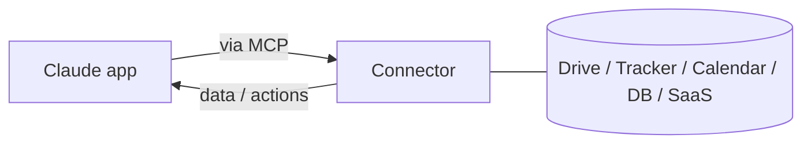

<LevelBadge level="intermediate" />

<VerifyNote lastVerified="2026-06-20" source="https://platform.claude.com/docs">
어떤 커넥터가 존재하는지와 요금제별 가용성은 자주 바뀝니다 — 현재 옵션은 앱/도움말 센터에서 확인하세요.
</VerifyNote>

**커넥터**를 사용하면 Claude 앱이 **채팅 바깥으로** — 여러분의 도구와 데이터(드라이브, 이슈 트래커, 캘린더, 데이터베이스 등)로 — 접근할 수 있어, Claude가 실제 시스템을 기반으로 답하고 그에 대해 작업할 수 있습니다. 내부적으로 이는 개방형 **[Model Context Protocol(MCP)](/docs/claude-code/mcp)**으로 구동됩니다.

## 커넥터가 하는 일

커넥터가 없으면 Claude는 대화에 담긴 내용만 알 수 있습니다. 커넥터가 있으면 (여러분의 허가 하에) 연결된 서비스에서 관련 정보를 가져올 수 있습니다 — 예를 들어 문서를 찾고, 최근 이슈를 읽고, 캘린더를 확인하고 — 이를 답변에 활용합니다.

## 동일한 표준, 어디서나

커넥터는 MCP의 **앱 대상** 형태입니다. 바로 그 동일한 프로토콜이 [Claude Code의 MCP](/docs/claude-code/mcp)와 [API의 MCP](/docs/api/mcp)를 구동합니다. 개념을 한 번 익히면 모든 표면에 적용됩니다.

## 설정 및 사용

1. 서비스를 **연결하세요**(지원되는 경우 OAuth로 인증).
2. **최소 권한을 부여하세요** — 작업에 필요한 접근 권한만.
3. **자연스럽게 요청하세요** — "내 3분기 기획 문서를 찾아서 리스크를 요약해 줘."

## 안전

:::warning 커넥터는 접근 권한 + (때로는) 작업 수행
- 신뢰하는 서비스와 범위만 인증하세요.
- 외부 소스에서 가져온 콘텐츠에는 [프롬프트 인젝션](/docs/security/prompt-injection)이 담겨 있을 수 있습니다 — 커넥터가 신뢰할 수 없는 자료를 읽을 때 주의하세요.
- 서드파티 커넥터를 활성화하기 전에 그것이 무엇을 할 수 있는지 검토하세요([서드파티 코드 검토](/docs/security/reviewing-third-party-code)).
:::

## 다음

- [Claude Code의 MCP 서버](/docs/claude-code/mcp)
- [MCP 및 도구 연결 (API)](/docs/api/mcp)
- [기존 도구 속 AI](/docs/claude-app/ai-in-your-tools)
