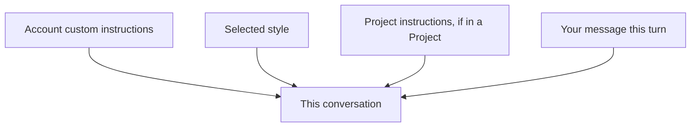

<LevelBadge level="beginner" />

<VerifyNote lastVerified="2026-06-20" source="https://www.anthropic.com">
Claude 앱에서 사용자 지정 지침과 스타일의 정확한 이름과 위치는 바뀝니다 — 앱/도움말 센터에서 확인하세요.
</VerifyNote>

매 채팅마다 "간결하게 해 줘"라거나 "나는 간호사니까 그에 맞게 설명해 줘"를 반복하기 지치셨나요? **사용자 지정 지침**과 **스타일**을 사용하면 기본값을 한 번 설정해 어디서나 적용되도록 할 수 있습니다.

## 사용자 지정 지침 = 여러분의 개인 시스템 프롬프트

고정된 사실과 선호 사항을 설정하세요 — 여러분이 누구인지, 무엇을 하는지, 어떤 답변을 좋아하는지 — 그러면 Claude가 대화 전반에 이를 적용합니다. 이는 [시스템 프롬프트](/docs/foundations/roles)의 소비자 앱 버전입니다(그리고 개발자를 위한 [CLAUDE.md](/docs/claude-code/claude-md)의 사촌 격입니다).

포함하면 좋은 것:
- **여러분에 대한 맥락**("나는 작은 빵집을 운영해요"; "나는 Python으로 코딩해요").
- **출력 선호도**("기본적으로 짧은 글머리 기호 답변으로"; "항상 추론 과정을 보여 줘").
- **확고한 규칙**("이모지 절대 쓰지 마"; "미터법 단위").

## 스타일 = 표현 프리셋

**스타일**은 어조/형식(간결, 격식, 설명형 등)을 바꾸며 대화마다 전환할 수 있습니다. 고정 지침을 다시 쓰지 않고 *이 채팅에 다른 목소리*를 원할 때 스타일을 사용하세요.

## 이들이 어떻게 쌓이는가

충돌이 있을 때는 더 구체적이거나 더 나중의 맥락이 우선하는 경향이 있습니다 — 따라서 [프로젝트](/docs/claude-app/projects)의 지침이나 메시지 속 명시적 요청이 전역 기본값을 무시할 수 있습니다. 의외의 결과를 피하려면 이들을 일관되게 유지하세요.

## 팁

- **지침을 짧고 진실되게 유지하세요** — CLAUDE.md와 마찬가지로, 비대함과 낡은 규칙은 해롭습니다.
- 사용자 지정 지침에 **비밀 정보를 넣지 마세요**.
- 필요가 바뀜에 따라 **가끔 다시 검토하세요**.

## 다음

- [시스템, 사용자, 어시스턴트 역할](/docs/foundations/roles)
- [Projects: 지속적인 작업 공간](/docs/claude-app/projects)
- [CLAUDE.md 및 메모리 파일](/docs/claude-code/claude-md)
