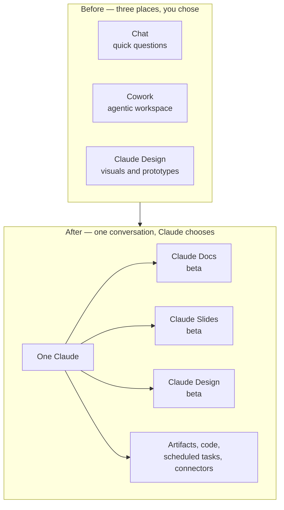

<LevelBadge level="beginner" />

<VerifyNote lastVerified="2026-09-25" source="https://claude.com/blog/cowork-is-now-claude">
**2026년 9월 16일**에 발표되었습니다. 통합된 경험은 웹, 데스크톱, 모바일에서 **Pro와 Max를 시작으로 점진적으로** 배포되고 있으며, 이어서 Team과 Free로 확대됩니다. Enterprise 조직에는 **최소 30일의 사전 통지**가 제공됩니다. Claude Docs, Claude Slides, Claude Design은 **유료 요금제에서 베타**입니다. 롤아웃이 단계적이기 때문에 같은 요금제의 두 계정이 같은 날 서로 다른 것을 볼 수 있습니다 — 여기 내용에 의존하기 전에 [헬프센터 문서](https://support.claude.com/en/articles/16761823-claude-cowork-and-chat-are-one-claude)에서 현재 상태를 확인하세요.
</VerifyNote>

**2026년 9월 16일**, Anthropic은 세 개의 제품을 하나로 합쳤습니다. 채팅, **Cowork**(에이전틱 워크스페이스), **Claude Design**은 더 이상 여러분이 골라야 하는 별개의 장소가 아닙니다. 이제 대화 입력창은 하나이고, 작업에 무엇이 필요한지는 Claude가 결정합니다.

공식 설명은 짧습니다: *"필요한 것을 Claude에게 요청하면, 어떤 도구를 쓸지 Claude가 결정할 수 있습니다."* 실질적인 결과는 더 길고, 이 페이지가 다루는 것이 바로 그것입니다 — 이런 통합은 설정을 이동시키고, 습관을 폐기시키며, 부딪혀보기 전까지는 제약이 드러나지 않는 두 개의 새로운 문서 도구를 함께 내놓기 때문입니다.

<Callout type="objectives" items={[
  "2026년 9월 16일에 실제로 무엇이 합쳐졌는지 이해하기 — 그리고 '고를 모드가 없다'는 것이 작업을 시작하는 방식을 어떻게 바꾸는지",
  "옮겨간 모든 설정 찾기: 전역 지침, 웹 검색, 리서치, 파일 저장소",
  "Claude Docs, Claude Slides, Claude Design, 일반 아티팩트, 다운로드한 .docx/.pptx 사이에서 올바르게 선택하기",
  "Claude Docs를 설계 의도대로 사용하기: 탭, 인라인 코멘트, @Claude 편집, 실시간 공동 작성",
  "발목을 잡을 여덟 가지 제약 파악하기 — 버전 이력 없음, 코멘트 전용 역할 없음, 갱신되지 않는 차트, 그리고 Docs가 아예 제공되지 않는 컴플라이언스 구성",
  "모든 것이 하나의 대화에서 실행되는 지금, 에이전틱 작업의 사용량 한도 비용을 예측하기"
]} />

## 무엇이 합쳐졌는가, 그림 하나로

가지고 있던 것이 버려지지는 않습니다. Anthropic에 따르면: *"기존 Cowork 작업, 프로젝트, 커넥터, 스킬, 아티팩트, 파일이 모두 이어지며, 그 Cowork 작업들은 이전과 똑같이 열려서 계속 이어서 작업할 수 있습니다."*

바뀌는 것은 **진입점**입니다. 이전에는 작업을 설명하기 전에 작업의 형태를 먼저 결정했습니다 — 질문이면 채팅, 프로젝트면 Cowork. 이제는 작업을 설명하면 Claude가 기계 장치를 고르며, 어떤 대화에서든 동일한 컨텍스트, 스킬, 커넥터를 사용할 수 있습니다.

## 모든 것이 어디로 옮겨갔는가

"내 버튼 어디 갔지" 혼란을 가장 많이 일으키는 부분이고, 제3자 기사가 전혀 다루지 않는 부분입니다. 네 가지가 이동했습니다:

| 쓰던 것 | 지금 있는 곳 |
| --- | --- |
| 전역 지침 | **설정 → 일반** |
| 웹 검색 토글 | **사라짐 — 자동입니다.** 검색 시점은 Claude가 결정 |
| 리서치 | **`/deep-research`** 입력, 또는 **`+`** 버튼 사용 |
| 내 파일 | **설정 → 저장소 폴더** |

<Callout type="warning" items={[
  "웹 검색 토글은 숨겨진 것이 아니라 제거되었습니다. 비공개 작업이나 오프라인 추론 작업을 위해 검색을 강제로 끄는 데 의존하던 워크플로가 있다면, 그 레버는 더 이상 UI에 존재하지 않습니다 — 대신 프롬프트에서 말하세요 ('대화 내용만으로 답하고, 웹을 검색하지 마')."
]} />

## 세 가지 템플릿: 실제로 원하는 건 어느 것인가?

통합과 함께 **Claude Docs**와 **Claude Slides**가 새 도구로 출시되었고, **Claude Design**이 대화 안으로 들어왔습니다. 세 가지 모두 *템플릿*입니다 — 별개의 앱이 아니라 아티팩트의 시작 형태입니다.

<Steps items={[
  {title: "Claude Docs — 살아있는 문서", body: "제목, 표, 기타 서식을 갖추고 하나 이상의 탭(노트북의 섹션처럼)을 가진, Claude 계정에 저장되는 리치 텍스트 문서. 여러분과 Claude와 동료들이 모두 같은 문서에 동시에 씁니다. Word (.docx), PDF, Markdown (.md), Google Docs로 내보냅니다. 문서 자체가 산출물이고 계속 바뀔 예정일 때 선택하세요."},
  {title: "Claude Slides — 프레젠테이션", body: "메모, 보고서, 또는 대화에서 이미 만든 작업물로부터 구성된 덱. 어떤 슬라이드든 직접 편집할 수 있고, Claude를 떠나지 않고 발표할 수 있으며, PowerPoint와 PDF로 내보낼 수 있습니다. 이미 만들어둔 자료에서 덱을 뽑아내야 할 때 선택하세요."},
  {title: "Claude Design — 비주얼과 프로토타입", body: "여러분의 디자인 시스템에 맞춰 만드는 비주얼, 목업, 프로토타입, 원페이저, 랜딩 페이지. .zip, PDF, PowerPoint, 또는 독립 실행형 HTML로 내보냅니다. 결과물이 시각적이거나 브랜드에 맞아야 할 때 선택하세요."},
  {title: "일반 아티팩트 — 코드, 앱, 차트", body: "Free를 포함한 모든 요금제에서 그대로 유지됩니다. 실행 가능한 미니 앱, 차트, 다이어그램, 스크립트. 읽히기보다 실행되어야 하는 것일 때 선택하세요. Artifacts를 참고하세요."},
  {title: "생성된 파일 — .docx / .pptx / .xlsx / .pdf", body: "Claude가 만들고 여러분이 다운로드하는 일회성 파일. 실시간 편집 서피스도, 공유도, 코멘트도 없습니다. 넘겨줄 파일이 필요하고 Claude 안에서 다시 건드리지 않을 때 선택하세요. Generating Real Files를 참고하세요."}
]} />

가장 중요한 구분은 마지막 두 개입니다: **Claude Doc은 URL과 협업자와 코멘트를 가진 살아있는 문서이고, 생성된 `.docx`는 다운로드입니다.** 통합 전에 "Word 문서"를 요청해서 파일을 받았다면, 지금 똑같이 요청하면 그 다음에 내보내야 하는 Doc을 받을 수도 있습니다 — 보통은 그게 원하던 것이지만, 공유 규칙이 다른 다른 종류의 객체입니다.

### 만드는 세 가지 방법

<Steps items={[
  {title: "어떤 대화에서든 요청하기", body: "평범한 말로 충분합니다 — '방금 정리한 계획을 팀과 공유할 수 있는 제품 스펙으로 만들어줘.' Claude가 시작 전에 몇 가지 질문을 하고, 화면에 문서 초안을 작성합니다."},
  {title: "템플릿을 명시적으로 선택하기", body: "메시지 입력창에서 Output을 선택하고 템플릿을 고르세요. Claude가 계속 원하는 것과 다른 형태를 고를 때 이 방법을 쓰세요."},
  {title: "Artifacts 탭에서 시작하기", body: "갤러리에서 템플릿을 고른 다음 Claude에게 지시하세요. 대화가 아니라 문서 자체가 목적일 때 유용합니다."}
]} />

<PromptCard title="첫 초안이 근접하도록 Claude Doc 브리핑하기">{`Create a Claude Doc: a one-page product spec for the export feature
we just designed.

Structure it in four tabs:
  1. Summary — problem, proposed solution, who it's for
  2. Requirements — numbered, testable, each with a rationale
  3. Open questions — things I still need to decide, with your
     recommendation and the tradeoff for each
  4. Rejected alternatives — what we considered and why not

Rules:
- Pull the decisions from this conversation. Do not invent
  requirements I did not state.
- Where I was vague, leave a comment asking me the question
  instead of guessing.
- Add a table comparing the three export formats we discussed.

Ask me anything you need before you start drafting.`}</PromptCard>

## Claude Docs 깊이 들여다보기

### 편집, 코멘트, 그리고 @Claude

세 가지 편집 경로가 공존하며, 그것이 이 도구의 핵심입니다:

- **직접 입력합니다.** 문서를 클릭해 들어가 타이핑하세요. 변경은 자동 저장됩니다.
- **요청합니다.** 대화로 변경을 요청하면 Claude가 편집하고 무엇을 왜 했는지 설명합니다.
- **코멘트를 남깁니다.** 텍스트를 선택해 협업자를 위한 코멘트를 남기세요 — 그리고 **코멘트에서 `@Claude`를 멘션하면 Claude가 그 자리에서 해당 편집을 수행합니다.** Claude는 스레드에 답하고, 변경을 적용하고, 설명합니다.

Claude는 또한 선택을 설명하거나 질문하기 위해 **초안 작성 중에 스스로 코멘트를 남깁니다**. 프롬프트를 이 동작에 맞춰 설계할 만한 가치가 있습니다: Claude에게 *추측하지 말고 코멘트로 물어보라*고 지시하면(위 프롬프트 카드처럼) 조용한 환각 위험이 여러분이 답할 수 있는 눈에 보이는 질문으로 바뀝니다.

Claude에게 문서에 **차트, 다이어그램, 그래프, 타임라인을 추가**하라고 요청할 수도 있습니다.

### 협업과 공유

편집 권한이 있는 사람들은 여러분과 Claude와 같은 문서를 동시에 작업하며, 모두의 편집이 실시간으로 나타납니다.

| | 뷰어 | 편집자 |
| --- | --- | --- |
| 읽기 | ✅ | ✅ |
| 편집 | ❌ | ✅ |
| 코멘트 | ❌ | ✅ |
| 내보내기 | ❌ | ✅ |

공유 규칙은 요금제별로 크게 다릅니다:

- **Pro / Max** — 링크를 가진 누구와도 공유 가능.
- **Team / Enterprise** — 특정 인물이나 그룹을 초대하거나, 조직 전체와 공유. **문서를 조직 외부와 공유할 수 없습니다** — 링크로도, 이메일 초대로도.
- **어느 경우든** — 공유된 문서를 열려면 Claude 계정이 필요하고, **문서 이름 변경이나 삭제는 소유자만 할 수 있습니다.**

### 어디서 쓸 수 있는가

Docs는 **웹, 데스크톱, Claude Code, 모바일**에서 작동합니다 — 하지만 **iOS와 Android 앱은 보기 전용**입니다: 휴대폰에서는 편집도, 템플릿 선택도 할 수 없습니다. 리뷰 루프가 모바일 중심이라면 이를 고려해 계획하세요.

## 발목을 잡을 제약들

하나하나 모두 문서화되어 있고, 하나하나 모두 첫째 주에 누군가를 놀라게 합니다.

<Steps items={[
  {title: "아직 버전 이력이 없다", body: "문서의 이전 상태를 보거나 복원할 방법이 없습니다. 편집 권한이 있는 누구나 무엇이든 덮어쓸 수 있고, 복구 수단은 미리 받아둔 내보내기 파일뿐입니다. 중요한 문서라면 이력 기능이 나오기 전까지 마일스톤마다 Markdown으로 내보내세요."},
  {title: "코멘트 전용 접근 수준이 없다", body: "역할은 뷰어와 편집자뿐이고 그 사이는 없습니다. 코멘트는 해야 하지만 편집은 안 되는 리뷰어는 권한으로서 존재하지 않습니다 — 편집 권한을 주고 신뢰에 맡기거나, 보기 권한을 주고 피드백은 다른 곳에서 모으세요."},
  {title: "차트와 다이어그램은 자동으로 갱신되지 않는다", body: "Claude가 추가한 차트는 스냅샷입니다. 문서의 기반 수치를 바꿔도 차트는 Claude에게 다시 만들어달라고 요청할 때까지 예전 값을 계속 보여줍니다. 모든 시각 자료는 다시 요청하기 전까지 낡은 것으로 취급하세요."},
  {title: "Team과 Enterprise는 외부 공유가 불가능하다", body: "조직 외부로는 링크 공유도, 이메일 초대도 없습니다. 고객에게 문서를 보내야 한다면 내보낸 다음(Word, PDF, Markdown, Google Docs) 그 파일을 보내세요."},
  {title: "모바일은 보기 전용이다", body: "iOS와 Android는 문서를 읽을 수 있습니다. 편집하거나 템플릿을 고를 수는 없습니다."},
  {title: "CMEK, ZDR, HIPAA 환경에서는 제공되지 않는다", body: "Claude Docs는 고객 관리 암호화 키, 제로 데이터 보존, 또는 HIPAA로 구성된 조직에서는 사용할 수 없습니다. 규제 산업 팀에게는 이것이 가장 중요한 사실이며, 롤아웃 지연이 아니라 — 제외입니다."},
  {title: "아직 Compliance API에 없다", body: "문서 내부의 활동은 Compliance API에 기록되지 않습니다. 감사 태세가 그 내보내기에 의존한다면, 문서 활동은 현재 사각지대입니다."},
  {title: "Enterprise는 꺼진 상태로 시작한다", body: "Enterprise 요금제에서는 소유자가 조직 설정에서 각각을 켜기 전까지 템플릿이 꺼져 있습니다. Pro, Max, Team에서는 기본적으로 켜져 있습니다."}
]} />

### 통합된 경험에서 아직 지원되지 않는 것들

통합 경험은 아직 **GitHub 연동("Add from GitHub")**, **대화 브랜칭**, **과거 Cowork 작업 전체 검색**, **Dispatch**(기존 사용자만), **파일 및 코드 생성용 시크릿 채팅**을 지원하지 않습니다. 워크플로가 브랜칭이나 Cowork 이력 검색에 기대고 있다면, 그 기능은 일시적으로 사라진 것입니다 — 옮겨진 것이 아닙니다.

## 비용은 얼마인가

별도 가격은 없습니다. 관련된 문장은 *사용량 한도*에 관한 것입니다: *"Claude로 하는 모든 것이 요금제의 사용량 한도에 계산됩니다. 웹을 검색하고, 코드를 실행하고, 파일을 만드는 긴 에이전틱 작업은 일반적으로 간단한 질문보다 더 많이 사용합니다."* Claude Docs도 같은 방식으로 계산됩니다.

통합은 이 문제를 들리는 것보다 더 날카롭게 만듭니다. 이전에는 Cowork를 여는 것이 의도적인 행위였습니다 — 비싼 작업을 시작한다는 것을 알고 있었죠. 이제는 같은 입력창에 무심하게 표현한 요청 하나가 검색하고 코드를 실행하고 파일을 쓰는 긴 에이전틱 실행을 촉발할 수 있습니다. **비용 신호가 문 앞에서 프롬프트로 옮겨갔습니다.** 한도가 중요한 요금제라면, 원하는 것을 명시적으로 말하세요:

<PromptCard title="답만 원할 때 요청을 저렴하게 유지하기">{`Answer from this conversation only. Do not search the web, do not
run code, and do not create any files or artifacts. Two paragraphs.`}</PromptCard>

그리고 반대로, 전체 기계 장치를 정말 원할 때:

<PromptCard title="의도적으로 비싼 버전을 요청하기">{`Take this as a full task, not a chat answer.

Research the three vendors below, check their current pricing pages,
build a comparison spreadsheet, and turn the recommendation into a
Claude Doc I can share with the team. Cite every figure with a link
and the date you read it.

Vendors: [A], [B], [C]`}</PromptCard>

## 자신의 습관 이전하기

<Steps items={[
  {title: "전역 지침을 새 집으로 옮기기", body: "설정 → 일반으로 이동했습니다. 한 번 열어서 다시 읽어보세요: 채팅 전용 Claude를 위해 쓴 지침('웹을 브라우징할 수 없음', '오래 걸리는 일은 하기 전에 물어볼 것')은 이제 통합된 동작과 능동적으로 충돌할 수 있습니다."},
  {title: "웹 검색 토글을 찾는 습관 버리기", body: "사라졌습니다. 검색 의도를 프롬프트에 넣으세요 — '현재 출처를 확인해' 또는 '검색하지 마'."},
  {title: "리서치를 다시 배우기", body: "/deep-research를 입력하거나 + 버튼을 쓰세요. 이제는 모드가 아니라 명령입니다."},
  {title: "Cowork가 별개라고 가정한 모든 것을 점검하기", body: "예약 작업, 커넥터, 스킬은 그대로 이어졌지만, '이건 Cowork 작업이야'라고 말해서 더 열심히 일하라는 신호를 주던 프롬프트는 더 이상 아무것도 신호하지 않습니다. 그 표현을 위 프롬프트 카드처럼 명시적인 범위 지정으로 대체하세요."},
  {title: "Docs 내보내기 주기 결정하기", body: "버전 이력이 나오기 전까지는 마일스톤 리듬을 정하세요 — 잃으면 속상할 상태에 도달할 때마다 Markdown으로 내보내세요."}
]} />

## 알아둘 만한 용어

<Flashcards cards={[
  {front: "One Claude", back: "채팅, Cowork, Claude Design을 고를 모드가 없는 단일 대화 경험으로 통합한 2026년 9월 16일의 변화. 작업에 어떤 도구가 필요한지는 Claude가 결정합니다."},
  {front: "템플릿 (Docs / Slides / Design)", back: "별개의 앱이 아니라 아티팩트의 시작 형태. 유료 요금제에서 베타이며, Pro, Max, Team에서는 기본적으로 켜져 있고, Enterprise에서는 소유자가 활성화할 때까지 꺼져 있습니다."},
  {front: "Claude Doc", back: "Claude 계정에 저장되는 리치 텍스트 멀티탭 살아있는 문서로, 여러분과 Claude와 협업자가 실시간으로 공동 편집합니다. Word, PDF, Markdown, Google Docs로 내보냅니다."},
  {front: "탭 (Doc 안의)", back: "노트북의 섹션처럼 문서의 한 섹션. 하나의 문서가 여러 개를 담을 수 있습니다 — 스펙을 요약, 요구사항, 미해결 질문으로 나누는 데 유용합니다."},
  {front: "@Claude 코멘트", back: "문서 코멘트에서 Claude를 멘션해 그 자리에서 해당 편집을 수행하게 하고, 스레드에 답하고, 무엇을 바꿨는지 설명하게 하는 것."},
  {front: "뷰어 대 편집자", back: "유일한 두 가지 접근 수준. 뷰어는 읽습니다. 편집자는 읽고, 편집하고, 코멘트하고, 내보냅니다. 코멘트 전용 역할은 없습니다."},
  {front: "Output 버튼", back: "Claude가 형태를 골라주는 것을 원하지 않을 때, 템플릿을 명시적으로 선택하기 위한 메시지 입력창의 컨트롤."},
  {front: "Doc 대 생성된 파일", back: "Doc은 URL과 협업자와 코멘트를 가진 살아있는 문서입니다. 생성된 .docx/.pptx/.xlsx는 그런 것이 전혀 없는 일회성 다운로드입니다."}
]} />

## 퀴즈

<Quiz questions={[
  {q: "여러분의 조직은 제로 데이터 보존(ZDR)으로 Enterprise에서 Claude를 운영합니다. 팀이 Claude Docs에서 스펙 초안을 작성하기 시작하려고 합니다. 어떻게 되나요?", options: ["소유자가 조직 설정에서 템플릿을 활성화하면 작동합니다", "작동하지만 문서가 30일 후에 삭제됩니다", "Claude Docs를 사용할 수 없습니다 — ZDR, CMEK, HIPAA 구성은 제외됩니다", "보기 전용 모드로 작동합니다"], answer: 2, explain: "Claude Docs는 CMEK, ZDR, HIPAA 구성을 사용하는 조직에서는 제공되지 않습니다. 롤아웃 지연이 아니라 제외이므로, 어떤 관리자 토글로도 해결되지 않습니다. 그런 구성 아래의 팀에는 다른 초안 작성 서피스가 필요합니다."},
  {q: "Q3 수치 표에서 Claude Doc에 차트를 추가했습니다. 그 후 동료가 표의 두 수치를 수정합니다. 차트는 무엇을 보여줄까요?", options: ["수정된 수치, 실시간으로 갱신됨", "문서를 다시 로드하면 수정된 수치", "Claude에게 차트를 다시 만들어달라고 요청할 때까지 예전 수치", "불일치를 표시하는 오류 상태"], answer: 2, explain: "차트와 다이어그램은 자동으로 갱신되지 않습니다 — 각각은 생성될 때 찍힌 스냅샷입니다. 문서의 모든 시각 자료는 현재 데이터로 다시 만들어달라고 명시적으로 요청할 때까지 낡은 것으로 취급하세요."},
  {q: "Team 요금제를 쓰고 있고 완성된 스펙을 외부 고객에게 보내야 합니다. 지원되는 경로는 무엇인가요?", options: ["문서 링크를 공유 — 링크 공유는 모든 유료 요금제에서 작동합니다", "문서의 공유 대화상자에서 고객을 이메일로 초대", "문서를 Word, PDF, Markdown 또는 Google Docs로 내보내서 그 파일을 보내기", "먼저 문서를 Pro 계정으로 옮기기"], answer: 2, explain: "Team과 Enterprise 요금제에서는 문서를 링크로도 이메일 초대로도 조직 외부와 공유할 수 없습니다. 링크를 가진 누구나 공유는 Pro/Max 동작입니다. 외부 수신자를 위한 지원 경로는 내보내기입니다."},
  {q: "통합 이후 웹 검색에 대해 참인 것은 무엇인가요?", options: ["토글이 설정 → 일반으로 이동했습니다", "토글이 + 버튼 뒤로 이동했습니다", "토글이 제거되었습니다 — 검색은 자동이므로 프롬프트에서 조정합니다", "이제 모든 요금제에서 검색이 기본적으로 꺼져 있습니다"], answer: 2, explain: "웹 검색 토글은 이동한 것이 아니라 제거되었습니다. 검색 시점은 Claude가 결정합니다. 전역 지침은 설정 → 일반으로 이동했고 리서치는 /deep-research 또는 + 버튼으로 옮겨갔지만, 검색은 이제 프롬프트에서 조정합니다 ('현재 출처를 확인해' 또는 '검색하지 마')."}
]} />

<Callout type="takeaways" items={[
  "하나의 대화, 고를 모드 없음: 비용 신호가 문 앞(Cowork를 여는 것)에서 프롬프트로 옮겨갔습니다. 저렴한 답을 원할 때와 완전한 에이전틱 실행을 원할 때를 명시적으로 말하세요.",
  "네 가지가 이동했습니다: 전역 지침 → 설정 → 일반, 웹 검색 → 자동, 프롬프트에서 조정, 리서치 → /deep-research 또는 +, 파일 → 설정 → 저장소 폴더.",
  "Claude Doc은 협업자와 코멘트를 가진 살아있는 문서이고, 생성된 .docx는 다운로드입니다. 의도적으로 선택하세요 — 공유 규칙이 완전히 다릅니다.",
  "Claude의 코멘트를 중심으로 프롬프트를 설계하세요: 추측하지 말고 코멘트로 물어보라고 지시하면, 창작이 눈에 보이는 질문으로 바뀝니다.",
  "두 가지 제약은 오늘 당장 우회책이 필요합니다: 버전 이력 없음(마일스톤마다 Markdown으로 내보내기)과 절대 갱신되지 않는 차트(데이터 변경마다 다시 생성).",
  "규제 산업 팀: Claude Docs는 CMEK, ZDR, HIPAA 환경에서 제공되지 않으며, 문서 활동은 아직 Compliance API에 없습니다."
]} />

## 출처 및 더 읽을 거리

- Anthropic — [Claude Cowork and chat are now one Claude](https://claude.com/blog/cowork-is-now-claude) (발표, 2026년 9월 16일)
- Anthropic 헬프센터 — [Claude Cowork and chat are one Claude](https://support.claude.com/en/articles/16761823-claude-cowork-and-chat-are-one-claude) (롤아웃, 이동 내역, 이어진 것, 현재 공백)
- Anthropic 헬프센터 — [Get started with Claude Docs](https://support.claude.com/en/articles/16923645-get-started-with-claude-docs) (생성, 탭, 코멘트, 공유 매트릭스, 내보내기, 제약)
- Anthropic 헬프센터 — [What are artifacts and how do I use them?](https://support.claude.com/en/articles/17153992-what-are-artifacts-and-how-do-i-use-them) (세 가지 템플릿과 요금제별 제공 여부)
- AILmanac 관련 문서: [Artifacts](/docs/claude-app/artifacts) · [Cowork 예약 작업](/docs/claude-app/cowork-scheduled-tasks) · [실제 파일 생성하기](/docs/claude-app/generating-files) · [프로젝트](/docs/claude-app/projects) · [요금제, 한도 및 결제](/docs/claude-app/plans-and-billing)

## 다음

- [Artifacts: 살아있고 실행 가능한 결과물](/docs/claude-app/artifacts) — 세 가지 템플릿이 모두 렌더링되는 컨테이너
- [Cowork 예약 작업](/docs/claude-app/cowork-scheduled-tasks) — 온전히 이어진 반복 작업 기계 장치
- [실제 파일 생성하기 (docx/pptx/xlsx/pdf)](/docs/claude-app/generating-files) — 살아있는 문서가 아니라 다운로드를 원할 때
