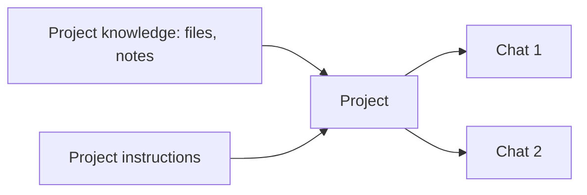

<LevelBadge level="beginner" />

<VerifyNote lastVerified="2026-06-20" source="https://www.anthropic.com">
Project 기능과 한도는 요금제에 따라 다르며 바뀝니다 — 현재 동작은 앱/도움말 센터에서 확인하세요.
</VerifyNote>

**Project**는 Claude.ai 안에서 **자체 파일, 지식, 지침**을 한데 묶는 전용 작업 공간입니다. 매 채팅마다 같은 문서를 다시 업로드하고 맥락을 다시 설명하는 대신, 한 번만 설정해 두면 — Project 안의 모든 대화가 이미 정보를 갖춘 상태로 시작됩니다.

## Project를 사용하는 이유

- **근거 있는 답변.** 여러분의 문서(핸드북, 명세, 메모)를 추가하면 Claude가 *그것을 바탕으로* 답합니다 — 코드가 필요 없는 내장형 [RAG](/docs/foundations/rag)의 한 형태입니다.
- **지속적인 맥락.** Project 지침은 그 안의 모든 것에 적용되는 범위 한정 [시스템 프롬프트](/docs/foundations/roles)처럼 작동합니다.
- **체계적.** 하나의 주제/고객/이니셔티브에 관한 모든 채팅이 함께 모여 있습니다.

## 하나 설정하기

1. **Project를 만들고** 명확한 목적을 부여하세요.
2. **지식을 추가하세요** — 항상 알고 있어야 할 파일/텍스트.
3. **Project 지침을 작성하세요** — 역할, 규칙, 해야 할 것/피해야 할 것.
4. **채팅을 시작하세요** — 모든 대화가 그 지식 + 지침을 물려받습니다.

## 훌륭한 활용 사례

- **고객/계정** 작업 공간(그들의 문서 + 여러분의 메모).
- Q&A를 위한 **코드베이스 또는 제품** 지식 베이스.
- 여러분의 스타일 가이드와 과거 작업물이 담긴 **글쓰기 프로젝트**(그래서 초안이 여러분의 목소리에 맞도록).
- 강의 계획서와 자료를 올려 둔, 특정 과정을 위한 **학습**.

## 팁

- **지식을 선별하세요** — 관련성 있고 최신인 파일이 모든 것을 쏟아붓는 것보다 낫습니다(노이즈는 검색 품질을 해칩니다).
- **지침을 간결하고 진실되게 유지하세요**([사용자 지정 지침](/docs/claude-app/custom-instructions)과 같은 규칙).
- 저장하기 꺼려지는 **민감한 데이터는 추가하지 마세요** — [개인정보 보호](/docs/foundations/privacy)를 참고하세요.

## 다음

- [사용자 지정 지침 및 스타일](/docs/claude-app/custom-instructions)
- [채팅 간 메모리](/docs/claude-app/memory)
- [검색 증강 생성 (RAG)](/docs/foundations/rag)
