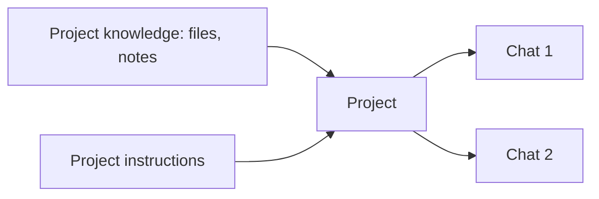

<LevelBadge level="beginner" />

<VerifyNote lastVerified="2026-09-23" source="https://claude.com/blog/projects-redesigned">
프로젝트 기능과 한도는 요금제에 따라 다르고 변경됩니다 — 현재 동작은 앱이나 헬프센터에서 확인하세요. **새로 설계된 프로젝트**(병렬 스레드에 작업을 위임하는 코디네이터)가 2026년 9월 17일 Claude Code에서 베타로 들어갔고, 이후 Claude의 나머지 영역과 Team/Enterprise 요금제로 확대될 예정입니다. 이 페이지는 대부분의 계정이 여전히 사용하는 지식 베이스형 프로젝트를 설명합니다.
</VerifyNote>

**프로젝트**는 Claude.ai의 전용 워크스페이스로, **자체 파일, 지식, 지침**을 하나로 묶습니다. 채팅마다 같은 문서를 다시 업로드하고 맥락을 다시 설명하는 대신, 한 번만 설정해두면 — 프로젝트 안의 모든 대화가 이미 정보를 아는 상태로 시작합니다.

<Callout type="objectives" items={[
  "프로젝트가 무엇을 묶어주는지, 그리고 그것이 채팅마다 맥락을 다시 붙여넣는 것보다 왜 나은지",
  "네 단계 설정, 그리고 사람들이 건너뛰는 한 단계",
  "검색 품질을 날카롭게 유지하기 위해 프로젝트 지식을 큐레이션하는 방법",
  "이 프로젝트가 Claude Code의 코디네이터-스레드 방식 프로젝트와 어떻게 다른지"
]} />

## 프로젝트를 쓰는 이유

- **근거 있는 답.** 문서(핸드북, 스펙, 메모)를 추가하면 Claude가 *그것들로부터* 답합니다 — 코드 없이 내장된 형태의 [RAG](/docs/foundations/rag)입니다.
- **지속되는 맥락.** 프로젝트 지침은 그 안의 모든 것에 적용되는 범위 한정 [시스템 프롬프트](/docs/foundations/roles)처럼 작동합니다.
- **정리됨.** 하나의 주제/고객/이니셔티브에 관한 모든 채팅이 한곳에 모여 있습니다.

## 하나 설정하기

<Steps items={[
  {title: "명확한 목적을 가진 프로젝트를 만들라", body: "주제, 고객, 또는 이니셔티브마다 프로젝트 하나. 서로 무관한 세 가지를 다루는 프로젝트는 그 셋 모두에 대해 검색이 형편없습니다."},
  {title: "지식을 추가하라", body: "항상 알고 있어야 하는 파일과 텍스트 — 핸드북, 스펙, 스타일 가이드. Claude가 여기서 답을 끌어옵니다."},
  {title: "프로젝트 지침을 작성하라", body: "사람들이 건너뛰는 단계. 역할, 관례, 해야 할 것과 피해야 할 것. 이것이 없으면 동료가 아니라 검색 인덱스를 가진 셈입니다."},
  {title: "채팅을 시작하라", body: "프로젝트 안의 모든 대화가 지식과 지침을 자동으로 물려받습니다."}
]} />

```mermaid
flowchart LR
  K[Project knowledge: files, notes] --> P[Project]
  I[Project instructions] --> P
  P --> C1[Chat 1]
  P --> C2[Chat 2]
```

## 좋은 활용 사례

- **고객/어카운트** 워크스페이스 (고객 문서 + 내 메모).
- Q&A용 **코드베이스 또는 제품** 지식 베이스.
- 스타일 가이드와 과거 원고를 담은 **글쓰기 프로젝트** (초안이 내 목소리에 맞도록).
- 강의계획서와 자료를 올려둔 강좌 **학습**용.

## 프로젝트 지침의 출발점

<PromptCard title="프로젝트 지침 골격">{`You are helping with [project/client name].

Context: [what this project is, who it serves, current stage]

Always:
- Answer from the project knowledge first; say so when you are going beyond it.
- Use [our terminology: list the 3-5 terms that matter].
- Match the tone in [named file in the knowledge base].

Never:
- Invent figures, dates, or quotes. If it is not in the knowledge, say it is not in the knowledge.
- [Project-specific constraint: e.g. reference the deprecated v1 API.]`}</PromptCard>

## 팁

- **지식을 큐레이션하세요** — 관련성 있고 최신인 파일이 전부 쏟아붓는 것보다 낫습니다 (노이즈는 검색을 해칩니다).
- **지침은 간결하고 사실에 맞게 유지하세요** ([커스텀 지침](/docs/claude-app/custom-instructions)과 같은 규칙입니다).
- **상황이 바뀌면 정리하세요.** 대체된 스펙을 지식 베이스에 남겨두는 것은 스펙이 없는 것보다 나쁩니다. Claude에게는 그것이 새 스펙과의 논쟁에서 졌다는 것을 알 방법이 없기 때문입니다.
- **저장하기 꺼림칙한 민감 데이터는 추가하지 마세요** — [프라이버시](/docs/foundations/privacy)를 참고하세요.

## "프로젝트"라고 불리는 두 가지

둘은 진짜로 다른 제품이고, 롤아웃 기간 동안 이름이 겹칩니다:

| | 이 프로젝트 (Claude.ai) | [Claude Code 프로젝트](/docs/claude-code/projects-coordinator-threads) |
|---|---|---|
| 무엇인가 | 지식 + 지침을 갖춘 워크스페이스 | 병렬 스레드에 위임하는 코디네이터 |
| 무엇을 하는가 | *내* 채팅을 *내* 파일에 근거시킴 | 작업을 범위 지정하고, 쪼개고, 실행해줌 |
| 코드를 실행하나? | 아니요 | 예 — 각 스레드가 자체 브랜치의 클라우드 세션 |
| 누가 쓸 수 있나 | 널리 제공됨 | 베타, 출시 시점에는 선별된 Pro/Max Claude Code 사용자 |

코디네이터, 스레드, 풀 리퀘스트에 관한 글을 읽고 있다면, 그것은 Claude Code 쪽입니다.

<Quiz questions={[
  {
    q: "프로젝트 지침은 무엇처럼 작동하나요?",
    options: [
      "첫 채팅에서의 일회성 메시지",
      "프로젝트 내 모든 채팅에 적용되는 범위 한정 시스템 프롬프트",
      "Claude로부터 파일을 숨기는 필터",
      "Claude가 스스로를 위해 작성하는 요약"
    ],
    answer: 1,
    explain: "프로젝트 지침은 프로젝트에 범위가 한정된 시스템 프롬프트처럼 동작합니다. 그래서 그 안의 모든 대화가 여러분이 다시 말하지 않아도 같은 역할과 관례를 물려받습니다."
  },
  {
    q: "사용할 수 있는 모든 파일을 프로젝트 지식에 쏟아붓는 것이 왜 해로운가요?",
    options: [
      "Claude가 파일당 요금을 부과합니다",
      "파일이 정해진 채팅 횟수 후에 만료됩니다",
      "관련 없고 낡은 자료가 검색 품질을 떨어뜨리는 노이즈를 더합니다",
      "첫 번째 파일만 읽힙니다"
    ],
    answer: 2,
    explain: "프로젝트 지식은 검색 대상이므로 양보다 관련성이 중요합니다. 대체된 문서가 최악의 경우입니다 — 여러분이 제거하거나 표시해두지 않으면 Claude는 새 파일이 오래된 파일을 무효화한다는 것을 알 수 없습니다."
  }
]} />

<Callout type="takeaways" items={[
  "프로젝트는 지식과 지침을 함께 묶어서, 그 안의 모든 채팅이 정보를 아는 상태로 시작하게 합니다.",
  "지침은 사람들이 건너뛰는 단계입니다 — 그것이 없으면 동료가 아니라 검색을 가진 셈입니다.",
  "큐레이션하고 정리하세요: 대체된 파일은 단순히 노이즈를 더하는 게 아니라 능동적으로 잘못된 길로 이끕니다.",
  "Claude Code의 코디네이터-스레드 방식 프로젝트는 이름만 공유하는 다른 제품입니다."
]} />

## 다음

- [커스텀 지침 및 스타일](/docs/claude-app/custom-instructions)
- [채팅 간 메모리](/docs/claude-app/memory)
- [검색 증강 생성 (RAG)](/docs/foundations/rag)
