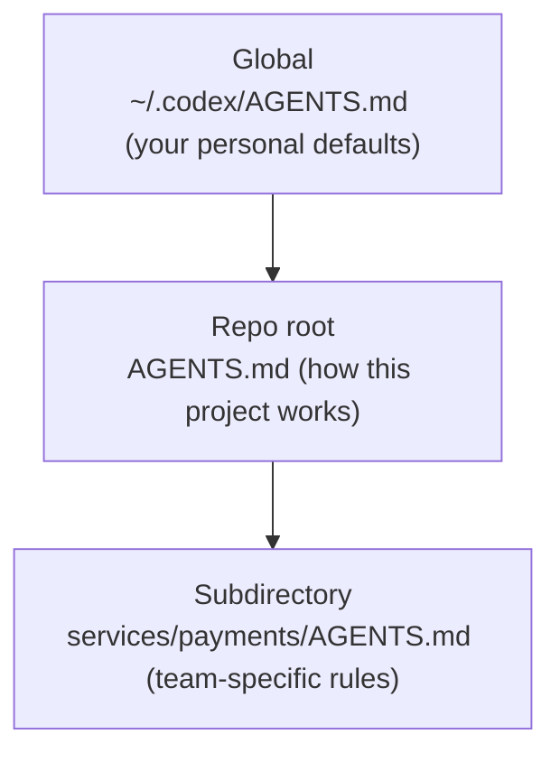

<LevelBadge level="intermediate" />

<VerifyNote lastVerified="2026-06-27" source="https://agents.md/">
AGENTS.md 채택 도구 목록과 Claude Code의 import/심볼릭 링크 동작은 빠르게 진화합니다 — 구체적인 내용은 공식 AGENTS.md 사이트와 Claude Code 메모리 문서에서 확인하세요.
</VerifyNote>

이미 [CLAUDE.md](/docs/claude-code/claude-md) — Claude Code의 프로젝트 브리핑 — 를 알고 계실 겁니다. 하지만 여러분의 저장소는 아마도 *둘 이상*의 에이전트가 다룰 것입니다: 동료는 Codex를 돌리고, CI는 코딩 봇을 쓰며, 누군가는 Cursor에서 저장소를 엽니다. `AGENTS.md`는 이런 도구들이 읽기로 합의한 개방형 표준이므로, 도구마다 다른 파일을 관리하는 대신 프로젝트의 지침을 **한 번만** 작성하면 됩니다.

<Callout type="objectives" items={["AGENTS.md가 무엇이고 누가 관리하는가", "Claude Code가 AGENTS.md가 아닌 CLAUDE.md를 읽는 이유", "여러 도구에 걸쳐 단일 진실 공급원을 유지하는 세 가지 신뢰할 수 있는 방법", "중첩된 그리고 전역 AGENTS.md 파일이 어떻게 병합되는가", "파일에 무엇을 담아야 하는가 — 그리고 무엇을 빼야 하는가"]} />

## AGENTS.md란

`AGENTS.md`는 저장소 루트에 있는 평범한 Markdown 파일입니다 — **사람이 아니라 에이전트를 위해 쓴 README**라고 생각하세요. 코딩 에이전트에게 프로젝트를 빌드하고, 테스트하고, 기여하는 방법을 알려줍니다. 이 형식에는 필수 필드가 없습니다: 에이전트는 그저 산문을 읽을 뿐입니다.

이는 **리눅스 재단(Linux Foundation) 산하 Agentic AI Foundation(AAIF)**이 관리하는 개방형 표준이며, 2026년 중반 기준으로 6만 개 이상의 오픈소스 프로젝트에서 사용되고 30개 이상의 도구가 읽습니다 — OpenAI Codex, Google의 Jules와 Gemini CLI, Cursor, Windsurf, Devin, Zed, Warp, Aider, goose, Amp, 그리고 GitHub Copilot의 코딩 에이전트를 포함해서요.

<Callout type="info" items={["AGENTS.md는 런타임이 아니라 관례입니다: 각 도구가 파일을 어떻게 발견하고, 병합하고, 주입할지 스스로 결정합니다.", "강제되는 스키마가 없습니다 — 명확한 산문이 경직된 구조를 이깁니다.", "README를 보완하지, 대체하지는 않습니다."]} />

## Claude Code의 함정

사람들이 흔히 걸려 넘어지는 부분이 여기입니다: **Claude Code는 `AGENTS.md`가 아니라 `CLAUDE.md`를 읽습니다.** 저장소에 `AGENTS.md`만 있다면 Claude Code는 기본적으로 그것을 무시합니다. 이는 버그가 아닙니다 — 표준보다 먼저 생겼습니다 — 하지만 여러 도구를 쓰는 저장소에는 의도적인 동기화 전략이 필요하다는 뜻이며, 그렇지 않으면 지침이 조용히 서로 어긋나 버립니다.

<Callout type="warning" items={["Claude Code가 AGENTS.md로 폴백할 것이라고 가정하지 마세요 — 자동으로 읽지 않습니다.", "손으로 관리하는 두 파일(CLAUDE.md와 AGENTS.md)은 서로 어긋나게 됩니다. 단일 진실 공급원 하나를 고르세요.", "어떤 폴백 주장에 의존하기 전에 공식 메모리 문서에서 현재 동작을 확인하세요."]} />

## 단일 진실 공급원을 유지하라

세 가지 패턴이 내용을 중복하지 않으면서 CLAUDE.md와 AGENTS.md를 동기화 상태로 유지해 줍니다. 팀의 플랫폼에 맞춰 고르세요.

<Steps items={[{title: "심볼릭 링크 (가장 단순함)", body: "CLAUDE.md를 AGENTS.md에 대한 심볼릭 링크로 만드세요. Claude Code는 심볼릭 링크를 따라가 대상 파일을 바이트 단위 그대로 읽습니다 — 실제 파일은 하나, 병합 로직은 전혀 없습니다. 주의: Windows에서는 심볼릭 링크 생성에 개발자 모드나 관리자 권한이 필요하므로, 크로스 플랫폼 팀은 import 방식을 선호할 수 있습니다."}, {title: "@import (크로스 플랫폼)", body: "유일한 역할이 @AGENTS.md import로 표준 파일을 끌어오는 것뿐인, 아주 작은 CLAUDE.md를 두세요. Claude Code는 시작 시 import한 파일을 컨텍스트로 확장하므로, AGENTS.md가 단일 공급원으로 남고 Windows에서 깨질 심볼릭 링크도 없습니다."}, {title: "/init (마이그레이션)", body: "이미 AGENTS.md(또는 .cursorrules / .windsurfrules)가 있는 저장소에서 Claude Code를 부트스트랩하나요? /init을 실행하세요 — 그 파일들을 읽어 관련 부분을 생성된 CLAUDE.md로 접어 넣습니다."}]} />

<PromptCard title="공유 표준에 CLAUDE.md 심볼릭 링크하기 (macOS / Linux)">{`ln -s AGENTS.md CLAUDE.md`}</PromptCard>

<PromptCard title="또는 그것을 import하는 한 줄짜리 CLAUDE.md를 유지하기">{`@AGENTS.md`}</PromptCard>

<Callout type="tip" items={["팀 전체가 macOS/Linux를 쓴다면 심볼릭 링크하세요 — 관리할 것이 가장 적습니다.", "Windows 기여자가 섞여 있다면 @import를 쓰세요.", "어느 쪽을 고르든 커밋하여 팀 전체가 동일한 동작을 얻게 하세요."]} />

## 중첩된 그리고 전역 파일이 어떻게 병합되는가

더 풍부한 에이전트들은 AGENTS.md를 계층적으로 다룹니다 — [CLAUDE.md 메모리 계층 구조](/docs/claude-code/claude-md)와 동일한 사고 모델입니다. 예를 들어 Codex는 홈 디렉터리의 전역 파일에서 시작해 Git 루트를 거쳐 현재 폴더까지 내려가며, 진행하면서 이어 붙입니다:

작업에 더 가까운 파일이 이깁니다. **마지막에** 이어 붙여져 앞선 지침을 덮어쓰기 때문입니다. 그래서 `services/payments/AGENTS.md`는 저장소 루트 지침을 상속받으면서 그 서비스 내부에만 적용되는 규칙을 더합니다 — 전문화된 지침은 전문화된 코드에 최대한 가깝게 내려놓으세요.

<Flashcards title="상호운용성 한눈에 보기" cards={[{front: "AGENTS.md는 누가 읽나요?", back: "30개 이상의 도구 — Codex, Cursor, Windsurf, Devin, Zed, Gemini CLI, Copilot의 코딩 에이전트 등. 기본적으로 Claude Code는 읽지 않습니다."}, {front: "CLAUDE.md는 누가 읽나요?", back: "Claude Code — 오직 Claude Code뿐입니다. AGENTS.md를 자동으로 읽지 않습니다."}, {front: "Mac/Linux 팀을 위한 최선의 동기화", back: "CLAUDE.md → AGENTS.md 심볼릭 링크. 실제 파일 하나, 어긋남 없음."}, {front: "Windows 기여자가 있을 때의 최선의 동기화", back: "@AGENTS.md를 담은 한 줄짜리 CLAUDE.md — 심볼릭 링크 불필요."}, {front: "중첩 파일의 병합 순서", back: "전역 → 저장소 루트 → 하위 디렉터리. 작업에 더 가까운 파일이 덮어씁니다, 마지막에 이어 붙여지기 때문입니다."}]} />

## 무엇을 담아야 하는가

좋은 CLAUDE.md와 같은 규율입니다 — 표준은 그저 몇 가지 흔한 섹션을 제안할 뿐입니다:

- **프로젝트 개요** — 이것이 무엇인지, 두 문장으로.
- **빌드 & 테스트 명령** — 실행, 테스트, 린트하는 방법.
- **코드 스타일** — 에이전트가 추론할 수 없는 관례.
- **테스트 지침** — "완료"가 무엇을 의미하는지.
- **보안 고려사항** — 절대 건드리거나 커밋하면 안 되는 것.
- **커밋 / PR 가이드라인** — 메시지 형식, 브랜치 규칙.

<Callout type="warning" items={["에이전트는 파일을 글자 그대로 따릅니다 — 오래되거나 희망사항에 불과한 지침은 CLAUDE.md와 똑같이 적극적으로 해를 끼칩니다.", "짧고 진실하게 유지하세요; 프로젝트가 오늘 어떻게 동작하는지 기술하세요.", "비밀 정보를 절대 커밋하지 마세요; 큰 문서는 붙여 넣는 대신 참조하세요."]} />

## 스스로 확인하기

<Quiz title="스스로 확인하기" questions={[{q: "Claude Code는 AGENTS.md를 자동으로 읽나요?", options: ["네, AGENTS.md로 폴백합니다", "아니요 — CLAUDE.md만 읽습니다", "Windows에서만"], answer: 1, explain: "Claude Code는 CLAUDE.md를 읽고 단독으로 있는 AGENTS.md는 기본적으로 무시하므로, 여러 도구를 쓰는 저장소에는 의도적인 동기화 전략이 필요합니다."}, {q: "팀이 전적으로 macOS와 Linux를 씁니다. Claude Code와 Codex에 걸쳐 하나의 지침 파일을 공유하는 가장 관리 부담이 적은 방법은?", options: ["CLAUDE.md와 AGENTS.md를 손으로 관리하기", "CLAUDE.md를 AGENTS.md에 심볼릭 링크하기", "AGENTS.md를 주석에 붙여 넣기"], answer: 1, explain: "CLAUDE.md → AGENTS.md 심볼릭 링크는 실제 파일 하나만 갖게 해 줍니다; Claude Code가 심볼릭 링크를 따라가 대상 파일을 바이트 단위 그대로 읽습니다."}, {q: "에이전트가 전역, 저장소 루트, 하위 디렉터리 AGENTS.md를 병합할 때, 충돌 시 어느 것이 이기나요?", options: ["전역 파일", "저장소 루트 파일", "작업에 가장 가까운 하위 디렉터리 파일"], answer: 2, explain: "파일은 전역 → 루트 → 하위 디렉터리 순으로 이어 붙여지므로, 작업에 가장 가까운 파일이 마지막에 나타나 앞선 지침을 덮어씁니다."}]} />

<Callout type="takeaways" items={["AGENTS.md는 30개 이상의 코딩 에이전트가 읽는, 리눅스 재단이 관리하는 개방형 표준입니다 — 에이전트를 위한 README.", "Claude Code는 AGENTS.md가 아니라 CLAUDE.md를 읽으므로, 여러 도구를 쓰는 저장소는 둘을 동기화 상태로 유지해야 합니다.", "Mac/Linux에서는 CLAUDE.md → AGENTS.md 심볼릭 링크를, 크로스 플랫폼 팀에서는 한 줄짜리 @AGENTS.md import를 쓰세요.", "중첩 파일은 전역 → 루트 → 하위 디렉터리 순으로 병합되며, 가장 가까운 파일이 이깁니다.", "훌륭한 CLAUDE.md처럼 채우세요: 개요, 빌드/테스트 명령, 관례, 보안, 가드레일 — 짧고 진실하게."]} />

## 다음

- [CLAUDE.md & 메모리 파일](/docs/claude-code/claude-md) — 같은 아이디어의 Claude Code 쪽
- [CLAUDE.md 템플릿](/docs/templates/claude-md) — AGENTS.md로 재사용할 수 있는 바로 쓰는 출발점
- [슬래시 명령어](/docs/claude-code/slash-commands) — 기존 지침 파일을 마이그레이션하는 /init 포함

## 출처 & 더 읽을거리

- [AGENTS.md — 공식 사이트 & 사양](https://agents.md/)
- [OpenAI Codex — AGENTS.md를 활용한 사용자 지정 지침](https://developers.openai.com/codex/guides/agents-md)
- [Claude Code 메모리 문서](https://code.claude.com/docs/en/memory)
