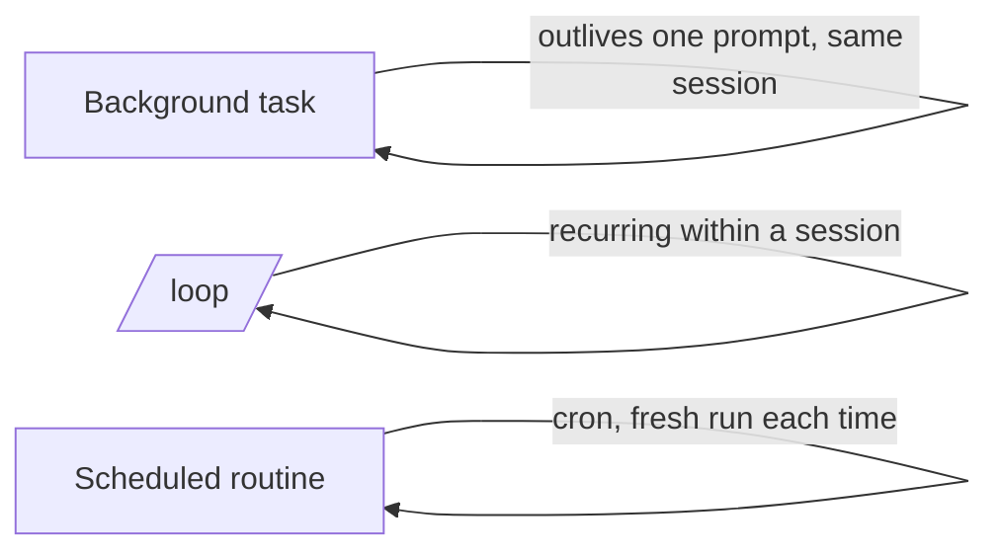

<LevelBadge level="advanced" />

<VerifyNote lastVerified="2026-06-20" source="https://code.claude.com/docs/en">
백그라운드 작업, /loop, 스케줄링의 정확한 명령과 가용 여부는 릴리스마다 바뀝니다 — 공식 문서에서 확인하세요.
</VerifyNote>

모든 것이 빠른 편집인 것은 아닙니다. Claude Code는 **단일 프롬프트보다 오래 지속되는** 작업을 실행할 수 있습니다: 백그라운드의 장시간 명령, 반복 루프, 그리고 예약 실행.

## 백그라운드 작업

세션을 **차단하지 않고** 장시간 실행되는 명령(개발 서버, 테스트 워처, 빌드)을 시작합니다. Claude는 계속 작업하다가 작업이 출력을 내거나 완료되면 알림을 받습니다. 평소에 `&`로 백그라운드 처리하던 것이라면 무엇이든 이 기능을 쓰되 — 관리되는 방식이라 Claude가 나중에 출력을 읽을 수 있습니다.

:::tip 바쁜 대기(busy-wait)를 하지 마세요
작업을 백그라운드에서 시작하고 계속 진행하세요. 빡빡한 루프로 폴링하는 대신 완료 알림이 당신을 다시 데려오게 하세요.
:::

## 반복 루프 (`/loop`)

`/loop`은 세션 안에서 프롬프트나 명령을 **반복 간격으로** 실행합니다 — 예: "5분마다 배포 상태를 확인해줘." 간격을 지정하거나, Claude가 스스로 속도를 정하게 할 수 있습니다. CI 실행을 지켜보거나, 하니스가 달리 알려줄 수 없는 외부 작업을 폴링하는 데 좋습니다.

## 예약된 클라우드 에이전트

**시간에 맞춰 지속적으로** 일어나야 하는 작업 — "매일 아침 새 이슈를 요약해줘", "매시간 뉴스를 확인하고 문서를 업데이트해줘" — 에는 **예약 작업 / 루틴**(cron 방식)을 사용하세요. 각 실행은 새로 시작되므로, 지침은 **자체 완결적**이어야 합니다.

## 무엇을 선택할지

| 필요 | 사용 |
|---|---|
| 장시간 명령을 실행하면서 계속 작업하기 | 백그라운드 작업 |
| 이번 세션에서 N분마다 무언가를 폴링하기 | `/loop` |
| 일정에 맞춰 무기한으로 무언가를 수행하기 | 예약 루틴 |

:::warning 자율성에는 가드레일이 필요하다
일정에 맞춰 무인으로 동작하는 모든 것은 범위를 좁게 잡고 되돌릴 수 있어야 합니다. 엄격한 [권한](/docs/claude-code/permissions)과 함께 구성하고 [자율 실행 강화하기](/docs/security/hardening-autonomous-runs)를 읽으세요.
:::

## 다음

- [헤드리스 모드 & Agent SDK](/docs/claude-code/headless-and-agent-sdk)
- [권한 & 모드](/docs/claude-code/permissions)
- [자율 실행 강화하기](/docs/security/hardening-autonomous-runs)
