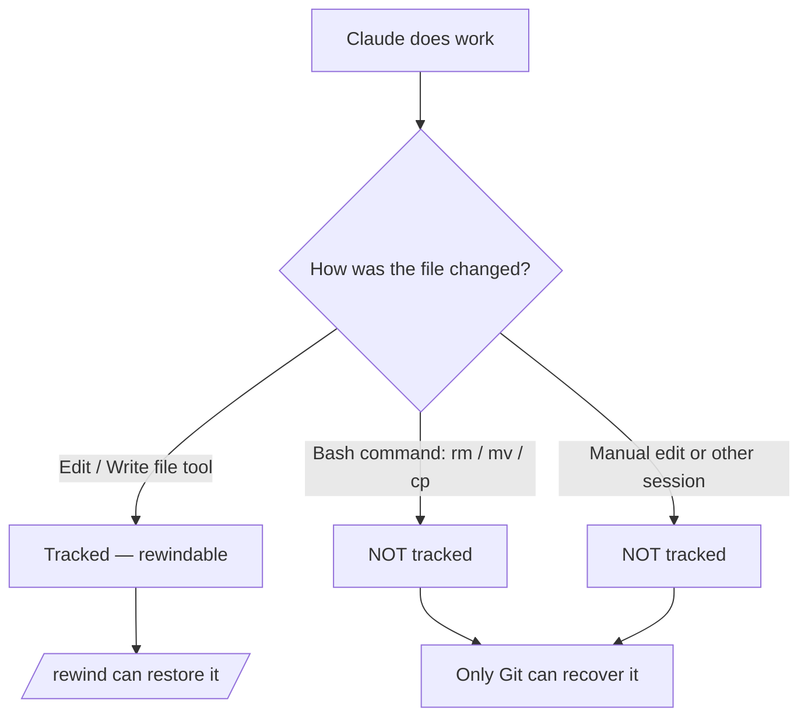

<LevelBadge level="intermediate" />

<Callout type="objectives" items={["체크포인트가 무엇을 캡처하는지 — 그리고 무엇을 조용히 캡처하지 않는지 이해하기", "되감기 메뉴를 두 가지 방법으로 열고 매번 올바른 복원 작업 고르기", "'복원'(상태 되돌리기)과 '요약'(컨텍스트 압축)을 구분하기", "체크포인트가 Git을 보완하지만 결코 대체하지 않는 이유를 정확히 알기"]} />

<VerifyNote lastVerified="2026-07-09" source="https://code.claude.com/docs/en/checkpointing">
체크포인트 동작, 되감기 메뉴 작업, 보존 기간, 버전 요구 사항(예: `/clear` 이전으로 되돌리려면 Claude Code v2.1.191 이상 필요)은 릴리스마다 바뀝니다 — 공식 문서에서 확인하세요.
</VerifyNote>

## 핵심 아이디어

야심 차고 광범위한 변경 작업을 Claude에게 맡길 때 가장 두려운 질문은 "편집 세 단계쯤 들어갔을 때 잘못되면 어쩌지?"입니다. **체크포인팅**이 그 답입니다: Claude Code는 각 편집 전에 코드를 자동으로 스냅샷하므로, 반쯤 끝난 리팩터링을 손으로 풀어내는 대신 이전 상태로 되감을 수 있습니다.

이것을 **세션 전체에 대한 로컬 실행 취소**라고 생각하세요 — 두려움 없이 "그래, 과감한 접근을 시도해 봐"라고 말할 수 있게 해주는 안전망입니다.

## 체크포인트는 어떻게 생성되는가

체크포인트는 당신이 만드는 것이 아닙니다 — 자동으로 생깁니다.

<Steps items={[{title: "모든 프롬프트 = 하나의 체크포인트", body: "각 사용자 프롬프트는 Claude의 파일 편집 도구가 실행되기 전 코드 상태를 캡처합니다. 명령도, 설정도, 절차도 필요 없습니다."}, {title: "세션 간에 유지됩니다", body: "체크포인트는 대화를 종료하고 다시 시작해도 살아남으므로, 진행 중인 세션뿐 아니라 재개한 세션에서도 되감을 수 있습니다."}, {title: "스스로 정리됩니다", body: "체크포인트는 30일(설정 가능) 후 해당 세션과 함께 제거됩니다. 세션 수준의 복구이지 보관소가 아닙니다."}]} />

## 되감기 메뉴 열기

들어가는 방법은 두 가지입니다:

<Steps items={[{title: "/rewind 실행", body: "프롬프트에서 슬래시 명령을 입력합니다. 항상 동작합니다."}, {title: "Esc를 두 번 누르기 — 단, 입력창이 비어 있을 때만", body: "입력창이 비어 있을 때 Esc를 두 번 누르면 되감기 메뉴가 열립니다. 텍스트가 들어 있으면 두 번의 Esc는 그 텍스트를 대신 지웁니다(지워진 텍스트는 입력 기록에 저장되므로, 나중에 위 방향키를 눌러 되돌릴 수 있습니다)."}]} />

<PromptCard title="되감기 메뉴 열기">{`/rewind`}</PromptCard>

메뉴에는 **이번 세션에서 보낸 모든 프롬프트**가 나열됩니다. 작업할 지점을 고른 뒤, 하나의 작업을 선택하세요.

## 복원 대 요약: 핵심 차이

여기서 사람들이 헷갈립니다. 메뉴는 두 *종류*의 작업을 제공합니다:

- **복원** 작업은 디스크와/또는 대화의 상태를 바꿉니다 — 되돌립니다.
- **요약** 작업은 파일을 절대 건드리지 않습니다 — 컨텍스트 윈도우 공간을 확보하기 위해 대화를 압축합니다.

<Callout type="warning" items={["복원 = 되돌리기(코드, 대화 또는 둘 다를 되돌림). 요약 = 컨텍스트 압축(디스크의 파일은 건드리지 않음).", "편집이 무언가를 망가뜨렸을 때는 복원을 사용하세요. 세션이 비대해졌지만 코드는 멀쩡할 때는 요약을 사용하세요."]} />

### 복원 작업

<Steps items={[{title: "코드와 대화 복원", body: "파일과 채팅 기록을 모두 선택한 지점으로 되돌립니다 — 그 순간으로 깔끔하게 '시간을 되감는' 것입니다."}, {title: "대화 복원", body: "채팅을 해당 메시지로 되감되 현재 코드는 유지합니다. 지키고 싶은 편집을 잃지 않고 질문을 다시 던질 때 유용합니다."}, {title: "코드 복원", body: "파일 변경은 되돌리되 대화는 유지합니다. 편집은 취소하고, 그에 관한 논의는 남겨둡니다."}]} />

대화를 복원하거나("여기서부터 요약"을 선택한 후), 선택한 메시지의 원래 프롬프트가 입력 필드로 다시 들어오므로 다시 보내거나 편집할 수 있습니다.

### 요약 작업

둘 다 대화의 일부를 AI가 생성한 요약으로 압축합니다 — 선택한 메시지의 어느 쪽을 압축할지 고르는 **표적형 `/compact`**와 같습니다.

<Steps items={[{title: "여기서부터 요약", body: "선택한 메시지 이전의 메시지는 그대로 유지됩니다. 선택한 메시지와 그 이후의 모든 것은 요약이 됩니다. 초기 컨텍스트를 완전한 상세함으로 유지하면서 곁가지 논의를 버릴 때 사용하세요."}, {title: "여기까지 요약", body: "선택한 메시지 이전의 메시지는 요약이 됩니다. 선택한 메시지와 그 이후는 그대로 유지됩니다. 대화의 끝에 머무릅니다. 최근 작업은 그대로 두면서 초기 설정 잡담을 압축할 때 사용하세요."}]} />

어느 쪽이든 원래 메시지는 세션 대화 기록에 남아 있으므로 Claude가 여전히 세부 사항을 참조할 수 있습니다. 요약이 무엇에 초점을 맞출지 유도하는 선택적 지시를 입력할 수 있습니다.

전체 흐름은 [컨텍스트 관리](/docs/claude-code/context-management)를 참고하세요 — `/rewind`의 요약 작업은 메스이고 `/compact`는 넓은 붓입니다.

## `/clear` 이전으로 되감기

같은 Claude Code 프로세스에서 앞서 `/clear`를 실행했다면, 되감기 메뉴 맨 위에 추가 항목이 나타납니다: `/resume <session-id> (previous session)`. 이를 선택하면 `/clear` 전에 활성 상태였던 대화로 돌아갑니다.

<VerifyNote lastVerified="2026-07-09" source="https://code.claude.com/docs/en/checkpointing">
되감기 메뉴에서 `/clear` 이전으로 되돌리려면 Claude Code v2.1.191 이상이 필요합니다. 이전 버전에서는 대신 `/resume`을 실행하고 목록에서 이전 세션을 고르세요.
</VerifyNote>

## 체크포인트가 멈추는 지점 — 발목을 잡는 한계들

체크포인트는 그렇지 않을 때까지는 마법처럼 느껴집니다. 세 가지 빈틈이 중요합니다:

<Steps items={[{title: "Bash 변경은 보이지 않습니다", body: "Claude가 실행하는 셸 명령이 건드린 파일 — rm, mv, cp, 코드 생성기, 포매터 — 은 추적되지 않습니다. Claude의 파일 편집 도구를 통한 직접 편집만 체크포인트됩니다. rm으로 삭제된 파일은 되감기 입장에서 보면 사라진 것입니다."}, {title: "외부 및 동시 변경은 보이지 않습니다", body: "Claude Code 밖에서 당신이 하는 수동 편집, 그리고 다른 동시 세션의 편집은 일반적으로 캡처되지 않습니다 — 현재 세션이 편집한 것과 같은 파일을 우연히 건드리는 경우가 아니라면."}, {title: "세션 수준이지 이력이 아닙니다", body: "체크포인트는 빠른 로컬 복구입니다. 커밋도, 브랜치도 아니며, 팀과 공유할 수도 없습니다."}]} />

## 체크포인트 대 Git: 둘 다 사용하라

둘은 서로 다른 문제를 해결하므로, 짝지어 쓰세요.

| | 체크포인트 (`/rewind`) | Git |
|---|---|---|
| 범위 | 한 세션 | 프로젝트 전체 이력 |
| 세분성 | 프롬프트 단위, 자동 | 커밋 단위, 의도적 |
| bash로 만든 변경을 추적하는가? | 아니오 | 예 (스테이징/커밋 후) |
| 수명 | 약 30일, 이후 사라짐 | 영구적 |
| 공유 / 협업 가능 | 아니오 | 예 |
| 멘탈 모델 | "로컬 실행 취소" | "영구 이력" |

<Callout type="tip" items={["위험하고 광범위한 작업 전에 Git으로 동작하는 상태를 커밋하세요 — 그것이 당신의 견고한 바닥입니다.", "커밋 사이의 빠른 세션 내 복구에는 Git 이력을 오염시키지 않고 /rewind를 사용하세요.", "Claude가 파괴적인 bash(rm/mv)나 생성기를 실행할 예정이라면 Git에 의지하세요 — 되감기는 그런 파일을 구해주지 못합니다."]} />

## 언제 사용해야 하는가

<Steps items={[{title: "대안 탐색", body: "과감한 구현을 시도해 보고, 마음에 들지 않으면 분기 지점으로 코드와 대화를 복원한 뒤 다른 것을 시도하세요."}, {title: "잘못된 편집에서 복구", body: "세 프롬프트 전의 편집이 버그를 만들었나요? 잔해를 디버깅하는 대신 그 직전으로 코드를 복원하세요."}, {title: "기능 반복", body: "변형을 실험하되, 알려진 좋은 상태가 언제나 /rewind 한 번 거리에 있음을 알고 있으세요."}, {title: "컨텍스트 공간 확보", body: "장황한 디버깅 우회로가 컨텍스트 윈도우를 잡아먹었나요? 중간 지점부터 앞쪽을 요약하고 원래 지시는 완전한 상세함으로 유지하세요."}]} />

<Quiz title="스스로 점검하기" questions={[{q: "Claude가 bash 명령으로 `rm config.old.json`을 실행했는데 되돌리고 싶습니다. `/rewind`로 복원할 수 있나요?", options: ["예 — Claude가 하는 모든 변경은 체크포인트됩니다", "아니오 — bash로 만든 변경은 추적되지 않습니다; 직접 파일 도구 편집만 추적됩니다", "30초 이내에 /rewind를 실행할 때만"], answer: 1, explain: "체크포인팅은 Claude의 파일 편집 도구를 통해 이루어진 편집만 캡처합니다. bash 명령(rm, mv, cp)으로 변경된 파일은 추적되지 않습니다 — 바로 그것이 Git이 있는 이유입니다."}, {q: "코드는 멀쩡한데, 긴 디버깅 곁가지가 컨텍스트 윈도우를 채웠습니다. 어떤 작업이 맞나요?", options: ["곁가지 이전으로 코드와 대화 복원", "코드 복원", "곁가지 시작 지점에서 여기서부터 요약"], answer: 2, explain: "요약 작업은 파일을 건드리지 않고 대화를 압축합니다. '여기서부터 요약'은 곁가지를 요약으로 바꾸면서 이전 컨텍스트를 온전히 유지합니다 — 코드 변경 없이 컨텍스트 공간을 확보합니다."}, {q: "체크포인트는 어떻게 생성되나요?", options: ["/checkpoint를 수동으로 실행합니다", "자동으로, 각 편집 전에 — 모든 프롬프트가 하나를 만듭니다", "Git에서 커밋할 때만"], answer: 1, explain: "체크포인팅은 자동입니다: 모든 사용자 프롬프트가 편집 이전의 코드 상태를 캡처합니다. 수동 단계는 없습니다."}]} />

<Flashcards title="체크포인트와 되감기 용어" cards={[{front: "체크포인트", back: "각 편집 전에, 프롬프트당 한 번씩 찍히는 코드의 자동 스냅샷. 세션 범위이며 약 30일 보관됩니다."}, {front: "/rewind", back: "이번 세션의 모든 프롬프트를 나열하는 되감기 메뉴를 열어, 어느 지점에서든 복원하거나 요약할 수 있게 합니다. 빈 입력창에서 Esc 두 번으로도 접근할 수 있습니다."}, {front: "복원 작업", back: "상태 — 코드, 대화 또는 둘 다 — 를 선택한 지점으로 되돌립니다. 이것이 '실행 취소'입니다."}, {front: "요약 작업", back: "컨텍스트 확보를 위해 대화의 일부를 AI 요약으로 압축합니다. 디스크의 파일은 절대 건드리지 않습니다."}, {front: "Bash 사각지대", back: "셸 명령(rm/mv/cp)으로 변경된 파일은 체크포인트되지 않습니다 — 직접 파일 도구 편집만 됩니다. 그런 것에는 Git을 사용하세요."}]} />

<Callout type="takeaways" items={["체크포인트는 코드의 자동, 프롬프트당 스냅샷입니다 — 세션 전체에 대한 로컬 실행 취소이며 약 30일 보관됩니다.", "되감기 메뉴는 /rewind 또는 빈 입력창에서 Esc 두 번으로 열립니다; 보낸 모든 프롬프트를 나열합니다.", "복원 작업은 상태(코드, 대화 또는 둘 다)를 되돌립니다; 요약 작업은 컨텍스트를 압축하며 파일을 절대 건드리지 않습니다.", "bash로 만든, 외부의, 동시 변경은 추적되지 않습니다 — 직접 파일 도구 편집만 추적됩니다.", "체크포인트는 Git을 보완하지 대체하지 않습니다: '로컬 실행 취소' 대 '영구적이고 공유 가능한 이력'으로 생각하세요."]} />

## 다음

- [컨텍스트 관리](/docs/claude-code/context-management) — `/compact`, `/clear`, 그리고 요약이 더 큰 그림에 어떻게 들어맞는지
- [플랜 모드](/docs/claude-code/plan-mode) — 편집이 실행되기 전에 계획을 조사하고 승인하여, 되감기를 덜 하도록
- [권한](/docs/claude-code/permissions) — 야심 찬 작업을 안전하게 실행하는 나머지 절반
