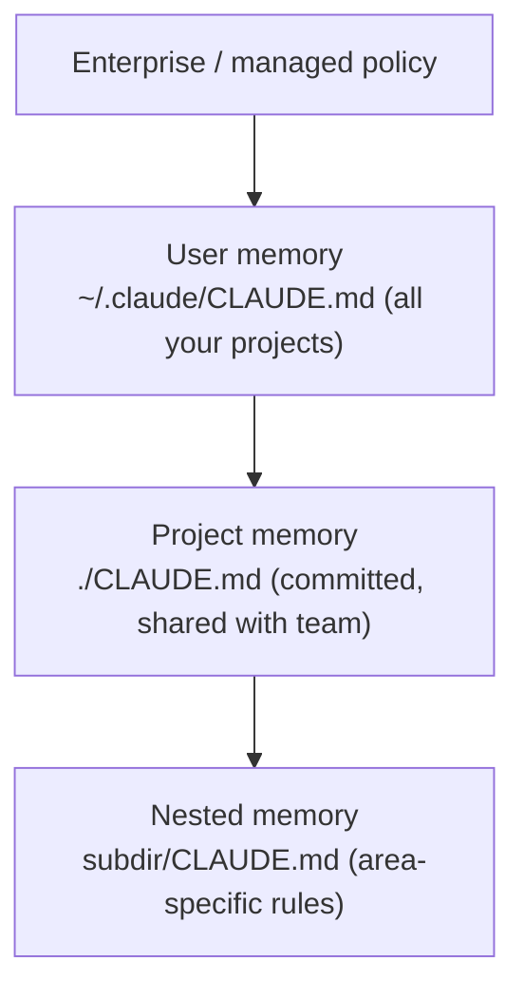

<LevelBadge level="beginner" />

<VerifyNote lastVerified="2026-06-20" source="https://code.claude.com/docs/en/memory">
메모리 파일 위치와 import 구문은 바뀔 수 있습니다 — 구체적인 사항은 공식 Claude Code 메모리 문서에서 확인하세요.
</VerifyNote>

[Claude Code](/docs/claude-code/what-is-claude-code)를 더 좋게 만들기 위해 **단 하나**의 일을 한다면, 바로 이것을 하세요. `CLAUDE.md`는 Claude가 모든 세션 시작 시에 읽는 일반 텍스트 파일입니다 — 프로젝트의 영구적인 브리핑입니다.

## 왜 가장 레버리지가 큰 설정인가

이것이 없으면 매 세션마다 프로젝트를 다시 설명하게 됩니다("우리는 pnpm을 쓰고, 테스트는 `__tests__`에 있고, `/generated`는 건드리지 마…"). 이것이 있으면 Claude는 이미 알고 있습니다. 여기에 좋은 지침을 두면 *앞으로의 모든* 상호작용을 한 번에 개선합니다.

## 메모리 계층

Claude Code는 여러 위치에서 메모리를 읽어 병합하며, 대략 가장 전역적인 것부터 가장 구체적인 것 순서입니다:

- **사용자 메모리** — 모든 프로젝트에 걸친 개인 선호 설정.
- **프로젝트 메모리** (`./CLAUDE.md`, 커밋됨) — *이* 저장소가 어떻게 동작하는지. 팀과 공유됩니다.
- **중첩** — 하위 폴더에 `CLAUDE.md`를 두면 그곳에만 적용되는 규칙을 정할 수 있습니다.

## 시작점 생성하기

프로젝트에서 `/init`을 실행하면 Claude가 코드를 점검해 `CLAUDE.md` 초안을 작성합니다. 그다음 **다듬어 줄이세요** — 초안은 시작점이지 완성본이 아닙니다.

## 무엇을 넣어야 하는가

- 프로젝트가 무엇인지, 두 문장으로.
- 기술 스택과 **실행 / 테스트 / 린트** 방법.
- Claude가 추론할 수 없는 관례(명명, 구조, 커밋 스타일).
- **가드레일**: "완료를 선언하기 전에 테스트를 실행하라", "`/vendor`는 절대 편집하지 마라", "비밀 값을 절대 커밋하지 마라".

바로 쓸 수 있는 시작본은 [CLAUDE.md 템플릿](/docs/templates/claude-md)에서 가져오세요.

## 무엇을 넣지 말아야 하는가

:::warning 짧고 사실인 것이 길고 이상적인 것보다 낫다
Claude는 `CLAUDE.md`를 *문자 그대로* 따릅니다. 오래되거나, 모호하거나, 희망 사항에 불과한 지침은 오히려 해롭습니다. 프로젝트가 오늘 **실제로** 어떻게 동작하는지 기술하고, 간결하게 유지하며, 주기적으로 점검하세요.
:::

피해야 할 것: 통째로 붙여넣은 거대한 문서(대신 `@imports`로 파일을 참조하세요), 비밀 값, 그리고 실제로 따르지 않는 규칙.

## Imports

기존 문서를 복제하지 말고 끌어오세요 — 예를 들어 스타일 가이드를 `@path/to/file` import로 참조하면 단일 출처가 유지됩니다. 정확한 구문은 [공식 메모리 문서](https://code.claude.com/docs/en/memory)를 참고하세요.

## 다음

- [플랜 모드](/docs/claude-code/plan-mode) — 안전한 첫 변경
- [권한 & 모드](/docs/claude-code/permissions) — Claude가 무인으로 할 수 있는 일
- [워크스루: 실제 저장소에 맞게 Claude Code 커스터마이즈하기](/docs/walkthroughs/customize-claude-code)
