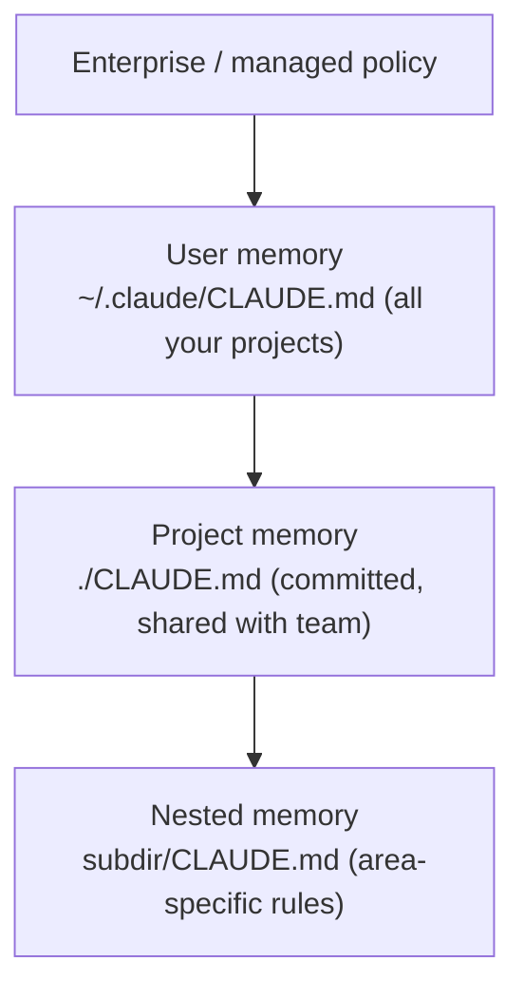

<LevelBadge level="beginner" />

<VerifyNote lastVerified="2026-06-20" source="https://code.claude.com/docs/en/memory">
메모리 파일 위치와 임포트 문법은 변할 수 있습니다 — 세부는 공식 Claude Code 메모리 문서에서 확인하세요.
</VerifyNote>

[Claude Code](/docs/claude-code/what-is-claude-code)를 더 좋게 만들려고 **한 가지**만 한다면, 이것을 하세요. `CLAUDE.md`는 Claude가 매 세션 시작에 읽는 평문 파일 — 프로젝트의 영구 브리핑입니다.

<Callout type="objectives" items={["CLAUDE.md가 왜 단일 최고 레버리지의 Claude Code 설정인지", "메모리 계층이 전역에서 프로젝트별로 어떻게 병합되는지", "/init로 시작 파일을 생성하고 다듬는 법", "CLAUDE.md에 무엇이 들어가고 — 무엇을 빼야 하는지", "@imports로 문서를 중복 없이 참조하는 법"]} />

## 왜 가장 레버리지가 큰 설정인가

이것이 없으면 매 세션마다 프로젝트를 다시 설명하게 됩니다("우리는 pnpm을 쓰고, 테스트는 `__tests__`에 있고, `/generated`는 건드리지 말고…"). 이것이 있으면 Claude가 이미 압니다. 여기 좋은 지침은 *모든* 미래 상호작용을 한 번에 개선합니다.

## 메모리 계층

Claude Code는 여러 곳에서 메모리를 읽고 병합하며, 대략 가장 전역적인 것에서 가장 구체적인 것 순입니다:

- **사용자 메모리** — 모든 프로젝트에 걸친 개인 선호.
- **프로젝트 메모리** (`./CLAUDE.md`, 커밋됨) — *이* 저장소가 어떻게 작동하는지. 팀과 공유됩니다.
- **중첩** — 그곳에만 적용되는 규칙을 위해 하위 폴더에 `CLAUDE.md`를 두세요.

<Flashcards title="메모리 계층 알기" cards={[{front: "사용자 메모리", back: "~/.claude/CLAUDE.md — 모든 프로젝트에 적용되는 개인 선호."}, {front: "프로젝트 메모리", back: "./CLAUDE.md — 커밋되어 팀과 공유되며; 이 저장소가 어떻게 작동하는지 기술."}, {front: "중첩 메모리", back: "subdir/CLAUDE.md — 그 하위 폴더 안에서만 적용되는 영역별 규칙."}, {front: "Enterprise / managed policy", back: "가장 전역적인 계층; 사용자 메모리 위에 있는 조직 수준 정책."}]} />

## 시작점 생성하기

<Steps items={[{title: "프로젝트에서 /init 실행", body: "Claude가 코드를 검사하고 자동으로 CLAUDE.md 초안을 작성합니다."}, {title: "다듬기", body: "초안은 시작점이지 끝이 아닙니다. 참이고 유용한 것으로 다듬으세요."}, {title: "템플릿 빌려 쓰기", body: "CLAUDE.md 템플릿 페이지에서 완성된 스타터를 가져와 저장소에 맞게 적응시키세요."}]} />

<PromptCard title="Generate a draft CLAUDE.md">{`/init`}</PromptCard>

[CLAUDE.md 템플릿](/docs/templates/claude-md)에서 완성된 스타터를 가져오세요.

## 무엇을 넣을까

- 프로젝트가 무엇인지, 두 문장으로.
- 기술 스택과 **실행 / 테스트 / 린트** 방법.
- Claude가 추론할 수 없는 관례(명명, 구조, 커밋 스타일).
- **가드레일**: "완료 선언 전 테스트 실행", "`/vendor` 절대 편집 금지", "비밀 절대 커밋 금지".

## 무엇을 넣지 말까

<Callout type="warning" items={["Claude는 CLAUDE.md를 문자 그대로 따릅니다 — 낡거나 모호하거나 희망사항인 지침은 오히려 해칩니다.", "프로젝트가 오늘 실제로 어떻게 작동하는지 기술하세요; 짧고 참인 것이 길고 이상적인 것보다 낫습니다.", "거대한 붙여넣기 문서(대신 @imports 사용), 비밀, 실제로 따르지 않는 규칙은 피하세요.", "프로젝트가 진화함에 따라 정확하게 유지되도록 주기적으로 검토하세요."]} />

## 임포트

문서를 복제하는 대신 기존 문서를 끌어오세요 — 예를 들어 `@path/to/file` 임포트로 스타일 가이드를 참조해 단일 진실 소스를 유지하세요. 정확한 문법은 [공식 메모리 문서](https://code.claude.com/docs/en/memory)를 참고하세요.

<Callout type="tip" items={["단일 진실 소스: CLAUDE.md에 내용을 붙여넣기보다 @imports로 파일을 참조하세요.", "문서가 이미 있으면 링크하세요 — 복사하지 마세요. 사본은 오래되어 어긋납니다."]} />

## 스스로 점검하기

<Quiz title="스스로 점검하기" questions={[{q: "Claude Code가 매 세션 시작에 프로젝트의 영구 브리핑으로 읽는 파일은?", options: ["README.md", "CLAUDE.md", "package.json"], answer: 1, explain: "CLAUDE.md는 Claude가 매 세션 시작에 읽는 평문 메모리 파일입니다."}, {q: "프로젝트에서 /init을 실행하면 무엇을 하나요?", options: ["CLAUDE.md를 팀 저장소에 커밋한다", "코드를 검사해 CLAUDE.md 초안을 작성하고, 그다음 여러분이 다듬는다", "낡은 메모리 파일을 삭제한다"], answer: 1, explain: "/init은 코드에서 시작 CLAUDE.md를 초안하며 — 초안은 시작점이므로 이후 다듬습니다."}, {q: "스타일 가이드 같은 큰 기존 문서를 포함하는 권장 방법은?", options: ["문서 전체를 CLAUDE.md에 붙여넣기", "@path/to/file 임포트로 참조하기", "비밀로 저장하기"], answer: 1, explain: "@imports로 파일을 가리켜 복제되어 어긋나는 사본 대신 단일 진실 소스를 두세요."}]} />

<Callout type="takeaways" items={["CLAUDE.md는 가장 레버리지가 큰 설정입니다: 모든 미래 세션을 한 번에 개선합니다.", "메모리는 전역에서 구체적으로 병합됩니다: 엔터프라이즈 정책, 그다음 사용자, 프로젝트, 중첩 CLAUDE.md 파일.", "/init로 시작한 뒤, 초안을 실제로 참인 것으로 다듬으세요.", "프로젝트 요약, 실행/테스트/린트 명령, 관례, 가드레일을 포함하세요.", "짧고 참되게 유지하세요 — 큰 문서에는 @imports를 쓰고, 비밀은 절대 커밋하지 마세요."]} />

## 다음

- [AGENTS.md & 도구 간 상호운용](/docs/claude-code/agents-md) — 모든 코딩 에이전트에 하나의 지침 파일 공유
- [플랜 모드](/docs/claude-code/plan-mode) — 안전한 첫 변경
- [권한 & 모드](/docs/claude-code/permissions) — Claude가 무인으로 무엇을 할 수 있는지
- [워크스루: 실제 저장소용 Claude Code 커스터마이즈](/docs/walkthroughs/customize-claude-code)
