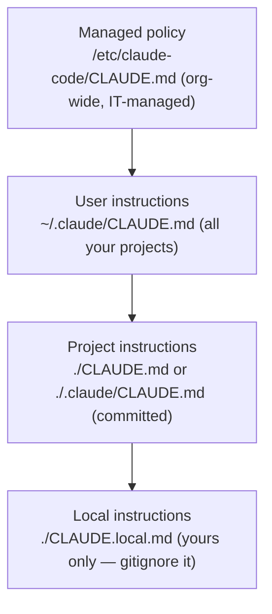

<LevelBadge level="beginner" />

<VerifyNote lastVerified="2026-10-06" source="https://code.claude.com/docs/en/memory">
위치, 로드 순서, 임포트 문법은 공식 메모리 문서(How Claude remembers your project)에서 가져왔으며, 그 문서는 이제 **두 가지** 메커니즘을 설명합니다: 여러분이 작성하는 CLAUDE.md 파일과 Claude가 스스로 작성하는 **자동 메모리**. 임포트는 최대 네 홉 깊이까지 해석됩니다. 세부는 거기서 확인하세요 — 이런 내용은 변합니다.
</VerifyNote>

[Claude Code](/docs/claude-code/what-is-claude-code)를 더 좋게 만들려고 **한 가지**만 한다면, 이것을 하세요. `CLAUDE.md`는 Claude가 매 세션 시작에 읽는 평문 파일 — 프로젝트의 영구 브리핑입니다.

<Callout type="objectives" items={["CLAUDE.md가 왜 단일 최고 레버리지의 Claude Code 설정인지", "메모리 계층이 관리형 정책부터 CLAUDE.local.md까지 어떤 순서로 로드되는지", "자동 메모리가 여러분이 직접 쓰는 CLAUDE.md와 어떻게 다른지", "/init로 시작 파일을 생성하고 다듬는 법", "CLAUDE.md에 무엇이 들어가고 — 무엇을 빼야 하는지", "@imports로 문서를 중복 없이 참조하는 법"]} />

## 왜 가장 레버리지가 큰 설정인가

이것이 없으면 매 세션마다 프로젝트를 다시 설명하게 됩니다("우리는 pnpm을 쓰고, 테스트는 `__tests__`에 있고, `/generated`는 건드리지 말고…"). 이것이 있으면 Claude가 이미 압니다. 여기 좋은 지침은 *모든* 미래 상호작용을 한 번에 개선합니다.

## 메모리 계층

Claude Code는 여러 위치에서 메모리를 읽어 로드 순서대로 병합하며, 범위가 넓은 것이 먼저입니다 — 그래서 프로젝트 지침은 사용자 지침 *다음에* 컨텍스트로 들어갑니다:

```mermaid
flowchart TD
  A["Managed policy<br/>/etc/claude-code/CLAUDE.md (org-wide, IT-managed)"] --> B["User instructions<br/>~/.claude/CLAUDE.md (all your projects)"]
  B --> C["Project instructions<br/>./CLAUDE.md or ./.claude/CLAUDE.md (committed)"]
  C --> D["Local instructions<br/>./CLAUDE.local.md (yours only — gitignore it)"]
```

- **관리형 정책** — IT/DevOps 팀이 배포하는 조직 전체 지침. 경로는 OS별로 다릅니다: macOS에서는 `/Library/Application Support/ClaudeCode/CLAUDE.md`, Linux와 WSL에서는 `/etc/claude-code/CLAUDE.md`, Windows에서는 `C:\Program Files\ClaudeCode\CLAUDE.md`.
- **사용자 지침** (`~/.claude/CLAUDE.md`) — 모든 프로젝트에 걸친 개인 선호.
- **프로젝트 지침** (`./CLAUDE.md` *또는* `./.claude/CLAUDE.md`, 커밋됨) — *이* 저장소가 어떻게 작동하는지. 팀과 공유됩니다. 저장소가 [`AGENTS.md`](/docs/claude-code/agents-md)를 쓴다면, 이 파일들 대신 또는 함께 로드될 수 있습니다.
- **로컬 지침** (`./CLAUDE.local.md`) — 샌드박스 URL처럼 나만을 위한 프로젝트별 메모. `.gitignore`에 추가하세요.

작업 디렉터리 *위쪽* 디렉터리 계층에 있는 파일은 실행 시점에 로드됩니다; **하위 디렉터리의 파일은 필요할 때 로드**되며, Claude가 그 영역의 무언가를 건드리는 순간입니다.

<Callout type="tip" items={["한 파일로는 부족해졌나요? 지침을 .claude/rules/*.md로 나누세요 — 주제당 한 파일, 재귀적으로 발견됩니다. paths 프런트매터가 없는 규칙은 .claude/CLAUDE.md와 같은 우선순위로 실행 시점에 로드됩니다; paths 프런트매터를 추가하면 Claude가 일치하는 파일을 작업할 때만 규칙이 로드되어 컨텍스트를 절약합니다."]} />

<Flashcards title="메모리 계층 알기" cards={[{front: "관리형 정책", back: "IT가 관리하는 조직 전체 CLAUDE.md — 가장 넓은 계층으로, 사용자 지침과 프로젝트 지침보다 먼저 로드됩니다."}, {front: "사용자 지침", back: "~/.claude/CLAUDE.md — 모든 프로젝트에 적용되는 개인 선호."}, {front: "프로젝트 지침", back: "./CLAUDE.md 또는 ./.claude/CLAUDE.md — 커밋되어 팀과 공유되며; 이 저장소가 어떻게 작동하는지 기술합니다."}, {front: "로컬 지침", back: "./CLAUDE.local.md — 개인용 프로젝트별 선호. gitignore에 넣으세요."}, {front: ".claude/rules/*.md", back: "규모가 큰 프로젝트를 위한 주제당 한 파일 지침. paths 프런트매터가 있으면 일치하는 파일에 대해서만 로드됩니다."}, {front: "하위 디렉터리 CLAUDE.md", back: "필요할 때 로드됩니다 — Claude가 트리의 그 부분에서 작업할 때이며, 실행 시점이 아닙니다."}]} />

## 나머지 절반: 자동 메모리

CLAUDE.md는 *여러분이* 작성하는 메모리의 절반입니다. Claude Code는 **자동 메모리**도 유지합니다 — 여러분의 수정과 선호를 보고 Claude가 스스로 작성하는 메모로, 저장소별로 저장되며 여러분의 CLAUDE.md 파일들과 함께 매 세션에 로드됩니다.

| | CLAUDE.md 파일 | 자동 메모리 |
| --- | --- | --- |
| **누가 쓰는가** | 여러분 | Claude |
| **무엇을 담는가** | 지침과 규칙 | 학습과 패턴 |
| **범위** | 프로젝트, 사용자, 또는 조직 | 저장소별, 워크트리 간 공유 |

둘 다 강제가 아니라 *컨텍스트*입니다: Claude는 이것을 반드시 따라야 하는 설정이 아니라, 저울질할 수 있는 안내로 취급합니다. Claude의 판단과 무관하게 어떤 동작을 하드 차단하려면 대신 [PreToolUse 훅](/docs/claude-code/hooks)을 쓰세요.

<Callout type="warning" items={["자동 메모리는 처음 200줄 또는 25 KB까지만 로드됩니다 — 비대해진 MEMORY.md는 조용히 잘립니다. 전체 시작 비용 분해는 Context Budget Audit을 참고하세요."]} />

## 시작점 생성하기

<Steps items={[{title: "프로젝트에서 /init 실행", body: "Claude가 코드를 검사하고 자동으로 CLAUDE.md 초안을 작성합니다."}, {title: "다듬기", body: "초안은 시작점이지 끝이 아닙니다. 참이고 유용한 것으로 다듬으세요."}, {title: "템플릿 빌려 쓰기", body: "CLAUDE.md 템플릿 페이지에서 완성된 스타터를 가져와 저장소에 맞게 적응시키세요."}]} />

<PromptCard title="CLAUDE.md 초안 생성하기">{`/init`}</PromptCard>

[CLAUDE.md 템플릿](/docs/templates/claude-md)에서 완성된 스타터를 가져오세요.

## 무엇을 넣을까

- 프로젝트가 무엇인지, 두 문장으로.
- 기술 스택과 **실행 / 테스트 / 린트** 방법.
- Claude가 추론할 수 없는 관례(명명, 구조, 커밋 스타일).
- **가드레일**: "완료 선언 전 테스트 실행", "`/vendor` 절대 편집 금지", "비밀 절대 커밋 금지".

## 무엇을 넣지 말까

<Callout type="warning" items={["Claude는 CLAUDE.md를 문자 그대로 따릅니다 — 낡거나 모호하거나 희망사항인 지침은 오히려 해칩니다.", "프로젝트가 오늘 실제로 어떻게 작동하는지 기술하세요; 짧고 참인 것이 길고 이상적인 것보다 낫습니다.", "거대한 붙여넣기 문서(대신 @imports 사용), 비밀, 실제로 따르지 않는 규칙은 피하세요.", "프로젝트가 진화함에 따라 정확하게 유지되도록 주기적으로 검토하세요."]} />

## 임포트

문서를 복제하는 대신 기존 문서를 끌어오세요 — 예를 들어 `@path/to/file` 임포트로 스타일 가이드를 참조해 단일 진실 소스를 유지하세요. 상대 경로와 절대 경로 모두 작동하며, 상대 경로는 작업 디렉터리가 **아니라** 임포트를 담은 파일을 기준으로 해석됩니다. 임포트된 파일은 다른 파일을 또 임포트할 수 있고, 최대 깊이는 **네 홉**입니다.

물리기 전에 알아둘 만한 문법 함정 두 가지:

- **공백에는 백슬래시가 필요합니다.** `@Design\ Docs/api-conventions.md`는 작동합니다; 백슬래시가 없으면 경로는 첫 공백에서 끊깁니다. 따옴표로 감싸면 파일이 아예 임포트되지 않습니다.
- **백틱은 제외시킵니다.** 임포트 파싱은 코드 스팬과 펜스 블록을 건너뛰므로, `` `@README` ``는 문자 그대로의 텍스트로 남고 `@README` 단독으로 쓰면 파일을 임포트합니다. 경로를 로드하지 않고 *언급*하는 방법이 바로 이것입니다.

전체 레퍼런스는 [공식 메모리 문서](https://code.claude.com/docs/en/memory)를 참고하세요.

<Callout type="tip" items={["단일 진실 소스: CLAUDE.md에 내용을 붙여넣기보다 @imports로 파일을 참조하세요.", "문서가 이미 있으면 링크하세요 — 복사하지 마세요. 사본은 오래되어 어긋납니다."]} />

## 스스로 점검하기

<Quiz title="스스로 점검하기" questions={[{q: "Claude Code가 매 세션 시작에 프로젝트의 영구 브리핑으로 읽는 파일은?", options: ["README.md", "CLAUDE.md", "package.json"], answer: 1, explain: "CLAUDE.md는 Claude가 매 세션 시작에 읽는 평문 메모리 파일입니다."}, {q: "프로젝트에서 /init을 실행하면 무엇을 하나요?", options: ["CLAUDE.md를 팀 저장소에 커밋한다", "코드를 검사해 CLAUDE.md 초안을 작성하고, 그다음 여러분이 다듬는다", "낡은 메모리 파일을 삭제한다"], answer: 1, explain: "/init은 코드에서 시작 CLAUDE.md를 초안하며 — 초안은 시작점이므로 이후 다듬습니다."}, {q: "스타일 가이드 같은 큰 기존 문서를 포함하는 권장 방법은?", options: ["문서 전체를 CLAUDE.md에 붙여넣기", "@path/to/file 임포트로 참조하기", "비밀로 저장하기"], answer: 1, explain: "@imports로 파일을 가리켜 복제되어 어긋나는 사본 대신 단일 진실 소스를 두세요."}, {q: "커밋하고 싶지 않은 개인적이고 프로젝트별인 메모는 어디에 두나요?", options: ["~/.claude/CLAUDE.md", "./CLAUDE.local.md", "./.claude/CLAUDE.md"], answer: 1, explain: "./CLAUDE.local.md가 로컬 계층입니다: 프로젝트별이지만 나만의 것. gitignore에 넣으세요. ~/.claude/CLAUDE.md는 모든 프로젝트에 적용되고, ./.claude/CLAUDE.md는 커밋되는 팀 지침입니다."}, {q: "자동 메모리는 누가 쓰나요?", options: ["여러분이 직접 손으로", "Claude가, 여러분의 수정과 선호를 보고", "IT 관리자가"], answer: 1, explain: "자동 메모리는 Claude가 스스로 쓰는 절반입니다 — 학습과 패턴이며 저장소별로 저장됩니다. CLAUDE.md는 여러분이 쓰는 절반입니다."}, {q: "하위 디렉터리의 CLAUDE.md는 언제 로드되나요?", options: ["실행 시점에, 다른 모든 메모리 파일과 함께", "필요할 때, Claude가 트리의 그 부분에서 작업할 때", "@import할 때만"], answer: 1, explain: "작업 디렉터리 위쪽 파일은 실행 시점에 로드됩니다; 하위 디렉터리의 파일은 Claude가 그 영역의 무언가를 건드릴 때 필요에 따라 로드됩니다."}]} />

<Callout type="takeaways" items={["CLAUDE.md는 가장 레버리지가 큰 설정입니다: 모든 미래 세션을 한 번에 개선합니다.", "메모리는 넓은 범위부터 로드됩니다: 관리형 정책, 그다음 사용자(~/.claude/CLAUDE.md), 프로젝트(./CLAUDE.md 또는 ./.claude/CLAUDE.md), 그리고 로컬(./CLAUDE.local.md). 하위 디렉터리 파일은 필요할 때 로드됩니다.", "자동 메모리가 나머지 절반입니다 — Claude 자신의 메모로, 저장소별이며 매 세션 로드됩니다. 둘 다 강제가 아니라 컨텍스트입니다: 무언가를 하드 차단하려면 훅을 쓰세요.", "한 파일로는 부족해졌나요? .claude/rules/*.md로 나누고 paths 프런트매터로 규칙의 범위를 지정하세요.", "/init로 시작한 뒤, 초안을 실제로 참인 것으로 다듬으세요.", "짧고 참되게 유지하세요 — 큰 문서에는 @imports(최대 네 홉)를 쓰고, 비밀은 절대 커밋하지 마세요."]} />

## 다음

- [AGENTS.md & 도구 간 상호운용](/docs/claude-code/agents-md) — 모든 코딩 에이전트에 하나의 지침 파일 공유
- [플랜 모드](/docs/claude-code/plan-mode) — 안전한 첫 변경
- [권한 & 모드](/docs/claude-code/permissions) — Claude가 무인으로 무엇을 할 수 있는지
- [워크스루: 실제 저장소용 Claude Code 커스터마이즈](/docs/walkthroughs/customize-claude-code)
