<LevelBadge level="intermediate" />

Claude Code 프로젝트는 노트북에 브라우저 탭이 쌓이듯 컨텍스트 부채를 쌓습니다. 설치한 스킬 하나하나가 Claude가 매 턴 다시 읽는 목록에 한 줄을 더합니다. 서브에이전트 하나하나가 설명(description)을 더합니다. 3월에 써 둔 `CLAUDE.md` 단락은 그 작업에 필요하든 아니든 9월에도 로드됩니다. 그리고 `npm test` 한 번은 최대 30,000자를 대화에 쏟아붓습니다. 세션이 지시를 잊어버리기 시작하거나 청구서가 한 일과 맞지 않게 될 때까지, 이 중 어느 것도 눈에 보이지 않습니다.

[컨텍스트 관리](/docs/claude-code/context-management)는 그 순간에 쓰는 두 명령, `/clear`와 `/compact`를 다룹니다. 이 페이지는 프로젝트당 한 번 돌리는 감사입니다. 당신이 아무것도 입력하기 전에, 또는 턴 사이에 Claude Code가 컨텍스트를 쓰는 여섯 군데, 각각을 지배하는 설정, 그리고 그 기본값을 다룹니다. 여기 있는 모든 내용은 2026년 9월 기준 공식 문서에 있으며, 대부분의 노브는 그에 관한 통설보다 더 최신입니다.

<Callout type="objectives" items={[
  "자르기 전에 측정하기: /context, /usage의 사용량 귀속, /doctor의 목록 비용 추정치를 읽어 가장 큰 항목부터 손보기",
  "/skill-doctor(v2.1.252+)와 네 가지 skillOverrides 상태로 스킬 목록을 솎아내고, 목록에 걸린 창의 1% 예산을 이해하기",
  "셸 명령이나 백그라운드 작업이 인라인으로 반환하는 양(기본 30,000자와 32,000자)을 bashOutputMaxChars와 taskOutputMaxChars로 제한하기",
  "omitClaudeMd(v2.1.271+)로 모든 서브에이전트마다 CLAUDE.md 값을 치르는 것을 멈추고, 서브에이전트 설명을 15,000토큰 경고선 아래로 유지하기",
  "자동 압축 창을 의도적으로 설정하고(/autocompact, autoCompactWindow), 압축 후 어떤 호출된 스킬이 살아남는지 결정하는 25,000토큰 예산을 이해하기",
  "컨텍스트가 아니라 사고(thinking) 토큰이 실제 청구서일 때 maxEffortLevel로 전사적으로 노력 수준을 제한하기"
]} />

<VerifyNote lastVerified="2026-09-15" source="https://code.claude.com/docs/en/settings-reference">
설정 이름, 기본값, 범위, 최소 버전은 Claude Code 설정 레퍼런스에서 가져왔습니다(`autoCompactWindow`, `bashOutputMaxChars`, `taskOutputMaxChars`, `maxEffortLevel`, `skillListingBudgetFraction`, `skillOverrides`, `disableBundledSkills`). `/skill-doctor` 동작, 1% 목록 예산, 1,536자 설명 상한, 25,000토큰 재부착 예산은 [스킬 문서](https://code.claude.com/docs/en/skills)에서 가져왔습니다. Bash 인라인 한도는 [도구 레퍼런스](https://code.claude.com/docs/en/tools-reference#output-limits)에서 가져왔습니다. `omitClaudeMd`, 15,000토큰 설명 경고, 서브에이전트가 로드하는 것은 [서브에이전트 문서](https://code.claude.com/docs/en/sub-agents)에서 가져왔습니다. CLAUDE.md와 비용 관련 지침은 [비용 관리](https://code.claude.com/docs/en/costs)에서 가져왔습니다. 모델별 컨텍스트 크기는 여기서 반복하지 않습니다. [모델과 가격](/docs/whats-new/models-and-pricing)을 보세요.
</VerifyNote>

## 입력하기 전에 이미 창 안에 있는 것

```mermaid
flowchart LR
  subgraph startup["Loaded at session start (every turn thereafter)"]
    SP[System prompt]
    CM[CLAUDE.md hierarchy]
    AM["Auto memory (first 200 lines / 25 KB)"]
    SL["Skill listing (capped at 1% of window)"]
    AD["Subagent descriptions (warning at 15k tokens)"]
    MT["MCP tool names (schemas deferred)"]
  end
  subgraph turns["Added as you work"]
    TR["Tool results (Bash ≤30k chars inline)"]
    TO["Background task output (≤32k chars inline)"]
    SK["Invoked skill bodies"]
    FR[File reads]
  end
  startup --> turns --> C{Auto-compact window}
  C -->|summary| R["Re-attached skills: 5k each, 25k total"]
```

이 다이어그램을 실행 가능하게 만드는 사실은 두 가지입니다. 왼쪽 상자에 있는 모든 것은 **매 요청마다** 비용이 발생합니다. Claude Code가 매 턴 전체 대화를 전송하고, 캐시 읽기 할인만이 그 충격을 완화하기 때문입니다. 그리고 오른쪽 상자는 장황한 명령 하나가 한 걸음에 왼쪽 상자 전체보다 더 많은 것을 더할 수 있는 곳입니다. 아래 감사는 왼쪽에서 오른쪽으로 진행합니다.

## 감사

<Steps items={[
  { title: "측정: /context, /usage, /doctor", body: "/context를 실행하면 범주별 실시간 분석과 최적화 제안이 나오며, 어떤 CLAUDE.md와 자동 메모리 파일이 로드되었는지도 포함됩니다. Pro, Max, Team, Enterprise 플랜에서는 /usage가 최근 사용량을 스킬, 서브에이전트, 플러그인, 개별 MCP 서버에 백분율로 귀속시키고, 10% 이상을 차지하는 행동(긴 컨텍스트, 캐시 미스)을 표시합니다. /doctor는 스킬 목록의 컨텍스트 비용과 가장 큰 기여자들을 추정합니다. 아무것도 바꾸기 전에 가장 큰 항목 세 개를 적어 두세요." },
  { title: "/skill-doctor로 스킬 목록 솎아내기", body: "목록에 있는 모든 스킬은 Claude가 쓰든 안 쓰든 매 턴 컨텍스트 비용을 발생시킵니다. /skill-doctor(v2.1.252+)는 각 스킬의 컨텍스트 비용과 호출 빈도를 보여주고, 한 번도 호출되지 않은 스킬을 표시하며, 어디서 끌 수 있는지 알려줍니다. 또 최근에 쓰지 않은 플러그인도 나열합니다. 비용이 가장 큰 미사용 항목부터 시작하세요. 대화형 세션에서는 /plugin 관리자의 Stats 탭에 보고서가 열리고, -p를 쓰면 텍스트로 출력됩니다. 번들 스킬과 엔터프라이즈 스킬은 다루지 않고, 기능 플래그 조회가 필요하며, Remote Control에서는 거부됩니다." },
  { title: "삭제하지 말고 skillOverrides로 접어두기", body: "스킬마다 네 가지 상태가 있습니다: on(이름과 설명이 목록에 올라감), name-only(설명 없이 이름만 올라가고 여전히 호출 가능), user-invocable-only(Claude에게는 숨겨지지만 / 메뉴에는 남음), off. /skills 메뉴가 이것을 대신 써 줍니다: 스킬을 선택하고 Space로 상태를 순환시키고 Esc로 .claude/settings.local.json에 저장합니다. 플러그인 스킬은 대신 /plugin으로 관리합니다. disableBundledSkills: true로 설정하면 Claude Code 자체의 번들 스킬과 워크플로를 한 줄로 제거합니다." },
  { title: "목록 예산과 설명 상한을 알아두기", body: "목록은 모델 컨텍스트 창의 1%로 제한됩니다(skillListingBudgetFraction, 기본값 0.01). 넘치면 Claude Code는 모든 이름은 유지하되 가장 적게 쓰인 스킬부터 설명을 버리며, 이는 Claude가 자동 선택에 필요한 키워드를 벗겨냅니다. 각 스킬의 description과 when_to_use를 합친 길이도 1,536자에서 잘립니다(skillListingMaxDescChars). 핵심 사용 사례를 첫 문장에 넣으세요." },
  { title: "시작 시 로드되는 양 줄이기", body: "CLAUDE.md는 200줄 아래로 유지하고 워크플로 특화 지시(PR 리뷰, 마이그레이션)는 스킬로 옮기세요. 스킬은 호출될 때만 로드됩니다. 자동 메모리는 첫 200줄 또는 25 KB만 로드하므로, 비대해진 MEMORY.md는 조용히 잘립니다. 서브에이전트 설명은 매 턴 읽힙니다: 커스텀 서브에이전트들의 설명 합계가 15,000토큰을 넘으면 Claude Code가 시작 시 경고합니다. 세부 내용은 각 서브에이전트의 시스템 프롬프트로 옮기세요. 시스템 프롬프트는 그 에이전트가 실행될 때만 로드됩니다." },
  { title: "도구 출력을 인라인에서 제한하기", body: "성공한 Bash 또는 PowerShell 명령은 기본적으로 약 30,000자까지 인라인으로 반환합니다. 그 이상이면 Claude는 짧은 미리보기와 파일 경로를 받고 필요할 때 그 파일을 읽습니다. 실패한 명령은 머리와 꼬리를 발췌해 최대 10,000자를 반환합니다. bashOutputMaxChars(v2.1.261+, 4,000~128,000으로 클램프)는 인라인 상한과 되읽기 창을 함께 설정하고, Claude Code가 BASH_MAX_OUTPUT_LENGTH를 무시하게 만듭니다. taskOutputMaxChars는 TaskOutput으로 읽는 백그라운드 작업에 같은 역할을 합니다(기본 32,000, 같은 범위). 수다스러운 빌드 도구를 쓰는 프로젝트에서는 낮추고, Claude가 그래도 저장된 파일을 계속 열 때만 올리세요." },
  { title: "모든 서브에이전트에서 CLAUDE.md 값을 치르는 것 멈추기", body: "포크가 아닌 서브에이전트는 자기 프롬프트 위에 CLAUDE.md 계층의 모든 단계와 git status 스냅샷을 로드합니다. 내장 Explore와 Plan 에이전트는 둘 다 건너뜁니다. 위임 프롬프트에서 필요한 모든 것을 받는 커스텀 서브에이전트라면 프론트매터에 omitClaudeMd: true를 설정하세요(v2.1.271+). 사용자, 프로젝트, 로컬 CLAUDE.md 파일이 건너뛰어지고, 관리 정책 파일은 여전히 로드됩니다. 그 에이전트가 메인 세션 에이전트로 실행될 때는 무시됩니다. 헤드리스 실행에서 큰 공유 지시를 쓸 때는 모든 설명에 밀어넣는 대신 --append-subagent-system-prompt-file(v2.1.261+)을 넘기세요." },
  { title: "자동 압축 창을 의도적으로 설정하기", body: "autoCompactWindow는 100,000에서 1,000,000까지의 토큰 수이며 모델의 창 크기로 제한됩니다. 설정하지 않으면 Claude Code가 모델에 맞춰 조정된 창을 고릅니다. /autocompact 500k는 사용자 설정에 기록하고, --autocompact는 한 세션만 덮어쓰며, CLAUDE_CODE_AUTO_COMPACT_WINDOW는 둘 다 덮어씁니다. CLAUDE_AUTOCOMPACT_PCT_OVERRIDE(1~100)는 트리거 지점을 낮추는 것만 가능합니다. 압축 후 호출된 스킬들은 각각 최대 5,000토큰씩, 총 25,000토큰 안에서 최신순으로 재부착되므로 오래된 스킬은 완전히 빠질 수 있습니다. 반드시 살아남아야 하는 스킬이 있다면 /compact 후에 다시 호출하세요." },
  { title: "컨텍스트가 아니라 사고가 청구서일 때 노력 수준 제한하기", body: "사고 토큰은 출력으로 과금됩니다. maxEffortLevel(v2.1.267+)은 어떤 세션이든 쓸 수 있는 노력 수준에 상한을 둡니다: low, medium, high, xhigh, max 중 하나입니다(max = 상한 없음). 모든 공급자에서 매 요청 전에 적용되고, 여러 스코프 중 가장 낮은 상한이 이기며, xhigh보다 낮은 상한은 ultracode를 비활성화합니다. 모델별 상한은 modelSettings에 넣습니다. 조직 전체에 강제하려면 관리 설정(managed settings)으로 배포하세요." }
]} />

## 그대로 붙여 쓸 수 있는 설정 블록

<PromptCard title="프로젝트 로컬 컨텍스트 상한 (.claude/settings.local.json)">
{`{
  "bashOutputMaxChars": 12000,
  "taskOutputMaxChars": 12000,
  "skillOverrides": {
    "legacy-migration-notes": "name-only",
    "deploy-prod": "user-invocable-only",
    "old-design-system": "off"
  },
  "autoCompactWindow": 500000,
  "maxEffortLevel": "high"
}`}
</PromptCard>

이것을 기본값이 아니라 결정으로 읽고 위에서 아래로 내려가세요. 두 개의 출력 상한은 수다스러운 테스트 러너를 가정합니다. Claude가 실행할 때마다 저장된 출력 파일을 열기 시작하면 30,000 / 32,000 기본값 쪽으로 되돌리세요. 세 개의 오버라이드는 설명 값을 치르지 않으면서 스킬을 계속 닿을 수 있게 유지합니다. 압축 창은 모델이 조정한 지점보다 절반 지점에서 압축하고 싶은 1M 컨텍스트 모델을 위한 명시적 선택입니다. 노력 상한은 여기서 출력 품질을 바꾸는 유일한 한 줄이므로, 마지막에, 그리고 `/usage`가 사고 토큰이 지배한다고 보여준 뒤에만 설정하세요.

<PromptCard title="CLAUDE.md를 로드하지 않는 서브에이전트 (.claude/agents/repo-auditor.md)">
{`---
name: repo-auditor
description: Audits a repository for dead code and unused exports. Use for read-only sweeps.
tools: Read, Grep, Glob, Bash
model: sonnet
omitClaudeMd: true
---
You are a read-only auditor. Everything you need is in the delegation prompt.
Report findings as a table of path, symbol, and evidence. Do not edit files.`}
</PromptCard>

<PromptCard title="헤드리스 세션에서 스킬 보고서 실행하기">
{`claude -p "/skill-doctor"`}
</PromptCard>

## 흔한 실수

<Callout type="warning" items={[
  "스킬을 접어두는 대신 삭제하기. name-only는 거의 0에 가까운 목록 비용으로 스킬을 계속 호출 가능하게 유지합니다. off는 / 메뉴에서도 없애버립니다. 대부분의 '미사용' 스킬은 사라지는 게 아니라 name-only가 되어야 합니다.",
  "빌드 로그 하나가 넘쳤다고 bashOutputMaxChars를 128,000 상한까지 올리기. 그러면 앞으로의 모든 명령이 인라인에서 최대 4배 더 비싸집니다. 대신 PreToolUse 훅으로 로그를 필터링하세요(FAIL을 grep, head -100). 비용 문서에 정확한 훅 예시가 있습니다.",
  "autoCompactWindow를 모델 컨텍스트보다 크게 설정하기. Claude Code가 조용히 창 크기로 제한하므로, 설정은 적용된 것처럼 보이지만 아무 일도 하지 않습니다.",
  "컨텍스트가 분리되어 있으니 서브에이전트가 싸다고 가정하기. Explore, Plan이거나 omitClaudeMd를 설정하지 않았다면 그 시작 단계에는 여전히 모든 CLAUDE.md 단계와 git 스냅샷이 포함됩니다.",
  "휴대폰에서 Remote Control로 /skill-doctor를 읽기. 'Skill usage reports are not available on this connection.'을 반환합니다. 세션이 살아 있는 터미널에서 실행하세요.",
  "호출된 스킬이 /compact를 살아남을 거라 기대하기. 25,000토큰 재부착 예산에 각 5,000토큰씩, 가장 최근 호출만 들어갑니다. 여전히 필요한 것은 다시 호출하세요."
]} />

## 빠른 점검

<Quiz questions={[
  {
    q: "/skill-doctor는 무엇을 보고하고, 무엇을 의도적으로 빼놓나요?",
    options: [
      "모든 스킬의 전체 본문. 아무것도 제외되지 않는다",
      "세션 내 각 스킬의 컨텍스트 비용과 호출 횟수, 한 번도 호출되지 않은 것 표시 — 번들 스킬과 엔터프라이즈 스킬은 제외된다",
      "플러그인 스킬만",
      "오류가 난 스킬만"
    ],
    answer: 1,
    explain: "이 보고서는 번들 스킬과 엔터프라이즈 스킬을 제외한 세션 내 스킬들을 다루고, 비용과 빈도를 보여주며, 한 번도 호출되지 않은 스킬을 어디서 끌 수 있는지와 함께 표시하고, 최근 쓰지 않은 플러그인을 나열합니다. v2.1.252+와 기능 플래그 조회가 필요합니다."
  },
  {
    q: "스킬 목록이 예산을 초과했습니다. 무슨 일이 일어나나요?",
    options: [
      "Claude Code가 시작을 거부한다",
      "스킬이 무작위로 제거된다",
      "모든 이름은 남고, 가장 적게 쓰인 스킬부터 설명이 버려져서 Claude가 자동 선택할 가능성이 낮아진다",
      "예산이 자동으로 늘어난다"
    ],
    answer: 2,
    explain: "목록은 컨텍스트 창의 1%로 제한됩니다(skillListingBudgetFraction 0.01). 초과하면 이름은 유지되고 가장 적게 쓰인 스킬의 설명이 먼저 버려집니다. 비율을 올리거나 우선순위가 낮은 스킬을 name-only로 설정하세요."
  },
  {
    q: "성공한 npm test가 80,000자를 출력합니다. 기본 설정에서 Claude는 무엇을 받나요?",
    options: [
      "80,000자 전부를 인라인으로",
      "대략 첫 30,000자와, 나머지가 담긴 저장 파일의 경로. Claude는 그 파일을 읽거나 검색할 수 있다",
      "아무것도 — 명령이 종료된다",
      "마지막 10,000자만"
    ],
    answer: 1,
    explain: "유효한 결과는 기본적으로 약 30,000자까지 인라인으로 들어옵니다. 그 이상이면 Claude는 짧은 미리보기와 저장된 파일 경로를 받습니다. 실패는 파일 없이 10,000자 머리-꼬리 발췌를 받습니다. bashOutputMaxChars(4,000~128,000)가 유효 결과 상한을 바꿉니다."
  },
  {
    q: "어떤 서브에이전트가 아무 설정 없이도 당신의 CLAUDE.md 파일을 건너뛰나요?",
    options: [
      "없음 — 모든 서브에이전트가 로드한다",
      "내장 Explore와 Plan 에이전트",
      "모든 커스텀 서브에이전트",
      "포크된 서브에이전트"
    ],
    answer: 1,
    explain: "Explore와 Plan은 CLAUDE.md와 git status 스냅샷을 건너뜁니다. 그 밖의 모든 내장 및 커스텀 서브에이전트는 정의에 omitClaudeMd: true(v2.1.271+)가 없다면 둘 다 로드합니다. 포크는 대신 부모 대화를 상속합니다."
  },
  {
    q: "긴 세션에서 스킬 여섯 개를 호출했고 /compact가 막 실행됐습니다. 무엇이 살아남나요?",
    options: [
      "여섯 개 전부, 온전하게",
      "가장 최근에 호출된 것들이 총 25,000토큰 안에서 각각 최대 5,000토큰까지. 오래된 것은 완전히 빠질 수 있다",
      "없음 — 압축은 스킬을 비운다",
      "처음 호출한 하나만"
    ],
    answer: 1,
    explain: "Claude Code는 요약 뒤에 각 스킬의 가장 최근 호출을 재부착하며, 각각 첫 5,000토큰을 유지하고, 가장 최근에 호출된 스킬부터 채우는 합계 25,000토큰 예산 안에서 이뤄집니다. 여전히 필요한 것은 다시 호출하세요."
  },
  {
    q: "maxEffortLevel이 관리 설정에서 'medium', 사용자 설정에서 'high'로 되어 있습니다. 무엇이 적용되나요?",
    options: [
      "high — 사용자 설정이 이긴다",
      "medium — 여러 스코프 중 가장 낮은 상한이 적용된다",
      "max — 충돌하는 상한은 서로 무효가 된다",
      "/effort가 마지막으로 설정한 값"
    ],
    answer: 1,
    explain: "여러 스코프가 상한을 설정하면 가장 낮은 것이 적용되므로, 한 스코프에서 설정한 상한을 다른 스코프에서 올릴 수는 없습니다. 또한 /effort, --effort, CLAUDE_CODE_EFFORT_LEVEL, 그리고 effort 프론트매터보다 우선합니다. v2.1.267+가 필요합니다."
  }
]} />

<Flashcards cards={[
  { front: "/skill-doctor", back: "v2.1.252+. 스킬별 컨텍스트 비용 + 호출 빈도. 한 번도 호출되지 않은 스킬과 끄는 위치를 표시하고, 쓰지 않는 플러그인을 나열합니다. 번들/엔터프라이즈 스킬은 제외. Remote Control에서는 불가. -p로 텍스트 출력." },
  { front: "스킬 목록 예산", back: "모델 컨텍스트 창의 1%(skillListingBudgetFraction 0.01). 초과 시 이름은 유지, 가장 적게 쓰인 스킬의 설명부터 버림. 각 description + when_to_use는 1,536자로 제한(skillListingMaxDescChars)." },
  { front: "skillOverrides 상태", back: "on(이름 + 설명) · name-only(이름만, 여전히 호출 가능) · user-invocable-only(Claude에게 숨김, / 메뉴에는 있음) · off(모든 곳에서 숨김). /skills 메뉴: Space로 순환, Esc로 .claude/settings.local.json에 저장. 플러그인 스킬은 /plugin 사용." },
  { front: "Bash 출력 한도", back: "유효: 인라인 약 30,000자, 그 뒤 미리보기 + 저장 파일 경로. 실패: 10,000자 머리-꼬리, 파일 없음. bashOutputMaxChars(v2.1.261+)는 4,000~128,000으로 클램프하고 BASH_MAX_OUTPUT_LENGTH보다 우선합니다." },
  { front: "taskOutputMaxChars", back: "TaskOutput으로 읽는 백그라운드 작업 출력의 인라인 한도. 기본 32,000자(가장 최근 글자를 유지). 범위 4,000~128,000. TASK_MAX_OUTPUT_LENGTH보다 우선. v2.1.261+." },
  { front: "omitClaudeMd", back: "서브에이전트 프론트매터, v2.1.271+. 사용자, 프로젝트, 로컬 CLAUDE.md를 건너뜀. 관리 정책 파일은 여전히 로드. 메인 세션 에이전트에서는 무시. Explore와 Plan은 어차피 CLAUDE.md를 건너뜁니다." },
  { front: "autoCompactWindow", back: "토큰 단위, 100,000~1,000,000, 모델 창으로 제한. 미설정 = 모델에 맞춘 기본값. /autocompact 500k가 기록하고, --autocompact는 세션 단위로 덮어쓰며, CLAUDE_CODE_AUTO_COMPACT_WINDOW는 둘 다 덮어씀. CLAUDE_AUTOCOMPACT_PCT_OVERRIDE는 낮추는 것만 가능." },
  { front: "압축 후의 스킬", back: "각 스킬의 가장 최근 호출이 재부착되며, 각각 첫 5,000토큰, 합계 25,000토큰, 최신순. 오래된 스킬은 완전히 빠질 수 있습니다. 스킬 목록 자체는 다시 로드되지 않습니다." },
  { front: "서브에이전트 설명 한도", back: "커스텀 서브에이전트들의 설명 합계가 15,000토큰을 넘으면 시작 시 경고가 발생합니다. 설명을 줄이고, 세부 내용은 서브에이전트가 실행될 때만 로드되는 시스템 프롬프트로 옮기세요." },
  { front: "maxEffortLevel", back: "v2.1.267+. low / medium / high / xhigh / max(상한 없음). 모든 공급자에서 매 요청 전에 적용. 여러 스코프 중 가장 낮은 상한이 이김. xhigh보다 낮으면 ultracode 비활성화. 모델별 상한은 modelSettings에." }
]} />

<Callout type="takeaways" items={[
  "먼저 측정하세요: 실시간 분석은 /context, 스킬·서브에이전트·플러그인·MCP 서버별 귀속은 /usage, 목록 비용 추정은 /doctor.",
  "스킬 목록은 창의 1%로 제한된 턴별 세금입니다. /skill-doctor가 무엇을 접을지 알려주고, name-only는 거의 0에 가까운 비용으로 스킬을 계속 쓸 수 있게 합니다.",
  "도구 출력은 창을 날려버리는 가장 빠른 방법입니다: 성공한 명령당 인라인 약 30,000자, 백그라운드 작업당 32,000자. bashOutputMaxChars / taskOutputMaxChars로 제한하거나 훅으로 필터링하세요.",
  "서브에이전트는 시작 단계에서 무료가 아닙니다: Explore, Plan이거나 omitClaudeMd가 아니라면 모든 CLAUDE.md 단계에 git status까지 붙습니다. 커스텀 설명은 합계 15,000토큰 아래로 유지하세요.",
  "압축은 가장 최근에 호출된 스킬만 유지합니다(각 5,000, 합계 25,000). autoCompactWindow를 의도적으로 설정하고, 살아남아야 하는 것은 다시 호출하세요.",
  "사고 토큰이 청구서를 지배할 때 maxEffortLevel이 전사적으로 노력 수준을 제한합니다. 가장 낮은 스코프가 이기고 모든 공급자에서 유지됩니다."
]} />

## 출처 및 더 읽을거리

- [Claude Code 문서 — 설정 레퍼런스](https://code.claude.com/docs/en/settings-reference) — `autoCompactWindow`, `bashOutputMaxChars`, `taskOutputMaxChars`, `maxEffortLevel`, `skillListingBudgetFraction`, `skillOverrides`, `disableBundledSkills`
- [Claude Code 문서 — 스킬로 Claude 확장하기](https://code.claude.com/docs/en/skills) — `/skill-doctor`, 목록 예산, 설명 상한, 압축 재부착 예산
- [Claude Code 문서 — 도구 레퍼런스: 출력 한도](https://code.claude.com/docs/en/tools-reference#output-limits) — 유효 명령과 실패 명령의 인라인 상한
- [Claude Code 문서 — 서브에이전트](https://code.claude.com/docs/en/sub-agents) — 시작 시 로드되는 것, `omitClaudeMd`, 15,000토큰 설명 경고
- [Claude Code 문서 — 비용 관리](https://code.claude.com/docs/en/costs) — `/usage` 귀속, 200줄 CLAUDE.md 지침, 테스트 출력 필터 훅
- [Claude Code 문서 — 컨텍스트 창 탐색하기](https://code.claude.com/docs/en/context-window) — 이 페이지의 다이어그램이 요약한 대화형 시뮬레이션
- AILmanac 관련 문서: [MCP 토큰 비용](/docs/claude-code/mcp-token-cost) — 같은 감사의 MCP 특화 절반
- AILmanac 관련 문서: [서브에이전트 플릿 한도](/docs/claude-code/subagent-fleet-limits) — 서브에이전트의 동시성과 예산 측면

## 다음

- [컨텍스트 관리](/docs/claude-code/context-management) — 감사가 끝난 뒤, 그 순간의 `/clear` 대 `/compact`
- [스킬](/docs/claude-code/skills) — 목록의 한 줄을 값어치 있게 만드는 스킬 쓰기
- [서브에이전트](/docs/claude-code/subagents) — `omitClaudeMd`가 안전하도록 위임 프롬프트를 설계하기
