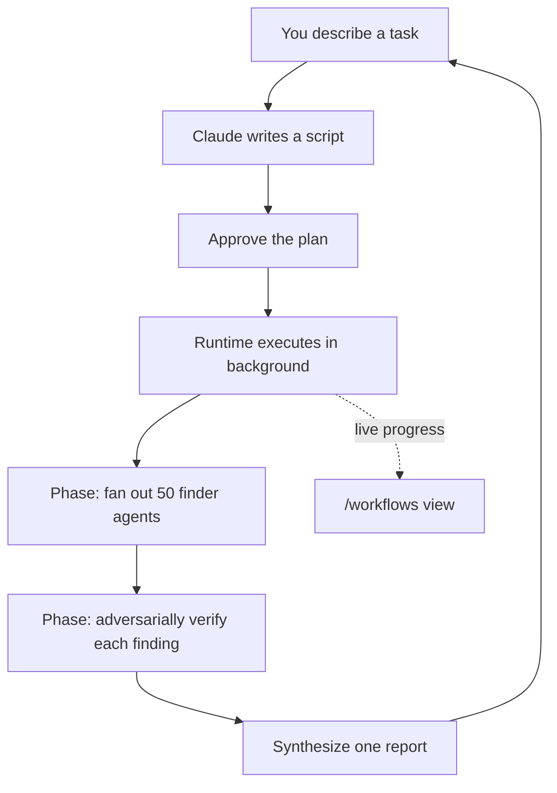

<LevelBadge level="advanced" />

<VerifyNote lastVerified="2026-06-28" source="https://code.claude.com/docs/en/workflows">
동적 워크플로우는 빠르게 발전하는 기능입니다. 트리거 키워드, 승인 옵션, 에이전트 상한, 사용 가능 여부는 Claude Code 릴리스마다 달라집니다 — 구체적인 사항은 공식 문서에서 확인하세요. Claude Code v2.1.154+와 유료 플랜이 필요합니다.
</VerifyNote>

<Callout type="objectives" items={["누가 플랜을 쥐고 있는지를 기준으로 워크플로우를 서브에이전트, 스킬, 에이전트 팀과 구분하기", "번들로 제공되는 /deep-research 명령으로 30초 안에 하나를 직접 보기", "세 가지 방법으로 직접 시작하기: ultracode 키워드, /effort ultracode, 또는 저장된 명령", "Yes를 누르기 전에 승인 프롬프트가 무엇으로부터 당신을 보호하는지 알기", "슬라이싱과 허용 목록으로 비용과 무인 실행을 통제하기"]} />

**동적 워크플로우**는 [서브에이전트](/docs/claude-code/subagents)를 대규모로 오케스트레이션하는 JavaScript 스크립트입니다. 당신이 작업을 설명하면, Claude가 *스크립트를 작성*하고, 런타임이 백그라운드에서 그것을 실행하는 동안 세션은 계속 응답합니다. 일반적인 다단계 작업이 Claude의 컨텍스트 창 안에서 턴마다 진행되는 것과 달리, 워크플로우는 **플랜을 코드로 옮깁니다** — 루프, 분기, 모든 중간 결과가 스크립트 변수 안에 존재하므로 당신의 컨텍스트에는 최종 답변만 담깁니다.

바로 그 한 가지 전환이 워크플로우를 한 번의 실행에서 *수십 또는 수백* 개의 에이전트로 확장할 수 있게 만듭니다. 반면 일반적인 위임은 소수에서 한계에 부딪힙니다.

## 언제 워크플로우를 선택할까

Claude Code는 다단계 작업을 실행하는 네 가지 방법을 제공합니다. 진짜 질문은 **누가 플랜을 쥐고 있는가**입니다:

| | [서브에이전트](/docs/claude-code/subagents) | [스킬](/docs/claude-code/skills) | 에이전트 팀 | **워크플로우** |
| :-- | :-- | :-- | :-- | :-- |
| 정체 | Claude가 생성하는 작업자 | Claude가 따르는 지침 | 동료 세션을 감독하는 리드 | 런타임이 실행하는 스크립트 |
| 다음에 무엇을 실행할지 결정하는 주체 | Claude, 턴마다 | Claude, 프롬프트에 따라 | 리드, 턴마다 | **스크립트** |
| 결과가 존재하는 곳 | 컨텍스트 창 | 컨텍스트 창 | 공유 작업 목록 | **스크립트 변수** |
| 규모 | 턴당 소수 | 서브에이전트와 동일 | 소수의 동료 | **수십에서 수백** |
| 중단 시 | 턴을 다시 시작 | 턴을 다시 시작 | 팀원은 계속 실행 | **세션 내에서 재개 가능** |

작업이 **한 대화로 조율할 수 있는 것보다 더 많은 에이전트**를 필요로 할 때, 또는 오케스트레이션을 **읽고 다시 실행할 수 있는 스크립트로 코드화**하고 싶을 때 워크플로우를 사용하세요. 대표적인 사례:

- **코드베이스 전역 버그 스윕** — 파인더를 모든 모듈에 펼친 다음, 독립적인 에이전트들이 각 발견 사항을 보고 전에 적대적으로 검증하게 합니다.
- **500개 파일 마이그레이션** — 파일당 하나의 에이전트, 각각 자체 워크트리에서, 검증 단계와 함께.
- 출처들이 단순히 요약되는 것이 아니라 **서로 교차 검증되어야** 하는 **리서치 질문**.
- 여러 독립적인 각도에서 초안을 잡아 보고, 확정하기 전에 서로 견주어 볼 만한 가치가 있는 **어려운 플랜**.

마지막 항목이 과소평가된 지점입니다: 워크플로우는 *반복 가능한 품질 패턴*(적대적 검토, 다각도 초안 작성, 다수결 검증)을 적용할 수 있으므로, 단지 더 많은 에이전트가 아니라 단일 패스보다 더 신뢰할 수 있는 결과를 얻습니다.



## 가장 빠르게 하나를 보는 방법: /deep-research

Claude Code는 모델을 시험해 보기 위해 직접 작성하지 않아도 되도록 내장 워크플로우를 함께 제공합니다. 아무 질문에나 실행해 보세요:

<PromptCard title="명령 하나로 워크플로우를 시험해 보기">{`/deep-research What changed in the Node.js permission model between v20 and v22?`}</PromptCard>

이 워크플로우는 웹 검색을 여러 각도로 펼치고, 출처를 가져와 **교차 검증**하고, 각 주장에 투표한 다음, **교차 검증을 통과하지 못한 주장은 걸러낸 출처 인용 보고서**를 반환합니다. 프롬프트가 뜨면 승인한 뒤 `/workflows`로 작동하는 모습을 지켜보세요. (WebSearch 도구가 사용 가능해야 합니다.)

## 직접 시작하는 세 가지 방법

**1. 한 번의 프롬프트로 요청하기.** 키워드 `ultracode`를 포함하거나, 그냥 평범한 말로 요청하세요("use a workflow", "run a workflow"). Claude는 세션의 노력 수준을 바꾸지 않고 그 단일 작업에 대한 스크립트를 작성합니다:

<PromptCard title="작업 하나를 워크플로우로 실행하기">{`ultracode: audit every API endpoint under src/routes/ for missing auth checks`}</PromptCard>

키워드는 입력란에서 강조 표시됩니다. 의도한 게 아니었나요? `Option+W`(macOS) 또는 `Alt+W`(Windows/Linux)를 눌러 해당 프롬프트에 대한 강조를 해제하세요.

:::note 키워드 변천사
v2.1.160 이전에는 리터럴 트리거 단어가 `workflow`였습니다. 흔한 단어 "workflow"가 실행을 발동시키지 않도록 `ultracode`로 이름이 변경되었습니다. 자연어 요청("run a workflow")은 **두** 버전 모두에서 작동합니다.
:::

**2. Claude가 결정하게 하기 — ultracode 노력.** 세션을 ultracode로 설정하면 Claude는 *모든* 실질적인 작업에 대해 워크플로우를 계획하며, 언제 워크플로우가 정당한지 스스로 판단합니다:

<PromptCard title="세션에 대해 자동 오케스트레이션 켜기">{`/effort ultracode`}</PromptCard>

Ultracode는 `xhigh` [추론 노력](/docs/api/thinking-and-effort)과 자동 오케스트레이션을 결합합니다. 하나의 요청이 여러 워크플로우로 이어질 수 있습니다 — 하나는 코드를 이해하기 위해, 하나는 변경하기 위해, 하나는 검증하기 위해. 그러면 모든 작업이 더 많은 토큰을 쓰고 더 오래 걸리므로, 일상적인 작업에는 `/effort high`로 되돌리세요. 이 설정은 현재 세션 동안만 유지됩니다.

**3. 저장된 명령이나 번들 명령 실행하기.** `/deep-research`, 또는 당신이 저장한(아래 참고) 어떤 워크플로우든 다른 슬래시 명령과 마찬가지로 `/` 자동완성에 나타납니다.

## 실행 전에 승인하기

워크플로우는 많은 에이전트를 생성할 수 있으므로, CLI는 계획된 단계들을 보여주고 먼저 묻습니다:

- **Yes, run it** — 실행 시작
- **Yes, and don't ask again for `[name]` in `[path]`** — 시작하고 이 프로젝트의 이 워크플로우에 대해서는 프롬프트 건너뛰기
- **View raw script** (`Ctrl+G`로 에디터에서 열기) — 결정하기 전에 읽기
- **No** — 취소 (`Tab`으로 프롬프트를 먼저 수정 가능)

프롬프트가 뜨는지 여부는 당신의 [권한 모드](/docs/claude-code/permissions)에 따라 다릅니다: **Default / accept-edits**는 (그 워크플로우에 대해 옵트아웃하지 않은 한) 매 실행마다 묻습니다. **Auto**는 첫 실행에서만 묻습니다. **bypass / `claude -p` / Agent SDK**는 절대 묻지 않습니다 — 실행이 즉시 시작됩니다.

:::warning 서브에이전트는 세션의 모드를 상속하지 않는다
당신 세션의 권한 모드가 무엇이든, 워크플로우가 생성하는 에이전트는 항상 **`acceptEdits`**에서 실행되고 당신의 [도구 허용 목록](/docs/claude-code/permissions)을 상속합니다 — 파일 편집은 자동 승인됩니다. 당신의 허용 목록에 *없는* 셸 명령, 웹 페치, MCP 도구는 여전히 실행을 멈추고 당신에게 프롬프트를 띄울 수 있습니다. 긴 무인 실행에서는 **시작 전에 에이전트가 필요로 하는 명령을 허용 목록에 추가하세요**, 그래야 당신을 기다리며 멈춰 서지 않습니다. [자율 실행 강화하기](/docs/security/hardening-autonomous-runs)를 참고하세요.
:::

## 실행이 작동하는 방식

런타임은 스크립트를 대화와 분리된 **격리 환경**에서 실행합니다 — 중간 결과는 스크립트 변수에 머물며 Claude의 컨텍스트에 결코 닿지 않습니다. 스크립트 자체는 **직접적인 파일시스템이나 셸 접근이 없습니다**: *에이전트*가 읽고, 쓰고, 명령을 실행합니다. 스크립트는 그들을 조율할 뿐입니다.

모든 실행은 자신의 스크립트를 `~/.claude/projects/` 아래 세션 디렉터리의 한 파일에 기록하고, Claude는 그 경로를 받습니다. 그래서 당신은 Claude에게 스크립트를 요청하고, 작성된 오케스트레이션을 읽고, 이전 실행과 diff를 비교하고, 편집한 뒤 Claude에게 당신이 편집한 버전에서 다시 시작하도록 요청할 수 있습니다.

런타임은 나쁜 스크립트가 통제 불능으로 치닫지 못하도록 몇 가지 상한을 강제합니다:

| 제약 | 이유 |
| :-- | :-- |
| 실행 중 사용자 입력 불가 (에이전트 권한 프롬프트만 실행을 멈춤) | 단계 간 승인을 위해서는 각 단계를 별도의 워크플로우로 실행 |
| 스크립트는 직접적인 파일시스템/셸 접근이 없음 | 에이전트가 일을 하고, 스크립트는 조율함 |
| 최대 **16개 동시** 에이전트 (코어가 적은 기기에서는 더 적음) | 로컬 리소스 사용을 제한 |
| 실행당 **총 1,000개 에이전트** | 폭주하는 루프 방지 |

## 실행을 지켜보고 관리하기

`/workflows`를 실행하면 진행 중인 실행과 완료된 실행이 나열되며, 하나를 선택하면 진행 뷰가 열립니다 — 각 단계가 에이전트 수, 총 토큰, 경과 시간과 함께 표시됩니다. 한 단계로 들어가고, 그다음 한 에이전트로 들어가면 그 프롬프트, 최근 도구 호출, 결과를 읽을 수 있습니다. 주요 컨트롤:

| 키 | 동작 |
| :-- | :-- |
| `↑` / `↓` | 단계 또는 에이전트 선택 |
| `Enter` / `→` | 들어가기; `Esc`로 빠져나오기 |
| `f` | 상태별로 에이전트 필터링 (v2.1.186+) |
| `p` | 실행 일시 정지 또는 재개 |
| `x` | 선택한 에이전트 중지 — 또는 포커스가 실행 전체에 있을 때는 실행 전체 중지 |
| `r` | 선택한 실행 중인 에이전트 재시작 |
| `s` | 이 실행의 스크립트를 명령으로 **저장** |

입력 상자 아래 작업 패널에도 한 줄짜리 진행 요약이 나타납니다. 아래쪽 화살표를 눌러 포커스를 옮기고, Enter로 펼치세요.

**재개:** 실행을 중지하고 나중에 재개하세요(`p`) — 이미 끝난 에이전트는 캐시된 결과를 반환하고, 나머지는 라이브로 실행됩니다. 재개는 **같은 세션 내에서** 작동합니다. 실행 도중 Claude Code를 종료하면 다음 세션은 처음부터 새로 시작합니다.

## 재사용을 위해 워크플로우 저장하기

Claude가 당신이 반복할 무언가에 대해 좋은 오케스트레이션을 작성했을 때 — 모든 브랜치에서 실행하는 리뷰 같은 것 — `/workflows`에서 `s`를 눌러 그 실행의 스크립트를 저장하세요. `Tab`으로 저장 위치를 전환합니다:

- 프로젝트의 `.claude/workflows/` — 저장소를 클론하는 모든 사람과 공유됨
- 홈의 `~/.claude/workflows/` — 어디서든 사용 가능, 당신만 봄

이후 세션에서 `/[name]`으로 실행됩니다. 저장된 워크플로우는 `args` 글로벌을 통해 입력을 받을 수 있어, 스크립트를 편집하는 대신 호출 시점에 매개변수를 지정합니다:

```text
> Run /triage-issues on issues 1024, 1025, and 1030
```

Claude는 목록을 구조화된 데이터로 전달하므로, 스크립트는 `args`에 대해 배열/객체 메서드를 직접 호출합니다.

## 비용에 유의하기

워크플로우는 많은 에이전트를 생성하므로, 한 번의 실행이 같은 작업을 대화로 하는 것보다 **상당히 더 많은 토큰**을 쓸 수 있고, 이는 당신 플랜의 사용량과 속도 제한에 합산됩니다. 두 가지 습관이 이것을 합리적으로 유지합니다:

- **먼저 슬라이스하기.** 지출을 가늠하기 위해 (전체 저장소가 아니라) 한 디렉터리, 또는 좁은 질문에 먼저 실행하세요. `/workflows`는 에이전트별 토큰 사용량을 라이브로 보여주며, 완료된 작업을 잃지 않고 언제든 중지할 수 있습니다.
- **모델 크기를 맞추기.** 스크립트가 한 단계를 다른 곳으로 라우팅하지 않는 한, 모든 에이전트는 당신 세션의 모델을 사용합니다. 큰 실행 전에 `/model`을 확인하고, 작업을 설명할 때 **가장 강력한 모델이 필요하지 않은 단계에는 더 작은 모델을 사용하도록** Claude에게 요청하세요. [비용 및 지연 시간](/docs/foundations/cost-and-latency)과 [모델 선택하기](/docs/api/choosing-a-model)를 참고하세요.

## 흔한 실수

- **실행 도중 사람의 개입을 기대하기.** 실행 도중 입력은 없습니다. 작업이 단계 간 당신의 승인을 필요로 한다면, 별도의 워크플로우로 나누세요.
- **무인 실행에서 허용 목록을 잊기.** 긴 워크플로우는 에이전트가 허용 목록에 없는 셸 명령에 부딪히는 순간 멈춥니다. 에이전트가 필요로 하는 것을 미리 승인하세요.
- **서브에이전트로 충분할 때 워크플로우에 손을 뻗기.** 턴당 위임된 작업 몇 개는 [서브에이전트](/docs/claude-code/subagents)가 담당하는 영역입니다. 워크플로우는 *함대* 규모이거나 오케스트레이션을 다시 실행 가능한 스크립트로 저장하고 싶을 때 그 오버헤드 값을 합니다.
- **일상적인 편집에 세션 내내 ultracode 노력을 실행하기.** 그것은 모든 것에 대해 워크플로우를 계획합니다 — 어려운 작업에는 훌륭하지만, 한 줄짜리 수정에는 낭비입니다. `/effort high`로 낮추세요.

<Quiz title="스스로 점검하기" questions={[{q: "워크플로우와 서브에이전트, 스킬, 또는 에이전트 팀의 결정적 차이는 무엇인가?", options: ["워크플로우는 에이전트를 생성할 수 있지만 나머지는 할 수 없다", "플랜이 Claude의 컨텍스트에서 턴마다가 아니라 런타임이 실행하는 스크립트 안에 존재한다", "워크플로우만이 유일하게 백그라운드에서 실행된다"], answer: 1, explain: "네 가지 모두 다단계 작업을 실행할 수 있습니다. 워크플로우에서는 루프, 분기, 중간 결과가 스크립트 변수에 존재하고 — Claude의 컨텍스트에는 최종 답변만 담깁니다 — 바로 이것이 수십에서 수백 개의 에이전트로 확장하게 만드는 것입니다."}, {q: "긴 무인 워크플로우를 실행하는데 에이전트가 허용 목록에 없는 셸 명령을 필요로 한다. 무슨 일이 일어나는가?", options: ["에이전트는 acceptEdits에서 실행되므로 자동 승인한다", "실행이 당신의 승인을 기다리며 멈춘다", "실행이 그 명령을 건너뛰고 계속한다"], answer: 1, explain: "워크플로우 에이전트는 acceptEdits에서 실행되므로 파일 편집은 자동 승인되지만, 허용 목록에 없는 셸 명령, 웹 페치, MCP 도구는 여전히 실행을 멈추고 당신에게 프롬프트를 띄웁니다. 무인 실행 전에 에이전트가 필요로 하는 것을 미리 승인하세요."}, {q: "큰 워크플로우를 확정하기 전에 비용이 얼마나 들지 가늠하는 가장 저렴한 방법은 무엇인가?", options: ["먼저 저장된 스크립트를 읽는다", "좁은 슬라이스 — 한 디렉터리 또는 한 질문 — 에 실행하고 /workflows에서 에이전트별 토큰을 지켜본다", "세션 전체를 더 작은 모델로 전환한다"], answer: 1, explain: "먼저 슬라이스하세요: 한 디렉터리 또는 좁은 질문에 실행하고, /workflows에서 라이브 에이전트별 토큰 사용량을 지켜보고, 완료된 작업을 잃지 않고 언제든 중지하세요."}]} />

<Callout type="takeaways" items={["워크플로우는 플랜을 코드로 옮깁니다 — 스크립트가 루프와 중간 결과를 쥐고 있으므로 실행이 수십에서 수백 개의 에이전트로 확장됩니다.", "/deep-research로 즉시 하나를 시험해 보세요; ultracode 키워드, /effort ultracode, 또는 저장된 /command로 직접 시작하세요.", "승인 프롬프트가 존재하는 이유는 한 번의 실행이 많은 에이전트를 생성할 수 있기 때문입니다 — Default와 accept-edits는 매 실행마다 묻고, Auto는 한 번 묻고, bypass와 헤드리스는 절대 묻지 않습니다.", "생성된 에이전트는 당신의 허용 목록과 함께 acceptEdits에서 실행되므로, 무인 실행 전에 그들이 필요로 하는 명령을 미리 승인하세요.", "워크플로우는 상당히 더 많은 토큰을 씁니다 — 먼저 슬라이스하고, 단계별로 모델 크기를 맞추고, 일상적인 편집에는 ultracode 노력을 /effort high로 되돌리세요."]} />

## 워크플로우 끄기

`/config`에서 **Dynamic workflows**를 끄거나, `~/.claude/settings.json`에 `"disableWorkflows": true`를 설정하거나, `CLAUDE_CODE_DISABLE_WORKFLOWS=1` 환경 변수를 설정하세요. 조직은 [관리 설정](/docs/claude-code/settings)에서 비활성화할 수 있습니다. 꺼져 있으면 번들 워크플로우 명령이 사라지고 `ultracode`는 더 이상 실행을 발동시키거나 `/effort` 메뉴에 나타나지 않습니다.

## 다음

- [서브에이전트와 병렬 에이전트](/docs/claude-code/subagents) — 워크플로우가 오케스트레이션하는 작업자 프리미티브
- [다중 서브에이전트 워크플로우 설계하기 (단계별 안내)](/docs/walkthroughs/multi-subagent-workflow)
- [장시간 실행 에이전트 하니스](/docs/frontiers/long-running-agent-harnesses) — 견고한 다중 에이전트 실행 뒤에 있는 설계 원칙
- [자율 실행 강화하기](/docs/security/hardening-autonomous-runs)
