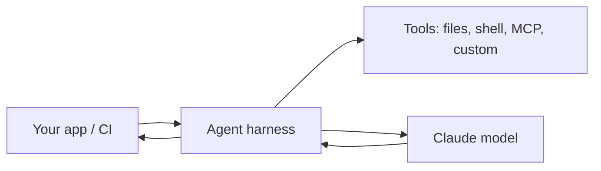

<LevelBadge level="advanced" />

<VerifyNote lastVerified="2026-06-20" source="https://code.claude.com/docs/en/sdk">
SDK 이름, 패키지 이름, 헤드리스 플래그는 변화합니다 — 공식 Claude Agent SDK / Claude Code 문서에서 확인하세요.
</VerifyNote>

Claude Code는 대화형 전용이 아닙니다. **헤드리스**(비대화형, 스크립트 가능)로 실행할 수 있으며, **Agent SDK**를 사용해 동일한 기반 하니스 위에서 **나만의 에이전트**를 구축할 수 있습니다.

## 헤드리스 모드

단일 프롬프트를 비대화형으로 실행하고 출력을 캡처합니다 — 스크립트, 프리커밋 훅, CI에 완벽합니다:

```bash
claude -p "Review the staged diff and list any bugs as a Markdown checklist"
```

입력을 파이프로 넣고, 결과를 받아냅니다. 승인을 기다리며 멈추지 않도록 [권한](/docs/claude-code/permissions)을 안전한 비대화형 태세로 설정해 함께 사용하세요 — 그리고 자동 실행이 비밀 값을 건드릴 수 없도록 **잠가 두세요**([자율 실행 강화하기](/docs/security/hardening-autonomous-runs) 참고).

전형적인 활용 사례: Claude가 모든 풀 리퀘스트를 검토하게 하는 CI 작업 — [PR 검토 워크스루](/docs/walkthroughs/pr-review-action)를 참고하세요.

## Agent SDK

**Claude Agent SDK**(Python과 TypeScript)를 사용하면 Claude Code를 구동하는 동일한 루프 위에서 — 도구 사용, 파일/셸 접근, 권한, 컨텍스트 관리 — 프로덕션 에이전트를 구축하되, *당신의* 애플리케이션에 연결할 수 있습니다.



단일 API 호출이나 직접 작성한 루프로는 부족해져서 배터리가 포함된(batteries-included) 에이전트 런타임이 필요할 때 이것을 선택하세요. 옵션의 스펙트럼 — 단일 호출 → 워크플로 → 커스텀 에이전트 → 매니지드 — 에 대해서는 [API로 에이전트 구축하기](/docs/api/building-agents)를 참고하세요.

## 헤드리스/SDK 대 대화형

| 모드 | 용도 |
|---|---|
| 대화형 Claude Code | 사람이 루프 안에 있는 일상적인 개발 |
| 헤드리스 (`claude -p`) | 스크립트, 프리커밋, CI 일회성 작업 |
| Agent SDK | 소프트웨어에 임베드된 프로덕션 에이전트 |

## 다음

- [모든 PR을 검토하는 GitHub Action (워크스루)](/docs/walkthroughs/pr-review-action)
- [API로 에이전트 구축하기](/docs/api/building-agents)
- [자율 실행 강화하기](/docs/security/hardening-autonomous-runs)
