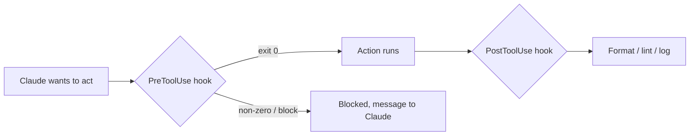

<LevelBadge level="advanced" />

<VerifyNote lastVerified="2026-06-23" source="https://code.claude.com/docs/en/hooks">
정확한 훅 이벤트 이름, stdin 페이로드, 그리고 차단 프로토콜은 진화합니다 — 특정 이벤트나 필드에 의존하기 전에 공식 훅 문서와 대조해 확인하세요.
</VerifyNote>

훅은 라이프사이클의 정의된 지점에서 **Claude Code가 자동으로 실행하는 셸 명령**입니다. [권한](/docs/claude-code/permissions)이 어떤 동작이 허용되는지 *여부*를 결정한다면, 훅은 그 주변에서 결정론적 로직 — 포매팅, 검증, 로깅, 게이트 — 을 *당신이* 실행하게 해줍니다. 훅은 "잊지 말고 기억해주세요" 대신 동작을 보장하게 만드는 방법입니다.

## 언제 훅을 꺼내야 하는가

- 모든 파일 편집 후 **자동 포맷 / 린트** (`PostToolUse`).
- 규칙을 위반하는 동작을 실행 전에 **차단** (`PreToolUse`).
- 세션이 끝나거나 작업이 완료될 때 **알림 또는 로그** (`Stop`).
- 세션 시작 시 **컨텍스트 주입**.

## 작동 방식

[`settings.json`](/docs/claude-code/settings)에서 훅을 등록하며, **이벤트**(그리고 종종 도구 매처)와 매칭합니다. 이벤트가 발생하면 Claude는 당신의 명령을 실행하고, **stdin에 JSON 페이로드**(도구 이름, 그 입력, 세션)를 전달합니다. 당신 명령의 종료 코드와 출력이 다음에 무슨 일이 일어날지 결정합니다.

```json
{
  "hooks": {
    "PostToolUse": [
      {
        "matcher": "Edit|Write",
        "hooks": [
          { "type": "command", "command": "jq -r '.tool_input.file_path' | xargs npx prettier --write" }
        ]
      }
    ]
  }
}
```

위 훅은 stdin JSON에서 편집된 파일의 경로(`.tool_input.file_path`)를 읽어 포맷합니다. 환경 변수에 경로가 담겨 있다고 가정하지 마세요 — **stdin에서 읽으세요.** 스크립트 위치를 찾는 데 유용한 `${CLAUDE_PROJECT_DIR}` 같은 경로 자리 표시자는 *사용 가능*합니다.

## 훅이 차단하는 방법

이벤트에 따라 두 가지:

- **종료 코드 2** — 훅이 동작을 실패시키고, **stderr**에 쓴 내용이 Claude가 보는 메시지가 됩니다. 단순하며 명령 훅에서 작동합니다.
- **stdout의 JSON (종료 0)** — 구조화된 결정을 반환합니다. `PreToolUse`의 경우 `deny`의 `permissionDecision`이고, `PostToolUse`/`Stop`/등의 경우 `{"decision": "block", "reason": "…"}`입니다.

```bash
#!/usr/bin/env bash
# PreToolUse hook on the Bash tool: refuse to delete things.
command=$(jq -r '.tool_input.command' < /dev/stdin)
if [[ "$command" == rm\ * || "$command" == *"rm -rf"* ]]; then
  echo "Blocked: destructive 'rm' is not allowed by policy." >&2
  exit 2
fi
exit 0
```

## 멘탈 모델



## 좋은 관행

- **훅을 빠르고 멱등하게 유지하세요** — 많이 실행됩니다.
- **진짜 문제에는 요란하게 실패하되**, 외형적인 문제에는 차단하지 마세요.
- **훅 출력을 Claude에 대한 피드백으로 다루세요** — 명확한 메시지는 Claude가 스스로 교정하는 데 도움이 됩니다.
- 훅은 당신 셸의 권한으로 실행됩니다 — 직접 작성하지 않은 훅은 검토하세요([서드파티 코드 검토하기](/docs/security/reviewing-third-party-code)).

## 흔한 실수

- **환경 변수에서 파일 경로 읽기.** 경로는 `$CLAUDE_FILE_PATH`가 아니라 stdin JSON(`.tool_input.file_path`)에 있습니다. stdin을 `jq`로 파이프하세요.
- **조용한 차단.** `PreToolUse` 훅이 stderr에 아무것도 없이 2로 종료하면, Claude는 차단되지만 *이유*를 모르고 적응할 수 없습니다. 항상 명확한 이유를 쓰세요.
- **느린 훅.** `PostToolUse` 훅은 *매번* 매칭되는 편집 후에 실행됩니다. 3초짜리 린터는 전체 세션을 굼뜨게 느껴지게 합니다 — 훅을 빠르게 유지하고, 이상적으로는 변경된 것에만 작용하게 하세요.
- **지나치게 광범위한 매처.** `matcher: ".*"`는 모든 도구에서 발동합니다. 정확한 이름, `Edit|Write` 목록, 또는 핸들러별 `if` 필드(예: `"if": "Bash(git push *)"`)로 좁히세요.
- **직접 작성하지 않은 훅을 신뢰하기.** 훅은 당신의 권한으로 임의의 셸을 실행합니다. 플러그인이나 템플릿의 훅은 먼저 검토하세요 — [서드파티 코드 검토하기](/docs/security/reviewing-third-party-code)를 참조하세요.

복사-붙여넣기용 스타터는 [훅 & settings.json 레시피](/docs/templates/hooks-settings)에 있습니다.

## 다음

- [settings.json](/docs/claude-code/settings) · [권한](/docs/claude-code/permissions)
- [스킬](/docs/claude-code/skills) — 전문성 대 자동화
- [자율 실행 강화하기](/docs/security/hardening-autonomous-runs)
