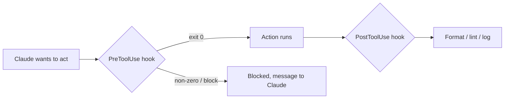

<LevelBadge level="advanced" />

<VerifyNote lastVerified="2026-06-20" source="https://docs.anthropic.com/en/docs/claude-code/hooks">
정확한 훅 이벤트 이름과 설정 스키마는 변화합니다 — 특정 이벤트에 의존하기 전에 공식 훅 문서와 대조해 확인하세요.
</VerifyNote>

훅은 Claude Code가 라이프사이클의 정해진 지점에서 **자동으로 실행하는 셸 명령**입니다. [권한](/docs/claude-code/permissions)이 어떤 동작을 *허용할지 여부*를 결정하는 반면, 훅은 그 주변에서 *당신이* 결정론적 로직을 실행하게 합니다 — 포매팅, 검증, 로깅, 게이트. 훅은 "잊지 말고 해주세요"가 아니라 동작을 보장된 것으로 만드는 방법입니다.

## 언제 훅을 쓰는가

- 모든 파일 편집 후 **자동 포맷 / 린트** (`PostToolUse`).
- 규칙을 위반하는 동작을 실행 전에 **차단** (`PreToolUse`).
- 세션이 끝나거나 작업이 완료될 때 **알림 또는 로깅** (`Stop`).
- 세션 시작 시 **컨텍스트 주입**.

## 작동 방식

[`settings.json`](/docs/claude-code/settings)에 훅을 등록하며, **이벤트**(그리고 흔히 도구 매처)에 매칭합니다. 이벤트가 발생하면 Claude가 당신의 명령을 실행하고 그 결과를 읽습니다 — 0이 아닌 종료 코드나 특정 출력은 동작을 **차단**하고 Claude에게 메시지를 되돌려 줄 수 있습니다.

```json
{
  "hooks": {
    "PostToolUse": [
      {
        "matcher": "Edit|Write",
        "hooks": [
          { "type": "command", "command": "npx prettier --write \"$CLAUDE_FILE_PATH\"" }
        ]
      }
    ]
  }
}
```

훅은 환경 변수/stdin을 통해 컨텍스트(예: 파일 경로, 도구 이름)를 받습니다 — 정확한 페이로드는 이벤트마다 다르므로 문서를 참고하세요.

## 멘탈 모델



## 좋은 관행

- **훅을 빠르고 멱등적으로 유지하세요** — 자주 실행됩니다.
- **진짜 문제에는 크게 실패하되**, 사소한 문제에는 차단하지 마세요.
- **훅 출력을 Claude에 대한 피드백으로 취급하세요** — 명확한 메시지는 스스로 교정하는 데 도움이 됩니다.
- 훅은 당신 셸의 권한으로 실행됩니다 — 직접 작성하지 않은 훅은 검토하세요([서드파티 코드 검토하기](/docs/security/reviewing-third-party-code)).

복사해 붙여 쓸 수 있는 시작본은 [훅 & settings.json 레시피](/docs/templates/hooks-settings)에 있습니다.

## 다음

- [settings.json](/docs/claude-code/settings) · [권한](/docs/claude-code/permissions)
- [스킬](/docs/claude-code/skills) — 전문성 대 자동화
- [자율 실행 강화하기](/docs/security/hardening-autonomous-runs)
