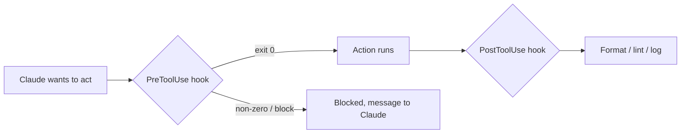

<LevelBadge level="advanced" />

<VerifyNote lastVerified="2026-06-23" source="https://code.claude.com/docs/en/hooks">
정확한 훅 이벤트 이름, stdin 페이로드, 차단 프로토콜은 계속 바뀝니다 — 특정 이벤트나 필드에 의존하기 전에 공식 hooks 문서와 대조해 확인하세요.
</VerifyNote>

훅(Hooks)은 Claude Code가 생명주기의 정해진 지점에서 **자동으로 실행하는 셸 명령**입니다. [권한](/docs/claude-code/permissions)이 어떤 동작을 *허용할지*를 결정한다면, 훅은 그 동작 주위에서 *당신이* 결정론적 로직을 실행하게 해줍니다 — 포맷팅, 검증, 로깅, 게이트. 훅은 "잊지 말고 해줘"가 아니라 보장된 동작을 만드는 방법입니다.

<Callout type="objectives" items={["명령이나 권한 대신 훅을 써야 할 때", "훅을 연결하는 방법: 이벤트, 매처, stdin의 JSON 페이로드", "훅이 동작을 차단하는 두 가지 방법 — 종료 코드 2 vs stdout의 JSON", "빠르고 안전한 훅을 느리고 조용한 훅과 구분하는 모범 사례와 흔한 실수"]} />

## 언제 훅을 써야 하나

동작이 단지 요청되는 것이 아니라 *보장*되기를 원할 때 훅을 쓰세요. 흔한 작업마다 대응하는 생명주기 이벤트가 있습니다:

- 모든 파일 편집 후 **자동 포맷/린트** (`PostToolUse`).
- 규칙을 위반하는 동작을 실행 전에 **차단** (`PreToolUse`).
- 세션이 끝나거나 작업이 완료될 때 **알림 또는 로깅** (`Stop`).
- 세션 시작 시 **컨텍스트 주입**.

<Flashcards title="한눈에 보는 훅 이벤트" cards={[{front: "PreToolUse", back: "동작이 실행되기 전에 발동합니다. 차단하거나 게이트를 걸 때 사용 — 예: 파괴적 명령을 실행 전에 거부."}, {front: "PostToolUse", back: "매칭된 동작 후에 발동합니다. 방금 변경된 내용을 포맷, 린트, 로깅할 때 사용."}, {front: "Stop", back: "세션이 끝나거나 작업이 완료될 때 발동합니다. 알림이나 로깅에 사용."}, {front: "Session start", back: "세션 시작 시 발동합니다. 컨텍스트를 주입할 때 사용."}]} />

## 작동 방식

훅은 [`settings.json`](/docs/claude-code/settings)에 등록하며, **이벤트**(그리고 대개 도구 매처)와 매칭합니다. 이벤트가 발동하면 Claude가 명령을 실행하며 **stdin으로 JSON 페이로드**(도구 이름, 입력, 세션)를 전달합니다. 명령의 종료 코드와 출력이 다음에 무엇이 일어날지 결정합니다.

<Steps items={[{title: "이벤트 매칭", body: "관심 있는 생명주기 이벤트 아래에 settings.json에 훅을 등록합니다 — 예를 들어 PostToolUse."}, {title: "매처로 좁히기", body: "도구 매처를 추가해 관련 도구에서만 훅이 발동하도록 합니다 — 예: 파일 편집에 대해 matcher \"Edit|Write\"."}, {title: "stdin에서 페이로드 읽기", body: "이벤트가 발동하면 Claude가 명령을 실행하고 stdin으로 JSON 페이로드 — 도구 이름, 입력, 세션 — 를 파이프합니다."}, {title: "다음에 무엇이 일어날지 결정", body: "명령의 종료 코드와 출력이 결과를 결정합니다: 동작을 진행시키거나, 로직을 실행하거나, 차단합니다."}]} />

```json
{
  "hooks": {
    "PostToolUse": [
      {
        "matcher": "Edit|Write",
        "hooks": [
          { "type": "command", "command": "jq -r '.tool_input.file_path' | xargs npx prettier --write" }
        ]
      }
    ]
  }
}
```

위 훅은 stdin JSON에서 편집된 파일의 경로(`.tool_input.file_path`)를 읽어 포맷합니다. 환경 변수에 경로가 들어 있다고 가정하지 마세요 — **stdin에서 읽으세요.** `${CLAUDE_PROJECT_DIR}` 같은 유용한 경로 플레이스홀더는 스크립트 위치를 찾는 데 *사용 가능*합니다.

## 훅이 차단하는 방법

이벤트에 따라 두 가지가 있습니다:

- **종료 코드 2** — 훅이 동작을 실패시키고, **stderr**에 쓴 내용이 Claude가 보는 메시지가 됩니다. 단순하며 명령 훅에서 잘 작동합니다.
- **stdout의 JSON (종료 0)** — 구조화된 결정을 반환합니다. `PreToolUse`의 경우 `permissionDecision`이 `deny`; `PostToolUse`/`Stop`/등의 경우 `{"decision": "block", "reason": "…"}`.

아래 스크립트는 Bash 도구에 대한 `PreToolUse` 훅입니다. 위에서 아래로 읽어보세요: stdin에서 명령을 꺼내, 파괴적으로 보이면 stderr에 이유를 쓰고 종료 2로 차단합니다.

```bash
#!/usr/bin/env bash
# PreToolUse hook on the Bash tool: refuse to delete things.
command=$(jq -r '.tool_input.command' < /dev/stdin)
if [[ "$command" == rm\ * || "$command" == *"rm -rf"* ]]; then
  echo "Blocked: destructive 'rm' is not allowed by policy." >&2
  exit 2
fi
exit 0
```

## 멘탈 모델

`PreToolUse` 훅은 동작 *전에* 실행되어 차단할 수 있고, `PostToolUse` 훅은 동작이 성공한 *후에* 실행되어 결과에 반응합니다.



## 모범 사례

- **훅을 빠르고 멱등하게 유지하세요** — 자주 실행됩니다.
- **진짜 문제에는 크게 실패**하되, 사소한 문제로 차단하지 마세요.
- **훅 출력을 Claude에 대한 피드백으로 취급하세요** — 명확한 메시지가 자가 수정을 돕습니다.
- 훅은 당신 셸의 권한으로 실행됩니다 — 직접 작성하지 않은 훅은 검토하세요 ([서드파티 코드 검토](/docs/security/reviewing-third-party-code)).

## 흔한 실수

- **환경 변수에서 파일 경로 읽기.** 경로는 `$CLAUDE_FILE_PATH`가 아니라 stdin JSON(`.tool_input.file_path`)에 있습니다. stdin을 `jq`로 파이프하세요.
- **조용한 차단.** `PreToolUse` 훅이 stderr에 아무것도 없이 종료 2로 나가면, Claude는 차단되지만 *왜*인지 모르고 적응할 수 없습니다. 항상 명확한 이유를 쓰세요.
- **느린 훅.** `PostToolUse` 훅은 매칭되는 *모든* 편집 후에 실행됩니다. 3초짜리 린터는 세션 전체를 굼뜨게 만듭니다 — 훅을 빠르게 유지하고, 이상적으로는 변경된 것에만 동작하게 하세요.
- **지나치게 넓은 매처.** `matcher: ".*"`는 모든 도구에서 발동합니다. 정확한 이름, `Edit|Write` 리스트, 또는 핸들러별 `if` 필드(예: `"if": "Bash(git push *)"`)로 좁히세요.
- **직접 작성하지 않은 훅을 신뢰하기.** 훅은 당신의 권한으로 임의의 셸을 실행합니다. 플러그인이나 템플릿에서 온 훅은 먼저 검토하세요 — [서드파티 코드 검토](/docs/security/reviewing-third-party-code) 참조.

<Callout type="warning" items={["훅은 당신의 권한으로 임의의 셸을 실행합니다 — 플러그인이나 템플릿에서 온 훅은 먼저 읽지 않고 절대 연결하지 마세요."]} />

복사-붙여넣기 시작점은 [Hooks & settings.json 레시피](/docs/templates/hooks-settings)에 있습니다.

<PromptCard title="편집된 파일 자동 포맷 (Edit|Write에 대한 PostToolUse)">{`{
  "hooks": {
    "PostToolUse": [
      {
        "matcher": "Edit|Write",
        "hooks": [
          { "type": "command", "command": "jq -r '.tool_input.file_path' | xargs npx prettier --write" }
        ]
      }
    ]
  }
}`}</PromptCard>

<Quiz title="스스로 점검하기" questions={[{q: "훅은 방금 편집된 파일의 경로를 어디서 찾나요?", options: ["$CLAUDE_FILE_PATH 환경 변수에서", "stdin의 JSON 페이로드, .tool_input.file_path에서", "Claude가 전달한 명령줄 인수에서"], answer: 1, explain: "경로는 환경 변수가 아니라 stdin JSON(.tool_input.file_path)에 있습니다. stdin을 jq로 파이프해서 읽으세요."}, {q: "PreToolUse 훅이 종료 코드 2로 나갑니다. 무슨 일이 일어나나요?", options: ["동작이 허용되고 stdout이 로깅됩니다", "동작이 차단되고, 훅이 stderr에 쓴 내용이 Claude가 보는 메시지가 됩니다", "종료 2는 예약되어 있어 Claude가 결과를 무시합니다"], answer: 1, explain: "종료 코드 2는 동작을 실패시킵니다; stderr가 Claude가 보는 메시지가 됩니다. Claude가 적응할 수 있도록 항상 명확한 이유를 쓰세요."}, {q: "matcher \".*\"는 왜 흔한 실수로 여겨지나요?", options: ["유효하지 않은 JSON이라 settings.json을 깨뜨립니다", "모든 도구에서 발동해 훅이 의도보다 훨씬 많이 실행됩니다 — 정확한 이름, Edit|Write 리스트, 또는 if 필드로 좁히세요", "Bash 도구에서만 매칭됩니다"], answer: 1, explain: "지나치게 넓은 매처는 모든 도구에서 발동합니다. 훅을 빠르고 표적화되게 유지하려면 좁히세요."}]} />

<Callout type="takeaways" items={["훅은 동작을 요청이 아니라 보장된 것으로 만듭니다 — 권한이 단지 허용하거나 거부하는 동작 주위에 결정론적 로직을 실행합니다.", "이벤트와 매처에 대해 settings.json에 훅을 등록합니다; Claude가 stdin으로 JSON 페이로드를 파이프하고 종료 코드와 출력을 읽습니다.", "파일 경로는 환경 변수가 아니라 stdin(.tool_input.file_path)에서 읽으세요.", "종료 코드 2(stderr가 메시지가 됨)나 stdout의 구조화된 JSON(종료 0)으로 차단하세요; 항상 명확한 이유를 포함하세요.", "훅을 빠르고 멱등하며 좁게 매칭되게 유지하세요 — 그리고 당신의 권한으로 실행되므로 직접 작성하지 않은 훅은 검토하세요."]} />

## 다음

- [settings.json](/docs/claude-code/settings) · [권한](/docs/claude-code/permissions)
- [Skills](/docs/claude-code/skills) — 전문성 vs 자동화
- [자율 실행 강화하기](/docs/security/hardening-autonomous-runs)
