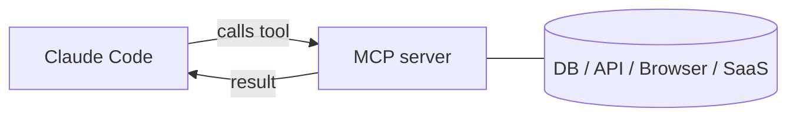

<LevelBadge level="advanced" />

<VerifyNote lastVerified="2026-06-23" source="https://code.claude.com/docs/en/mcp">
`claude mcp` 명령, 설정 스코프, 트랜스포트는 계속 발전합니다 — 공식 Claude Code MCP 문서와 modelcontextprotocol.io에서 확인하세요.
</VerifyNote>

**Model Context Protocol(MCP)**은 AI를 외부 도구 및 데이터에 연결하는 오픈 표준입니다. **MCP 서버**는 기능(데이터베이스 쿼리, GitHub PR 열기, 브라우저 조작)을 노출하고, Claude Code가 여기에 연결해 세션 중에 **그 도구들을 호출**할 수 있습니다. 파일 시스템과 셸 너머로 Claude를 확장하는 방법입니다.

<Callout type="objectives" items={["MCP 서버가 무엇이며 Claude Code가 그 도구를 어떻게 호출하는지 설명한다", "두 가지 트랜스포트 구분: 로컬 stdio vs 원격 HTTP/SSE", "claude mcp add로 서버를 추가하고 그것이 쓰는 JSON을 읽는다", "누가 서버를 볼지에 맞는 스코프(local, project, user)를 고른다", "실제 데이터베이스를 Claude에 끝까지 연결한다", "대부분이 겪는 보안 및 설정 함정을 피한다"]} />

## 그 형태



Claude가 사용할 수 있는 서버를 선언하고, 각 서버는 스키마를 가진 도구 집합을 게시하며, Claude가 다른 도구처럼 그것을 골라 호출합니다.

<Flashcards title="MCP 용어" cards={[{front: "Model Context Protocol (MCP)", back: "AI를 외부 도구 및 데이터에 연결하는 오픈 표준."}, {front: "MCP 서버", back: "기능 — 데이터베이스 쿼리, GitHub PR 열기, 브라우저 조작 — 을 호출 가능한 도구로 노출하는 프로그램."}, {front: "도구(Tool)", back: "MCP 서버가 스키마와 함께 게시하는 기능; Claude가 다른 도구처럼 골라 호출한다."}, {front: "트랜스포트", back: "Claude가 서버에 도달하는 방법: stdio(로컬 프로세스) 또는 원격 HTTP/SSE(호스팅됨, 대개 OAuth)."}, {front: "스코프", back: "누가 서버를 보는가: local(당신, 이 프로젝트), project(커밋된 팀), user(당신, 모든 곳)."}]} />

## 트랜스포트

Claude가 서버에 도달하는 방법은 두 가지입니다. 서버가 어디서 실행되는지에 따라 고르세요.

- **stdio** — Claude가 실행하는 로컬 프로세스(로컬 도구/CLI에 적합).
- **원격 (HTTP/SSE)** — 호스팅된 서버, 대개 OAuth 사용.

## 서버 설정

가장 빠른 길은 `claude mcp add` 명령입니다 — 설정을 대신 써줍니다. 다음 순서를 따라 0에서 연결된 서버까지 가세요.

<Steps items={[{title: "로컬 stdio 서버 추가", body: "claude mcp add 실행 — -- 뒤의 모든 것이 Claude가 대신 실행하는 실행 명령입니다."}, {title: "또는 원격 HTTP 서버 추가", body: "--transport http와 스코프를 전달한 뒤 서버 URL을 씁니다. 원격 서버는 대개 호스팅되며 OAuth를 사용합니다."}, {title: "연결된 것 보기", body: "claude mcp list를 실행해 설정된 서버와 연결 상태를 봅니다."}, {title: "검사 및 인증", body: "세션 안에서 /mcp를 써서 서버의 도구를 검사하고 원격 서버를 인증합니다."}]} />

<PromptCard title="로컬 stdio 서버 추가">{`# A local stdio server (everything after -- is the launch command)
claude mcp add github -- npx -y @modelcontextprotocol/server-github`}</PromptCard>

<PromptCard title="원격 HTTP 서버 추가 (프로젝트와 공유)">{`# A remote HTTP server, shared with everyone on the project
claude mcp add --transport http --scope project linear https://mcp.linear.app/mcp`}</PromptCard>

내부적으로는 그저 JSON입니다. **project** 스코프 서버는 리포지토리 루트의 `.mcp.json`에 들어갑니다 — 커밋하면 팀 전체가 같은 도구를 얻습니다:

```json
{
  "mcpServers": {
    "github": { "command": "npx", "args": ["-y", "@modelcontextprotocol/server-github"] }
  }
}
```

### 스코프가 누가 서버를 볼지 결정한다

| 스코프 | 위치 | 용도 |
|---|---|---|
| `local` (기본값) | 당신의 사용자 설정, 이 프로젝트만 | 개인 실험, 시크릿 |
| `project` | 리포지토리의 `.mcp.json` (커밋됨) | 팀 전체가 공유해야 할 도구 |
| `user` | 당신의 사용자 설정, 모든 프로젝트 | 어디서나 원하는 서버 |

`claude mcp list`를 실행해 연결된 것을 보고, 세션 안에서 `/mcp`로 도구를 검사하고 원격 서버를 인증하세요. 복사-붙여넣기 시작점은 [MCP 설정 & 서버 스캐폴드](/docs/templates/mcp-config)를 참조하세요.

## 실습 예제: Claude에 데이터베이스 주기

쿼리 결과를 붙여넣는 대신 Claude가 로컬 Postgres에 대해 질문에 답하게 하고 싶다고 합시다. 서버를 추가하세요(project 스코프라 팀원도 상속합니다):

<PromptCard title="프로젝트 스코프로 Postgres 서버 추가">{`claude mcp add --scope project db -- npx -y @modelcontextprotocol/server-postgres "postgresql://localhost/app"`}</PromptCard>

이제 세션에서 평범한 언어로 질문하고 Claude가 쿼리 루프를 대신 돌게 하세요:

<PromptCard title="데이터베이스에 대해 질문하기">{`How many users signed up last week? Check the DB.`}</PromptCard>

Claude가 서버의 `query` 도구를 호출해 행을 받아 답합니다 — 복사-붙여넣기 루프가 없습니다. project 스코프이므로 리포지토리를 풀한 팀원은 Claude Code를 여는 순간 같은 기능을 얻습니다. 읽기만 원한다면 연결 문자열을 읽기 전용으로 유지하세요.

## 신뢰 & 보안

<Callout type="warning" items={["MCP 서버는 코드를 실행하고 데이터를 읽고 동작을 취할 수 있습니다 — 신뢰하는 서버만 연결하세요.", "각 서버에 필요한 최소 권한만 주세요.", "서버가 반환하는 외부 콘텐츠는 프롬프트 인젝션을 실을 수 있습니다.", "서드파티 서버는 연결 전에 검토하세요."]} />

:::warning MCP 서버를 소프트웨어 설치처럼 다루세요
MCP 서버는 코드를 실행하고 데이터를 읽고 동작을 취할 수 있습니다. 신뢰하는 서버만 연결하고, **최소 권한**만 주며, 서버가 반환하는 외부 콘텐츠는 [프롬프트 인젝션](/docs/security/prompt-injection)을 실을 수 있음을 기억하세요. 서드파티 서버는 먼저 검토하세요 — [서드파티 코드 검토](/docs/security/reviewing-third-party-code) 참조.
:::

## 앱에서도 쓰이는 MCP

MCP는 Claude 앱의 **커넥터(Connectors)**도 구동합니다 — 같은 표준, 다른 표면. [앱의 커넥터(MCP)](/docs/claude-app/connectors)와, API의 경우 [MCP & 도구 연결](/docs/api/mcp)을 참조하세요.

## 흔한 실수

- **잘못된 스코프.** `local` 스코프로 추가한 서버는 팀원에게 안 보입니다; 당신만 쓰려던 것은 `project` 스코프로 커밋하면 안 됩니다. 신중히 고르세요.
- **너무 많은 서버, 너무 많은 도구.** 연결된 각 서버가 도구 스키마를 컨텍스트에 더합니다. 카탈로그 전체가 아니라 작업에 필요한 것만 연결하세요.
- **과도한 권한 연결.** Claude가 정말 써야 하는 게 아니면 데이터베이스 서버에 읽기 전용 역할을 주세요. MCP는 기능을 실제로 만듭니다 — 권한을 좁히세요.
- **인젝션 위험 잊기.** 서버가 반환하는 모든 것(웹 페이지, 이슈 본문, 행)은 [프롬프트 인젝션](/docs/security/prompt-injection)을 실을 수 있는 신뢰할 수 없는 텍스트입니다. 강력한 쓰기 가능 서버를 신뢰할 수 없는 읽기 가능 서버 옆에 생각 없이 연결하지 마세요.

<Quiz title="스스로 점검하기" questions={[{q: "Claude가 스스로 실행하는 로컬 프로세스인 트랜스포트는 무엇인가요?", options: ["원격 HTTP/SSE", "stdio", "OAuth"], answer: 1, explain: "stdio는 Claude가 실행하는 로컬 프로세스입니다 — 로컬 도구와 CLI에 이상적. 원격 HTTP/SSE는 호스팅된 서버로, 대개 OAuth를 씁니다."}, {q: "project 스코프 서버는 어디에 쓰이며 무엇이 이점인가요?", options: ["당신의 사용자 설정; 당신만 봅니다", "리포지토리 루트의 .mcp.json; 커밋하면 팀 전체가 같은 도구를 얻습니다", "숨겨진 전역 캐시; 아무도 편집할 수 없습니다"], answer: 1, explain: "project 스코프는 리포지토리 루트의 커밋된 .mcp.json에 들어가므로, 리포지토리를 풀한 팀원이 같은 도구를 상속합니다."}, {q: "Claude가 읽기만 하면 되는데 왜 데이터베이스 연결을 읽기 전용으로 유지하나요?", options: ["쿼리가 더 빨리 실행됩니다", "최소 권한 — MCP는 기능을 실제로 만드므로, 정말 필요하지 않으면 쓰기 접근을 주지 마세요", "읽기 전용이 프로토콜에서 요구됩니다"], answer: 1, explain: "서버에 필요한 최소 권한만 주세요. MCP는 기능을 실제로 만들므로, 읽기 전용 역할이 의도치 않은 쓰기를 막습니다."}]} />

<Callout type="takeaways" items={["MCP는 오픈 표준입니다; MCP 서버는 Claude Code가 다른 도구처럼 호출하는 도구를 노출합니다.", "두 트랜스포트: 로컬 stdio(Claude가 실행하는 프로세스)와 원격 HTTP/SSE(호스팅됨, 대개 OAuth).", "claude mcp add가 설정을 대신 써줍니다; 내부적으로는 JSON이고, project 스코프는 커밋된 .mcp.json에 있습니다.", "스코프가 가시성을 제어합니다: local(당신, 이 프로젝트), project(팀을 위해 커밋됨), user(당신, 모든 곳).", "서버를 소프트웨어 설치처럼 다루세요: 신뢰, 최소 권한, 그리고 서버가 반환하는 모든 것에서 프롬프트 인젝션 주의."]} />

## 다음

- [첫 MCP 서버 만들고 연결하기 (워크스루)](/docs/walkthroughs/first-mcp-server)
- [MCP 설정 & 서버 스캐폴드](/docs/templates/mcp-config)
- [에이전트 & 도구 보안](/docs/security/securing-agents)
