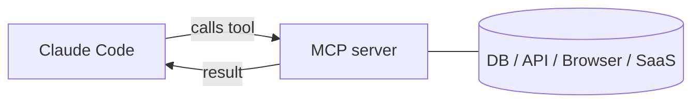

<LevelBadge level="advanced" />

<VerifyNote lastVerified="2026-06-23" source="https://code.claude.com/docs/en/mcp">
`claude mcp` 명령, 구성 범위, 그리고 전송 방식은 진화합니다 — 공식 Claude Code MCP 문서와 modelcontextprotocol.io에서 확인하세요.
</VerifyNote>

**Model Context Protocol (MCP)**은 AI를 외부 도구 및 데이터에 연결하기 위한 개방형 표준입니다. **MCP 서버**는 기능(데이터베이스 쿼리, GitHub PR 열기, 브라우저 구동)을 노출하고, Claude Code는 여기에 연결하여 세션 중에 **그 도구들을 호출**할 수 있습니다. 이것이 당신의 파일시스템과 셸을 넘어 Claude를 확장하는 방법입니다.

## 그 형태



Claude가 사용할 수 있는 서버를 선언하고, 각 서버는 스키마와 함께 도구 집합을 게시하며, Claude는 다른 도구처럼 그것들을 선택하고 호출합니다.

## 전송 방식

- **stdio** — Claude가 실행하는 로컬 프로세스(로컬 도구/CLI에 적합).
- **원격 (HTTP/SSE)** — 호스팅된 서버, 종종 OAuth와 함께.

## 서버 구성하기

가장 빠른 경로는 `claude mcp add` 명령입니다 — 구성을 당신을 위해 작성해줍니다:

```bash
# A local stdio server (everything after -- is the launch command)
claude mcp add github -- npx -y @modelcontextprotocol/server-github

# A remote HTTP server, shared with everyone on the project
claude mcp add --transport http --scope project linear https://mcp.linear.app/mcp
```

내부적으로 그것은 그냥 JSON입니다. **project** 범위의 서버는 리포 루트의 `.mcp.json`에 들어갑니다 — 체크인하면 팀 전체가 동일한 도구를 갖게 됩니다:

```json
{
  "mcpServers": {
    "github": { "command": "npx", "args": ["-y", "@modelcontextprotocol/server-github"] }
  }
}
```

**범위가 누가 서버를 볼지 결정합니다:**

| 범위 | 위치 | 용도 |
|---|---|---|
| `local` (기본값) | 당신의 사용자 설정, 이 프로젝트만 | 개인 실험, 비밀 정보 |
| `project` | 리포의 `.mcp.json` (커밋됨) | 팀 전체가 공유해야 할 도구 |
| `user` | 당신의 사용자 설정, 모든 프로젝트 | 어디서나 원하는 서버 |

`claude mcp list`를 실행하면 무엇이 연결되었는지 볼 수 있고, 세션 안에서 `/mcp`로 도구를 검사하고 원격 서버를 인증할 수 있습니다. 복사-붙여넣기용 스타터는 [MCP 구성 & 서버 스캐폴드](/docs/templates/mcp-config)를 참조하세요.

## 실전 예시: Claude에게 데이터베이스를 주기

쿼리 결과를 붙여넣는 대신 Claude가 로컬 Postgres에 대해 질문에 답하기를 원한다고 합시다. 서버를 추가하세요(project 범위로, 팀원들이 상속하도록):

```bash
claude mcp add --scope project db -- npx -y @modelcontextprotocol/server-postgres "postgresql://localhost/app"
```

이제 세션에서 물어볼 수 있습니다: *"지난주에 가입한 사용자가 몇 명이야? DB를 확인해줘."* Claude는 서버의 `query` 도구를 호출하고, 행을 돌려받아 답합니다 — 복사-붙여넣기 루프가 없습니다. project 범위이므로, 리포를 풀하는 팀원은 Claude Code를 여는 순간 동일한 기능을 얻습니다. 읽기만 원한다면 연결 문자열을 읽기 전용으로 유지하세요.

## 신뢰 & 보안

:::warning MCP 서버는 소프트웨어를 설치하는 것처럼 다루세요
MCP 서버는 코드를 실행하고 데이터를 읽고 동작을 취할 수 있습니다. 신뢰하는 서버만 연결하고, 필요한 **최소 권한**만 부여하며, 그것들이 반환하는 모든 외부 콘텐츠가 [프롬프트 인젝션](/docs/security/prompt-injection)을 담을 수 있음을 기억하세요. 서드파티 서버는 먼저 검토하세요 — [서드파티 코드 검토하기](/docs/security/reviewing-third-party-code)를 참조하세요.
:::

## 앱에서의 MCP도

MCP는 Claude 앱의 **커넥터(Connectors)**도 구동합니다 — 같은 표준, 다른 표면입니다. [앱에서의 커넥터 (MCP)](/docs/claude-app/connectors)를 참조하고, API의 경우 [MCP & 도구 연결하기](/docs/api/mcp)를 참조하세요.

## 흔한 실수

- **잘못된 범위.** `local` 범위로 추가된 서버는 팀원들에게 나타나지 않습니다. 당신만 원했던 서버는 `project` 범위로 커밋되면 안 됩니다. 신중하게 고르세요.
- **너무 많은 서버, 너무 많은 도구.** 연결된 각 서버는 그 도구 스키마를 컨텍스트에 추가합니다. 전체 카탈로그가 아니라 작업에 필요한 것만 연결하세요.
- **과도한 권한의 연결.** Claude가 정말로 써야 하는 경우가 아니면 데이터베이스 서버에 읽기 전용 역할을 부여하세요. MCP는 기능을 실제로 만듭니다 — 범위를 좁히세요.
- **인젝션 위험을 잊기.** 서버가 반환하는 모든 것(웹 페이지, 이슈 본문, 행)은 [프롬프트 인젝션](/docs/security/prompt-injection)을 담을 수 있는 신뢰할 수 없는 텍스트입니다. 충분히 생각하지 않고 강력한 쓰기 가능 서버를 신뢰할 수 없는 읽기 가능 서버 옆에 연결하지 마세요.

## 다음

- [첫 MCP 서버 구축 & 연결하기 (둘러보기)](/docs/walkthroughs/first-mcp-server)
- [MCP 구성 & 서버 스캐폴드](/docs/templates/mcp-config)
- [에이전트 & 도구 보안하기](/docs/security/securing-agents)
