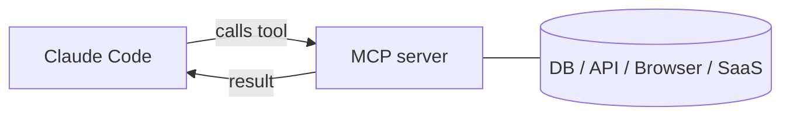

<LevelBadge level="advanced" />

<VerifyNote lastVerified="2026-06-20" source="https://docs.anthropic.com/en/docs/claude-code/mcp">
MCP 설정 구문, 스코프, 전송 방식은 변화합니다 — 공식 Claude Code MCP 문서와 modelcontextprotocol.io에서 확인하세요.
</VerifyNote>

**Model Context Protocol (MCP)**은 AI를 외부 도구 및 데이터와 연결하기 위한 개방형 표준입니다. **MCP 서버**는 기능(데이터베이스 쿼리, GitHub PR 열기, 브라우저 구동)을 노출하며, Claude Code는 여기에 연결해 세션 중에 **그 도구들을 호출**할 수 있습니다. 이것이 Claude를 파일시스템과 셸 너머로 확장하는 방법입니다.

## 그 형태



Claude가 사용할 수 있는 서버를 선언하면, 각 서버는 스키마를 가진 도구 집합을 게시하고, Claude는 다른 도구와 마찬가지로 그것들을 선택해 호출합니다.

## 전송 방식

- **stdio** — Claude가 실행하는 로컬 프로세스(로컬 도구/CLI에 좋음).
- **원격 (HTTP/SSE)** — 호스팅된 서버이며, 종종 OAuth를 사용.

## 서버 설정

서버는 명령/URL과 인증 정보를 가지고 설정됩니다(흔히 `.mcp.json`에서 그리고/또는 설정을 통해). 스코프는 서버가 어디에서 사용 가능한지(나만, 또는 프로젝트와 공유)를 제어합니다. 복사해 붙여 쓸 시작본은 [MCP 설정 & 서버 스캐폴드](/docs/templates/mcp-config)를 참고하세요.

```json
{
  "mcpServers": {
    "github": { "command": "npx", "args": ["-y", "@modelcontextprotocol/server-github"] }
  }
}
```

## 신뢰 & 보안

:::warning MCP 서버를 소프트웨어 설치처럼 취급하세요
MCP 서버는 코드를 실행하며 데이터를 읽고 동작을 수행할 수 있습니다. 신뢰하는 서버만 연결하고, 필요한 **최소 권한**만 부여하며, 서버가 반환하는 어떤 외부 콘텐츠든 [프롬프트 인젝션](/docs/security/prompt-injection)을 담을 수 있다는 점을 기억하세요. 서드파티 서버는 먼저 검토하세요 — [서드파티 코드 검토하기](/docs/security/reviewing-third-party-code)를 참고하세요.
:::

## 앱 안에서의 MCP

MCP는 Claude 앱의 **커넥터(Connectors)**도 구동합니다 — 같은 표준, 다른 환경입니다. [앱 안의 커넥터(MCP)](/docs/claude-app/connectors)를, API에 대해서는 [MCP & 도구 연결하기](/docs/api/mcp)를 참고하세요.

## 다음

- [첫 MCP 서버 구축 & 연결하기 (워크스루)](/docs/walkthroughs/first-mcp-server)
- [MCP 설정 & 서버 스캐폴드](/docs/templates/mcp-config)
- [에이전트 & 도구 보안](/docs/security/securing-agents)
