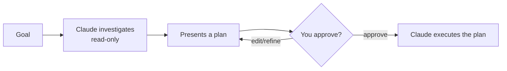

<LevelBadge level="beginner" />

<Callout type="objectives" items={["플랜 모드가 무엇을 하며 왜 읽기 전용인지 설명한다", "먼저 계획할 때와 건너뛸 수 있을 때를 판단한다", "조사-제안-승인-실행 루프를 짚어본다", "플랜 모드와 권한을 구분하고 함께 쓴다"]} />

<VerifyNote lastVerified="2026-06-20" source="https://code.claude.com/docs/en">
플랜 모드에 진입하는 방법(단축키/플래그)은 릴리스마다 바뀔 수 있습니다 — 공식 Claude Code 문서를 확인하세요.
</VerifyNote>

## 핵심 아이디어

계약자에게 집 열쇠를 넘기는 것과, 먼저 둘러보고 *무엇*을 바꿀지 적어달라고 하는 것을 상상해 보세요. 플랜 모드는 그 둘러보기입니다.

**플랜 모드**는 Claude Code를 **읽기 전용**으로 만듭니다: 코드베이스를 탐색하고, 검색하고, 추론할 수 있지만 — **파일을 편집하거나 상태를 바꾸는 명령을 실행하지 않습니다**. 대신 계획을 만들고 당신의 승인을 기다립니다.

<Callout type="tip" items={["읽기 전용은 Claude가 생각은 하되 행동은 하지 않음을 뜻합니다 — 당신이 진행하라고 할 때까지 파일 편집도, 상태 변경 명령도 없습니다."]} />

## 왜 가장 안전한 시작인가

크거나, 위험하거나, 낯선 무엇이든, Claude가 리포지토리를 건드리기 *전에* 무엇을 의도하는지 보고 싶을 것입니다. 플랜 모드는 **생각**과 **행동**을 분리합니다:

대가: 잘못된 가정이 잘못된 코드가 되기 *전에* 잡아냅니다.

## 언제 쓰나

<Callout type="tip" items={["크거나 다중 파일 변경, 마이그레이션, 리팩터링에는 항상", "아직 완전히 모르는 코드베이스에서 작업할 때", "팀원과 공유할 검토 가능한 계획을 원할 때"]} />

작고 뻔한 편집에는 건너뛸 수 있지만 — 의심스러우면 먼저 계획하세요.

## 실전에서 작동하는 법

루프를 따르세요. 각 단계가 다음 단계를 얻습니다 — Claude는 당신이 승인한 *뒤에야* 편집으로 전환합니다.

<Steps items={[{title: "플랜 모드에 진입하고 목표를 말하기", body: "읽기 전용 모드로 전환한 뒤, 무엇을 이루고 싶은지 설명합니다."}, {title: "Claude가 조사", body: "관련 파일을 읽고 명확화 질문을 합니다."}, {title: "Claude가 단계별 계획을 반환", body: "바꿀 파일, 접근 방식, 결과를 검증하는 법."}, {title: "당신이 승인하거나 다듬기", body: "승인 후에야 Claude가 변경으로 전환합니다."}]} />

### 직접 해보기

이것을 실제 계획 세션에 붙여넣고 루프가 펼쳐지는 것을 지켜보세요:

<PromptCard title="계획 세션 시작하기">{`I want to migrate our auth from sessions to JWT. Stay in Plan Mode: investigate the current setup, ask anything you need, then propose a step-by-step plan with files to change and how to verify — don't edit anything yet.`}</PromptCard>

:::tip CLAUDE.md와 짝지으세요
좋은 [CLAUDE.md](/docs/claude-code/claude-md)는 계획을 더 날카롭게 만듭니다 — Claude가 당신의 관례와 가드레일을 이미 염두에 두고 계획합니다.
:::

## 플랜 모드 vs 권한

전형적인 혼동. 둘은 다른 문제를 풀고 함께 작동합니다:

- **플랜 모드** = "조사하고 제안하되, 아직 행동하지 마." (이 페이지.)
- **[권한](/docs/claude-code/permissions)** = 일단 행동하면, *어떤* 동작이 묻지 않고 허용되는가.

**지금 행동할지 여부**(플랜 모드) 대 **일단 행동하면 어떤 동작이 허용되는가**(권한)로 생각하세요.

<Flashcards cards={[{front: "플랜 모드는 Claude Code를 어떤 상태로 두나요?", back: "읽기 전용 — 탐색, 검색, 추론은 할 수 있지만 당신이 승인할 때까지 파일을 편집하거나 상태 변경 명령을 실행하지 않습니다."}, {front: "플랜 모드 루프는 무엇인가요?", back: "조사(읽기 전용) → 계획 제시 → 당신이 승인하거나 다듬기 → Claude가 실행."}, {front: "언제 플랜 모드를 써야 하나요?", back: "크거나 위험하거나 낯선 작업(다중 파일 변경, 마이그레이션, 리팩터링, 미지의 코드베이스)에는 기본으로. 작고 뻔한 편집만 건너뛰세요."}, {front: "플랜 모드 vs 권한?", back: "플랜 모드는 지금 행동할지를, 권한은 일단 행동하면 어떤 동작이 허용되는지를 다스립니다."}]} />

<Callout type="takeaways" items={["플랜 모드는 읽기 전용입니다: Claude가 탐색하고 제안하지만 당신이 승인할 때까지 절대 편집하거나 상태 변경 명령을 실행하지 않습니다", "크거나 위험하거나 낯선 작업에는 기본으로 쓰고; 작고 뻔한 편집만 건너뛰세요", "루프는 조사 → 제안 → 승인/다듬기 → 실행입니다", "플랜 모드는 지금 행동할지를, 권한은 일단 행동하면 어떤 동작이 허용되는지를 다스립니다"]} />

<Quiz title="스스로 점검하기" questions={[{q: "플랜 모드에 있는 동안 Claude Code는 무엇을 할 수 있나요?", options: ["파일을 편집하고 아무 명령이나 실행", "탐색, 검색, 추론 — 하지만 파일 편집이나 상태 변경 명령은 안 함", "질문에만 답하고 파일 접근은 전혀 없음"], answer: 1, explain: "플랜 모드는 읽기 전용입니다: Claude가 코드베이스를 탐색하고, 검색하고, 추론할 수 있지만 파일을 편집하거나 상태 변경 명령을 실행하지 않습니다."}, {q: "언제 플랜 모드를 써야 하나요?", options: ["한 줄짜리 오타 수정에만", "크거나 다중 파일 변경, 마이그레이션, 리팩터링, 또는 낯선 코드베이스에", "절대 — 그냥 느리게 만들 뿐"], answer: 1, explain: "크거나 다중 파일 변경, 마이그레이션, 리팩터링에는 항상 쓰고, 완전히 모르는 코드베이스에서 작업할 때도 쓰세요. 작고 뻔한 편집은 건너뛸 수 있습니다."}, {q: "플랜 모드 루프의 올바른 순서는 무엇인가요?", options: ["실행, 그다음 조사, 그다음 승인", "조사(읽기 전용), 계획 제시, 당신이 승인하거나 다듬기, 그다음 Claude가 실행", "먼저 승인, 그다음 Claude가 조사하고 편집"], answer: 1, explain: "Claude가 읽기 전용으로 조사하고, 계획을 제시하고, 당신이 승인하거나 다듬고, 그다음에야 계획 실행으로 전환합니다."}, {q: "플랜 모드와 권한은 어떻게 다른가요?", options: ["같은 기능의 두 이름", "플랜 모드 = 조사하고 제안, 아직 행동 안 함; 권한 = 일단 행동하면 어떤 동작이 묻지 않고 허용되는가", "권한은 계획할지를 결정; 플랜 모드는 어떤 파일을 편집할지 결정"], answer: 1, explain: "플랜 모드는 생각과 행동을 분리합니다. 권한은 Claude가 일단 행동하면 어떤 동작이 묻지 않고 허용되는지를 제어합니다. 둘은 함께 작동합니다."}]} />

## 다음

- [권한 & 권한 모드](/docs/claude-code/permissions)
- [컨텍스트 관리](/docs/claude-code/context-management) — 긴 세션을 효과적으로 유지
- [워크스루: 실제 리포지토리에 맞게 Claude Code 커스터마이즈](/docs/walkthroughs/customize-claude-code)
