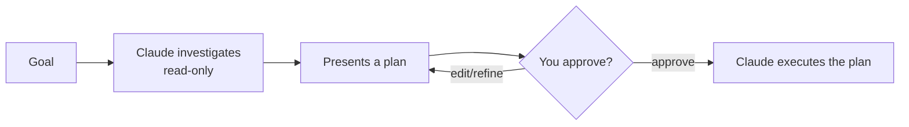

<LevelBadge level="beginner" />

<VerifyNote lastVerified="2026-06-20" source="https://docs.anthropic.com/en/docs/claude-code">
플랜 모드에 진입하는 방법(단축키/플래그)은 릴리스마다 바뀔 수 있습니다 — 공식 Claude Code 문서를 확인하세요.
</VerifyNote>

**플랜 모드**는 Claude Code를 **읽기 전용**으로 만듭니다: 코드베이스를 탐색하고, 검색을 실행하고, 추론할 수 있지만 — **파일을 편집하거나 상태를 변경하는 명령을 실행하지는 않습니다**. 대신 계획을 만들어 당신의 승인을 기다립니다.

## 왜 가장 안전한 시작 방법인가

크거나, 위험하거나, 낯선 것이라면 Claude가 저장소를 건드리기 *전에* 무엇을 하려는지 보고 싶을 것입니다. 플랜 모드는 **생각하기**와 **행동하기**를 분리합니다:

잘못된 가정이 잘못된 코드가 되기 *전에* 잡아냅니다.

## 언제 사용하는가

- 크거나 여러 파일에 걸친 변경, 마이그레이션, 리팩터링에는 **항상**.
- 아직 완전히 알지 못하는 코드베이스에서 작업할 때.
- 동료와 공유할 검토 가능한 계획을 원할 때.

작고 명백한 편집은 건너뛰어도 됩니다 — 하지만 의심스러우면 먼저 계획하세요.

## 실제 작동 방식

1. 플랜 모드에 진입해 목표를 진술합니다.
2. Claude가 관련 파일을 읽고 명확히 하는 질문을 합니다.
3. 단계별 계획을 반환합니다: 변경할 파일, 접근 방식, 검증 방법.
4. 당신이 승인(또는 보완)합니다. 그제야 비로소 변경 작업으로 전환합니다.

:::tip CLAUDE.md와 함께 사용하세요
좋은 [CLAUDE.md](/docs/claude-code/claude-md)는 계획을 더 날카롭게 만듭니다 — Claude가 당신의 관례와 가드레일을 이미 염두에 두고 계획합니다.
:::

## 플랜 모드 대 권한

둘은 서로 다른 문제를 풀며 함께 작동합니다:

- **플랜 모드** = "조사하고 제안하되, 아직 행동하지 마라." (이 페이지.)
- **[권한](/docs/claude-code/permissions)** = 일단 행동할 때, 묻지 않고 *어떤* 동작이 허용되는가.

## 다음

- [권한 & 권한 모드](/docs/claude-code/permissions)
- [컨텍스트 관리](/docs/claude-code/context-management) — 긴 세션을 효과적으로 유지하기
- [워크스루: 실제 저장소에 맞게 Claude Code 커스터마이즈하기](/docs/walkthroughs/customize-claude-code)
