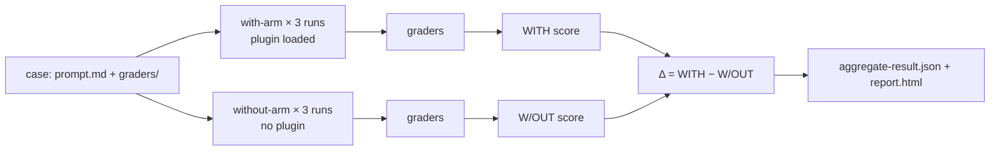

<LevelBadge level="advanced" />

<VerifyNote lastVerified="2026-09-14" source="https://code.claude.com/docs/en/plugin-evals">
`claude plugin eval`은 Claude Code **v2.1.269(2026년 9월 11일)** 에 출시되었고, 아직 어린 기능으로 문서화되어 있습니다: 케이스 스키마는 `1.1`, JSON 결과는 `schemaVersion: 1`이며, Anthropic이 서버 측에서 이 명령을 끌 수 있습니다("plugin eval is currently unavailable"). 아래의 기본값, 플래그, 채점기 의미론은 표시된 날짜의 공식 페이지에서 가져왔습니다. 단단한 CI 게이트를 연결하기 전에 다시 확인하세요.
</VerifyNote>

<Callout type="objectives" items={[
  "`claude plugin validate`와 수동 테스트로는 할 수 없는 것을 플러그인 eval이 무엇을 측정하는지 이해하기: 스킬이 *트리거되는가*, 그리고 맨 모델을 이기는가",
  "모든 결과에 나오는 세 숫자 — WITH, W/OUT, Δ — 를 읽고, 왜 일부 채점기가 의도적으로 점수에서 제외되는지 알기",
  "여섯 가지 채점기 유형(무료 넷, 심판 기반 둘) 중에서 고르고, 안정적인 신호를 주는 루브릭 쓰기",
  "플러그인의 MCP 서버를 목으로 대체해 스위트를 재현 가능하게 만들고 실제 서비스를 절대 건드리지 않게 하기",
  "모델을 고정하고, 비용 상한을 두고, 종료 코드 계약을 활용해 CI 게이트를 연결하기"
]} />

지금까지 플러그인 작성자에게는 두 가지 도구밖에 없었습니다. 매니페스트와 프론트매터가 파싱되는지 확인하는 `claude plugin validate`, 그리고 자기 눈. 둘 다 플러그인을 설치할 가치가 있는지 결정하는 질문에는 답하지 못합니다: **사용자가 자연스러운 요청을 입력했을 때 Claude가 그 스킬을 고르는가, 그리고 그 결과가 Claude가 어차피 했을 것보다 나은가?** `claude plugin eval`은 정확히 그것에 답합니다. 각 케이스를 당신의 플러그인만 로드된 일회용 세션에서 실행하고, 플러그인 없이 다시 실행하고, 양쪽을 채점해서 차이를 보고합니다.

이 페이지는 이미 작동하는 [플러그인](/docs/claude-code/plugins-marketplaces)이나 [스킬](/docs/claude-code/skills)이 있는 사람을 위한 것입니다. 개념만 알고 싶다면 처음 두 절과 퀴즈를 읽으세요.

## 멘탈 모델: 두 개의 팔과 하나의 델타

모든 케이스는 **프롬프트** 하나에 **채점기** 하나 이상을 더한 것입니다. 채점기는 Claude가 만들어낸 것에 대한 통과/실패 검사입니다. 각 케이스마다 Claude Code는 다음을 실행합니다:

- **with-arm**: 당신의 플러그인만 로드된 새 헤드리스 세션. 프롬프트를 보내고, Claude가 끝내거나 턴/시간 상한에 닿을 때까지 작업하게 하고, 그다음 채점기를 적용;
- **without-arm**: 같은 프롬프트, 같은 실행 횟수, 플러그인 없음.

각 팔은 케이스를 **기본적으로 세 번** 실행합니다. 비결정적인 에이전트를 한 번 실행해 보는 것은 거의 아무것도 알려주지 않기 때문입니다. 한 실행의 점수는 통과한 채점기의 비율입니다(가중치를 설정했다면 가중 비율). 케이스의 점수는 실행들의 평균입니다. 결과로 얻는 것:

| 컬럼 | 의미 |
|---|---|
| `WITH` | 플러그인이 로드된 상태의 평균 점수 |
| `W/OUT` | 플러그인 없는 상태의 평균 점수 |
| `Δ` | `WITH − W/OUT` — 플러그인이 실제로 기여한 것 |

눈에 잘 안 띄는 부분: **높은 `WITH` 점수 하나만으로는 아무것도 증명되지 않습니다.** 어떤 케이스가 양쪽 팔에서 1.0을 받으면, Claude는 당신 없이 해결한 것이고, 그 프롬프트에 대해 당신의 플러그인은 짐일 뿐입니다. Δ가 플러그인의 존재를 정당화하는 숫자입니다. Anthropic의 자체 문서는 가장 흔한 첫 발견을 지목합니다: Δ가 0에 가까우면서 *동시에* 스킬 발동 채점기가 실패하는 경우 — Claude가 자연스러운 표현에서 당신의 스킬을 아예 고르지 않았다는 뜻입니다. 그것은 코드 문제가 아니라 `SKILL.md`의 `description` 문제이며, 스킬을 이름으로 직접 호출하는 어떤 수동 테스트로도 잡아낼 수 없었을 문제입니다.



### 일부 채점기가 점수에서 제외되는 이유

"`Skill` 도구가 호출되었다" 같은 검사는 without-arm에서는 절대 통과할 수 없습니다. 그것이 점수에 들어가면 `W/OUT`을 0 쪽으로 끌어내려 Δ를 공짜로 부풀립니다. 그래서 두 팔 실행에서 Claude Code는 `tool`이 `Skill`인 모든 `tool_used` 채점기와 당신이 `arm: with-only`로 표시한 모든 것을 **양쪽 팔 모두에서 점수에서 제외합니다**. 이들은 통과/실패 표시로 보고서에 여전히 나타나고(보고서는 이를 "plugin-fired indicator"로 배지 처리합니다), JSON에는 `scored: false`로 표시됩니다. 여기서 두 가지 경계 규칙이 따라옵니다:

- 한 케이스의 채점기가 *전부* 제외 대상이라면, 대신 정상적으로 채점됩니다. 그러지 않으면 채점할 것이 아무것도 남지 않기 때문입니다.
- `arm: both`는 채점기가 양쪽 팔에서 모두 집계되도록 강제합니다. 미끼 프롬프트에 대한 "스킬을 호출해서는 **안 된다**" 검사에 원하는 것이 바로 그것이며, `min: 0`과 `max: 0`을 가진 `tool_used`로 작성합니다.

기억해 둘 만한 결과: 같은 스위트가 `--ablation none`(단일 팔, 아무것도 제외하지 않음)에서 기본 두 팔 모드와 **다른 절대 점수**를 보고할 수 있습니다. 추세를 차트로 그릴 때는 같은 것끼리 비교하세요.

## 케이스의 해부

스위트는 플러그인 안의 `evals/`(또는 당신이 지정한 다른 디렉터리)에 삽니다. 각 케이스는 `prompt.md`, `case.yaml`, 또는 둘 다를 담은 폴더이며, 채점기당 Markdown 파일 하나씩이 들어 있는 `graders/` 폴더가 함께 있습니다.

```text
my-plugin/
├── .claude-plugin/plugin.json
├── skills/...
└── evals/
    ├── drafts-commit-message/
    │   ├── prompt.md            # frontmatter: run limits; body: the user's request
    │   └── graders/
    │       ├── criteria.md      # type: llm — rubric in the body
    │       └── skill-fired.md   # type: tool_used, tool: Skill
    ├── ignores-unrelated-request/
    │   └── ...
    ├── mocks/                   # optional suite-wide MCP mocks
    └── results/                 # written by each run — add to .gitignore
```

프롬프트 본문은 **쓰인 그대로** Claude에게 전송됩니다. 처음 작성하는 사람을 먼저 물어뜯는 두 가지:

- 각 실행은 일회용 홈 디렉터리와 함께 **빈 작업 디렉터리**에서 시작합니다. 사용자 설정도, `CLAUDE.md`도, 개인 MCP 서버도, 다른 플러그인도 없고, 환경 변수는 허용 목록에 있는 것만 있습니다(`PATH` 같은 기본, 공급자 인증, 대부분의 `ANTHROPIC_*`/`CLAUDE_CODE_*`, 그리고 `EVAL_*`로 이름 붙은 모든 것). 작업에 파일이 필요하다면 프롬프트에 넣거나, 스캐폴드하거나, 플러그인에 담아 배포하세요.
- 프롬프트 안의 `@path` 멘션은 첨부로 **확장되지 않습니다**. Claude가 파일을 열어야 한다면 `allowed_tools`에서 `Read`를 허용하세요.

가장 중요한 `prompt.md` 프론트매터 필드들:

| 필드 | 기본값 | 참고 |
|---|---|---|
| `runs` | 3 | 팔당 1~50; `--runs`가 덮어씀 |
| `max_turns` | 10 | 최대 200. 여기에 닿으면 실행 오류로 기록되고 보통 점수를 떨어뜨리므로 넉넉하게 두세요 |
| `timeout_seconds` | 300 | 실행당 최대 3600 |
| `allowed_tools` | `[]` | 읽기 전용 도구는 나열만 해도 허용됨; 그 외에는 CLI 허용이 필요 |
| `model` | 세션 기본값 | `--model`이 덮어씀; CI에서는 고정하세요 |
| `env` | `{}` | 키가 `EVAL_[A-Z0-9_]*`와 일치해야 하며 아니면 실행이 실패 |
| `plugins` | 가장 가까운 상위 플러그인 | 자동 탐지가 당신의 플러그인을 놓치면 `["../.."]`로 설정 |

`case.yaml`은 같은 필드들을 담고(실행 관련 필드는 `execution:` 아래) 다른 파일을 참조하는 세 가지를 추가로 담습니다: `context.scaffold_script`(작업공간을 준비하는 Bash 스크립트, `--scaffold`와 함께만 실행), `context.history_file`(이어서 재개할 `.jsonl` 트랜스크립트. 당신의 프롬프트가 다음 턴이 됩니다), 그리고 `context.add_dirs`(Claude가 읽을 수 있는 픽스처 디렉터리들).

## 여섯 가지 채점기 유형

넷은 트랜스크립트와 파일로부터 계산되며 비용이 들지 않습니다. 둘은 심판 모델을 호출해 청구서에 더해집니다.

| 유형 | 무료? | 통과 조건 |
|---|---|---|
| `regex` | 예 | 대상(기본 `last_message`, 또는 `trace`, `files`, 특정 파일, `mock_calls`)에서 JavaScript 정규식이 발견될 때. 부재를 검사하려면 `match: not_contains`, 정확한 개수를 검사하려면 `match: "count:N"`. 대소문자 무시는 `flags: i`에 넣으며, 인라인 `(?i)`는 지원되지 않습니다 |
| `tool_used` | 예 | JSON으로 인코딩된 입력이 `input_match`와 일치하는 `tool` 호출 횟수가 `min`(기본 1)과 `max`(상한 없음) 사이일 때. `min: 0, max: 0`은 그 도구가 한 번도 호출되지 않았음을 단언합니다 |
| `tool_order` | 예 | 두 도구가 모두 호출되었고 첫 `before` 일치가 첫 `after` 일치보다 앞설 때 |
| `file_exists` | 예 | **Claude가 생성한** 파일이 `path` 글롭과 일치할 때(또는 `exists: false`로 하나도 일치하지 않을 때). 스캐폴드가 만든 파일이나 Claude가 단지 편집한 파일은 집계되지 않습니다 |
| `llm` | 아니오 | 심판 모델이 당신의 루브릭에 대해 **세 표 중 최소 두 표** PASS를 던질 때 |
| `baseline` | 아니오 | 심판이 그 실행이 `baseline_file`로 저장한 참조 트랜스크립트만큼은 기준을 충족한다고 판단할 때 |

**커스텀 코드 채점기는 없습니다.** 빌드나 테스트가 통과했는지 확인해야 한다면, 프롬프트에서 Claude에게 그것을 실행하고 결과를 파일에 쓰라고 지시한 다음, 그 파일을 `regex`로 채점하고, `input_match`가 그 명령을 지목하는 `tool_used` 채점기로 명령이 실행되었음을 단언하세요.

거의 모든 케이스가 원하는 스킬 발동 채점기는 이렇게 생겼습니다(스킬 이름을 바꾸세요. 이 패턴은 네임스페이스가 붙은 `plugin:skill` 형태도 일치시킵니다):

<PromptCard title="graders/skill-fired.md — 내 스킬이 실제로 실행되었나?">{`---
type: tool_used
tool: Skill
input_match: '"skill"\\s*:\\s*"(?:[\\w-]+:)?your-skill-name"'
---`}</PromptCard>

그리고 그 옆의 심판 루브릭은 형용사가 아니라 구체적인 PASS/FAIL 조건으로 쓴 것입니다:

<PromptCard title="graders/criteria.md — 안정적인 판정을 주는 루브릭">{`---
type: llm
weight: 2
---

PASS if the reply is a single conventional-commit subject line under 72 characters,
starts with "refactor:", and mentions both the rename (getUser -> fetchUser) and the
number of call sites updated.
FAIL if the reply contains more than one candidate message, asks a clarifying
question, or omits the rename.`}</PromptCard>

### 점수를 안정적으로 유지하는 습관

이것들은 공식 문서가 권하는 실천이며, LLM-as-judge 파이프라인을 돌려 본 사람이라면 어렵게 배운 것과 일치합니다:

- **긴 출력은 `llm` 심판이 아니라 파일에 대한 `regex`로 채점하세요.** 심판의 분산은 읽는 내용의 길이에 따라 커집니다. `llm` 채점기는 짧은 최종 메시지에 쓰세요.
- **결과에 하나, 경로에 하나.** `regex`/`llm`/`file_exists` 채점기는 답이 맞았는지 알려주고, `tool_used`/`tool_order` 채점기는 *당신의 플러그인이* 그것을 만들어냈는지 알려줍니다. Δ를 해석하려면 둘 다 필요합니다.
- **Δ가 음수인데 스킬이 발동했다면 플러그인보다 심판을 먼저 의심하세요.** 기본 심판은 작고 빠른 모델입니다. 루브릭과 형식이 다르다는 이유로 맞는 답을 떨어뜨릴 수 있습니다. `--judge-model sonnet`으로 다시 실행하고, 형식이 판정을 좌우하지 않도록 루브릭을 조이세요.
- **한 팔로 한 케이스씩 반복하다가** 세 번 실행으로 확인하세요: `--case <name> --runs 1 --ablation none`. 한 팔이면 테이블에 `WITH`/`W/OUT`/`Δ` 대신 `SCORE`와 `PASS%`가 표시됩니다.

## MCP 서버를 목으로 대체하기

플러그인의 스킬이 MCP 도구를 호출한다면, 실행은 당신이 요청하지 않는 한 **실제 서버를 절대 시작하지 않습니다**. 대신 Claude Code가 각 서버 이름으로 대역을 등록하고 Markdown 파일에서 도구 호출에 응답합니다: 스위트 전체에는 `evals/mocks/<server>/<tool>.md`, 케이스별로 덮어쓰려면 그 케이스 자신의 `mocks/` 폴더를 씁니다. 파일 본문이 도구 결과이며, `{{input.<field>}}` 치환과 `{{file:fixtures/...}}` 삽입을 지원합니다. 목 파일이 없는 도구는 그냥 Claude에게 제공되지 않습니다.

<PromptCard title="evals/mocks/tracker/create_issue.md — 입력까지 단언하는 목">{`---
expect:
  title: string
  priority: [low, medium, high]
---

Created issue #4821: {{input.title}}`}</PromptCard>

`expect:` 블록은 목을 단언으로 바꿉니다: 이를 위반하는 호출은 **점수 0으로 실행을 중단시키고** 서버, 도구, 이유를 기록합니다. 플러그인이 서버에게 무엇을 요청했는지 채점하려면 채점기를 `target: mock_calls`로 겨누세요. 응답이 대화에 의존하는 서버에는 `type: agent`로 작은 모델이 서버 역할을 하게 할 수 있습니다. 깨끗한 실행은 그 응답을 `results/<timestamp>/mock-recordings/` 아래에 저장하고, 녹음을 `mocks/.replay/<server>/`로 복사해 두면 이후 실행은 모델 호출 없이 그것을 재생합니다. CI가 결정적이도록 `.replay/`를 커밋하세요. `_tools.json`(저장된 `tools/list` 응답)은 목 처리된 도구에 관대한 플레이스홀더 대신 실제 설명과 스키마를 줍니다.

실제 서버를 대신 때리려면: `--allow-real-servers`는 목이 없는 서버를 시작하고, `--mocks off`는 목을 완전히 무시합니다. 어느 쪽이든 그 프로세스들은 **당신으로서, 샌드박스 밖에서** 실행되며, 그 도구들은 여전히 `--allow-tools "mcp__plugin_my-plugin_github__*"` 같은 명시적 허용이 필요합니다.

## 실행하기

<Steps items={[
  {title: "스위트 생성하기", body: "플러그인 루트에서 `claude plugin eval init`을 실행하세요. Claude가 플러그인을 읽고, 좋은 결과가 어떤 모습인지 묻고, 트리거되어야 할 프롬프트와 그러지 않아야 할 프롬프트를 제안하고, 채점기를 설계하고, 한 번 시험 실행한 뒤 프롬프트당 케이스 디렉터리를 하나씩 쓰는 대화형 세션이 열립니다. `claude plugin eval init --bare <name>`은 대신 빈 템플릿을 씁니다(터미널 없이 동작하는 유일한 형태로, 예를 들어 CI에서 쓸 수 있습니다)."},
  {title: "스위트 전체 실행하기", body: "`claude plugin eval .`은 모든 케이스를 양쪽 팔로 각각 세 번 실행합니다. 첫 실행은 `Trust this plugin directory?`를 묻습니다. git 리포 안이라면 yes라고 답하는 것은 저장소 전체를 신뢰하는 것이며, 대화형 세션에도 적용됩니다. 실행마다 각 채점기의 판정이 담긴 진행 줄이 출력되고, 그다음 요약 테이블과 `Report:` 경로가 따라옵니다."},
  {title: "케이스에 필요한 것만 허용하기", body: "실행은 절대 멈춰서 권한을 묻지 않습니다. 당신이 허용하지 않은 허가가 필요한 내장 도구(`Bash`, `Write`, `Edit`, `WebFetch`, `WebSearch`)는 세션에서 완전히 제거됩니다. 실행 전체에 대해 허용하려면: `--allow-tools Write Edit \"Bash(npm test *)\"`. 모든 Bash 허용은 Claude Code의 OS 수준 샌드박스 아래에서 실행됩니다. 샌드박스 백엔드가 없는 머신(네이티브 Windows)에서는 제한 없이 실행하는 대신 실행 자체를 거부합니다."},
  {title: "보고서 읽기", body: "`report.html`은 외부 요청이 전혀 없는 자기완결적 단일 파일입니다. 상단에는 판정 줄(기준선 대비 플러그인 효과를 점수로, 개선/변화 없음/후퇴한 케이스 수)과 다섯 개의 타일(스위트 점수, ablation Δ, 기준선 점수, 통과한 케이스, 완벽한 실행)이 있습니다. 각 케이스 카드는 Δ와 임계값 표시선이 있는 점수 바를 보여주고, Δ가 음수면 왼쪽 가장자리가 빨갛게 표시됩니다. 실패한 채점기는 심판의 표와 심판이 본 발췌와 함께 미리 펼쳐져 있습니다."},
  {title: "보고서가 어디로 갈지 결정하기", body: "claude.ai 구독으로 로그인되어 있고 아티팩트가 켜져 있으면, 보고서는 비공개 아티팩트로도 발행되고 `Published:` URL이 출력됩니다. `--no-publish`는 로컬에만 둡니다. API 키 인증은 절대 발행하지 않습니다. Claude Code 세션 안에서 시작한 실행은 `--publish-report`를 추가하지 않는 한 로컬에 머뭅니다."}
]} />

실제로 손이 가게 될 플래그들을 붙인 스위트 전체 실행 명령:

<PromptCard title="더 강한 심판과 비용 상한으로 스위트 실행하기">{`claude plugin eval . \\
  --judge-model sonnet \\
  --max-cost-usd 10 \\
  --allow-tools Read Write "Bash(npm test *)" \\
  -j 4`}</PromptCard>

플래그에 대한 참고: `-j`/`--concurrency`는 1에서 8까지이며 벽시계 시간만 줄여줍니다. 모든 실행이 당신 계정의 레이트 리밋을 공유하기 때문입니다. `--max-cost-usd`는 **정가 기준 추정치**에 대한 상한이며 각 실행이 시작되기 전에 검사됩니다. 이미 진행 중인 실행은 끝까지 가므로 그만큼 지출이 초과될 수 있고, 시작되지 못한 것이 남으면 명령이 `partial: true`와 함께 종료 코드 2로 끝납니다. 대상(`.`)을 `--tag`, `--allow-tools`, `--json` **앞에** 두세요. 이들은 각각 리스트나 선택적 값을 받으므로 뒤에 오는 대상을 삼켜버립니다("`--json` output path must end in `.json`" 오류가 바로 그 실수입니다).

## 비용은 얼마나 드나

모든 실행과 모든 심판 표는 당신 계정에 실제로 발생하는 모델 호출이며, 플랜 사용량이나 API 청구서에 집계됩니다. 대략적인 산수: with-arm에 `cases × runs` 에이전트 실행, without-arm에 같은 만큼, 거기에 **실행당 `llm` 또는 `baseline` 채점기마다 짧은 심판 호출 세 번**. 공식 워크스루의 채점기 두 개(`llm` 하나, `tool_used` 하나)를 가진 단일 케이스는 74초에 에이전트 실행 여섯 번을 돌려 정가 기준 약 $0.41로 추정되었습니다. 스위트를 감당 가능하게 유지하는 지렛대는 세 가지입니다:

- 채점기를 다듬는 중이고 Δ가 필요하지 않다면 `--ablation none`이 에이전트 실행을 절반으로 줄입니다.
- 매 커밋마다 돌리는 스위트에는 무료 채점기만(`regex`, `tool_used`, `tool_order`, `file_exists`), 심판 채점기는 야간 스위트에 쓰세요.
- 스위트 중간에 사용량 한도나 레이트 리밋 오류가 나면 이후의 각 실행이 **그 오류로 끝나고 보통 0점을 받으며, 스위트는 `partial`로 표시되지 않습니다**. 그래서 스로틀링된 실행이 후퇴와 완전히 똑같아 보일 수 있습니다. 갑작스러운 하락을 믿기 전에 `NOTES` 컬럼이나 `cases[].arms.with[].error`를 확인하세요.

## 이것으로 CI 게이트 걸기

<PromptCard title="CI 작업 — 모델 고정, 로컬 보고서, 종료 코드가 빌드를 좌우">{`claude plugin eval . \\
  --trust-plugin \\
  --json results.json \\
  --threshold 0.8 \\
  --model claude-sonnet-5 \\
  --judge-model claude-haiku-4-5 \\
  --no-publish \\
  --max-cost-usd 20`}</PromptCard>

각 플래그가 있는 이유:

- `--trust-plugin`은 첫 실행의 신뢰 결정을 단언합니다. 이것이 없으면 비대화형 작업은 종료 코드 1로 거부됩니다(러너가 TTY를 할당하면 프롬프트에서 멈춥니다). 코드와 스위트를 당신의 머신에서 실행해도 될 플러그인에만 넘기세요.
- `--model`과 `--judge-model`은 모델 롤아웃이 플러그인 후퇴로 오인되지 않도록 **고정**합니다. 이건 들리는 것보다 중요합니다: 테스트 대상 에이전트는 기본적으로 `ANTHROPIC_MODEL`이나 Claude Code의 현재 기본값을 쓰고, 그것은 릴리스마다 바뀝니다.
- `--threshold 0.8`은 기본값이 **1.0**이기 때문입니다. 기본값이면 어떤 케이스든 완벽하지 않으면 명령이 종료 코드 1로 끝납니다. 비결정적 에이전트의 세 번 실행 평균에 1.0 기준선은 불안정한 게이트입니다.
- `--json results.json`은 버전이 붙은 결과 문서(`schemaVersion: 1`, camelCase, 이름 변경 없이 새 필드만 추가)를 쓰고 진행 출력을 억제합니다.

종료 코드 계약:

| 종료 코드 | 의미 |
|---|---|
| 0 | 모든 케이스가 임계값 이상이고 모든 케이스 파일이 로드됨 |
| 1 | 임계값 미달 케이스, 케이스 파일 로드 실패, 케이스를 찾지 못함, 실행을 시작할 수 없음, `--trust-plugin` 없는 미신뢰 디렉터리, 또는 잘못된 옵션 |
| 2 | 부분 실행: 비용 상한에 닿음, 또는 첫 실행 시점이나 그 전에 자격 증명이 거부됨. `results.json`은 `partial: true`와 함께 그대로 기록됨 |
| 130 / 143 | 중단 / 종료(예: CI 타임아웃). 부분 결과가 기록됨 |

보고서 기록이나 발행 문제는 **절대** 종료 코드를 바꾸지 않습니다. 추세를 차트로 그릴 때는 `partial: true`인 문서와 `skippedPaidGraders`로 표시된 실행을 버리세요. 그 점수들은 비교 가능하지 않습니다.

게이트 스크립트가 JSON에서 읽는 필드: `aggregates.overallScore`, `aggregates.casesPassed` / `casesTotal`, `aggregates.meanDelta`, 그리고 케이스별로 `cases[].aggregates.score`와 `.delta`(팔들이 비교 가능하지 않으면 생략됨). `cases[].arms.with[].error`가 null이 아닌 실행(예: `timed out after 300s`)도 만들어낸 것으로 여전히 채점되므로, 오류가 곧 0점을 뜻하지는 않습니다. `aborted` 실행(목의 `expect:`가 발동한 경우)은 `error`가 여전히 `null`인 채로 0점을 받습니다.

## 실행이 닿을 수 있는 것과 닿을 수 없는 것

당신이 쓰지 않은 플러그인을 평가하기 전에 이것을 읽으세요. `claude plugin eval`을 어떤 디렉터리에 겨누는 것은 `claude --plugin-dir`과 같은 신뢰 결정입니다: 그 플러그인의 스킬 **과 훅**이 당신의 머신에서 당신으로서 로드되고 실행됩니다. 격리는 *테스트 대상 에이전트*가 할 수 있는 것을 제한할 뿐이며, 플러그인 자체 코드에 대한 경계가 아닙니다. 스위트가 통과한다는 것은 그 플러그인이 안전한지에 대해 아무것도 말해주지 않습니다.

- **격리된 에이전트.** 각 실행은 일회용 홈 디렉터리, 작업 디렉터리, Claude Code 설정을 받고, `claude -p` 자식 프로세스로 실행되며, eval 디렉터리를 읽을 수 없고(그래서 해당 케이스나 형제 케이스의 프롬프트와 채점기를 절대 보지 못합니다), Artifact 도구가 꺼져 있습니다.
- **관리 설정은 여전히 적용됩니다.** 관리자가 머신에 배포한 제약은 실행 안에서도 적용되므로, 관리되는 노트북에서의 결과는 관리되지 않는 CI 러너와 다를 수 있습니다.
- **옵트인 탈출구.** 케이스의 `scaffold_script`는 당신으로서, 샌드박스 밖에서, 그리고 `--scaffold`와 함께만 실행됩니다. 실제 MCP 서버는 `--allow-real-servers`나 `--mocks off`가 있을 때만 쓰입니다. 케이스의 `allowed_tools`나 스킬 자체의 `allowed-tools` 프론트매터는 이 제한을 절대 넓힐 수 없습니다.
- **네트워크.** 당신이 허용한 셸 명령은 샌드박스의 네트워크 규칙을 따릅니다. `WebFetch(domain:…)` 허용은 그 도메인에 직접 닿습니다. 플러그인의 훅과 당신이 시작한 실제 MCP 서버는 어떤 호스트에든 닿을 수 있습니다.

훅을 담아 배포하거나 실제 서버가 필요한 서드파티 플러그인이라면, 컨테이너나 CI 러너에서 스위트를 돌린 경우가 아니라면 점수를 참고용으로만 취급하세요. 더 넓은 체크리스트는 [서드파티 코드 검토하기](/docs/security/reviewing-third-party-code)를 보세요.

## 빠른 참조: 함정들

- `regex`의 기본 `target`은 `last_message`입니다. `trace`를 겨누면 줄 단위 JSON이므로 따옴표는 `\"`로 나타나고 줄바꿈은 이스케이프됩니다.
- `files`는 Claude가 생성한 **경로의 목록**이며, 그 내용이 아닙니다. 내용을 채점하려면 `{ source: file, path: <path> }`를 `target`/`focus`로 쓰세요. `llm` 심판은 PNG/JPEG/GIF/WebP를 이미지로 보고, 다른 바이너리(`.pptx`, PDF)는 거부합니다.
- `trace`를 읽는 `llm` 심판은 **처음 12개와 마지막 12개 메시지**만 봅니다.
- `file_exists`는 실행 중에 생성된 파일만 봅니다. 스캐폴드된 파일이나 단지 편집된 파일은 보이지 않으므로, 그 내용을 채점하거나 `Edit`에 대해 `tool_used`를 쓰세요.
- `prompt.md` 프론트매터의 알 수 없는 키는 오류이며, `env` 키는 `EVAL_*`이어야 합니다.
- 설치된 플러그인을 이름으로 평가하면(`name@marketplace`) 결과가 현재 디렉터리의 `./evals/results/` 아래에 기록되고 신뢰 프롬프트를 건너뜁니다.
- 플러그인 eval 케이스 형식은 skill-creator 플러그인이 스킬 eval에 쓰는 `evals/evals.json` 파일과 **별개**입니다.

<Flashcards cards={[
  {front: "with-arm / without-arm", back: "한 케이스에 대한 두 실행 집합: 당신의 플러그인만 로드한 것, 그리고 플러그인 없는 것. Δ는 with-arm 점수에서 without-arm 점수를 뺀 값입니다."},
  {front: "`tool_used: Skill`은 왜 점수에 들어가지 않나요?", back: "플러그인 없이는 절대 통과할 수 없으므로, 집계하면 W/OUT을 0으로 끌어내려 Δ를 부풀립니다. 양쪽 팔에서 제외되고 plugin-fired 지표로 표시됩니다."},
  {front: "기본 임계값", back: "1.0 — 완벽 미달인 케이스가 하나라도 있으면 명령이 종료 코드 1로 끝납니다. CI에서는 `--threshold`를 실제 기준선으로 설정하세요."},
  {front: "심판 표결 규칙", back: "`llm` 채점기는 심판이 세 표 중 최소 두 표를 PASS로 던질 때 통과합니다. `baseline` 채점기는 저장된 참조 트랜스크립트와 비교합니다."},
  {front: "종료 코드 2", back: "부분 실행: --max-cost-usd 상한에 닿았거나 자격 증명이 거부됨. results.json은 partial: true와 함께 그대로 기록됩니다."},
  {front: "목의 `expect:` 블록", back: "목 처리된 MCP 도구에 대한 입력 가드. 위반하는 호출은 점수 0으로 실행을 중단시키고 서버, 도구, 이유를 기록합니다."},
  {front: "EVAL_* 변수", back: "실행에 도달하는 유일한 커스텀 환경 변수입니다. 당신의 셸에서 오는 그 외 모든 것은 작은 허용 목록을 빼고 차단됩니다."}
]} />

<Quiz title="스스로 점검하기" questions={[
  {q: "어떤 케이스가 WITH 1.00, W/OUT 1.00을 받았습니다. 이것이 알려주는 것은?", options: ["플러그인이 완벽하게 작동한다", "Claude가 플러그인 없이도 이 프롬프트를 해결하므로, 여기서는 플러그인이 아무것도 더하지 않는다", "채점기가 고장났다", "심판 모델이 너무 약하다"], answer: 1, explain: "Δ가 0입니다. 높은 with-arm 점수 하나만으로는 플러그인이 도움이 됐음을 절대 증명하지 못합니다. 두 팔의 차이만이 증명합니다."},
  {q: "CI 작업이 다른 플래그 없이 `claude plugin eval . --json results.json`을 실행했고, 모든 케이스가 0.9점을 받았는데도 종료 코드 1로 끝났습니다. 왜일까요?", options: ["JSON 모드는 항상 1로 끝난다", "기본 --threshold가 1.0이므로 0.9는 실패다", "플러그인 디렉터리가 신뢰되었다", "--json은 채점을 비활성화한다"], answer: 1, explain: "기본 임계값은 완벽(1.0)입니다. --threshold 0.8이나 당신의 기준선을 넘기세요. CI에서는 --trust-plugin도 넘겨야 합니다. 그러지 않으면 미신뢰 디렉터리 검사도 종료 코드 1을 냅니다."},
  {q: "어떤 채점기 유형이 실행에 추가 비용이 들지 않나요?", options: ["llm과 baseline", "regex, tool_used, tool_order, file_exists", "regex만", "여섯 개 모두 무료다"], answer: 1, explain: "네 가지 채점기는 트랜스크립트와 파일로부터 계산됩니다. llm과 baseline은 각각 실행당 짧은 심판 호출 세 번을 더합니다."},
  {q: "Δ가 음수인데 스킬 발동 채점기가 모든 with-arm 실행에서 통과했습니다. 공식 지침은 먼저 무엇을 확인하라고 하나요?", options: ["플러그인을 삭제하라", "max_turns를 올려라", "심판: --judge-model sonnet으로 다시 실행하고 형식이 판정을 좌우하지 않도록 루브릭을 조여라", "케이스를 더 추가하라"], answer: 2, explain: "작은 심판은 루브릭과 형식이 다르다는 이유로 맞는 답을 떨어뜨릴 수 있습니다. 플러그인보다 심판을 먼저 의심하세요."},
  {q: "실행 중 목 처리된 MCP 도구가 목의 `expect:` 블록을 위반하는 입력으로 호출되었습니다. 무슨 일이 일어나나요?", options: ["호출이 오류 문자열을 반환하고 실행은 계속된다", "실행이 점수 0으로 중단되고 이유가 기록된다", "채점기가 건너뛰어진다", "대체 수단으로 실제 서버가 시작된다"], answer: 1, explain: "expect:는 단언입니다. 위반하는 호출은 실행을 중단시키고, 0점을 매기고, JSON에 서버, 도구, 이유와 함께 `aborted`로 나타납니다."},
  {q: "실행 중 테스트 대상 에이전트가 접근할 수 있는 것은 다음 중 무엇인가요?", options: ["당신의 ~/.claude 설정과 CLAUDE.md", "당신의 개인 MCP 서버", "그 케이스의 프롬프트와 채점기", "케이스의 allowed_tools에 나열된 읽기 전용 도구, 그리고 --allow-tools로 허용한 것"], answer: 3, explain: "실행은 격리되어 있습니다: 일회용 홈과 설정, 개인 설정 없음, 다른 플러그인 없음, 그리고 eval 디렉터리는 에이전트에게 숨겨집니다."}
]} />

## 출처 및 더 읽을거리

- [eval로 플러그인 테스트하기](https://code.claude.com/docs/en/plugin-evals) — 이 페이지가 기반으로 삼은 공식 레퍼런스: 케이스 형식, 채점기 표, 옵션, 종료 코드, 격리
- [플러그인 레퍼런스: `plugin eval`과 `experimental.evals`](https://code.claude.com/docs/en/plugins-reference#plugin-eval)
- [Claude Code 체인지로그, v2.1.269 (2026년 9월 11일)](https://code.claude.com/docs/en/changelog) — 해당 릴리스 항목
- [스킬: 프론트매터와 `description`이 트리거를 결정하는 방식](https://code.claude.com/docs/en/skills)
- [샌드박싱](https://code.claude.com/docs/en/sandboxing) — 실행에 Bash를 허용할 때 적용되는 OS 수준 샌드박스
- [헤드리스 모드](https://code.claude.com/docs/en/headless) — 각 실행이 기반으로 삼는 `claude -p` 자식 프로세스

## 다음

- [플러그인 & 마켓플레이스](/docs/claude-code/plugins-marketplaces) — 방금 테스트한 것을 패키징하고, 스위트가 초록불이 되면 공개하기
- [스킬](/docs/claude-code/skills) — 실패한 스킬 발동 채점기가 고치라고 알려주는 것이 바로 `description` 필드입니다
- [서드파티 코드 검토하기](/docs/security/reviewing-third-party-code) — 다른 사람의 플러그인(그리고 그 훅)을 당신의 머신에서 eval에 돌리기 전에
