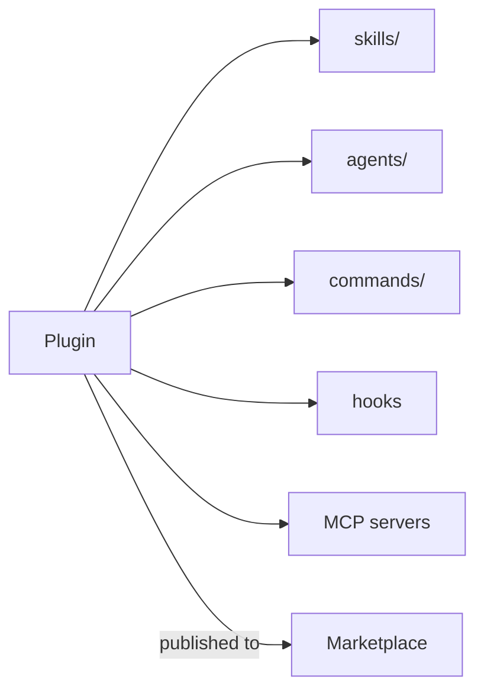

<LevelBadge level="advanced" />

<VerifyNote lastVerified="2026-06-20" source="https://docs.anthropic.com/en/docs/claude-code">
플러그인 구조와 마켓플레이스 메커니즘은 빠르게 변하고 있습니다 — 세부 사항은 공식 Claude Code 문서에서 확인하세요.
</VerifyNote>

**플러그인**은 여러 커스터마이즈 — [스킬](/docs/claude-code/skills), [서브에이전트](/docs/claude-code/subagents), [슬래시 명령](/docs/claude-code/slash-commands), [훅](/docs/claude-code/hooks), [MCP 서버](/docs/claude-code/mcp) — 를 버전이 매겨진 단일 설치 단위로 묶습니다. **마켓플레이스**는 사람들이 발견하고 설치할 수 있는 플러그인의 카탈로그입니다.

## 왜 플러그인이 중요한가

- **팀 툴킷을 한 번에 배포.** 모두에게 다섯 개 파일을 복사하라고 부탁하는 대신 플러그인을 게시하면, 동료들이 설치해 동일한 명령, 훅, 에이전트, MCP 연결을 얻습니다.
- **버전 관리.** 플러그인을 업데이트하면 모두가 새 버전을 받습니다.
- **배포.** 마켓플레이스는 당신의(또는 남의) 툴킷을 발견 가능하게 만듭니다.

## 보통 무엇이 들어 있는가

플러그인은 구조화된 폴더(매니페스트와 그것이 담는 구성요소들)입니다. 최소한으로는 스킬만 담을 수 있고, 최대로는 위의 전체 집합을 담습니다. 각 플러그인은 잡동사니가 아니라 **일관성 있게** — "팀 관례" 플러그인, "Python 툴킷" 플러그인처럼 — 유지하세요.

## 설치하기 전에 신뢰하세요

:::warning 플러그인은 실행 가능한 코드를 담을 수 있다
플러그인 안의 훅과 MCP 서버는 당신의 권한으로 실행됩니다. 신뢰하는 출처에서 설치하고, 플러그인이 무엇을 하는지 먼저 검토하세요 — [서드파티 코드 검토하기](/docs/security/reviewing-third-party-code)를 참고하세요.
:::

## 설정을 확장하는 경로

자연스러운 진행: `CLAUDE.md` → 몇 개의 [스킬](/docs/claude-code/skills)과 [명령](/docs/claude-code/slash-commands) → 그것들을 플러그인으로 묶기 → 팀이나 커뮤니티를 위해 마켓플레이스에 게시하기. 그 마지막 단계는 AILmanac이 생태계 성장을 돕고자 하는 방식의 일부입니다.

## 다음

- [스킬](/docs/claude-code/skills) · [서브에이전트](/docs/claude-code/subagents) · [MCP](/docs/claude-code/mcp)
- [서드파티 코드 검토하기](/docs/security/reviewing-third-party-code)
- AILmanac의 [스킬 팩](/docs/templates/skills)
