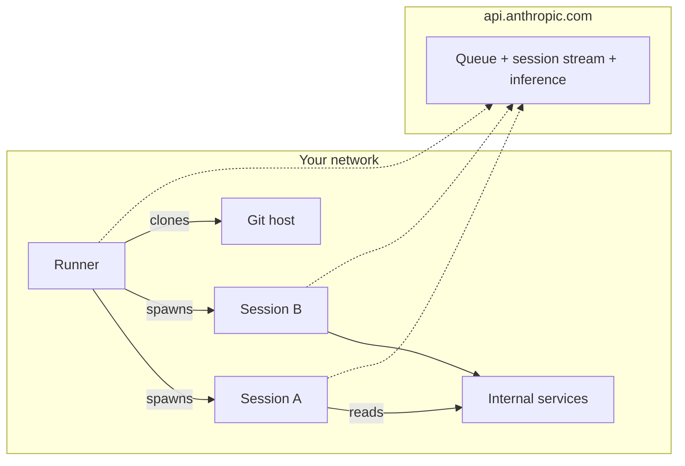

<LevelBadge level="advanced" />

<Callout type="objectives" items={[
  "셀프 호스팅 환경이 실제로 무엇인지 이해 — 세 가지 움직이는 부품(환경, 러너, 세션)이 셀프 호스팅 CI 러너와 거의 똑같이 생겼습니다",
  "네트워크 형태 파악: 100% 아웃바운드 HTTPS, Anthropic으로부터의 인바운드 제로, Anthropic의 컨트롤 플레인은 호스팅 상태 유지, 실행은 여러분의 서버로 이동",
  "언제 이를 손대야 하는지 알기(내부 네트워크 접근, 커스텀 도구, 컴플라이언스) vs 대부분의 팀이 먼저 사용해야 할 두 가지 더 쉬운 답",
  "shell history에 환경 시크릿을 유출하지 않고 claude self-hosted-runner로 첫 러너를 네 개의 명령으로 세우기",
  "한 사용자당 러너 잠금 이해 — 왜 존재하는지, --drain-grace-sec와 --retire-at가 무엇을 하는지, 최소 플릿 크기를 어떻게 결정하는지",
  "모든 첫 프로덕션 플릿을 잡는 여섯 가지 함정 배포(시크릿 로테이션, ZDR 차단, 모델 라우팅 차단, --base-dir 기본값, 시계 편차, 스팟 인스턴스 축출)",
]} />

<VerifyNote lastVerified="2026-08-07" source="https://code.claude.com/docs/en/self-hosted-environments">
공개 베타가 **2026년 8월 7일** [Claude Code v2.1.224](https://code.claude.com/docs/en/changelog)에서 Team과 Enterprise 플랜으로 출시되었습니다. `claude self-hosted-runner` 서브커맨드는 이전 버전에는 존재하지 않습니다 — 그 단어들을 프롬프트로 하여 조용히 일반 Claude 세션을 시작합니다. 이름, 플래그, 활성화 경로는 GA 전에 바뀔 수 있으니 공식 [셀프 호스팅 환경 페이지](https://code.claude.com/docs/en/self-hosted-environments)와 그 [퀵스타트](https://code.claude.com/docs/en/self-hosted-environments-quickstart)를 그것들에 기반해 빌드하기 전에 교차 확인하세요.
</VerifyNote>

2026년 8월 7일, Anthropic은 Claude Code와 규제된 조직이 실제로 인프라를 운영하는 방식 사이의 마지막 실제 격차를 닫는 기능을 출시했습니다: **셀프 호스팅 환경**. 모든 클라우드 세션 — claude.ai, 모바일과 데스크톱 앱, [예약된 Cowork 루틴](/docs/claude-app/cowork-scheduled-tasks), 또는 `claude --cloud`에서 시작하는 것들 — 은 이제 Team과 Enterprise 플랜에서 여러분 자신의 네트워크 내, 여러분이 프로비저닝하고 이미지화한 머신에서 실행할 수 있습니다. 오케스트레이션과 모델 호출은 Anthropic 쪽에 남습니다. 체크아웃된 코드, 도구 실행, 내부 서비스에 대한 네트워크 접근은 완전히 여러분의 서버에 있습니다.

GitHub Actions 셀프 호스팅 러너 플릿을 운영해본 적이 있다면, 형태는 정확히 익숙합니다. 그 정신적 모델을 들고 오면 더 빨리 생산적이 될 것입니다.

## 한 문단 버전

claude.ai 관리자 설정에서 **환경**을 정의합니다 — 이름이 붙은 목적지. 그 **환경 시크릿**을 한 번 복사합니다(365일 수명; UI는 이를 "environment key"라 부릅니다). Linux나 macOS 호스트에 Claude Code v2.1.224+를 설치하고, 시크릿을 파일에 넣고, `claude self-hosted-runner --environment-secret-file /etc/claude/environment-secret --base-dir /workspace`를 실행합니다. 그 프로세스는 `api.anthropic.com`으로 아웃바운드 폴링을 하여 작업을 찾고, 환경의 큐에서 세션을 클레임하고, 개발자가 선택한 리포를 클론하고, 각 세션을 실행할 자식 `claude` 프로세스를 생성합니다. 세션 상태, git 체크아웃, 도구가 만지는 모든 것은 호스트에 남습니다. 추론용 트랜스크립트만 아웃바운드 HTTPS로 나갑니다. Anthropic으로부터 인바운드는 없습니다. 단순한 정신적 모델, 운영상 놀라움 하나: 러너는 도착한 첫 사용자에 잠기고 drain될 때까지 그 사용자만 서빙합니다.

## 이것은 두 가지 더 쉬운 답과 비교해 어디에 있나

플릿을 만들기 전에 정말로 필요한지 정직하게 생각하세요. 두 가지 인접 제품이 인프라 운영 없이 "노트북 이외의 어딘가에서 Claude를 원한다" 케이스 대부분을 커버합니다.

| 옵션 | 실행 위치 | 여러분의 셋업 | 언제 고를까 |
| :--- | :--- | :--- | :--- |
| Anthropic 호스팅 클라우드 (기본값) | Anthropic 인프라 | 없음 | 실행을 이동시킬 컴플라이언스나 네트워크 이유가 없음. 대부분의 팀에 이것이 정답. |
| [Remote Control](https://code.claude.com/docs/en/remote-control) | 여러분의 항상 켜진 머신 | 그 한 머신 | 폰이나 다른 노트북에서 한 워크스테이션을 몰고 싶음. Pro, Max, Team, Enterprise에서 사용 가능. |
| **셀프 호스팅 환경** | 러너 플릿 | 러너 이미지, 오케스트레이션, 이그레스, git 자격 증명 | 네트워크 내부에서 세션 실행이 필요 — 내부 레지스트리, 프라이빗 엔드포인트, 에어갭 코드, 또는 컴플라이언스가 "체크아웃은 우리 인프라에 남는다"고 말함. Team과 Enterprise 전용. |

터미널이나 IDE에서 시작된 세션이 개발자의 노트북을 어차피 떠나지 않는다면, 그 세션에는 이 어떤 것도 적용되지 않습니다 — 환경 피커는 클라우드 세션에만 나타납니다.

## 아키텍처: 환경, 러너, 세션

세 명사. GitHub Actions의 등가물에 깔끔하게 매핑됩니다.

<Steps items={[
  {title: "환경 (~ 러너 그룹)", body: "claude.ai의 Cloud environments 관리자 페이지에서 생성한 러너들의 이름 있는 그룹. 세션은 특정 러너가 아니라 환경으로 라우팅됩니다. API 필드와 메트릭에서는 pool로 나타나며, ID는 ccpool_...와 같은 문자열입니다."},
  {title: "러너 (~ 셀프 호스팅 러너)", body: "claude self-hosted-runner로 시작된 호스트의 장수명 프로세스. 환경 시크릿으로 환경에 등록하고, 러너 토큰을 받고, 큐에서 작업을 폴링합니다. 하나의 바이너리, 설치할 데몬 서비스 없음 — 러너는 다른 모드의 표준 claude CLI입니다."},
  {title: "세션 (~ 워크플로우 실행)", body: "개발자가 claude.ai, 모바일/데스크톱 앱, 예약된 Cowork 루틴, 또는 claude --cloud에서 시작한 하나의 Claude Code 작업. 각 세션은 러너가 생성하는 자식 claude 프로세스로 실행되며, Anthropic으로 자체 이벤트 스트림을 가집니다."},
]} />

모든 연결은 네트워크에서 아웃바운드입니다. Anthropic은 절대 안으로 연결하지 않습니다. 러너와 각 세션은 큐 폴링, 세션 스트리밍, 모델 추론을 위해 각자 `api.anthropic.com`으로 자신의 아웃바운드 HTTPS를 엽니다. 러너 또는 세션은 여러분의 git 호스트로 git 연결을 엽니다(HTTPS/SSH로 공용, 또는 여러분이 그 네트워크에 있으니 내부에 직접).

## 가용성과 대부분의 조직이 부딪히는 차단 요소

롤아웃을 계획하기 전에 읽을 여섯 줄. 각각은 우회가 아닌 확고한 "아니오"입니다.

- **플랜**: Team과 Enterprise, 공개 베타. **셀프 호스팅 환경 허용**이 [Cloud environments 관리자 페이지](https://claude.ai/admin-settings/cloud-environments)에서 오너나 관리자에 의해 켜져야 합니다. **New** 버튼은 그전까지 숨겨집니다. 조직에 [Claude Code on the web](https://code.claude.com/docs/en/claude-code-on-the-web)이 활성화되어 있어야 합니다.
- **Zero Data Retention**: ZDR이 활성화된 조직에는 사용 불가. 조직이 ZDR을 필요로 한다면 셀프 호스팅 환경은 여러분을 위한 것이 아닙니다.
- **모델 라우팅**: 추론은 `api.anthropic.com`의 Anthropic API로 갑니다. 셀프 호스팅 환경 내에서 Amazon Bedrock, Google Cloud, Microsoft Foundry, 또는 [LLM 게이트웨이](https://code.claude.com/docs/en/llm-gateway)를 통해 라우팅**할 수 없습니다** — 세션은 Anthropic이 발급한 세션 스코프 OAuth 토큰으로 인증합니다. 실행은 이동, 추론은 유지.
- **저장소**: 세션 체크아웃은 지금은 GitHub입니다. 진실의 원천이 GitLab, Bitbucket, 또는 GitHub 페더레이션 인증이 없는 셀프 호스팅이라면 기다리세요.
- **아직 라우팅되지 않는 표면**: [Claude Tag](https://claude.com/docs/claude-tag/overview), Claude Security, Code Review 세션은 아직 셀프 호스팅 환경으로 라우팅되지 않습니다. 일반 채팅, 웹의 Claude Code, 모바일/데스크톱 앱, 예약된 루틴, `claude --cloud`는 됩니다.
- **러너 OS**: Linux나 macOS 호스트 또는 컨테이너. Windows는 러너 호스트로 지원되지 않습니다 — Linux 컨테이너에서 실행하세요. 개발자 워크스테이션은 영향을 받지 않습니다(그들은 결코 러너를 호스팅하지 않습니다).

## 퀵스타트: 네 개의 명령으로 첫 러너

가이드 셋업(`claude self-hosted-runner setup`)은 오너/관리자 계정으로 `claude auth login`한 머신에서 대화형으로 전체 흐름을 안내하며, 끝에 `./runner-setup/CHEAT-SHEET.md`를 남깁니다. 대화형 셋업이 불가능한 헤드리스 호스트에서는 이 네 명령으로 수동으로 하세요.

<Steps items={[
  {title: "claude.ai에서 환경을 생성하고 시크릿을 복사", body: "Cloud environments 관리자 페이지 → Self-hosted environments 아래 New → 이름 지정 → environment key 복사. 시크릿은 한 번만 표시됩니다. 생성 후 365일 만료. ccpool_... ID는 나중에 조회 가능하지만 시크릿은 그렇지 않습니다."},
  {title: "시크릿을 파일에 스테이징, shell history 밖으로", body: "subshell + umask 트릭은 stdin에서 읽으므로 시크릿이 ~/.bash_history나 ~/.zsh_history에 남지 않습니다. 붙여넣기 + Enter 후 Ctrl-D."},
  {title: "러너 사용자가 쓸 수 있는 base 디렉토리 생성", body: "러너는 --base-dir를 /workspace로 기본 설정합니다. 그 디렉토리가 존재하지 않으면(또는 러너가 root가 아니면), 첫 클레임에서 에러가 발생합니다. 명시적으로 소유하세요."},
  {title: "러너를 시작하고 등록되는 것을 지켜보기", body: "프로세스는 포어그라운드에서 큐를 폴링합니다. 종료 시 재시작은 여러분의 일 — 아래 플릿 레시피를 참조하세요."},
]} />

<PromptCard title="1. Verify Claude Code is new enough">{`claude self-hosted-runner --help`}</PromptCard>

v2.1.224+에서는 `--environment-secret-file` 같은 플래그와 함께 러너의 사용법 텍스트를 출력합니다. 이전 버전에서는 일반적인 `claude --help`를 출력합니다 — `claude update`로 업그레이드하거나 [`latest` 채널](https://code.claude.com/docs/en/setup)에서 재설치하세요.

<PromptCard title="2. Stage the environment secret without leaking it">{`sudo mkdir -p /etc/claude
sudo bash -c '(umask 077 && cat > /etc/claude/environment-secret)'
# paste secret, press Enter, then Ctrl-D`}</PromptCard>

<PromptCard title="3. Create a writable base directory">{`sudo mkdir -p /workspace && sudo chown $USER /workspace`}</PromptCard>

<PromptCard title="4. Start the runner">{`claude self-hosted-runner \\
  --environment-secret-file /etc/claude/environment-secret \\
  --base-dir /workspace`}</PromptCard>

몇 초 안에 관리자 페이지의 환경 상태가 **No runners deployed**에서 **Healthy**로 바뀝니다. `claude.ai/code`에서 세션을 시작하고, 피커에서 환경을 고르고, 러너가 활성/용량 카운트와 함께 `Picked up session <session-id>`를 로깅하는 것을 지켜보세요.

로그인한 다른 머신에서 후속 메시지를 보내기:

<PromptCard title="Send a follow-up to a running cloud session">{`claude -p "add a test for the empty-list case" --cloud <session-id>`}</PromptCard>

`<session-id>`는 순수한 `session_...` 또는 `cse_...` ID이거나 세션의 `claude.ai/code` URL입니다. `Sent to cloud session.`과 뷰 링크로 확인됩니다.

## 러너 라이프사이클: 한 사용자 잠금

대부분의 운영자가 처음 부딪히는 놀라움입니다. 의도적인 격리 선택이며, 플릿 사이징에 대한 모든 것을 결정합니다.

- 러너가 처음 클레임한 세션은 **러너를 그 사용자의 계정에 잠급니다**. 그 이후로 러너는 그 사용자의 큐에 있는 작업만 클레임하며, `--capacity` 동시 세션까지 가능합니다.
- 그 세션들이 끝난 뒤 무엇이 일어나는지는 `--drain-grace-sec`에 달렸습니다:
  - **기본값 `0`**: 활성 세션이 끝나자마자 러너가 종료됩니다. 오케스트레이터(Kubernetes, Compose, systemd + `Restart=always`)가 *어떤* 사용자든 서빙할 수 있는 깨끗한 디스크 위에 새 것을 시작합니다.
  - **양수 값**: 러너가 종료 전에 잠긴 계정의 큐를 그만큼 초 동안 계속 폴링합니다. 한 파워 유저의 연속 세션이 지배할 때만 사용하세요.
- **최소 플릿 크기**는 따라서 동시에 활발히 일할 것으로 예상하는 사용자 수입니다 — 러너에서의 하나의 장수 세션은 drain될 때까지 그 러너에서 다른 모든 사용자를 차단합니다.
- 세션 리스는 매 ~사이클 폴링됩니다. **60초** 동안 폴링이 없으면 컨트롤 플레인이 세션을 다른 러너로 재큐잉합니다. 러너 하트비트와 리스 리프레시는 같은 호출입니다.
- 시그널 없이 벽시계 시간에 파괴되는 호스트(스팟 인스턴스, 샌드박스 수명 캡)에는 kill 몇 분 전에 `--retire-at <epoch-seconds>`를 전달하세요. 러너는 새 작업 받기를 중단하고, 각 활성 세션을 놓아주고(그래서 사용자의 다음 메시지가 새 러너에서 픽업됨), 0으로 종료합니다. `--retire-at` 없이는 시그널 없는 kill이 크래시처럼 보이고 세션은 lost-worker 상태에서 재큐잉됩니다.
- SIGTERM은 기본으로 우아한 drain을 트리거합니다(플래그 없음). kill grace를 넘어서는 턴은 여전히 손실됩니다. 그것을 위해 사이징하세요.

<Flashcards title="러너 라이프사이클 용어" cards={[
  {front: "한 사용자 잠금", back: "러너가 클레임한 첫 세션은 drain될 때까지 러너를 그 사용자의 계정에 잠급니다. 최소 플릿 크기 = 동시 활성 사용자 수."},
  {front: "--drain-grace-sec", back: "활성 세션이 끝난 후 러너가 잠긴 사용자의 큐를 계속 폴링하는 초. 기본값 0(즉시 종료)."},
  {front: "--capacity", back: "러너당 동시 세션, 모두 잠긴 사용자를 위해 서빙됨."},
  {front: "--retire-at <epoch>", back: "시그널 없는 kill(스팟 인스턴스, 샌드박스 타임아웃) 전에 러너에게 작업 받기를 중단하고 활성 세션을 놓아주도록 요청. lost-worker 상태를 방지."},
  {front: "--base-dir", back: "러너가 저장소를 체크아웃하는 곳. 기본값 /workspace. 존재하고 쓰기 가능해야 하거나, 러너를 root로 실행해야 합니다."},
  {front: "--environment-secret-file", back: "ccpool 시크릿을 담은 파일 경로. 환경 시크릿은 생성 후 365일 만료. 그전에 로테이션."},
  {front: "ccpool_ ID", back: "공개 환경 식별자(APIs와 메트릭에서 pool_id). 시크릿이 아님. 세션 토큰 검증 시 aud 체크에 사용."},
]} />

## 네트워크와 실제로 경계를 넘는 것

셀프 호스팅의 요점은 무엇이 나가는지에 대한 통제입니다. 그래서 무엇이 나가는지 정확히 알 가치가 있습니다.

**여러분의 인프라에 남는 것** — 저장소 체크아웃, 빌드 아티팩트, 도구가 읽는 시크릿, 세션이 만들거나 수정하는 모든 파일. 세션-내부-서비스 호출(데이터베이스, 레지스트리, 프라이빗 HTTP 엔드포인트)은 결코 네트워크를 떠나지 않습니다.

**여러분의 인프라를 떠나는 것** — 대화 자체(프롬프트, 모델 응답, 도구 결과)는 추론을 위해 `api.anthropic.com`으로 가고, Anthropic은 세션이 다른 표면에서 이어질 수 있도록 세션 트랜스크립트를 저장합니다. 러너 하트비트와 큐 폴링은 같은 호스트로 아웃바운드 HTTPS입니다. 선택 사항: 내부 git 호스트가 러너에서 직접 도달할 수 없다면 git 클론은 Anthropic의 [git 프록시](https://code.claude.com/docs/en/self-hosted-environments-deploy#use-the-anthropic-git-proxy)를 통해 터널링할 수 있습니다.

**결코 일어나지 않는 것** — Anthropic은 여러분의 네트워크로 인바운드 연결을 열지 않습니다. 노출할 포트가 없고, 방화벽화할 인그레스가 없습니다.

프록시 지원: 러너와 선택적 오토스케일링 오케스트레이터는 `HTTPS_PROXY` / `NO_PROXY`와 [네트워크 구성](https://code.claude.com/docs/en/network-config)의 mTLS 변수를 존중합니다. 세션은 이를 상속합니다. 경로에 있는 프록시는 서버 전송 이벤트 응답을 **버퍼링하면 안 됩니다** — 그렇게 하면 세션 스트리밍이 깨집니다.

## 프로덕션 체크리스트: 러너 이미지에 구워 넣을 것

러너는 하나의 바이너리입니다. 세션을 생산적으로 만드는 나머지 모든 것은 이미지나 래퍼 스크립트에 있습니다.

- **Claude Code 버전을 핀 고정.** `latest` 채널은 출시 당일 릴리스를 받습니다. `stable` 채널, Homebrew 캐스크, apt/dnf/apk 안정 리포지토리는 약 일주일 뒤따릅니다. [특정 버전 설치](https://code.claude.com/docs/en/setup#install-a-specific-version)를 따라 핀 고정하세요.
- **Git ≥ 2.24**를 PATH에. 일부 [Git 구성](https://code.claude.com/docs/en/self-hosted-environments-deploy#configure-git) 옵션에는 더 새로운 git이 필요합니다. 각 명시된 하한은 그 페이지에 있습니다.
- **빌드 도구 사전 설치** — 컴파일러, 언어 런타임, 패키지 관리자, 내부 CLI. 이는 "왜 셀프 호스팅하는가" 가치의 80%입니다: 모든 세션이 빌드할 준비가 된 채로 시작, 턴 중간에 `apt install` 없음.
- **git 자격 증명 프로비저닝**을 러너 이미지에 또는 래퍼를 통해. 옵션에는 세션별 발급 자격 증명이 포함됩니다 — [Git 구성](https://code.claude.com/docs/en/self-hosted-environments-deploy#configure-git) 참조.
- **종료 시 재시작 오케스트레이션**(Kubernetes Deployment, `Restart=always`가 있는 `systemd`, `restart: always`가 있는 Compose). 러너는 활성 세션이 끝나면 설계상 종료됩니다. 재시작기 없이는 환경이 식습니다.
- **시계 동기화(NTP 또는 동등한 것).** 시계가 5분 이상 어긋나면 인증이 실패합니다 — `poll auth failed` 루프의 조용한 원인.
- **오토스케일링**: 폭발적인 수요를 위해 [오토스케일링 오케스트레이터](https://code.claude.com/docs/en/self-hosted-environments-configuration#on-demand-runners)를 배포하세요. 세션이 큐잉될 때 온디맨드 러너를 시작하는 여러분이 호스팅하는 두 번째 프로세스입니다.

## 테스팅과 아이덴티티

단일 호스트 스모크 테스트를 넘어가는 날 알아둘 만한 두 개의 인접 표면:

- **CI 스모크 테스트** — [엔드투엔드 테스트](https://code.claude.com/docs/en/self-hosted-environments-testing)는 CI에서 환경으로 세션을 디스패치하고(`--environment ccpool_...`) Claude의 응답을 읽어 이미지 승격 게이트를 제공합니다.
- **세션 아이덴티티 검증** — [세션 아이덴티티 검증](https://code.claude.com/docs/en/self-hosted-environments-identity)은 내부 서비스가 접근을 부여하기 전에 세션 토큰을 검증하게 해줍니다. `ccpool_...` ID를 `aud` 체크로 사용합니다. 이것이 내부 API가 "이 요청은 우리 환경의 세션에서 왔지, 임의의 직원 노트북에서가 아니다"를 알게 해주는 조각입니다.

## 모든 첫 플릿을 잡는 여섯 가지 함정

만든 것이 아닙니다 — 각각은 문서의 작은 글씨에 있거나 설계의 자연스러운 결과입니다. 한 주를 아끼세요.

1. **가이드 셋업 버전 함정.** Claude Code &lt; v2.1.224에서 `claude self-hosted-runner setup`은 에러를 내지 않습니다 — 문자 그대로의 단어들을 프롬프트로 하여 일반 Claude 세션을 시작합니다. 먼저 `--help` 체크를 하세요. 일반 `claude --help`가 보이면 업그레이드하세요.
2. **환경 시크릿은 한 번만 표시.** 생성 시 복사하는 값은 복구 불가능합니다. 마법사를 닫기 전, 복사하는 바로 그 순간에 시크릿 매니저에 저장하세요. 잃어버리면 환경의 **Configuration** 탭에서 새 시크릿을 만들어 러너로 롤한 뒤 이전 것을 취소하세요 — 취소된 시크릿에 도달하는 오래된 러너는 다음 폴링에서 `poll auth failed`로 실패합니다.
3. **`--base-dir` 기본값 함정.** `--base-dir`를 전달하지 않고 러너를 root로 실행하지 않으면, `/workspace`가 존재하지 않고 쓰기도 안 됩니다 — 러너는 잘 등록되지만 첫 클레임에서 에러가 납니다. 비 root 실행에서는 항상 명시적 `--base-dir`를 전달하고 `chown`하세요.
4. **한 사용자 잠금, 다시.** 20명의 활발한 엔지니어 팀은 최소 20개의 러너가 필요합니다. 20 × 세션 용량이 아닙니다. 여기서 부족하게 프로비저닝하면 모든 다른 사용자는 러너에 먼저 도달한 사람 뒤에서 기다립니다. *동시 활성 사용자*로 플릿 사이즈를 잡으세요, 동시 세션이 아닙니다.
5. **시계 편차가 인증을 실패시킴.** 벽시계 시간에서 5분 이상 어긋난 호스트의 러너는 `poll auth failed`에 조용히 루프합니다. NTP는 선택 사항이 아닙니다.
6. **시그널 없는 kill은 현재 턴을 잃음.** 스팟 인스턴스, 컨테이너 런타임 데드라인, 일부 Kubernetes 축출은 SIGTERM 없이 호스트를 죽입니다. 알려진 kill 시간 몇 분 전에 `--retire-at`를 설정해서 러너가 깔끔하게 drain하게 하세요. 그렇지 않으면 중간 비행 중인 턴이 손실되고 세션은 lost-worker 상태에서 재큐잉됩니다.

<Quiz title="이해도 확인" questions={[
  {q: "ZDR 활성화된 Enterprise 조직이 Claude Code 실행을 온프렘으로 옮기고 싶어합니다. 셀프 호스팅 환경을 사용할 수 있을까요?", options: ["예, ZDR은 실행 위치와 직교합니다", "아니오 — 셀프 호스팅 환경은 Zero Data Retention 활성화된 조직에는 사용 불가", "예, 하지만 예약된 루틴만"], answer: 1, explain: "셀프 호스팅 환경은 ZDR 활성화된 조직에는 사용 불가입니다. 세션 트랜스크립트는 여전히 추론을 위해 api.anthropic.com으로 가고, 세션이 표면 간 이동할 수 있도록 저장됩니다 — 그 저장은 ZDR과 호환되지 않습니다."},
  {q: "20명의 엔지니어가 각자 언제든 Claude Code 클라우드 세션을 열어둘 수 있습니다. 최소 러너 수는?", options: ["1, --capacity가 동시 세션을 처리하므로", "20, 각 러너가 drain될 때까지 한 사용자에 잠기므로", "ceil(20 / --capacity)로 계산 가능"], answer: 1, explain: "러너는 라이프타임 동안 첫 사용자의 계정에 잠깁니다. 최소 플릿 크기는 동시 활성 사용자 수와 같습니다. --capacity는 그 한 잠긴 사용자를 위해서만 동시성을 올립니다."},
  {q: "종료 2분 경고를 받는 스팟 인스턴스에 러너가 있습니다 — SIGTERM 없음. 중간 턴 세션 손실을 피하려면 무엇을 설정할까요?", options: ["--drain-grace-sec 120", "알려진 종료 시간 몇 분 전으로 --retire-at 설정", "--capacity 1"], answer: 1, explain: "--retire-at는 시그널 없는 kill을 처리합니다: 러너는 새 작업을 받지 않고 활성 세션을 놓아주어 사용자의 다음 메시지가 새 러너에서 픽업됩니다. --drain-grace-sec는 drain 후 폴링에만 영향을 줍니다."},
  {q: "Claude Code 클라우드 세션을 Bedrock 추론으로 라우팅하고 싶습니다. 셀프 호스팅 환경이 그것을 활성화할까요?", options: ["예 — 일반적인 사용 사례입니다", "아니오 — 셀프 호스팅 환경의 세션은 Anthropic이 발급한 세션 스코프 OAuth 토큰으로 인증하고 추론은 api.anthropic.com으로만 감", "예, LLM 게이트웨이를 사용하면"], answer: 1, explain: "셀프 호스팅은 실행을 이동시키지, 추론이 아닙니다. 셀프 호스팅 환경의 추론은 Bedrock, Google Cloud, Foundry, 또는 LLM 게이트웨이를 통해 라우팅할 수 없습니다."},
  {q: "실제 시간보다 12분 앞선 시계의 머신에 러너를 올립니다. 무엇을 볼까요?", options: ["잘 동작합니다 — Anthropic은 시계 편차를 허용합니다", "등록되지만 세션을 절대 픽업하지 않음", "poll auth failed로 실패하고 Healthy로 등록되지 않음 — 5분 편차를 넘으면 인증이 실패"], answer: 2, explain: "인증 토큰은 시간에 묶여 있습니다. 벽시계 시간에서 5분 이상 어긋나면 러너의 폴링이 인증을 실패합니다. NTP나 유사한 시계 동기화는 확고한 요구 사항입니다."},
]} />

<Callout type="takeaways" items={[
  "셀프 호스팅 환경은 Claude Code 클라우드 세션 EXECUTION을 네트워크로 이동시킵니다. 오케스트레이션과 추론은 api.anthropic.com에 남습니다. Anthropic으로부터 인바운드는 없습니다.",
  "세 부분: 환경(이름 있는 라우팅 목적지), 러너(claude self-hosted-runner 프로세스), 세션(하나의 자식 Claude Code 작업). GitHub Actions 셀프 호스팅 러너와 같은 형태.",
  "오늘의 가용성: Team과 Enterprise, 공개 베타, 기본 꺼짐. ZDR로 차단. 추론은 Anthropic 밖으로 라우팅할 수 없음. GitHub만 체크아웃. Linux/macOS 러너 호스트.",
  "하나의 러너는 라이프타임 동안 첫 사용자의 계정에 잠깁니다. 최소 플릿 크기 = 동시 활성 사용자 수. --capacity는 그 잠긴 사용자를 위해서만 동시성을 스케일합니다.",
  "네 개의 명령이 전체 퀵스타트: 버전 확인, umask 보호된 파일에 시크릿 스테이징, 쓰기 가능한 --base-dir mkdir, 러너를 포어그라운드에서 실행. 종료 시 재시작은 오케스트레이터의 일.",
  "플릿 미만이라면 Anthropic 호스팅 클라우드가 정답. 하나의 항상 켜진 머신을 원격으로 몰려면 대신 Remote Control을 사용하세요.",
]} />

## 다음

- 여러분이 라우팅할 클라우드 세션 → [Claude Code on the web](https://code.claude.com/docs/en/claude-code-on-the-web)
- 장치가 꺼진 상태에서 실행되는 예약된 세션 → [Cowork 예약된 작업](/docs/claude-app/cowork-scheduled-tasks)
- 실제 배포를 위한 하드닝과 플릿 레시피 → [프로덕션 배포 (공식 문서)](https://code.claude.com/docs/en/self-hosted-environments-deploy)
- "노트북 이외의 어딘가에서 Claude Code 실행"을 위한 다른 프리미티브 → [Remote Control (공식 문서)](https://code.claude.com/docs/en/remote-control)
